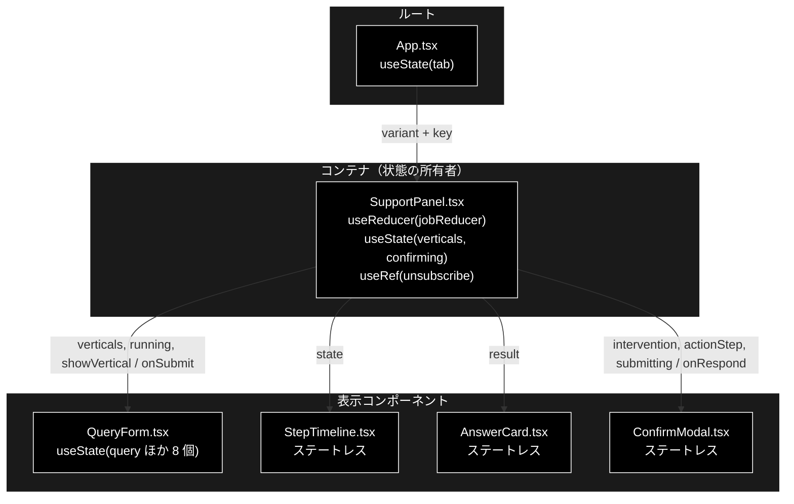
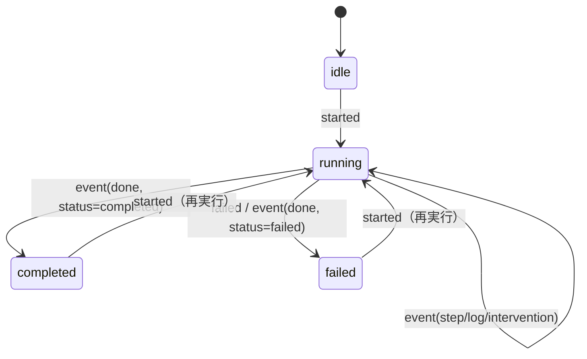
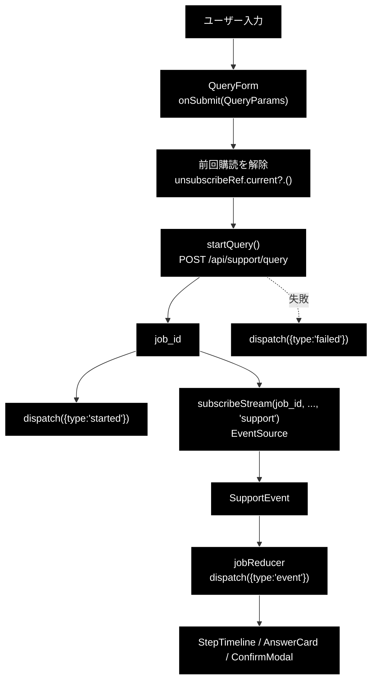
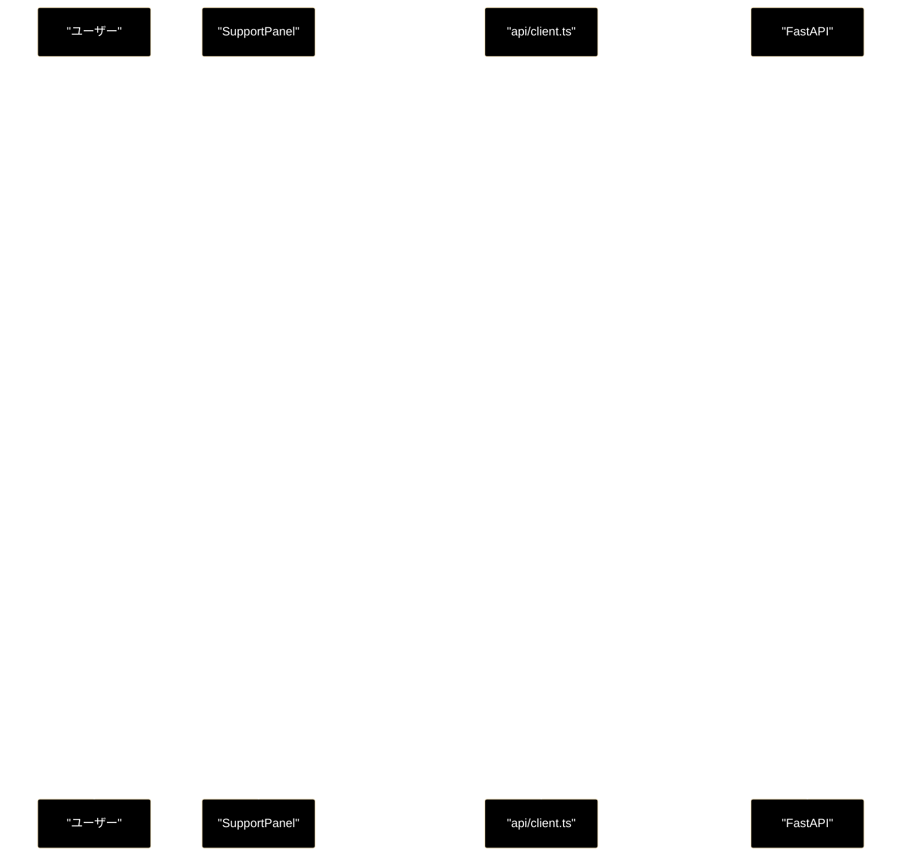
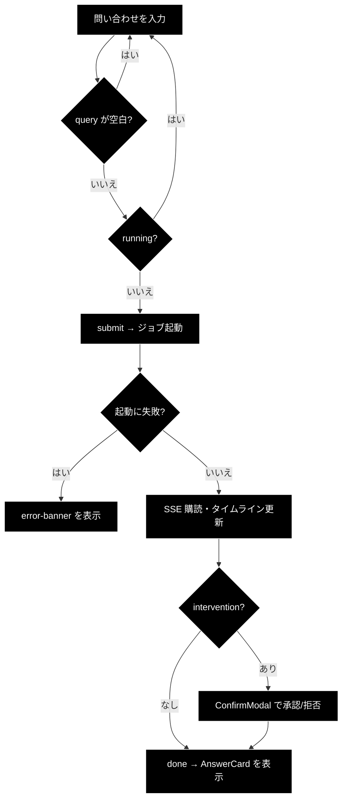

# SupportPanel.tsx - 問い合わせ → 回答 パネル ドキュメント

**Version 1.0** | 最終更新: 2026-08-01

---

## 目次

1. [概要](#概要)
2. [コンポーネントツリー図](#1-コンポーネントツリー図)
3. [Props インターフェース](#2-props-インターフェース)
4. [状態管理](#3-状態管理)
5. [データフロー・副作用](#4-データフロー副作用)
6. [API 通信・SSE イベント](#5-api-通信sse-イベント)
7. [ユーザー操作フロー](#6-ユーザー操作フロー)
8. [型定義とバックエンド対応](#7-型定義とバックエンド対応)
9. [スタイル・アクセシビリティ](#8-スタイルアクセシビリティ)
10. [テスト](#9-テスト)
11. [変更履歴](#10-変更履歴)

---

## 概要

| 項目 | 内容 |
|---|---|
| ファイル | `frontend/src/components/SupportPanel.tsx` |
| 種別 | **コンテナコンポーネント**（reducer・副作用・API 呼び出しを束ねる） |
| 親 | `App.tsx` |
| 子 | `QueryForm` / `StepTimeline` / `AnswerCard` / `ConfirmModal` |
| 主な依存 | `../api/client` / `../state/jobReducer` |
| 対応バックエンド | `backend/app/core/support_agent.py`（`run_support_agent_core` / `STEP_IDS`） |

**基本版タブと GRACE-Support タブで共用**するパネル。両者はまったく同じパイプライン
（`run_support_agent_core`）を通り、違いは**業界特化（`VerticalProfile`）を使うかどうか**
だけなので、画面を 2 つに複製せず `variant` で振り分ける。

| `variant` | 業界特化 | 挙動 |
|---|---|---|
| `"basic"` | なし | `/api/verticals` を**取得しない**。`vertical` は常に `null` |
| `"vertical"`（既定） | あり | プロファイル一覧を取得し、セレクタを出す |

> ⚠️ **ここを 2 コンポーネントへ複製しないこと。** 同一パイプラインの画面が 2 つになると、
> ルート `README.md` §3.1 の操作対応表もテストも二重管理になる。

### 主な責務

- 入力フォームから受けたパラメータでジョブを起動する（`POST /api/support/query`）
- SSE を購読し、届いたイベントを reducer へ流す
- HITL CONFIRM の承認 / 拒否をバックエンドへ送る
- `variant` に応じて業界プロファイル一覧の取得可否とフォームの表示を切り替える
- 実行中バナー・エラーバナーを出す

### 主要機能一覧

| 機能 | 実装 | 説明 |
|---|---|---|
| ジョブ起動 | `submit(params)` | `startQuery()` → `dispatch('started')` → `subscribeStream()` |
| SSE 購読 | `subscribeStream(..., 'support')` | 解除関数を `unsubscribeRef` に保持 |
| 多重購読の防止 | `unsubscribeRef.current?.()` | **新しい送信の直前**に前回の購読を切る |
| HITL 応答 | `respond(approve)` | `confirmIntervention()` → `dispatch('confirm_sent')` |
| 二重送信の防止 | `running` prop | `state.phase === 'running'` を `QueryForm` へ渡す |
| リード文の切替 | `LEAD[variant]` | 基本版 / Support で説明文を変える |

---

## 1. コンポーネントツリー図



---

## 2. Props インターフェース

```typescript
export type SupportVariant = 'basic' | 'vertical';

export function SupportPanel({ variant = 'vertical' }: { variant?: SupportVariant })
```

| Prop | 型 | 必須 | 既定値 | 説明 |
|---|---|:---:|---|---|
| `variant` | `SupportVariant` | | `'vertical'` | 業界特化の有無。`'basic'` で素のパイプライン |

### 子へ渡す props

| 子 | 渡す props |
|---|---|
| `QueryForm` | `verticals` / `running`（`phase === 'running'`）/ `showVertical` / `onSubmit` |
| `StepTimeline` | `state`（`JobState` 全体） |
| `AnswerCard` | `result`（`state.result` が非 null のときだけ描画） |
| `ConfirmModal` | `intervention` / `actionStep`（`state.steps.action`）/ `submitting` / `onRespond` |

### コールバックの契約

| コールバック | 呼ばれる条件 | 本コンポーネントの責務 |
|---|---|---|
| `onSubmit`（← `QueryForm`） | フォーム submit かつ `query` が空白でなく `running === false` | 前回購読の解除 → ジョブ起動 → SSE 購読開始 |
| `onRespond`（← `ConfirmModal`） | 承認 / 拒否ボタンの `click` | `confirmIntervention()` を送り、モーダルを閉じる |

---

## 3. 状態管理

### 3.1 ローカル state（`useState` / `useRef`）

| 変数 | 型 | 初期値 | 更新契機 | 説明 |
|---|---|---|---|---|
| `verticals` | `VerticalInfo[]` | `[]` | マウント時の `fetchVerticals()` | セレクタの選択肢。**基本版では取得しないので空のまま** |
| `confirming` | `boolean` | `false` | `respond()` の前後 | 承認送信中。モーダルのボタンを `disabled` にする |
| `unsubscribeRef` | `useRef<(() => void) \| null>` | `null` | 購読開始時 | SSE 解除関数の保持（**再レンダリングで消えないよう ref**） |

> 📝 **`unsubscribeRef` が `useState` ではなく `useRef` である理由**: 解除関数は
> 描画に関係しない。`useState` にすると更新のたびに再レンダリングが走る。

### 3.2 reducer state（`useReducer(jobReducer, initialJobState)`）

`state/jobReducer.ts` が SSE イベント列を畳み込む。**純関数・副作用ゼロ**（vitest 7 件）。

| フィールド | 型 | 初期値 | 説明 |
|---|---|---|---|
| `jobId` | `string \| null` | `null` | 起動中ジョブの ID |
| `phase` | `'idle' \| 'running' \| 'completed' \| 'failed'` | `'idle'` | ジョブ全体の進行状態 |
| `steps` | `Record[StepId, StepState]` | 全 `pending` | 8 ステップの個別状態 |
| `intervention` | `InterventionInfo \| null` | `null` | HITL CONFIRM の承認待ち |
| `result` | `SupportResult \| null` | `null` | 最終結果 |
| `error` | `string \| null` | `null` | エラーメッセージ |
| `logs` | `string[]` | `[]` | ステップに紐づかないログ |

#### アクション一覧

| アクション | ペイロード | 効果 |
|---|---|---|
| `started` | `jobId` | 状態を初期化し `phase='running'`、`steps` を作り直す |
| `event` | `SupportEvent` | 種別に応じて `steps` / `intervention` / `result` / `error` / `phase` を更新 |
| `confirm_sent` | — | `intervention` をクリア（モーダルを閉じる） |
| `failed` | `message` | `phase='failed'`、`error` を設定 |
| `reset` | — | 初期状態へ戻す |

#### 状態遷移図



### 3.3 親から渡る状態（props 由来）

| 値 | 供給元 | 本コンポーネントでの扱い |
|---|---|---|
| `variant` | `App.tsx` の `useState(tab)` | 読み取りのみ。`showVertical` の導出に使う |

### 3.4 派生値

| 値 | 導出 | 用途 |
|---|---|---|
| `showVertical` | `variant === 'vertical'` | プロファイル取得の可否・`QueryForm` への受け渡し |
| `running` | `state.phase === 'running'` | `QueryForm` の入力無効化 |

---

## 4. データフロー・副作用

### 4.1 副作用一覧（`useEffect`）

| # | 目的 | 依存配列 | クリーンアップ | 備考 |
|---|---|---|---|---|
| 1 | 業界プロファイル一覧の取得 | `[showVertical]` | `() => unsubscribeRef.current?.()` | **基本版（`showVertical=false`）では取得せず、クリーンアップだけ返す** |

```tsx
useEffect(() => {
  // 基本版は業界プロファイルを使わないので取得しない。
  if (!showVertical) return () => unsubscribeRef.current?.();
  fetchVerticals()
    .then(setVerticals)
    .catch(() => setVerticals([]));
  return () => unsubscribeRef.current?.();
}, [showVertical]);
```

> ⚠️ **早期 return でもクリーンアップを返している。** `if (!showVertical) return;` と
> 書くとアンマウント時に `EventSource` が閉じず、購読が残る。**両方の分岐で同じ
> クリーンアップを返すこと。**

> 📝 **取得失敗は握りつぶして `[]` にする。** バックエンド停止中でも画面は開けるべき
> だから。セレクタが「（なし）」だけになるので、症状は画面上で分かる。

### 4.2 多重購読の防止（2 段構え）

| 段 | 場所 | 効果 |
|---|---|---|
| 1 | `submit()` 冒頭の `unsubscribeRef.current?.()` | **新しい送信の直前**に前回の購読を切る |
| 2 | `useEffect` のクリーンアップ | **アンマウント時**（タブ切替）に切る |

`App.tsx` が `key={tab}` を与えているため、基本版 ⇄ Support の切替では
このパネル自体が作り直され、reducer 状態も初期化される。

### 4.3 データフロー図



---

## 5. API 通信・SSE イベント

### 5.1 呼び出す API

| 関数 | メソッド | パス | 用途 | 呼ぶ条件 |
|---|---|---|---|---|
| `fetchVerticals` | GET | `/api/verticals` | 業界プロファイル一覧 | **`variant === 'vertical'` のときだけ** |
| `startQuery` | POST | `/api/support/query` | ジョブ起動（202） | フォーム送信時 |
| `subscribeStream` | GET(SSE) | `/api/support/stream/{job_id}` | ステップ進捗の購読 | 起動成功後 |
| `confirmIntervention` | POST | `/api/support/confirm/{job_id}` | HITL CONFIRM への承認/拒否 | モーダルのボタン押下 |

`subscribeStream` の第 4 引数 `kind` に **`'support'`** を渡す（Review は `'review'`）。
イベント形式は両者同一なので購読関数自体は共用である。

### 5.2 SSE イベント種別（`SupportEvent.type`）

| type | 意味 | 主なフィールド | reducer の扱い |
|---|---|---|---|
| `step` | ステップの開始・終了・スキップ | `step`, `status`, `title`, `data` | 該当 `StepState.status` と `data` を更新 |
| `log` | 進捗ログ 1 行 | `step`, `message` | ステップ付きなら `logs` へ、無ければ `state.logs` へ |
| `intervention` | HITL CONFIRM 要求 | `status`, `data: InterventionInfo` | `waiting` で設定（モーダル表示）、それ以外で `null` |
| `result` | 最終結果 | `data: SupportResult` | `result` を設定 |
| `error` | エラー | `message` | `error` を設定 |
| `done` | 配信終了 | `status` | `phase` を `completed` / `failed` に。`intervention` もクリア |

> ⚠️ **`done` を受けたら `api/client.ts` が `source.close()` する。** 閉じないと
> `EventSource` が自動再接続し、同じジョブのイベントを再送させてしまう。

### 5.3 シーケンス図



---

## 6. ユーザー操作フロー

### 6.1 イベントハンドラ一覧

| 要素 | イベント | ハンドラ | 効果 | 無効化条件 |
|---|---|---|---|---|
| 送信（`QueryForm` 内） | `submit` | `submit(params)` | ジョブ起動 → SSE 購読 | `running` または `query` が空白のみ |
| 承認 / 拒否（`ConfirmModal` 内） | `click` | `respond(approve)` | `confirmIntervention()` | `confirming`（送信中） |

`respond()` は `state.jobId` か `state.intervention` が無ければ**何もせず return** する
（モーダルが閉じた後の遅延クリック対策）。

### 6.2 表示の出し分け

| 表示 | 条件 |
|---|---|
| `div.error-banner` | `state.error` が非 null |
| `div.running-banner`「実行中…」 | `phase === 'running'` **かつ** `intervention` が無い |
| `AnswerCard` | `state.result` が非 null |
| `ConfirmModal` | `state.intervention` が非 null |

> 📝 **承認待ちの間は「実行中…」を出さない。** モーダルが最前面に出ているため、
> 背後で実行中バナーが重なると「動いているのか待っているのか」が分からなくなる。

### 6.3 操作フロー図



---

## 7. 型定義とバックエンド対応

| TS 型（`src/types.ts` ほか） | 対応する Python | 定義元 |
|---|---|---|
| `QueryParams` | `QueryRequest` | `backend/app/schemas.py` |
| `SupportEvent` | SSE ペイロード | `backend/app/core/jobs.py`（`Job.emit`） |
| `SupportResult` | `SupportResult` | `backend/app/core/support_agent.py` |
| `VerticalInfo` | `VerticalInfo` | `backend/app/schemas.py` |
| `InterventionInfo` | intervention イベントの `data` | `backend/app/core/intervention_bridge.py` |
| `StepId` / `STEP_IDS` | `STEP_IDS` | `backend/app/core/support_agent.py` |
| `SupportVariant` | — | 本ファイル（UI 内部のみ） |

> ⚠️ **バックエンドのスキーマを変えたら `src/types.ts` も必ず追随させる。**
> `frontend` は blocking な CI ゲート（`tsc --noEmit`）なので、型がズレると
> **PR がマージできなくなる**。

---

## 8. スタイル・アクセシビリティ

| 項目 | 内容 |
|---|---|
| スタイル方式 | プレーン CSS（`src/styles.css`） |
| 主要クラス | `.panel-lead`, `.error-banner`, `.running-banner` |
| ダークモード | 未対応 |

### アクセシビリティ・チェック

| 観点 | 状態 | 補足 |
|---|:--:|---|
| エラーが支援技術へ通知されるか | ❌ | `.error-banner` に `role="alert"` / `aria-live` を付けていない |
| 実行中であることが伝わるか | ❌ | `.running-banner` は視覚のみ。`aria-busy` 等は未設定 |
| 二重送信が防げるか | ✅ | `running` で送信ボタンを `disabled` |
| 承認の二重送信が防げるか | ✅ | `confirming` でモーダルのボタンを `disabled` |
| キーボードのみで送信・承認できるか | ✅ | すべて `<button>` / `<input>` 要素 |

---

## 9. テスト

| テストファイル | 対象 | 実行 |
|---|---|---|
| `src/state/jobReducer.test.ts` | reducer の畳み込み（7 件） | `npm test` |
| `src/state/queryParams.test.ts` | 送信ペイロードの組み立て（19 件） | `npm test` |
| `backend/tests/test_api.py` | 呼び先の API（ジョブ起動・SSE・confirm） | `uv run pytest backend/tests` |

### テスト方針

- **純ロジックを優先してテストする。** `@testing-library/react` は未導入のため、
  `SupportPanel` 自体のレンダリングテストは持たない。
- reducer（`jobReducer`）とペイロード組み立て（`queryParams`）を切り出して
  テストすることで、コンポーネントに残るのは**配線だけ**にしている。
- CI は `npm run lint`（tsc）→ `npm test`（vitest）→ `npm run build` の順で
  **いずれも blocking**。

> ⚠️ **購読解除の漏れはテストで捕まらない。** `useEffect` のクリーンアップや
> `submit()` 冒頭の `unsubscribeRef.current?.()` を消しても、型検査も vitest も通る。
> 変更時は実際に連続送信・タブ往復をして、イベントが二重に流れないことを確認すること。

---

## 10. 変更履歴

| 版 | 日付 | 変更内容 |
|---|---|---|
| 1.0 | 2026-08-01 | 初版作成。基本版 / GRACE-Support で共用する `variant` 方式に基づく。早期 return でもクリーンアップを返す必要があること、多重購読を 2 段で防いでいること、承認待ち中は実行中バナーを出さないことを明記 |
