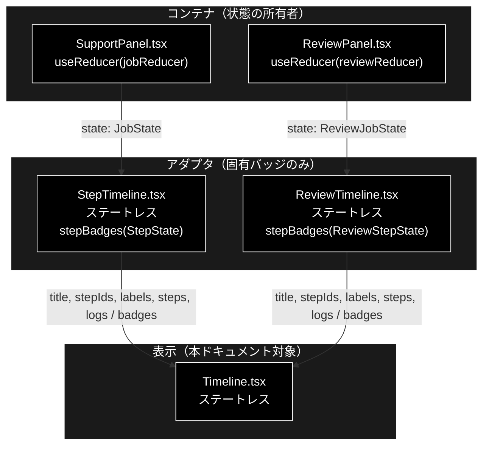
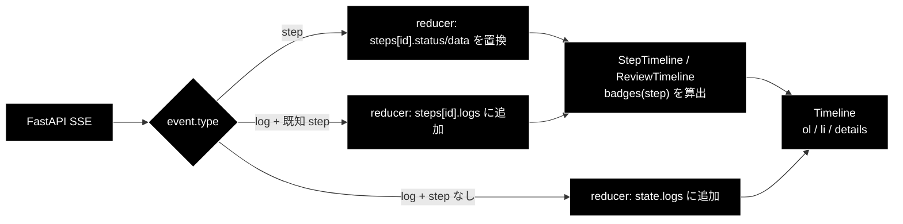
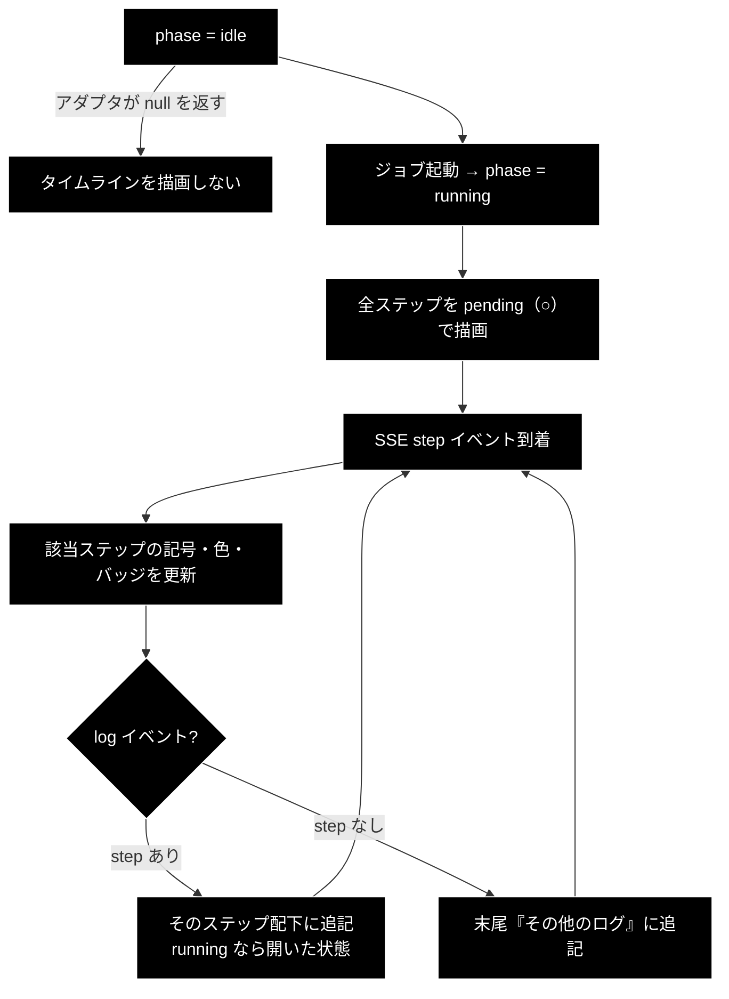

# Timeline.tsx - ステップトレース表示（Support/Review 共通） ドキュメント

**Version 1.0** | 最終更新: 2026-08-01

---

## 目次

- [概要](#概要)
- [1. コンポーネントツリー図](#1-コンポーネントツリー図)
- [2. Props インターフェース](#2-props-インターフェース)
- [3. 状態管理](#3-状態管理)
- [4. データフロー・副作用](#4-データフロー副作用)
- [5. API 通信・SSE イベント](#5-api-通信sse-イベント)
- [6. ユーザー操作フロー](#6-ユーザー操作フロー)
- [7. 型定義とバックエンド対応](#7-型定義とバックエンド対応)
- [8. スタイル・アクセシビリティ](#8-スタイルアクセシビリティ)
- [9. テスト](#9-テスト)
- [10. 変更履歴](#10-変更履歴)

---

## 概要

| 項目 | 内容 |
|---|---|
| ファイル | `frontend/src/components/Timeline.tsx` |
| 種別 | 表示コンポーネント（ステートレス） |
| 親 | `StepTimeline.tsx`（Support）と `ReviewTimeline.tsx`（Review）の**両方** |
| 子 | なし（`<ol>` / `<li>` / `<details>` を直接組む） |
| 主な依存 | なし（React の import すら無い — JSX のみ） |
| 対応バックエンド | `backend/app/core/support_agent.py`（`STEP_IDS`）／ `backend/app/core/review_agent.py`（`REVIEW_STEP_IDS`） |

### 主な責務

- ステップの一覧を**固定順**（`stepIds` の並び）で縦タイムラインとして描画する。
- 各ステップの `status`（pending / running / done / skipped）を**記号と色**で区別する。
- ステップに紐づくログを `<details>` で折りたたみ表示し、**実行中のステップだけ既定で開く**。
- ステップに紐づかないログを「その他のログ」として末尾にまとめる。
- 補足バッジの**中身は決めない**。`badges` コールバックで呼び出し側に委ねる。

### なぜ共通化されているか

Support と Review は**見た目が同じで、中身が違う**。

| 要素 | Support | Review | 共通化の扱い |
|---|---|---|---|
| マークアップ・CSS | 同じ | 同じ | ✅ `Timeline` に集約 |
| ステップ ID の集合 | 8 個（`STEP_IDS`） | 9 個（`REVIEW_STEP_IDS`） | ❌ `stepIds` prop で渡す |
| ステップのラベル | `STEP_LABELS` | `REVIEW_STEP_LABELS` | ❌ `labels` prop で渡す |
| バッジの出し方 | 支持率・強制エスカレ・救済… | セグメント数・抑止・裏取り… | ❌ `badges` コールバックで渡す |

> `ConfirmModal` が**構造的部分型**（`ActionStepView`）で共用を実現しているのに対し、
> `Timeline` は**差分をコールバックと配列で外出しする**方式を採っている。
> どちらも「共通の見た目 + エージェント固有の中身」という同じ問題への別解である。

### 主要機能一覧

| 機能 | 実装 | 説明 |
|---|---|---|
| ステップ一覧描画 | `stepIds.map(...)` | 固定順。`steps[id]` を引く |
| 状態記号 | `STATUS_ICON[step.status]` | `○`（pending）/ `▶`（running）/ `✓`（done）/ `−`（skipped） |
| 状態の色 | `` `step step-${step.status}` `` | `.step-pending` / `.step-running` / `.step-done` / `.step-skipped` |
| ラベル | `labels[id]` | 呼び出し側の `STEP_LABELS` / `REVIEW_STEP_LABELS` |
| 補足バッジ | `badges(step).map(...)` | 呼び出し側が算出した文字列配列 |
| ステップ別ログ | `<details open={step.status === 'running'}>` | **実行中だけ自動で開く**。件数を `<summary>` に出す |
| その他のログ | 末尾の `<details>` | `state.logs`（ステップに紐づかないログ） |

---

## 1. コンポーネントツリー図



> **3 層構造**（コンテナ → アダプタ → 表示）になっているのがこの系統の特徴。
> `StepTimeline` / `ReviewTimeline` はマークアップを一切持たず、
> **バッジ関数と定数を束ねて `Timeline` へ渡すだけ**のアダプタである。

---

## 2. Props インターフェース

```typescript
export interface TimelineStep {
  id: string;
  status: 'pending' | 'running' | 'done' | 'skipped';
  logs: string[];
  data: Record<string, unknown>;
}

interface Props {
  title: string;
  stepIds: readonly string[];
  labels: Record<string, string>;
  steps: Record<string, TimelineStep>;
  /** ステップに紐づかないログ。 */
  logs: string[];
  /** ステップごとの補足バッジ（判定結果・スキップ理由など）。 */
  badges: (step: TimelineStep) => string[];
}
```

| Prop | 型 | 必須 | 既定値 | 説明 |
|---|---|:---:|---|---|
| `title` | `string` | ✅ | — | 節見出し。現状 Support / Review とも `"ステップトレース"` |
| `stepIds` | `readonly string[]` | ✅ | — | 描画する順序。`STEP_IDS`（8）/ `REVIEW_STEP_IDS`（9） |
| `labels` | `Record<string, string>` | ✅ | — | ID → 表示名。`STEP_LABELS` / `REVIEW_STEP_LABELS` |
| `steps` | `Record<string, TimelineStep>` | ✅ | — | reducer が畳み込んだステップ状態 |
| `logs` | `string[]` | ✅ | — | ステップに紐づかないログ（`state.logs`） |
| `badges` | `(step: TimelineStep) => string[]` | ✅ | — | ステップごとの補足バッジを返す |

### `TimelineStep` — 型の緩め方

`stepIds` / `labels` / `steps` の型は **`string` キー**で緩めてある。

| 呼び出し側の実型 | `Timeline` 側の型 | 代入可能か |
|---|---|:---:|
| `readonly StepId[]` / `readonly ReviewStepId[]` | `readonly string[]` | ✅ |
| `Record<StepId, string>` / `Record<ReviewStepId, string>` | `Record<string, string>` | ✅ |
| `Record<StepId, StepState>` / `Record<ReviewStepId, ReviewStepState>` | `Record<string, TimelineStep>` | ✅ |

> ⚠️ **緩めた代償**: `steps[id]` は型の上では常に `TimelineStep` を返すが、
> **`stepIds` に `steps` へ存在しないキーが混ざると実行時に `undefined`** になり、
> `step.status` の参照で落ちる。現状 `stepIds` と `steps` は同じ reducer 由来の
> 定数から作られているので起きないが、型検査は守ってくれない。

### コールバックの契約

| コールバック | 呼ばれる条件 | 呼び出し側の責務 |
|---|---|---|
| `badges(step)` | **各ステップのレンダリングごと**（`stepIds.map` 内で毎回） | 純関数として文字列配列を返す。副作用を持たせない |

> ⚠️ **`badges` の戻り値は `key` に使われる**（`<span key={badge}>`）。
> したがって**同じステップ内で重複する文字列を返してはいけない**（React が
> 重複キー警告を出し、更新時の要素対応がずれる）。現状の 2 実装は、
> 各バッジが異なる接頭辞（`支持率 ` / `判定: ` / `スキップ: ` 等）を持つため衝突しない。

---

## 3. 状態管理

### 3.1 ローカル state（`useState`）

**なし。** `useState` / `useReducer` / `useEffect` / `useRef` を一切持たない。
React からの import も無く、JSX だけで構成されている。

唯一の「状態らしきもの」は `<details>` の開閉だが、これは**ブラウザ側が持つ**
（React が管理していない → §6.1）。

### 3.2 reducer state（`useReducer`）

**なし。** `jobReducer` / `reviewReducer` は 2 段上のコンテナが持つ。

### 3.3 親から渡る状態（props 由来）

| 値 | 供給元 | 本コンポーネントでの扱い |
|---|---|---|
| `steps` | `SupportPanel` の `state.steps` / `ReviewPanel` の `state.steps` | 読み取りのみ |
| `logs` | 同 `state.logs` | 読み取りのみ。`join('\n')` して表示 |
| `stepIds` / `labels` | モジュールレベルの定数（`STEP_IDS` 等） | 読み取りのみ。**レンダリング間で不変** |

> **不変条件**: 表示コンポーネントは props を変更しない。並べ替えも行わない
> （`stepIds` の順序をそのまま使う）。

---

## 4. データフロー・副作用

### 4.1 副作用一覧（`useEffect`）

**なし。** 購読・タイマー・DOM 操作のいずれも行わない。

### 4.2 ステップ状態の由来

reducer が SSE の `step` イベントを畳み込む。

| SSE の `status` | `StepStatus` | 記号 |
|---|---|---|
| `started` | `running` | `▶` |
| `skipped` | `skipped` | `−` |
| それ以外（`finished`） | `done` | `✓` |
| （イベント未着） | `pending`（初期値） | `○` |

```typescript
// jobReducer.ts / reviewReducer.ts（同じ形）
const status: StepStatus =
  event.status === 'started' ? 'running'
    : event.status === 'skipped' ? 'skipped'
      : 'done';
return updateStep(state, event.step, {
  status,
  data: (event.data ?? {}) as Record<string, unknown>,
});
```

> ⚠️ **`data` は「置換」であって「マージ」ではない。**
> `step_finished` の `data` が `step_started` の `data` を**丸ごと上書きする**。
> これがバッジ実装の前提になっている:
> - バッジは `step.status === 'done'` を条件にする → 読むのは `step_finished` の `data`
> - `ConfirmModal` は実行中に描画される → 読むのは `step_started` の `data`
>
> 例えばアクションステップでは、`step_started` の `args` は `step_finished` 到着後に
> **消える**（`identity_checked` / `result_message` に置き換わる）。

### 4.3 ログの振り分け

```typescript
// jobReducer.ts
case 'log': {
  const message = event.message ?? '';
  if (isStepId(event.step)) {
    const step = state.steps[event.step];
    return updateStep(state, event.step, { logs: [...step.logs, message] });
  }
  return { ...state, logs: [...state.logs, message] };  // ← その他のログ
}
```

| `log` イベントの `step` | 行き先 | 画面上の位置 |
|---|---|---|
| 既知のステップ ID | `steps[id].logs` | そのステップ配下の `<details>` |
| `null` / 未知の ID | `state.logs` | 末尾の「その他のログ」 |

> **未知のステップ ID が捨てられない設計**になっている。バックエンドが新しいステップを
> 足してフロントの `STEP_IDS` に追加し忘れても、ログは「その他のログ」に落ちて残る
> （黙って消えない）。ただし**ステップ行そのものは表示されない**ので、
> `STEP_IDS` の追随は必要である。

### 4.4 ログを既定で開く条件

```typescript
<details className="step-logs" open={step.status === 'running'}>
```

| 状態 | 既定 | 意図 |
|---|---|---|
| `running` | **開く** | 今まさに進んでいるステップの中身を見せる |
| それ以外 | 閉じる | 完了したステップで画面を埋めない |

> ⚠️ **`open` は React が制御する属性なので、ステータスが `running` → `done` に
> 変わると「ユーザーが開いたまま」でも閉じる**（`open={false}` へ再レンダリングされるため）。
> 実行中に開いて読んでいたログが完了と同時に畳まれるのは、この挙動による。
> ユーザー操作を優先したいなら `defaultOpen` 相当の制御（初回のみ `open`）が必要だが、未実装。

### 4.5 データフロー図



---

## 5. API 通信・SSE イベント

**本コンポーネント自身は API を呼ばない。** `fetch` / `EventSource` を使わない。
関係する SSE イベントは reducer 経由で届く（§4.2 / §4.3）。

| type | 意味 | 本コンポーネントへの影響 |
|---|---|---|
| `step` | ステップの開始・終了・スキップ | 記号・色・バッジが変わる |
| `log` | 進捗ログ 1 行 | ステップ配下または「その他のログ」に積まれる |
| `result` / `intervention` / `error` / `done` | — | 直接の影響なし（`phase` が変わることで親が描画を止める） |

---

## 6. ユーザー操作フロー

### 6.1 イベントハンドラ一覧

| 要素 | イベント | ハンドラ | 効果 | 無効化条件 |
|---|---|---|---|---|
| `<details className="step-logs">` | `toggle`（ネイティブ） | **なし** | ログの開閉。**React state を持たない** | なし |
| その他 | — | なし | — | — |

**React のイベントハンドラは 1 つも無い。** 唯一の操作はネイティブ `<details>` の開閉で、
ブラウザが状態を持つ。したがって「開いた状態」は再レンダリングで失われうる（§4.4）。

### 6.2 表示フロー図



> `phase === 'idle'` のときにタイムラインを出さないのは**アダプタ側の責務**
> （`StepTimeline` / `ReviewTimeline` の `if (state.phase === 'idle') return null;`）。
> `Timeline` 自身は無条件に描画する。

---

## 7. 型定義とバックエンド対応

| TS 型 | 対応する Python | 定義元 |
|---|---|---|
| `TimelineStep` | `step` イベントの畳み込み結果（フロント側の構造） | `src/components/Timeline.tsx` |
| `StepState` | 同上（Support 版） | `src/state/jobReducer.ts` |
| `ReviewStepState` | 同上（Review 版） | `src/state/reviewReducer.ts` |
| `STEP_IDS` | `STEP_IDS` | `backend/app/core/support_agent.py` |
| `REVIEW_STEP_IDS` | `REVIEW_STEP_IDS` | `backend/app/core/review_agent.py` |

### ステップ ID の件数（バックエンドと突合）

| | 件数 | 一覧 |
|---|:---:|---|
| Support（`STEP_IDS`） | 8 | `profile` / `plan` / `execute` / `confidence` / `gate` / `web` / `no_info` / `action` |
| Review（`REVIEW_STEP_IDS`） | 9 | `ruleset` / `segment` / `retrieve` / `detect` / `ground` / `suppress` / `web` / `severity` / `action` |

> ⚠️ **Review のラベル番号と実行順は一致しない。** `REVIEW_STEP_LABELS` では
> `web` が「⑥ Web 裏取り」、`severity` が「⑤ Severity」だが、`REVIEW_STEP_IDS` の並び
> （＝画面上の並び＝実行順）は `web` → `severity` である。
> Support で ④' が ⑤ の後に来るのと同じ事情で、**番号は Support パイプラインとの
> 対応を示す呼称**にすぎない。reducer のコメントにもその旨が書かれている。

### `<pre>` へのログ流し込み

```typescript
<pre>{step.logs.join('\n')}</pre>
```

ログはバックエンドの `log()` が出す文字列そのままで、**フロントで整形も
エスケープ処理もしない**（React がテキストノードとして安全に描画する）。
インデント（`"  [action] ..."` の先頭空白）は `<pre>` がそのまま保つ。

---

## 8. スタイル・アクセシビリティ

| 項目 | 内容 |
|---|---|
| スタイル方式 | プレーン CSS（`src/styles.css`）。CSS-in-JS・Tailwind は不使用 |
| 主要クラス | `.timeline`, `.step`（`.step-pending` / `.step-running` / `.step-done` / `.step-skipped` 修飾）, `.step-icon`, `.step-body`, `.step-title`, `.step-logs`, `.badge` |
| ダークモード | 未対応（対応する場合は `prefers-color-scheme` を使う） |

### アクセシビリティ・チェック

| 観点 | 状態 |
|---|---|
| フォーム要素に `label` が対応しているか | 該当なし（フォーム要素を持たない） |
| モーダルにフォーカストラップがあるか | 該当なし（モーダルではない） |
| 状態表示が色のみに依存していないか（記号併用） | ✅ `○` / `▶` / `✓` / `−` の**記号を併用**。`.step-*` の色は補助 |
| キーボードのみで操作できるか | ✅ 唯一の操作要素がネイティブ `<details>` / `<summary>` なので Tab + Enter で開閉可 |
| 順序が意味を持つことが伝わるか | ✅ `<ol>` を使用（`<ul>` ではない）。ステップの実行順を表す |
| 見出しがあるか | ✅ `<h2>{title}</h2>`。ページ内の `<h1>`（`App.tsx:34`）の直下で階層が正しい |
| 進捗が支援技術に伝わるか | ❌ `aria-live` を付けていないため、**SSE でステップが進んでも読み上げられない**。実行中であることは視覚的にしか分からない |
| 状態が支援技術に伝わるか | ❌ 記号（`▶` 等）は文字として読まれるが、`aria-label`（「実行中」等）は付けていない |

> 上記 ❌ は既知の未対応であり、消さずに残す。改善するなら
> `<ol aria-live="polite">` と、`<span className="step-icon" aria-label="実行中">` が最小の変更。

---

## 9. テスト

| テストファイル | 対象 | 実行 |
|---|---|---|
| `src/state/jobReducer.test.ts` | `steps` / `logs` を組み立てる側（Support reducer、7 ケース） | `npm test` |
| `src/state/reviewReducer.test.ts` | 同（Review reducer、13 ケース） | `npm test` |
| （コンポーネント本体の専用テストなし） | — | — |

**本コンポーネント専用のテストは未整備。** `@testing-library/react` を導入していないため
JSX のレンダリングテストが書けず、`tsc --noEmit` の型検査でガードしている。

### 型検査で守れていること・守れていないこと

| 項目 | 型検査で守れるか |
|---|:---:|
| `StepState` / `ReviewStepState` が `TimelineStep` に代入できること | ✅ 両アダプタのコンパイルが通ることで担保 |
| `badges` のシグネチャ | ✅ |
| `stepIds` の全 ID が `steps` に存在すること | ❌ `Record<string, ...>` に緩めているため未チェック（§2） |
| `badges` の戻り値に重複が無いこと（`key` 衝突） | ❌ |
| `step.data` のキー名がバックエンドと一致すること | ❌ `Record<string, unknown>` のため任意のキーが書ける |

### テスト方針

- **純ロジック（reducer / パーサ）を優先してテストする。** JSX のレンダリングテストは未導入。
- CI では `npm run lint`（tsc）→ `npm test`（vitest）→ `npm run build` の順に実行され、
  **いずれも blocking**。

---

## 10. 変更履歴

| 版 | 日付 | 変更内容 |
|---|---|---|
| 1.0 | 2026-08-01 | 初版作成 |
