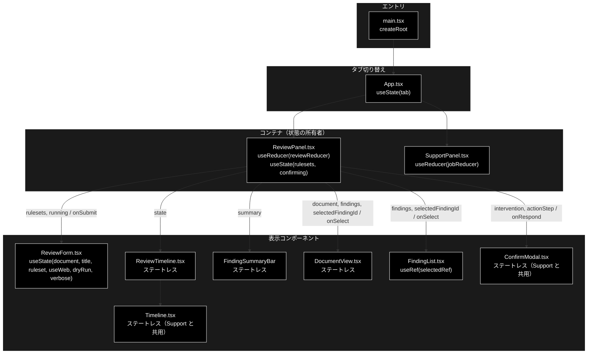
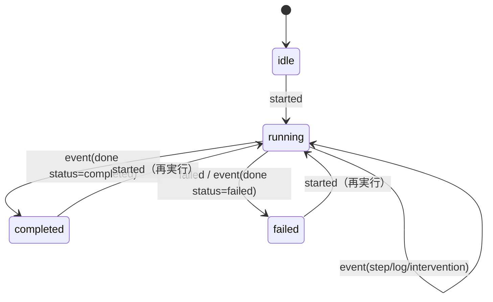
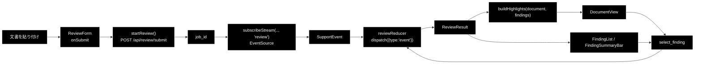
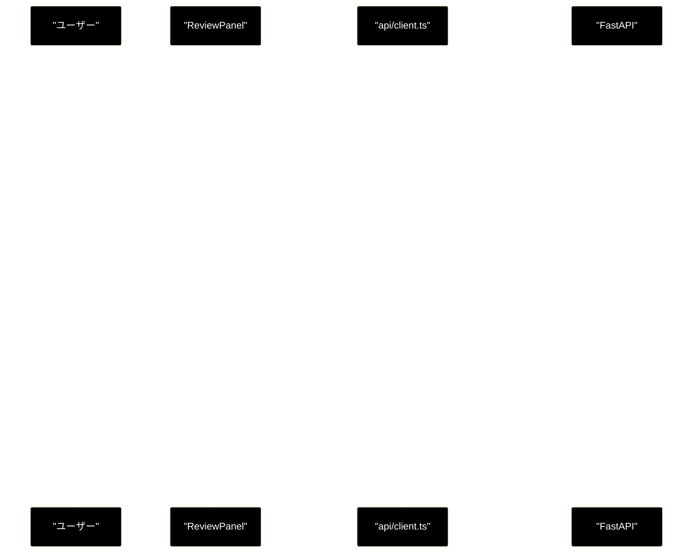
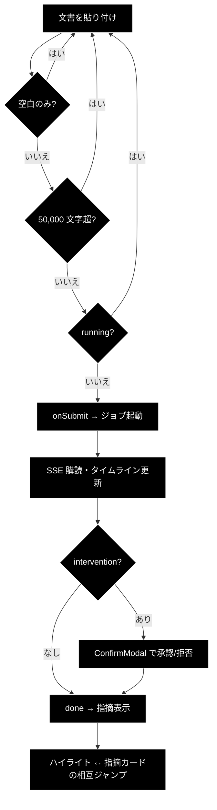

# components/ReviewPanel ほか - GRACE-Review UI ドキュメント

**Version 1.0** | 最終更新: 2026-07-29

---

## 目次

1. [概要](#概要)
2. [コンポーネントツリー図](#1-コンポーネントツリー図)
3. [Props インターフェース](#2-props-インターフェース)
4. [状態管理](#3-状態管理)
5. [データフロー・副作用](#4-データフロー副作用)
6. [API 通信・SSE イベント](#5-api-通信sse-イベント)
7. [ユーザー操作フロー](#6-ユーザー操作フロー)
8. [型定義とバックエンド対応](#7-型定義とバックエンド対応)
9. [スタイル・アクセシビリティ](#8-スタイルアクセシビリティ)
10. [テスト](#9-テスト)
11. [変更履歴](#10-変更履歴)

---

## 概要

| 項目 | 内容 |
|---|---|
| ファイル | `frontend/src/components/ReviewPanel.tsx` ほか 5 コンポーネント＋2 純ロジック |
| 種別 | コンテナ（`ReviewPanel`）＋表示・状態保持コンポーネント |
| 親 | `App.tsx`（タブで `SupportPanel` と切り替え） |
| 子 | `ReviewForm` / `ReviewTimeline` / `FindingSummaryBar` / `DocumentView` / `FindingList` / `ConfirmModal` |
| 主な依存 | `../state/reviewReducer`, `../state/highlight`, `../api/client` |
| 対応バックエンド | `backend/app/core/review_agent.py`（`REVIEW_STEP_IDS`）, `backend/app/api/review.py` |

本ドキュメントが対象とするファイル:

| ファイル | 種別 |
|---|---|
| `components/ReviewPanel.tsx` | コンテナコンポーネント |
| `components/ReviewForm.tsx` | 状態保持コンポーネント |
| `components/DocumentView.tsx` | 表示コンポーネント（ステートレス） |
| `components/FindingList.tsx` | 表示コンポーネント（`FindingSummaryBar` も同居） |
| `components/ReviewTimeline.tsx` | 表示コンポーネント（ステートレス） |
| `components/Timeline.tsx` | 表示コンポーネント（Support と共用） |
| `state/reviewReducer.ts` | 純ロジック（非コンポーネント） |
| `state/highlight.ts` | 純ロジック（非コンポーネント） |

### 主な責務

- 文書とルールセットを受け取ってレビュージョブを起動する
- SSE のステップ進捗（S1・①〜⑦）をタイムラインへ反映する
- 原文を指摘箇所でハイライトし、指摘カードと相互にジャンプさせる
- 重大度・状態ごとの件数と KPI を提示する
- HITL CONFIRM のモーダルを出して承認/拒否を返す

### 主要機能一覧

| 機能 | 実装 | 説明 |
|---|---|---|
| ジョブ起動 | `ReviewPanel.submit()` | `startReview()` → `subscribeStream(..., 'review')` |
| 進捗の畳み込み | `reviewReducer` | SSE イベント列 → `ReviewJobState` |
| 原文ハイライト | `buildHighlights()` + `DocumentView` | オフセットで原文を断片へ分割 |
| 重なり解消 | `resolveOverlaps()` | severity の高い方を優先 |
| 相互ジャンプ | `select_finding` アクション | ハイライト ⇔ 指摘カードの選択同期 |
| 指摘の並び替え | `FindingList.sortFindings()` | severity 降順 → 原文の出現順 |

---

## 1. コンポーネントツリー図



> ⚠️ **タブは条件レンダリング（アンマウント）で切り替える。** `App.tsx` は
> `tab === 'support' ? <SupportPanel /> : <ReviewPanel />` としており、両方を同時に
> マウントしない。各パネルが自分の SSE 購読を持つため、離れた側の `EventSource` が
> `useEffect` のクリーンアップで確実に閉じる。

---

## 2. Props インターフェース

### 2.1 `ReviewPanel`

Props なし（`export function ReviewPanel()`）。状態をすべて自分で所有する。

### 2.2 `ReviewForm`

```typescript
interface Props {
  rulesets: RuleSetInfo[];
  running: boolean;
  onSubmit: (params: ReviewParams) => void;
}
```

| Prop | 型 | 必須 | 既定値 | 説明 |
|---|---|:---:|---|---|
| `rulesets` | `RuleSetInfo[]` | ✅ | — | `/api/rulesets` の取得結果。セレクタの選択肢 |
| `running` | `boolean` | ✅ | — | 実行中フラグ。`true` の間は入力とボタンを `disabled` |
| `onSubmit` | `(params: ReviewParams) => void` | ✅ | — | 送信時に親へ `ReviewParams` を返す |

### 2.3 `DocumentView`

```typescript
interface Props {
  document: string;
  findings: ReviewFinding[];
  selectedFindingId: string | null;
  onSelect: (findingId: string | null) => void;
}
```

| Prop | 型 | 必須 | 既定値 | 説明 |
|---|---|:---:|---|---|
| `document` | `string` | ✅ | — | 原文。`reducer` が `started` 時に保持したもの |
| `findings` | `ReviewFinding[]` | ✅ | — | 採用された指摘（`suppressed` は含まない） |
| `selectedFindingId` | `string \| null` | ✅ | — | 選択中の指摘 ID |
| `onSelect` | `(id: string \| null) => void` | ✅ | — | ハイライトクリック時の通知 |

### 2.4 `FindingList` / `FindingSummaryBar`

```typescript
// FindingList
interface Props {
  findings: ReviewFinding[];
  selectedFindingId: string | null;
  onSelect: (findingId: string | null) => void;
}

// FindingSummaryBar
{ summary: FindingSummary }
```

### 2.5 `Timeline`（Support と共用）

```typescript
interface Props {
  title: string;
  stepIds: readonly string[];
  labels: Record<string, string>;
  steps: Record<string, TimelineStep>;
  logs: string[];
  badges: (step: TimelineStep) => string[];
}
```

**ステップ ID の集合とバッジの出し方はエージェントごとに違う**ため、呼び出し側
（`StepTimeline` / `ReviewTimeline`）から渡す設計にしている。

### 2.6 コールバックの契約

| コールバック | 呼ばれる条件 | 親側の責務 |
|---|---|---|
| `ReviewForm.onSubmit` | submit かつ `document` が空白でなく、50,000 文字以下、`running === false` | `startReview()` → SSE 購読開始 |
| `DocumentView.onSelect` | ハイライト `<mark>` のクリック | `select_finding` を dispatch。同じ ID の再クリックは `null`（選択解除） |
| `FindingList.onSelect` | 指摘カードのクリック | 同上 |
| `ConfirmModal.onRespond` | 承認/拒否ボタン | `confirmReviewIntervention()` → `confirm_sent` を dispatch |

---

## 3. 状態管理

### 3.1 ローカル state（`useState`）

#### `ReviewPanel`

| 変数 | 型 | 初期値 | 更新契機 | 説明 |
|---|---|---|---|---|
| `rulesets` | `RuleSetInfo[]` | `[]` | マウント時の `fetchRuleSets()` | セレクタの選択肢。取得失敗時は `[]` |
| `confirming` | `boolean` | `false` | 承認/拒否の送信中 | モーダルのボタンを二重押下から守る |

#### `ReviewForm`

| 変数 | 型 | 初期値 | 更新契機 | 説明 |
|---|---|---|---|---|
| `document` | `string` | `''` | `onChange` / サンプル投入 | 点検対象の文書 |
| `title` | `string` | `''` | `onChange` / サンプル投入 | 空なら送信時に `'無題'` |
| `ruleset` | `string` | `'ec_ad'` | セレクタ変更 | 適用するルールセット |
| `useWeb` | `boolean` | `false` | チェックボックス | **既定 OFF**（Support と逆） |
| `dryRun` | `boolean` | `true` | チェックボックス | 既定 ON（起票せずログのみ） |
| `verbose` | `boolean` | `false` | チェックボックス | 詳細ログ |

#### `FindingList`

`useRef(selectedRef)` のみ（state ではない）。選択中カードへ `scrollIntoView` するために使う。

### 3.2 reducer state（`useReducer`）

`state/reviewReducer.ts` が SSE イベント列を畳み込む。**純関数・副作用ゼロ。**

| フィールド | 型 | 初期値 | 説明 |
|---|---|---|---|
| `jobId` | `string \| null` | `null` | 起動中ジョブの ID |
| `phase` | `'idle' \| 'running' \| 'completed' \| 'failed'` | `'idle'` | ジョブ全体の進行状態 |
| `document` | `string` | `''` | 実行対象の原文（ハイライト描画に使う） |
| `documentTitle` | `string` | `''` | 表示用タイトル |
| `steps` | `"Record[ReviewStepId, ReviewStepState]"` | 全 `pending` | 9 ステップの個別状態 |
| `intervention` | `InterventionInfo \| null` | `null` | HITL CONFIRM の承認待ち |
| `result` | `ReviewResult \| null` | `null` | 最終結果 |
| `error` | `string \| null` | `null` | エラーメッセージ |
| `logs` | `string[]` | `[]` | ステップに紐づかないログ |
| `selectedFindingId` | `string \| null` | `null` | 選択中の指摘（相互ジャンプ用） |

> **`document` を reducer が持つ理由**: 原文は API のレスポンスに含まれない
> （送ったものをそのまま返す必要がない）。`started` アクションで送信時の文字列を
> 保持しておき、`ReviewFinding.start` / `.end` と突き合わせてハイライトする。

#### アクション一覧

| アクション | ペイロード | 効果 |
|---|---|---|
| `started` | `jobId`, `document`, `documentTitle` | 状態を初期化し `phase='running'`、原文を保持 |
| `event` | `SupportEvent` | 種別に応じて steps / intervention / result を更新 |
| `confirm_sent` | — | `intervention` をクリア |
| `select_finding` | `findingId` | 選択中の指摘を切り替える |
| `failed` | `message` | `phase='failed'`、`error` を設定 |
| `reset` | — | 初期状態へ戻す |

#### 状態遷移図



> **未知のステップ ID は無視する。** `isReviewStepId()` で `REVIEW_STEP_IDS` に
> 含まれるかを検査してから更新する。Support のステップ（`plan` 等）が混ざっても
> 状態が壊れない。

### 3.3 親から渡る状態（props 由来）

| 値 | 供給元 | 本コンポーネントでの扱い |
|---|---|---|
| `rulesets` | `ReviewPanel` の `useState` + `fetchRuleSets()` | `ReviewForm` は読み取りのみ |
| `findings` / `summary` | `ReviewPanel` の reducer state | `DocumentView` / `FindingList` は読み取りのみ |
| `selectedFindingId` | `ReviewPanel` の reducer state | 変更はコールバックで親へ依頼する |

---

## 4. データフロー・副作用

### 4.1 副作用一覧（`useEffect`）

| # | ファイル | 目的 | 依存配列 | クリーンアップ | 備考 |
|---|---|---|---|---|---|
| 1 | `ReviewPanel` | ルールセット一覧の初回取得 ＋ 購読解除の登録 | `[]` | `unsubscribeRef.current?.()` を返す | マウント時 1 回。**アンマウント時に SSE を閉じる** |
| 2 | `FindingList` | 選択カードへスクロール | `[selectedFindingId]` | なし | `scrollIntoView` のみで解除不要 |

> ⚠️ **SSE の購読解除は `unsubscribeRef` で管理する。** `submit()` の先頭でも
> `unsubscribeRef.current?.()` を呼び、再実行時に前のジョブの購読が残らないようにしている。
> 依存配列を `[jobId]` にする代わりに ref で明示管理しているのは、`SupportPanel` と
> 同じ形に揃えるため。

### 4.2 データフロー図



### 4.3 ハイライト分割の不変条件

`state/highlight.ts` は**純関数**で、以下を必ず満たす。

| 不変条件 | 理由 |
|---|---|
| 断片を連結すると原文に戻る | 文字の欠落・重複は画面上気づきにくく、最も厄介な出方をする |
| 範囲外オフセットの指摘は無視する | バックエンドの不整合で本文が欠けないようにする |
| `start >= end` の空スパンは捨てる | 空の `<mark>` を作らない |
| 重なりは severity の高い方を残す | 同じ文言が複数ルールに触れるのは普通に起きる |
| 入力配列を破壊しない | React の再描画で副作用が出ないようにする |

> ⚠️ **`dangerouslySetInnerHTML` は使わない。** 分割結果を React 要素の配列として
> 組み立てる（XSS 回避）。原文はユーザーが貼り付けた任意のテキストである。

---

## 5. API 通信・SSE イベント

### 5.1 呼び出す API

| 関数 | メソッド | パス | 用途 |
|---|---|---|---|
| `startReview` | POST | `/api/review/submit` | ジョブ起動。`job_id` / `stream_url` を得る |
| `subscribeStream(.., 'review')` | GET(SSE) | `/api/review/stream/{job_id}` | ステップ進捗の購読 |
| `confirmReviewIntervention` | POST | `/api/review/confirm/{job_id}` | HITL CONFIRM への承認/拒否 |
| `fetchRuleSets` | GET | `/api/rulesets` | ルールセット一覧 |

> `subscribeStream` は Support と**共用**しており、第 4 引数 `kind`（`'support'` /
> `'review'`）でパスを切り替えるだけ。イベント形式が同一なので、パースと終了判定は共通。

### 5.2 SSE イベント種別（`SupportEvent.type`）

| type | 意味 | 主なフィールド | reducer の扱い |
|---|---|---|---|
| `step` | ステップの開始・終了・スキップ | `step`, `status`, `title` | 該当 `ReviewStepState.status` を更新 |
| `log` | 進捗ログ 1 行 | `step`, `message` | 該当ステップの `logs` に追加（`step` 無しは全体 `logs`） |
| `intervention` | HITL CONFIRM 要求 | `data: InterventionInfo` | `intervention` を設定（モーダル表示） |
| `result` | 最終結果 | `data: ReviewResult` | `result` を設定 |
| `error` | エラー | `message` | `error` を設定 |
| `done` | 配信終了 | `status` | `phase` を確定し `EventSource` を close |

### 5.3 ステップ ID とラベル

`REVIEW_STEP_IDS` はバックエンドの `backend/app/core/review_agent.py` と**同じ並び**にする。

| ID | ラベル |
|---|---|
| `ruleset` | S1 ルールセット適用 |
| `segment` | ① Segment（文書を検査単位へ分割） |
| `retrieve` | ② Retrieve（規程を RAG 検索） |
| `detect` | ③ Detect（二段判定で違反候補を検出） |
| `ground` | ④ Ground（指摘の根拠を検証） |
| `suppress` | ④' Suppress（誤検知抑止 + 救済） |
| `web` | ⑥ Web 裏取り（法改正・ガイドライン更新） |
| `severity` | ⑤ Severity（重大度の確定＋強制 high） |
| `action` | ⑦ Action（レポート → HITL CONFIRM → 実行） |

> 番号は Support のパイプラインとの対応を示す呼称で、**実行順とは一致しない**。
> 表の並びが実行順である。

### 5.4 シーケンス図



---

## 6. ユーザー操作フロー

### 6.1 イベントハンドラ一覧

| 要素 | イベント | ハンドラ | 効果 | 無効化条件 |
|---|---|---|---|---|
| 実行ボタン | `submit` | `ReviewForm.submit(e)` | `onSubmit(params)` を呼ぶ | `running`、`document` が空白のみ、50,000 文字超 |
| 文書 textarea | `change` | `setDocument` | ローカル state 更新 | `running` |
| ルールセットセレクタ | `change` | `setRuleset` | ローカル state 更新 | `running` |
| サンプル投入チップ | `click` | `setDocument` / `setTitle` | NG 例 / OK 例を流し込む | `running` |
| 原文ハイライト | `click` | `onSelect(findingId)` | 該当カードを選択・スクロール | なし |
| 指摘カード | `click` | `onSelect(findingId)` | ハイライトを強調 | なし |
| 承認ボタン | `click` | `respond(true)` | `confirmReviewIntervention(.., true)` | `confirming` |
| 拒否ボタン | `click` | `respond(false)` | `confirmReviewIntervention(.., false)` | `confirming` |

### 6.2 操作フロー図



### 6.3 文字数カウンタ

`ReviewForm` は入力中の文字数を常時表示し、`MAX_DOCUMENT_CHARS`（50,000）を超えると
赤字＋送信不可にする。**バックエンドの `ReviewRequest.document` の `max_length` と
同じ値を持っている**ので、値を変えるときは両方を直す。

---

## 7. 型定義とバックエンド対応

| TS 型（`src/types.ts`） | 対応する Python | 定義元 |
|---|---|---|
| `SupportEvent` | SSE ペイロード（Support と共用） | `backend/app/core/jobs.py` |
| `Severity` | `Severity` | `backend/app/core/rulesets.py` |
| `FindingStatus` | `FindingStatus` | `backend/app/core/rulesets.py` |
| `Segment` | `SegmentModel` | `backend/app/schemas.py` |
| `ReviewFinding` | `ReviewFindingModel` | `backend/app/schemas.py` |
| `FindingSummary` | `FindingSummaryModel` | `backend/app/schemas.py` |
| `ReviewResult` | `ReviewResultModel` | `backend/app/schemas.py` |
| `RuleSetInfo` | `RuleSetInfo` | `backend/app/schemas.py` |
| `ReviewParams` | `ReviewRequest` | `backend/app/schemas.py` |
| `ReviewStepId` | `REVIEW_STEP_IDS` | `backend/app/core/review_agent.py` |

> ⚠️ **バックエンドのスキーマを変えたら、この表の TS 型も必ず追随させる。**
> `frontend` は blocking な CI ゲート（`tsc --noEmit`）なので、型がズレると
> **PR がマージできなくなる**。

### 7.1 オフセットの契約

`ReviewFinding.start` / `.end` は**原文の文字オフセット**である。フロントは
`document.slice(start, end)` で切り出すため、次が成り立つことを前提にしている。

```
document.slice(finding.start, finding.end) === finding.excerpt
```

バックエンド側は `split_segments` で正規化を一切行わないことでこれを保証しており、
`backend/tests/test_review_agent_core.py` と `test_review_api.py` が固定している。

---

## 8. スタイル・アクセシビリティ

| 項目 | 内容 |
|---|---|
| スタイル方式 | プレーン CSS（`src/styles.css`）。CSS-in-JS・Tailwind は不使用 |
| 主要クラス | `.tabs`, `.review-form`, `.review-panes`, `.document-body`, `.hl`, `.finding-card`, `.finding-summary` |
| ハイライト色 | `.hl-high`（赤系）/ `.hl-medium`（橙系）/ `.hl-low`（灰系） |
| レスポンシブ | `@media (max-width: 960px)` で 2 ペインを 1 カラムへ、`640px` でタブを縦積みへ |
| ダークモード | 未対応（対応する場合は `prefers-color-scheme` を使う） |

### アクセシビリティ・チェック

| 観点 | 状態 |
|---|---|
| フォーム要素に `label` が対応しているか | ✅（セレクタ・チェックボックスは `<label>` で囲んでいる） |
| textarea に `label` が対応しているか | ❌（`placeholder` のみ。`aria-label` を付けるべき） |
| タブに `role="tablist"` / `role="tab"` / `aria-selected` があるか | ✅ |
| タブに `aria-controls` / パネルの `role="tabpanel"` があるか | ❌ |
| モーダルにフォーカストラップがあるか | ❌（`role="dialog"` / `aria-modal` は付与済み） |
| 重大度が色のみに依存していないか（記号・文言併用） | ✅（`重大` / `中` / `軽微` のテキストバッジを併記） |
| ハイライトがキーボードで選択できるか | ❌（`<mark>` の `onClick` のみ。`tabIndex` / `onKeyDown` が無い） |
| キーボードのみで送信・承認できるか | ✅（フォーム submit と `<button>` のみ） |

> ❌ の項目は**実装できていないことが分かっている状態**として残している。消すと再発見できない。

---

## 9. テスト

| テストファイル | 対象 | 件数 | 実行 |
|---|---|:---:|---|
| `src/state/reviewReducer.test.ts` | reducer の畳み込み | 13 | `npm test` |
| `src/state/highlight.test.ts` | ハイライト分割・重なり解消 | 13 | `npm test` |
| `src/state/jobReducer.test.ts` | Support の reducer（既存） | 7 | `npm test` |
| `src/markdown/parseMarkdown.test.ts` | Markdown パーサ（既存） | 10 | `npm test` |

### テスト方針

- **純ロジック（reducer / ハイライト分割）を優先してテストする。** JSX のレンダリング
  テストは導入しておらず（`@testing-library/react` 未導入）、コンポーネントは
  `tsc --noEmit` の型検査でガードしている。
- `highlight.test.ts` は「**連結すると必ず原文に戻る**」を全ケースで確認する。
  ここが壊れると原文の文字が欠ける／重複するという気づきにくい不具合になるため、
  不変条件として固定している。
- CI では `npm run lint`（tsc）→ `npm test`（vitest）→ `npm run build` の順に
  実行され、**いずれも blocking**。

---

## 10. 変更履歴

| 版 | 日付 | 変更内容 |
|---|---|---|
| 1.0 | 2026-07-29 | 初版作成（GRACE-Review STEP6・PR #42 に対応） |
