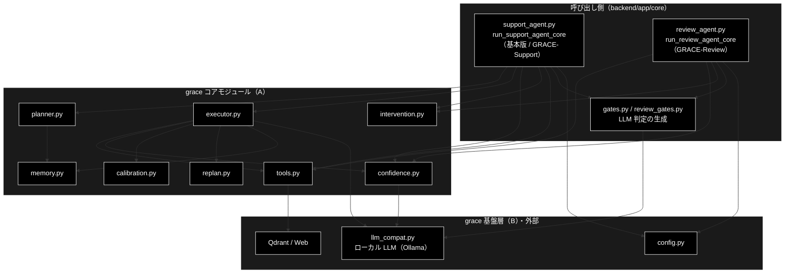

# grace/README.MD  grace/docs/ - ドキュメント一覧・棚卸し

**Version 1.11** | 最終更新: 2026-10-08

---

> 📎 **姉妹版**: `backend/` 側の棚卸しは [`backend/docs/README.md`](../../backend/docs/README.md)。

`grace/docs/` 配下の全ドキュメントを棚卸しし、ドキュメント名・概要・重要度・必要性（現状の課題）を一覧化する。

各行の判定は、対応する `grace/*.py`（または関連ソース）の最終コミット日と、ドキュメント側の
「最終更新」ヘッダーを突き合わせ、さらに本文を実際に読んで事実誤りの有無を確認した結果である （CLAUDE.md
冒頭「作業原則」に従い、確認していないものは「確認していない」と明記する）。

---

## 目次

- [概要](#概要)（GRACE-Support / GRACE-Review が使う grace モジュールと比較）
  - [GRACE-Support（基本版も同じ）の流れと grace モジュール](#grace-support基本版も同じの流れと-grace-モジュール)
  - [GRACE-Review の流れと grace モジュール](#grace-review-の流れと-grace-モジュール)
  - [GRACE-Support と GRACE-Review の比較](#grace-support-と-grace-review-の比較)
- [凡例](#凡例)
- [1. コアモジュール 1:1 対応ドキュメント（`grace/*.py`）](#1-コアモジュール-11-対応ドキュメントgracepy)
- [2. 横断・アーキテクチャ概説ドキュメント](#2-横断アーキテクチャ概説ドキュメント)
- [3. GRACE-Support（`backend/app/core/support_agent.py`）関連ドキュメント](#3-grace-supportbackendappcoresupport_agentpy関連ドキュメント)
- [4. 実在が確認できなかったドキュメント（削除済み）](#4-実在が確認できなかったドキュメント削除済み)
- [5. 優先対応の提案（本ドキュメント作成時点の所見）](#5-優先対応の提案本ドキュメント作成時点の所見)
- [5.1 残作業（TODO）](#51-残作業todo)
- [6. 変更履歴](#6-変更履歴)

## 概要

`grace/` は **2 つのエージェントが共用する自律エージェント基盤**である。
**GRACE-Support**（問い合わせ → 回答。基本版タブも同じコア）と **GRACE-Review**（文書 → 指摘）は、
どちらも `backend/app/core/` のコア関数から `grace/` の部品を呼ぶ。ただし**使う部品の範囲が大きく違う**。

- **GRACE-Support** は grace の**計画→実行ループ**（`planner` → `executor`）をまるごと使う。
  `tools` / `replan` / `memory` / `calibration` / 多軸信頼度は `executor` の内側で動く
- **GRACE-Review** は `planner` / `executor` を**通らない**。必要な部品
  （`tools` の検索・`confidence` の根拠検証・`intervention` の承認・`llm_compat` の LLM 呼び出し）を
  コア関数が**直接**呼ぶ

本節は、両エージェントの**ステップごとに grace のどのモジュール（シンボル）が効くか**の正本である
（姉妹リポジトリ grace_v2 の `grace/docs/README.md` にも同じ構成の節がある。grace の使い方は両リポジトリで同じで、違うのは LLM だけ）。
ステップの対照表と実行順の図は [`docs/pipelines.md`](../../docs/pipelines.md) §2、
ステップ内部の設計は [`backend/docs/support_flow.md`](../../backend/docs/support_flow.md) /
[`backend/docs/review_flow.md`](../../backend/docs/review_flow.md) が正本なので、ここでは繰り返さない。

### 主な責務

- GRACE-Support の各ステップに、計画・実行・検証・承認の部品を供給する
- GRACE-Review の各ステップに、検索・根拠検証・承認・LLM 呼び出しの部品を供給する
- 両エージェントで同じ根拠検証（`GroundednessVerifier`・`support_rate`）を提供する
- 両エージェントで同じ HITL 承認（`InterventionHandler` の CONFIRM）を提供する

### 各責務対応のモジュール

| # | 責務 | 対応モジュール | 説明 |
|---|------|--------------|------|
| 1 | Support への計画・実行・検証・承認の部品供給 | `backend/app/core/support_agent.py` | `run_support_agent_core` が `create_planner` / `create_executor` / `create_tool_registry` / `create_groundedness_verifier` / `create_source_agreement_calculator` / `create_intervention_handler` を生成する |
| 2 | Review への検索・根拠検証・承認・LLM の部品供給 | `backend/app/core/review_agent.py` | `run_review_agent_core` が `create_tool_registry` / `create_groundedness_verifier` / `create_intervention_handler` を生成し、LLM 判定は `backend/app/core/review_gates.py` が `llm_compat.create_chat_client` で作る |
| 3 | 共通の根拠検証 | `grace/confidence.py` | `GroundednessVerifier.verify` と `damp_support_rate`（判定できなかった主張の分だけ支持率を減衰） |
| 4 | 共通の HITL 承認 | `grace/intervention.py` | `InterventionHandler.handle`（CONFIRM）。呼び出しは両者とも `support_agent.py::_perform_action` を通る |

### アーキテクチャ構成図

**データフロー**:

1. 両コアとも `copy.deepcopy(get_config())` でリクエスト単位の設定を作り、業界プロファイル／ルールセットの検索スコープと方針を `config` へ注入する
2. Support は `planner.create_plan` → `executor.execute` で内部 RAG と回答生成を行い、`executor` の内側で `tools` / `replan` / `memory` / `calibration` / 多軸信頼度が動く
3. Review は `tools` の `rag_search` を直接呼んで規程を集め、`review_gates.py` の LLM 判定で違反候補を出す
4. 両者とも `confidence.GroundednessVerifier` で根拠を検証し、副作用のあるアクションは `intervention.InterventionHandler` の承認を経てから実行する

### GRACE-Support（基本版も同じ）の流れと grace モジュール

実行順に並べる（`support_agent.py::STEP_IDS`）。「—」は grace を使わず `backend/app/core/` の純関数だけで判定するステップ。

| 実行順 | ステップ | grace モジュール（シンボル） | 備考 |
|:--:|---|---|---|
| 1 | 0-(A) `analyze` 入力・質問分析 | `llm_compat.py`（`create_chat_client`）／`intervention.py`（`InterventionRequest`） | 複数質問の検知・再構成は `gates.py::create_question_analyzer` / `reconstruct_query` の LLM 判定。主質問の選択は `InterventionRequest` を Web の承認待ち（`backend/app/core/intervention_bridge.py`）へ渡す |
| 2 | 0-(B) `profile` 業界プロファイル適用 | `config.py`（`GraceConfig`） | `qdrant.allowed_collections` / `llm.prompt_addendum` へ注入。**基本版はスキップ** |
| 3 | ① `plan` | `planner.py`（`create_plan`）← `memory.py`（`best_collection`） | 実行メモリのコレクション事前分布を計画に反映 |
| 4 | ② `execute` | `executor.py`（`execute`）→ `tools.py`（`rag_search` / `reasoning`）・`replan.py`・`confidence.py`（多軸信頼度）・`calibration.py`・`memory.py`（`_record_memory`） | 全体信頼度（`overall_confidence`）はここで決まる。較正は `config/calibration.json` があるときだけ。**本リポジトリ固有**: reasoning が空応答なら参照情報を絞って 1 回だけ再試行（`ReasoningTool._minimal_sources`）、reasoning の失敗によるリプランでは検索を積み上げない（`ReplanManager._drop_redundant_search_steps`） |
| 5 | ③ `confidence` | `confidence.py`（`GroundednessVerifier.verify`） | `support_rate = supported / (supported + contradicted)` |
| 6 | ④ `gate` 回答ゲート＋強制エスカレ＋救済 | — | `gates.py::_answer_gate` ほか（純関数） |
| 7 | ⑤ `web` Web フォールバック | `tools.py`（`web_search` / `reasoning`）・`confidence.py`（`GroundednessVerifier` / `SourceAgreementCalculator`） | 内部回答と Web 回答の一致度を相互検証 |
| 8 | ④' `no_info` 情報なし回答検知 | `llm_compat.py` | `gates.py::create_no_info_judge` の LLM 判定 |
| 9 | ⑥ `action` | `intervention.py`（`InterventionHandler.handle`） | 本人確認（`ec` のみ）→ CONFIRM → `support_actions.py` が実行 |

### GRACE-Review の流れと grace モジュール

実行順に並べる（`review_agent.py::REVIEW_STEP_IDS`）。番号は Support との対応を示す呼称なので、⑥ が ⑤ より先に来る。
② Retrieve 〜 ④' Suppress は**セグメントごとに並行して流れる**（4 ステップが同時に始まり、検査単位ごとに 1 周する）。

| 実行順 | ステップ | grace モジュール（シンボル） | 備考 |
|:--:|---|---|---|
| 1 | S1 `ruleset` ルールセット適用 | `config.py`（`GraceConfig`） | `qdrant.allowed_collections` / `llm.prompt_addendum` へ注入（Support の 0-(B) と同じ手順） |
| 2 | ① `segment` 文書を検査単位へ分割 | — | 決定的な分割（原文オフセット保持） |
| 3 | ② `retrieve` 規程を RAG 検索 | `tools.py`（`rag_search` を**直接** `ToolRegistry.execute`） | `planner` / `executor` を通らない |
| 4 | ③ `detect` 二段判定 | `llm_compat.py` | 第 1 段はルールのキーワード、第 2 段は `review_gates.py::create_violation_detector` の LLM 判定 |
| 5 | ④ `ground` 指摘の根拠を検証 | `confidence.py`（`GroundednessVerifier.verify` / `damp_support_rate`） | Support の ③ と同じ検証器 |
| 6 | ④' `suppress` 誤検知抑止＋救済 | `llm_compat.py` | `review_gates.py::create_vacuous_judge`（実質性なしの判定） |
| 7 | ⑥ `web` 法改正の裏取り（既定 OFF） | `tools.py`（`web_search`） | 信頼度を下げる方向にだけ使う |
| 8 | ⑤ `severity` 重大度の確定＋強制 high | `llm_compat.py` | 重大リスク語の言及の仕方を `review_gates.py::create_mention_classifier` で判定 |
| 9 | ⑦ `action` | `intervention.py`（`InterventionHandler.handle`） | high があれば `escalate_to_human`（承認不要）、なければ `create_ticket`（CONFIRM）。実行は `support_actions.py` |

### GRACE-Support と GRACE-Review の比較

| grace モジュール | 区分 | GRACE-Support（基本版も同じ） | GRACE-Review |
|---|:--:|---|---|
| `planner.py` | A | ✅ ① Plan | — |
| `executor.py` | A | ✅ ② Execute（統括） | — |
| `tools.py` | A | ✅ ② の内側・⑤ Web | ✅ ② Retrieve・⑥ Web（直接呼ぶ） |
| `confidence.py` | A | ✅ ② 多軸信頼度・③ 根拠検証・⑤ 相互検証 | ✅ ④ 根拠検証（`damp_support_rate` も） |
| `calibration.py` | A | ✅ ② の内側（較正ファイルがあるとき） | — |
| `memory.py` | A | ✅ ① で読み・② で書く | — |
| `replan.py` | A | ✅ ② の内側（失敗・低信頼時） | — |
| `intervention.py` | A | ✅ 0-(A) 主質問の選択・⑥ CONFIRM | ✅ ⑦ CONFIRM |
| `config.py` | B | ✅ リクエスト単位のコピーへ注入 | ✅ 同左 |
| `llm_compat.py` | B | ✅ 判定系（質問分析・意図・情報なし・担当範囲）。Ollama 経路では `_strip_think()` で思考タグを剥がす | ✅ 判定系（違反検出・言及分類・実質性） |
| `schemas.py` | B | ✅ 計画・ステップ結果の型（planner / executor 経由） | —（直接は使わない） |

| 観点 | GRACE-Support | GRACE-Review |
|---|---|---|
| 入出力 | 問い合わせ → 回答 1 件 | 文書 → 指摘 N 件 |
| grace の使い方 | 計画→実行ループ（`planner` → `executor`）に任せる | 部品を直接呼ぶ（`executor` を通らない） |
| 生成の主体 | `tools.py` の `reasoning`（`executor` 経由） | `review_gates.py` の LLM 判定（`llm_compat` 経由） |
| 共用する部品 | `GroundednessVerifier`・`InterventionHandler`・`ToolRegistry`・`support_actions.py::ActionBackend` | 同左 |
| 業界定義 | `VerticalProfile`（`verticals.py`） | `RuleSet`（`rulesets.py`） |

> ⚠️ **共用部品を触るときは両方を壊さないこと。** `GroundednessVerifier` / `InterventionHandler` /
> `ToolRegistry` は両エージェントの共用である。Support のつもりで直した変更が Review を壊す。
> `backend/tests/test_review_*.py`（26 本・2026-10-06 実測）も通すこと。

---

## 凡例

- **重要度**: 高＝現行パイプラインの中核（実行経路で常時使われる） / 中＝周辺機能・横断資料 / 低＝実装の裏付けが取れない・使用実績が薄い
- **必要性**: 現行＝内容・用語とも最新実装と一致 / 要更新＝内容は概ね正しいが実装から遅れている / 要修正＝ **事実誤り**
  （用語・プロバイダ名等）を含み優先度高で直すべき / 要確認＝対応ソースの実在が確認できず、保持・削除の判断にユーザー確認が必要

---

## 1. コアモジュール 1:1 対応ドキュメント（`grace/*.py`）

**種別 E**（IPO 形式・`a_class_method_md_format.md` 準拠。使用例は IPO 詳細の冒頭 `### 4.1`）。

> 📝 **2026-10-06 の再点検。** AST 照合（`grace/*.py` のトップレベル関数・クラス・メソッド・大文字定数が文書に現れるか）で
> **5 モジュールに計 18 件の未記載**が見つかり、同日すべて実装から書き起こして追加した — `intervention.md` 5 件 /
> `llm_compat.md` 1 件（`_THINK_OPEN_RE`）/ `planner.md` 1 件（`_is_excluded`）/ `replan.md` 1 件（`_drop_redundant_search_steps`）/
> `tools.md` 10 件。**全 11 モジュールで網羅 100%** に戻った。あわせて 12 文書が**現在の既定モデル**を `gemma4:12b-mlx`
> （2026-10-03 より前の既定）のまま記載していたので `gemma4:26b-a4b-it-qat` へ是正した。下表の括弧内（シンボル数など）は各時点の記録として残している。

| ドキュメント名                         | 概要                                                                                                               | 重要度 | 必要性                                                                                                                                                                                                                                                                    |
|----------------------------------------|--------------------------------------------------------------------------------------------------------------------|:------:|---------------------------------------------------------------------------------------------------------------------------------------------------------------------------------------------------------------------------------------------------------------------------|
| [`planner.md`](./planner.md)           | `Planner`：質問複雑度推定・LLM/ルールベース計画生成（`create_plan`）の IPO 仕様書                                  |   高   | **現行**（2026-09-03 に v4.0 へ全面更新済み。`planner.py` と同期）                                                                                                                                                                                                        |
| [`executor.md`](./executor.md)         | `Executor`：計画実行オーケストレータ。内部RAG→reasoning、S3 ハイブリッド ReAct ループ、締切ベース実行の IPO 仕様書 |   高   | **現行**（2026-09-03 に v5.0 へ全面更新済み。`executor.py` と同期）                                                                                                                                                                                                       |
| [`confidence.md`](./confidence.md)     | `GroundednessVerifier`/`ConfidenceCalculator` 等：根拠検証・多軸信頼度算出の IPO 仕様書                            |   高   | **現行**（2026-09-03 に v3.0 へ全面更新済み。`confidence.py` と同期）                                                                                                                                                                                                     |
| [`calibration.md`](./calibration.md)   | `calibration.py`：温度スケーリングによる confidence の事後較正（ECE 縮小）                                         |   高   | **現行**（2026-09-04 v1.1 で再確認。公開シンボル 9/9 記載、LLM 非使用のためプロバイダ誤記なし。`calibration.py` は初回投入以降未変更で本書は追随済み）                                                                                                                    |
| [`intervention.md`](./intervention.md) | `intervention.py`：HITL 4 段階介入（SILENT/NOTIFY/CONFIRM/ESCALATE）管理                                           |   高   | **現行**（2026-09-04 v1.3 で訂正済み。概要の「Anthropic Claude」誤記を Ollama へ、§6.4 の Streamlit 前提の統合例を `InterventionBridge`（FastAPI+SSE）へ差し替え。シンボル 23/23）                                                                                        |
| [`memory.md`](./memory.md)             | `memory.py`：実行メモリ層（P4）。実行実績からコレクション優先順位を学習（`planner` が読み、`executor` が書く）     |   高   | **現行**（2026-09-04 新規作成 v1.0。公開シンボル 14 件と `MemoryConfig` の既定値を実装から確認）                                                                                                                                                                          |
| [`llm_compat.md`](./llm_compat.md)     | `llm_compat.py`：全 LLM 呼び出し（planner/executor/confidence/tools）が経由する互換アダプタ層                      |   高   | **現行**（2026-09-04 v2.0 へ全面改訂。**既定である `OllamaGenaiClient`/`_OllamaModels` が未記載**だった重大な欠落を解消し、`parse_score` / `_strip_think` も追加。2026-10-08 v2.6 で Anthropic 予備経路と拡張思考予算の記述を削除）                                                    |
| [`replan.md`](./replan.md)             | `replan.py`：ステップ失敗・低信頼度時の動的リプラン（全体/部分再計画・フォールバック・スキップ・中断）             | 中〜高 | **現行**（2026-09-04 v1.6 で訂正済み。プロバイダ誤記（本文＋Mermaid ノード 2 箇所）と、存在しない `agent_rag.py (Streamlit)` 参照を修正。シンボル 20/20）                                                                                                                 |
| [`schemas.md`](./schemas.md)           | `schemas.py`：`ExecutionPlan`/`PlanStep`/`ExecutionResult`・S3 ReAct（`Scratchpad`/`AgentThought`）等 Pydantic スキーマ定義 |   高   | **現行**（2026-09-04 v2.0。**未記載だった公開シンボル 4 件**（`ScratchpadEntry`/`Scratchpad`/`AgentThought`/`repair_plan_dependencies`）を追加し、`PlanStep.dynamic` と `ExecutionResult` の計測 3 フィールドも補完。公開シンボル 14/14） |
| [`tools.md`](./tools.md)               | `tools.py`：`ToolResult` ほかツール群（内部RAG検索・Web検索・推論・ask_user・opt-in の code_execute）の定義。**`tools.py` の唯一のドキュメント** |   高   | **現行**（2026-09-04 v4.0。v3.0 の訂正に加え、**`web_search.md` を統合**して `WebSearchTool` の全メソッド（バックエンド 3 種・`_parse_to_rag_format`・`_calculate_confidence_factors`）と `WebSearchConfig` 全 11 項目を収録。統合時に旧稿の誤り 3 件を実装基準で是正） |
| [`config.md`](./config.md)             | `config.py`：LLM/Embedding/信頼度/介入/リプラン/コスト/Qdrant 等の Pydantic 階層設定                               |   高   | **現行**（2026-09-04 v2.0。プロバイダ誤記を訂正し、**`llm.timeout` の既定値の誤り（doc 30 → 実際 180）**も修正。未記載だった `OllamaConfig`/`JudgeConfig`/`MemoryConfig`/`CodeExecuteConfig` を追加）                                                                     |

**このカテゴリの欠落は解消済み**: `grace/memory.py` のドキュメントが存在しなかったが、2026-09-04 に [
`memory.md`](./memory.md) を新規作成した（IPO 形式・公開シンボル 14 件を実装から確認）。

**`web_search.md` は削除した**（2026-09-04）。`web_search.py` という独立モジュールは存在せず、
`WebSearchTool` は `tools.py` に定義されたクラスの一つなので、内容を [`tools.md`](./tools.md) §4.7・§5.2・§5.3
へ統合し、**`grace/*.py` とドキュメントの 1:1 対応**を回復した。
統合は旧稿のコピーではなく実装との突き合わせで行っており、旧稿にあった次の誤りは持ち込んでいない:
`_calculate_confidence_factors` が修正前のキー（`top_score` / `score_spread` のみ）で書かれていた点、
DuckDuckGo のパッケージ名が旧名 `duckduckgo_search` だった点、`max_retries` を `2` 固定と書いていた点。

---

## 2. 横断・アーキテクチャ概説ドキュメント

**種別 A**（`a_cross_doc_md_format.md`。概要に主な責務・各責務対応のモジュール・構成図。構成図の正本は `grace_core.md` §1.1）。

| ドキュメント名                               | 概要                                                                                                                                   |              重要度              | 必要性                                                                                                                                                                                              |
|----------------------------------------------|----------------------------------------------------------------------------------------------------------------------------------------|:--------------------------------:|-----------------------------------------------------------------------------------------------------------------------------------------------------------------------------------------------------|
| [`grace.md`](./grace.md)                     | GRACE 自律型エージェントの設計思想・アーキテクチャ概説（「入口となる傘ドキュメント」の位置づけ）。ReAct→Reflection→GRACE の経緯        | 高（オンボーディング資料として） | **現行**（2026-09-04 v2.0。Version ヘッダーを新設して更新管理下に置き、単数形パス `grace/doc/` を是正、プロバイダ表記を Ollama へ訂正。**新設の第5部**で「本書の 5 段階（`grace/` 汎用エンジン）」と「製品パイプラインの 8 段（0-(A)〜⑥）」の対応関係を明示）                                     |
| [`grace_core.md`](./grace_core.md)           | 8 コアモジュール（planner/executor/confidence/calibration/memory/intervention/replan/tools）の横断アーキテクチャ・構成図・IPO リンク集 |                中                | **現行**（2026-09-04 v2.0。**行番号参照 4 件を全廃**（4 件すべて実装とずれていた）、`_record_memory` の成否判定を現行仕様へ、設定既定値のずれ 2 件（`llm.provider` / `max_parallel_steps`）を訂正、Streamlit 前提のクライアント層を React UI + FastAPI へ差し替え） |
| [`grace_core_flow.md`](./grace_core_flow.md) | `grace_core.md` の姉妹編。自律 Agent の 5 段階設計と、最小実行サンプル（本書内のコード例）＋発行される API・プロンプト全文             |                中                | **現行**（2026-09-04 v2.0。**存在しない `agent_example.py`** を「本書内の解説用コード片」と明示し実物のエントリポイントを案内、§E.2 の LLM 発行部を既定経路の `_OllamaModels` へ差し替え、**§E.4.3 の推論プロンプトを現行の 7 規則へ更新**）                                    |

---

## 3. GRACE-Support（`backend/app/core/support_agent.py`）関連ドキュメント

> ⚠️ **この 3 件は `grace/docs/` ではなく `backend/docs/` にある**（master `93481c7` で移設済み）。
> 本表は棚卸しの連続性のために残すが、リンク先は `../../backend/docs/` である。

| ドキュメント名                                                     | 概要                                                                                                                     |             重要度             | 必要性                                                                                                                                                                                                              |
|--------------------------------------------------------------------|--------------------------------------------------------------------------------------------------------------------------|:------------------------------:|---------------------------------------------------------------------------------------------------------------------------------------------------------------------------------------------------------------------|
| [`support_flow.md`](../../backend/docs/support_flow.md)（旧 `agent_support_example.md`）           | GRACE-Support 本体（v1〜v3＋業界特化）の設計書。回答判定フロー・groundedness ゲート・データ契約・ActionTool 仕様         |               高               | 現行（2026-09-20 に CLI 削除へ追随。付録A は旧 CLI 仕様の記録、付録B は Web 経路の実行トレース） |
| [`support_flow.md` 付録B](../../backend/docs/support_flow.md)（旧 `agent_support_example_flow.md`） | 上記の姉妹編。`vertical="gov"` のリクエスト 1 本のステップ別トレース（モジュール・コード・IN/OUT データ） | 高（デバッグ時の実用性が高い） | 要更新（S3 ReActループ等の反映状況は未確認）                                                                                                                                                       |
| [`verticals_and_rulesets.md`](../../backend/docs/verticals_and_rulesets.md)（旧 `agent_support_verticals.md`）       | GRACE-Support 業界特化（自治体/SaaS/EC）設計書。`VerticalProfile`・しきい値・エスカレ語・アクション対応                  |               高               | 要更新（doc 2026-07-11 ／ `verticals.py` 最終更新 2026-08-30、約 50 日遅れ。GA'（担当範囲判定・`SCOPE_POLICY`）等の追加が未反映の可能性が高い）                                                                     |
| [`confidence_calibration.md`](./confidence_calibration.md)         | `confidence.py`×`calibration.py` の横断整理（処理順・データフロー）。個別 docs を補うアーキテクチャ資料                  |               中               | **現行**（2026-09-04 v2.0。技術スタック行・Mermaid ノード・モデル記述を Ollama へ訂正。補助 LLM 判定が既定無効である点も注記）                                                                                      |

---

## 4. 実在が確認できなかったドキュメント（削除済み）

以下 2 件は、記述対象のスクリプトが **git 全履歴（`git log --all --full-history`）を通じて一度も見つからなかった**。
本リポジトリ内で書かれてから削除された形跡もなく、姉妹リポジトリからの文書コピー、または実装されないまま
構想段階で書かれた設計書とみられる。**2026-09-04 にユーザー承認のうえ削除し、`grace/old_docs/` ごと無くなった。**

| ドキュメント名 | 概要 | 削除理由 |
|---|---|---|
| `old_docs/benchmark.md` | `run_benchmark.py --fast` の実行ログ・ベンチマーク集計の解説 | `run_benchmark.py` が git 履歴上に存在しない。文中のコレクション名 `cc_news_2per_anthropic` も現行命名規則 `*_ollama` と矛盾しており、現行実装との対応が取れていなかった |
| `old_docs/agent_example_core8.md` | コア 8 モジュールを明示的に呼び出す最小サンプル `agent_example_core8.py` の設計書 | `agent_example_core8.py` が git 履歴上に存在しない。`grace_core_flow.md` §D が参照していた同名の `agent_example.py` も同じ状態で、そちらは v2.0 で「本書内の解説用コード片」と明示済み |

> 📝 内容が必要になった場合は `git log --all --diff-filter=D -- grace/old_docs/` から復元できる。

---

## 5. 優先対応の提案（本ドキュメント作成時点の所見）

1. ~~**事実誤り（プロバイダ誤記）の修正**~~ → **完了**（2026-09-04）。8 コアモジュール分（`intervention.md` / `replan.md` /
   `tools.md`）に続き、`llm_compat.md` / `config.md` / `confidence_calibration.md` も訂正済み。誤記の **再生産元**だった
   `.claude/skills/grace-agent-docs/SKILL.md` §3 も Ollama へ是正済み。
   > 📌 `llm_compat.md` は表記だけでなく **既定経路（Ollama 系クラス）が丸ごと未記載**という欠落があり、`config.md` は **
   `llm.timeout` の既定値が実装と食い違って**いた（doc 30 / 実際 180）。表記の一致だけを確認しても見つからない種類の誤りなので、以後も
   **シンボル網羅と既定値の照合**まで行うこと。
2. ~~**`grace/memory.py` のドキュメント欠落**を埋める~~ → **完了**（2026-09-04 `memory.md` 新規作成）。
3. ~~**`grace/doc/`（単数形）への内部リンク**~~ → **完了**（2026-09-04）。
   リポジトリ全体で解消した（変更履歴に残る「`grace/doc/` → `grace/docs/` に訂正した」という
   記述だけが残る）。是正先はリンクの**ラベル**で、移設に合わせて実体のパスへ書き換えている:
   `backend/docs/agent_support_example.md`（5 件）/ `agent_support_verticals.md`（2 件）/
   `grace/old_docs/agent_example_core8.md`（2 件）/ `grace/docs/web_search.md`（3 件・本ファイルは後に `tools.md` へ統合）/
   `backend/app/core/support_agent.py`・`backend/app/core/verticals.py`・`agent_support_example.py`・
   `grace/step_trace/_trace.py` の docstring。
   `grace/step_trace/README.md` の**リンク切れ**（移設前の `../docs/agent_support_example*.md` を参照）と、
   同ファイルの実行要件表の `ANTHROPIC_API_KEY`（本リポジトリの LLM は Ollama で API キー不要）も是正済み。
4. ~~`../old_docs/benchmark.md` / `../old_docs/agent_example_core8.md` の実在確認~~ → **完了**（2026-09-04）。
   ユーザー承認のうえ 2 件とも削除し、`grace/old_docs/` ディレクトリごと無くなった（§4 参照）。
5. ~~上記以外の「要更新」判定分の追随~~ → **完了**（2026-09-04）。
   `grace_core.md` / `grace_core_flow.md` / `schemas.md` に続き、`backend/docs/` へ移設された
   `agent_support_example.md` / `agent_support_example_flow.md` / `agent_support_verticals.md` の
   3 件も棚卸しを終えた（結果は [`backend/docs/README.md`](../../backend/docs/README.md) §1）。
   `web_search.md` は `tools.md` へ統合して削除した。

---

## 5.1 残作業（TODO）

> **対象リポジトリは `grace_v2_local` と `grace_v2` の 2 つだけ。**
> `anthropic_grace_agent_v2` / `ollama_grace_agent_v2` / `grace_agent_v2_react_anthropic` /
> `openai_grace_agent` は**別プロジェクト**であり、移植元にも参照先にもしない。

**`grace/docs/` に残る作業は無い**（2026-10-06 に再点検し、未記載シンボル 18 件と既定モデル表記を是正した。§1 冒頭の注記）。
§1 のコアモジュール 1:1 対応ドキュメントは全件「現行」、§2 の横断 3 点も最新化済み。

横断的な残作業は [`backend/docs/docs_audit.md`](../../backend/docs/docs_audit.md) **§5** に集約した
（2026-09-16 の再編で `backend/docs/README.md` は「地図」になり、棚卸しと残作業は
`docs_audit.md` へ移った。§5 は README では変更履歴である）:

| # | 内容 | 場所 |
|---|---|---|
| 1 | **`eval/vertical/` の扱いの決定**（対象 2 リポジトリのどちらにも存在しない） | `backend/docs/docs_audit.md` §5.3 |
| 2 | 姉妹リポジトリ `grace_v2` が抱える同種の負債（存在しないパス 31 件・単数形リンク 17 件・行番号参照 13 件・棚卸し未作成）と**実装の遅れ**（`STEP_IDS` に `analyze` 段が無い）。✅ **2026-10-06 に再測定し、ほぼ解消していた**（`docs_audit.md` v1.8 §5.2）。残っていた行番号参照 1 件は同日 grace_v2 側で是正。実装の差で残る `judges_enabled` は本リポジトリ固有の意図した違い | 同 §5.2 |
| 3 | GRACE-Review の内部ヘルパー 4 件（`_document_segment` / `_is_too_broad` / `_brief` / `select_document_rules`）。**`review_rules_collection.md` は 2026-09-16 に `data_pipeline.md` 付録A へ統合済みで単体では存在しない。`data_pipeline.md` の Version ヘッダーも対応済み**（いずれも 2026-09-21 に確認） | 同 §5.1 |

---

## 6. 変更履歴

| バージョン | 日付 | 変更内容 |
|---|---|---|
| 1.0 | 2026-09-03 | 初版作成。`grace/docs/` 全 20 ファイルの棚卸し |
| 1.1 | 2026-09-04 | 8 コアモジュール（planner/executor/confidence/calibration/memory/intervention/replan/tools）を**日付ではなく内容**（公開シンボル網羅・プロバイダ表記・廃止ファイル参照）で再判定し、該当行を更新。`memory.md` の新規作成を反映 |
| 1.2 | 2026-09-04 | `llm_compat.md` / `config.md` / `confidence_calibration.md` の訂正を反映し、優先対応 1 を完了に更新。8 コアモジュールを追加観点（廃止パス・禁止表記・設定既定値のドリフト）で再点検し、未修正が無いことを確認 |
| 1.3 | 2026-09-04 | 横断 3 点（`grace.md` / `grace_core.md` / `grace_core_flow.md`）を v2.0 へ最新化した結果を反映。**行番号参照の全廃**（`grace_core.md` 4 件・すべて実装とずれていた）と、**存在しない `agent_example.py`** の扱い確定（`grace_core_flow.md` §D を「本書内のコード例」と明示）が主眼。§3 の 3 件が `backend/docs/` へ移設済みであることを反映しリンクを修正。優先対応 3・5 を更新 |
| 1.4 | 2026-09-04 | `schemas.md` を v2.0 へ最新化（未記載の公開シンボル 4 件を追加、14/14 網羅）。単数形パス `grace/doc/` をリポジトリ全体で解消し、優先対応 3 を完了に更新 |
| 1.5 | 2026-09-04 | `web_search.md` を `tools.md` へ統合し削除。`grace/*.py` とドキュメントの 1:1 対応が回復し、§1 は全件「現行」になった。統合は実装との突き合わせで行い、旧稿の誤り 3 件（confidence キー・DDG パッケージ名・`max_retries`）は持ち込んでいない |
| 1.6 | 2026-09-04 | §5 に「残作業（TODO）」を新設し、対象リポジトリを `grace_v2_local` / `grace_v2` の 2 つに限定することを明記。`grace/docs/` 自体に残作業は無く、横断的な TODO は `backend/docs/README.md` §5 へ集約した |
| 1.7 | 2026-09-21 | 横断的な残作業の参照先を [`backend/docs/docs_audit.md`](../../backend/docs/docs_audit.md) §5 へ修正（2026-09-16 の再編で `backend/docs/README.md` §5 は変更履歴になっていた）。`data_pipeline.md` の Version ヘッダーは対応済みであることを確認し、残作業の記述から外した |
| 1.8 | 2026-09-24 | `grace/docs/` を基本フォーマット・横断文書フォーマットへ追随させた（2026-09-24）。IPO 文書 11 件で使用例を IPO 詳細の冒頭へ移し（`executor.md` は 4.0 があったため小節を 2 つずつ繰り下げ、崩れていた目次も作り直した）、各責務対応のモジュールを主な責務と 1:1 に揃えた（`confidence` / `llm_compat` / `memory` / `tools` / `schemas`）。横断文書（`grace` / `grace_core_flow` / `confidence_calibration`）の概要へ共通骨格を追加。本書に目次を追加し、§1・§2 へ種別を明記した |
| 1.9 | 2026-10-06 | **冒頭に[概要](#概要)を新設し、GRACE-Review を取り込んだ**。それまで本書は GRACE-Support の流れだけを前提にしていた。両エージェントのステップごとに grace のどのモジュール（シンボル）が効くかの表と、モジュール単位・観点単位の比較表、3 層の構成図を置いた（Review は `planner` / `executor` を通らず、`tools` / `confidence` / `intervention` / `llm_compat` を直接呼ぶ）。章番号は変えていない。grace_v2 の `grace/docs/README.md` v1.12 と同じ構成で、本リポジトリの実装（Ollama・`_minimal_sources` / `_drop_redundant_search_steps`）に合わせて書いた。あわせて §1 冒頭に 2026-10-06 の再点検（未記載シンボル 18 件の追加・既定モデル表記の是正）を記録し、§5.1 #2 に grace_v2 側で解消済みの点を注記 |
| 1.10 | 2026-10-06 | §5.1 #2（grace_v2 側の負債）を、`docs_audit.md` v1.8 §5.2 の再測定結果に合わせて「ほぼ解消」へ更新 |
| 1.11 | 2026-10-08 | Anthropic 予備経路（`AnthropicGenaiClient`）と拡張思考予算（`heavy_thinking_budget`）の削除に追随し、§1 の `llm_compat.md` 行の状態欄を更新 |
