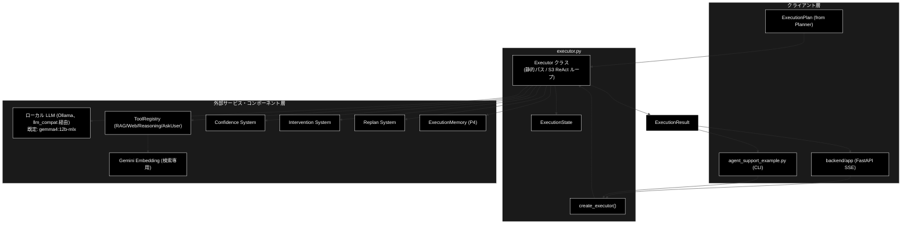
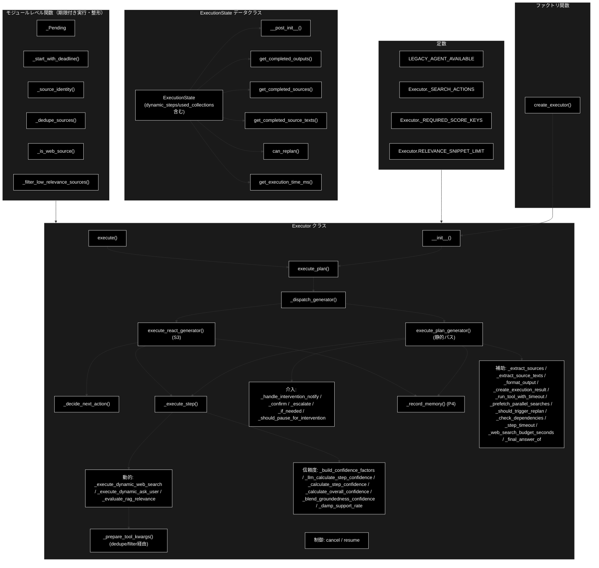
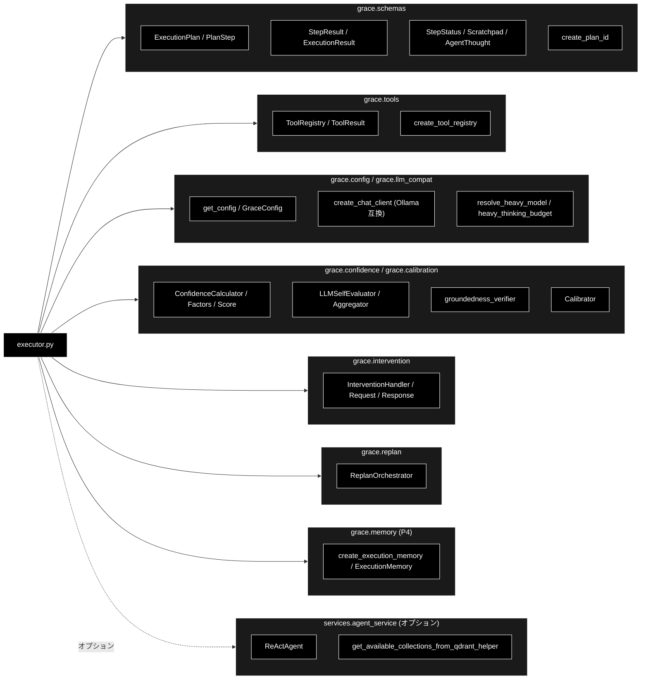
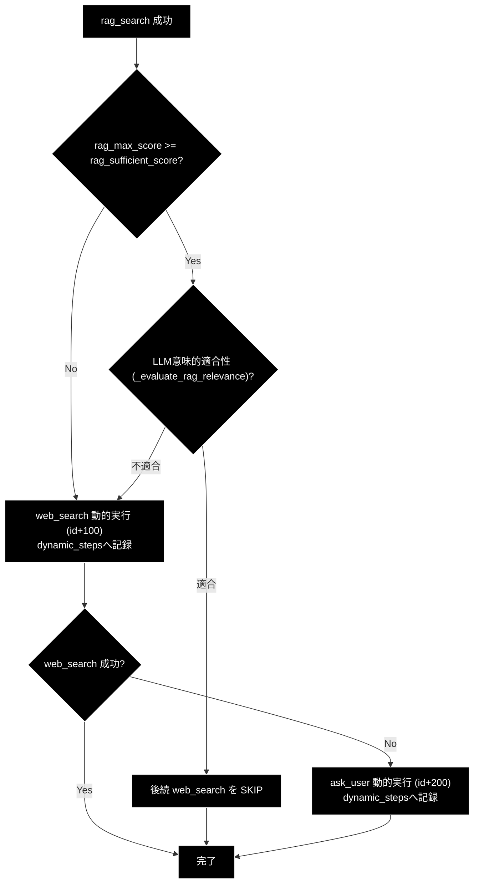
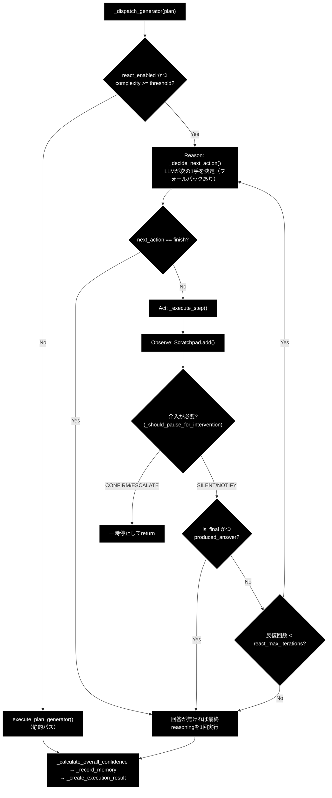
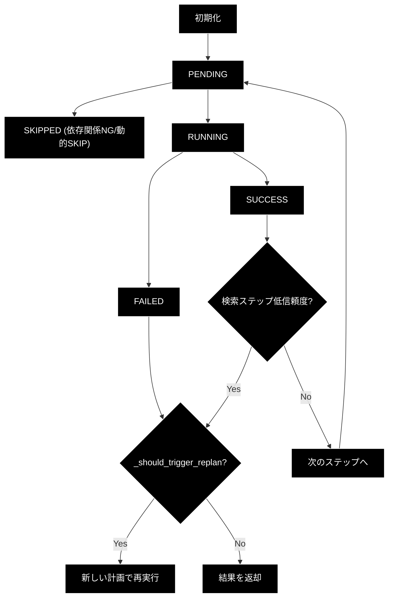

# executor.py - GRACE計画実行エージェント ドキュメント

**Version 5.0** | 最終更新: 2026-09-03

---

## 目次

1. [概要](#概要)
   - [主な責務](#主な責務)
   - [各責務対応のモジュール](#各責務対応のモジュール)
   - [主要機能一覧](#主要機能一覧)
2. [アーキテクチャ構成図](#1-アーキテクチャ構成図)
   - [システム全体構成](#11-システム全体構成)
   - [データフロー](#12-データフロー)
3. [モジュール構成図](#2-モジュール構成図)
   - [内部モジュール構成](#21-内部モジュール構成)
   - [外部依存関係](#22-外部依存関係)
   - [内部依存モジュール](#23-内部依存モジュール)
4. [クラス・関数一覧表](#3-クラス関数一覧表)
   - [モジュールレベル関数・クラス](#30-モジュールレベル関数クラス)
   - [クラス一覧](#31-クラス一覧)
   - [関数一覧（カテゴリ別）](#32-関数一覧カテゴリ別)
5. [クラス・関数 IPO詳細](#4-クラス関数-ipo詳細)
   - [モジュールレベルのヘルパー（期限付き実行・重複除去）](#40-モジュールレベルのヘルパー期限付き実行重複除去)
   - [ExecutionState データクラス](#41-executionstate-データクラス)
   - [Executor クラス](#42-executor-クラス)
   - [ファクトリ関数](#43-ファクトリ関数)
6. [設定・定数](#5-設定定数)
   - [モジュールレベル定数](#51-モジュールレベル定数)
   - [GraceConfigから使用される設定](#52-graceconfigから使用される設定)
7. [使用例](#6-使用例)
   - [基本的なワークフロー](#61-基本的なワークフロー)
   - [コールバック付きの使用](#62-コールバック付きの使用)
   - [ジェネレータ版の使用](#63-ジェネレータ版の使用)
   - [ReAct ループが選ばれる例](#64-react-ループが選ばれる例)
8. [エクスポート](#7-エクスポート)
9. [変更履歴](#8-変更履歴)
10. [付録: 依存関係図](#付録-依存関係図)
11. [付録: 動的フォールバック連鎖](#付録-動的フォールバック連鎖)
12. [付録: ReAct ハイブリッドループ](#付録-react-ハイブリッドループ)
13. [付録: ステータス遷移図](#付録-ステータス遷移図)

---

## 概要

`executor.py`は、GRACE（Guided Reasoning with Adaptive Confidence Execution）エージェントの計画実行コンポーネントです。Plannerが生成した`ExecutionPlan`を受け取り、各ステップを順次実行して結果を管理します。LLM呼び出しは`grace/llm_compat.py`の互換クライアント（`create_chat_client`）経由で**ローカル LLM（Ollama、既定モデルは `config.py::get_default_ollama_model()` が返す `gemma4:12b-mlx`）**に委譲され、Embedding は Gemini（`gemini-embedding-001`、3072次元）を継続利用します（`ANTHROPIC_API_KEY` は不要。Anthropic 経路は `provider="anthropic"` を明示したときだけ動く後方互換）。

> **0-(A) 入力・質問分析との関係**: `backend/app/core/support_agent.py` の `STEP_IDS` には `executor.py` の前段として `"analyze"`（複数質問の検知・選択・再構成）と `"profile"`（業界プロファイル適用）が追加されているが、**executor.py 自体はこの2ステップを直接扱わない**（`grep` で `analyze` を検索しても executor.py 内に該当箇所は無い）。0-(A)/0-(B) は `Planner.create_plan()` を呼ぶ前に完了しており、executor が受け取るのは既に確定した単一クエリの `ExecutionPlan` である。したがって本ドキュメントで扱う `ExecutionPlan` の前提（`original_query` が単一の質問文であること）は従来どおり変わらない。

### 主な責務

- 計画の順次実行（ブロッキング版／ジェネレータ版／S3 ハイブリッド ReAct ループ）
- ステップ間の依存関係管理と検索ステップの並列プリフェッチ（デーモンスレッドの期限付き実行）
- ツールの呼び出しと結果管理（ToolRegistry経由、timeout制御付き）
- RAG検索結果に基づく動的フォールバック連鎖（web_search／ask_user の動的挿入、動的挿入の追跡）
- reasoning へ渡す参照情報の重複除去・関連度フィルタリング
- 信頼度（Confidence）の計算と評価（LLM版／Heuristic版／groundedness較正）
- Human-in-the-Loop（HITL）介入処理（NOTIFY／CONFIRM／ESCALATE）
- 失敗時・低信頼度時のリプラン連携（ReplanOrchestrator）
- 実行メモリ層への記録（コレクションごとの成否をPlannerの優先順位へ反映）
- 実行状態の追跡とコールバック通知

### 各責務対応のモジュール

| # | 責務 | 対応モジュール | 説明 |
|---|------|--------------|------|
| 1 | 計画の順次実行 | `executor.py` | ブロッキング版（`execute_plan`）・ジェネレータ版（`execute_plan_generator`、静的パス）・S3 ハイブリッド ReAct ループ（`execute_react_generator`）の3モードを`_dispatch_generator`が振り分け |
| 2 | ステップ間の依存関係管理と並列プリフェッチ | `executor.py` | `_check_dependencies`で依存確認、`_prefetch_parallel_searches`で同一ウェーブの検索を並列化（`_start_with_deadline`のデーモンスレッド） |
| 3 | ツールの呼び出しと結果管理 | `grace.tools` | ToolRegistryから取得したツールを`_execute_step`で実行（`_run_tool_with_timeout`でtimeout制御） |
| 4 | 動的フォールバック連鎖 | `executor.py` | `_evaluate_rag_relevance`／`_execute_dynamic_web_search`／`_execute_dynamic_ask_user`。挿入先は`ExecutionState.dynamic_steps`で追跡 |
| 5 | 参照情報の重複除去・関連度フィルタ | `executor.py` | `_dedupe_sources`／`_filter_low_relevance_sources`／`_is_web_source`／`_source_identity` |
| 6 | 信頼度の計算と評価 | `grace.confidence` / `grace.calibration` | LLM版（`_llm_calculate_step_confidence`、`config.judges.step_confidence_llm`でON/OFF）・Heuristic版・groundedness ブレンド＋温度較正 |
| 7 | HITL介入処理 | `grace.intervention` | InterventionHandlerを通じてNOTIFY/CONFIRM/ESCALATEレベルの介入を処理（`_should_pause_for_intervention`が非対話実行を判定） |
| 8 | 失敗時・低信頼度時のリプラン連携 | `grace.replan` | `_should_trigger_replan`の判定でReplanOrchestratorを起動 |
| 9 | 実行メモリ層への記録 | `grace.memory` | `_record_memory`が使用コレクションごとの成否を記録（`config.memory.enabled`） |
| 10 | 実行状態の追跡 | `executor.py` | ExecutionStateデータクラスで状態を管理、コールバックでUIに通知 |

### 主要機能一覧

| 機能 | 説明 |
|------|------|
| `_Pending` | `_start_with_deadline`が返す「期限つき実行のハンドル」 |
| `_source_identity()` | 検索結果1件の同一性キーを算出 |
| `_dedupe_sources()` | reasoning へ渡す参照情報を重複除去＋上限で切る |
| `_is_web_source()` | Web検索由来の結果か判定 |
| `_filter_low_relevance_sources()` | 関連度の低いRAG結果だけを参照情報から除外 |
| `_start_with_deadline()` | 関数をデーモンスレッドで開始し、期限つきで待ち合わせるハンドルを返す |
| `ExecutionState` | 実行状態管理データクラス |
| `ExecutionState.__post_init__()` | 全ステップをPENDINGで初期化 |
| `ExecutionState.get_completed_outputs()` | 成功したステップの出力を取得 |
| `ExecutionState.get_completed_sources()` | 成功したステップのソース（識別子）を取得 |
| `ExecutionState.get_completed_source_texts()` | 完了ステップの**出典本文**を取得（groundedness 検証用・P-01b） |
| `ExecutionState.can_replan()` | リプラン可能か判定 |
| `ExecutionState.get_execution_time_ms()` | 実行時間（ミリ秒）を取得 |
| `Executor` | 計画実行エージェントクラス |
| `Executor.__init__()` | コンストラクタ（各種コンポーネントの初期化。実行メモリ・ReActクライアントを含む） |
| `Executor._should_pause_for_intervention()` | 介入で一時停止すべきか判定（対話/非対話・ESCALATE/CONFIRM） |
| `Executor.execute_plan_generator()` | 静的パスを計画をジェネレータで実行（UI連携用） |
| `Executor.execute_plan()` | 計画を同期実行（ブロッキング版、`_dispatch_generator`をドレイン） |
| `Executor._dispatch_generator()` | S3: 複雑度に応じて ReAct ループ／静的パスを振り分け |
| `Executor.execute()` | `execute_plan()` の統一エントリーポイント（benchmark互換） |
| `Executor.execute_react_generator()` | S3: Reason→Act→Observe→Confidence→Controller の観測駆動 ReAct ループ |
| `Executor._decide_next_action()` | ReAct の Reason：Scratchpad＋初期計画から次の1手をLLMが決定（フォールバックあり） |
| `Executor._handle_ask_user_response()` | ask_user 出力をUIへ渡しユーザー応答を反映 |
| `Executor._step_timeout()` | ステップの実効タイムアウト（秒）を解決 |
| `Executor._web_search_budget_seconds()` | web_search が自力で使いうる最大秒数を算出 |
| `Executor._run_tool_with_timeout()` | ツールを timeout_seconds 制限付きで実行（デーモンスレッド） |
| `Executor._prefetch_parallel_searches()` | 依存関係のない後続検索ステップを並列プリフェッチ |
| `Executor._should_trigger_replan()` | リプランを発火すべきか判定 |
| `Executor._check_dependencies()` | ステップの依存関係を確認 |
| `Executor._execute_step()` | 個別ステップの実行（ジェネレータ対応） |
| `Executor._execute_legacy_agent_step()` | Legacy ReActAgentを使用したステップ実行 |
| `Executor._prepare_tool_kwargs()` | ツール実行引数の準備（参照情報の重複除去・関連度フィルタ・ask_user除外を含む） |
| `Executor._relevance_check_model()` | RAG適合性チェックに使う軽量モデル名を解決（M-3） |
| `Executor._format_rag_snippet()` | 適合性チェック用に検索結果を短文へ整形（M-5） |
| `Executor._evaluate_rag_relevance()` | LLMでRAG結果の意味的適合性を判定（担当範囲を考慮） |
| `Executor._execute_dynamic_web_search()` | web_search を動的挿入実行（`dynamic_steps`へ記録） |
| `Executor._execute_dynamic_ask_user()` | ask_user を動的挿入実行（`dynamic_steps`へ記録） |
| `Executor._execute_fallback()` | フォールバックアクションの実行 |
| `Executor._warn_on_missing_score_keys()` | 検索ステップの統計に正準キーが無ければ警告 |
| `Executor._build_confidence_factors()` | ConfidenceFactors を構築（共通部） |
| `Executor._llm_calculate_step_confidence()` | LLMを使用したステップ信頼度計算（`judges.step_confidence_llm`でHeuristicのみに切替可） |
| `Executor._calculate_step_confidence()` | Heuristicベースのステップ信頼度計算 |
| `Executor._extract_sources()` | ツール結果から出典識別子を抽出（表示用） |
| `Executor._extract_source_texts()` | ツール結果から出典本文を抽出（groundedness検証用・P-01b） |
| `Executor._damp_support_rate()` | 判定できたclaimの割合で支持率を減衰（M-6） |
| `Executor._format_output()` | 出力を文字列にフォーマット |
| `Executor._calculate_overall_confidence()` | 全体信頼度の計算（groundedness ブレンド＋較正） |
| `Executor._blend_groundedness_confidence()` | groundedness を主成分に最終 confidence を合成 |
| `Executor._final_answer_of()` | 最後に成功した reasoning/legacy_agent の出力を返す（静的メソッド） |
| `Executor._record_memory()` | 実行結果を実行メモリへ記録（P4、動的ステップは成否集計から除外） |
| `Executor._create_execution_result()` | ExecutionResultを生成（ベンチマーク用の集計値を含む） |
| `Executor.cancel()` | 実行をキャンセル |
| `Executor.resume()` | 実行を再開 |
| `Executor._handle_intervention_notify()` | NOTIFYレベルの介入処理 |
| `Executor._handle_intervention_confirm()` | CONFIRMレベルの介入処理 |
| `Executor._handle_intervention_escalate()` | ESCALATEレベルの介入処理 |
| `Executor._handle_intervention_if_needed()` | 介入が必要か判定して処理 |
| `create_executor()` | Executorインスタンスを作成するファクトリ関数 |

---

## 1. アーキテクチャ構成図

### 1.1 システム全体構成



### 1.2 データフロー

1. Plannerから`ExecutionPlan`を受信（`original_query`は0-(A)/0-(B)で確定済みの単一クエリ）
2. `execute_plan()`が`_noninteractive = True`にして`_dispatch_generator`を呼ぶ
3. `_dispatch_generator`が`plan.complexity`と`executor.react_complexity_threshold`（既定0.7）を比較し、S3 ReAct ループ（`execute_react_generator`）か静的パス（`execute_plan_generator`）かを選ぶ
4. `ExecutionState`を初期化し、全ステップをPENDINGに設定（プリフェッチキャッシュもクリア）
5. **静的パス**: 未完了ステップを順次実行（キャンセル／SKIP／依存関係を確認）。検索系ステップは依存関係のない後続検索を並列プリフェッチ（デーモンスレッド）
6. **ReAct パス**: Reason（`_decide_next_action`がLLMで次の1手を決定）→ Act（`_execute_step`）→ Observe（`Scratchpad.add`）→ Controller（介入判定）を`is_final`かつ回答生成まで最大`react_max_iterations`回繰り返す
7. ツールを呼び出し（timeout制御）、中間結果をyieldでUI通知
8. `rag_search`成功時はスコアとLLMの意味的適合性判定に基づき、必要なら`web_search`→`ask_user`を動的挿入（`ExecutionState.dynamic_steps`へ記録）
9. reasoning ステップは`state.step_results`全体から参照情報を集約し、`_filter_low_relevance_sources`→`_dedupe_sources`の順で絞り込む（ask_userの出力は除外）
10. LLM版信頼度を計算（`judges.step_confidence_llm`が有効な場合。既定はHeuristicのみ）、必要に応じて介入を処理
11. ステップ失敗または検索ステップの低信頼度でリプランを実行（最大`replan.max_replans`回）
12. 全体信頼度を計算（groundedness を主成分にブレンド→温度較正）
13. `_record_memory`が使用コレクションごとの成否を実行メモリへ記録（動的挿入ステップの空振りは集計から除外）
14. `ExecutionResult`を生成して返却（`rag_max_score`／`rag_search_count`／`web_search_used`／`total_token_usage`のベンチマーク集計を含む）

---

## 2. モジュール構成図

### 2.1 内部モジュール構成



### 2.2 外部依存関係

| ライブラリ | バージョン | 用途 |
|-----------|-----------|------|
| `ast` | 標準ライブラリ | ask_user／reasoning出力の安全なパース（`literal_eval`） |
| `logging` | 標準ライブラリ | ログ出力 |
| `threading` | 標準ライブラリ | 期限付き実行の**デーモンスレッド**（`_start_with_deadline`） |
| `time` | 標準ライブラリ | 実行時間計測 |
| `dataclasses` | 標準ライブラリ | データクラス定義 |
| `enum` | 標準ライブラリ | 列挙型（Enum） |
| `json` | 標準ライブラリ | ツール中間結果のUI向け整形（`_execute_step`内でローカルimport） |
| `re` | 標準ライブラリ | Legacy Agent の出典抽出（`_execute_legacy_agent_step`内でローカルimport） |

> ⚠️ **`concurrent.futures.ThreadPoolExecutor` は使わない。** 2026-08 の修正で `_start_with_deadline`（`threading.Thread(daemon=True)`）へ全面移行した。`ThreadPoolExecutor` のワーカーは非デーモンで `_threads_queues` に登録され、インタプリタ終了時の `_python_exit()` が全ワーカーを `join()` する。タイムアウトで見捨てたスレッドが非デーモンだと、Ctrl-C や uvicorn のシャットダウンがローカル LLM の生成が返るまでハングする（`_start_with_deadline` の docstring 参照）。

### 2.3 内部依存モジュール

| モジュール | 用途 |
|-----------|------|
| `grace.schemas` | ExecutionPlan, PlanStep, StepResult, ExecutionResult, StepStatus, Scratchpad, AgentThought, create_plan_id |
| `grace.tools` | ToolRegistry, ToolResult, create_tool_registry |
| `grace.config` | get_config, GraceConfig, resolve_heavy_model, heavy_thinking_budget |
| `grace.llm_compat` | create_chat_client（genai互換 Ollama クライアント生成） |
| `grace.confidence` | ConfidenceCalculator, ConfidenceFactors, ConfidenceScore, LLMSelfEvaluator, ConfidenceAggregator, ActionDecision, InterventionLevel, および各 create_* ファクトリ（create_groundedness_verifier 等） |
| `grace.calibration` | Calibrator（confidence 温度較正） |
| `grace.intervention` | InterventionHandler, InterventionRequest, InterventionResponse, InterventionAction, create_intervention_handler |
| `grace.replan` | ReplanOrchestrator, create_replan_orchestrator（モジュール末尾で遅延import。循環import回避） |
| `grace.memory` | create_execution_memory（P4: 実行メモリ層） |
| `services.agent_service` | ReActAgent, get_available_collections_from_qdrant_helper（オプション、Legacy Agent用） |

---

## 3. クラス・関数一覧表

### 3.0 モジュールレベル関数・クラス

| 関数・クラス | 概要 |
|-------|------|
| `_Pending` | `_start_with_deadline`が返す「まだ終わっていないかもしれない実行」のハンドル（`wait(timeout)`／`result()`） |
| `_source_identity(entry)` | 検索結果1件の同一性キー（`source\x00body`）を返す。判定不能なら`None` |
| `_dedupe_sources(sources, limit)` | 参照情報を順序保持で重複除去し、`limit`件で切る |
| `_is_web_source(entry)` | `entry.get("collection") == "web_search"`か判定 |
| `_filter_low_relevance_sources(sources, min_rag_score)` | 関連度の低いRAG結果だけを除外（Web結果・全件除外は対象外） |
| `_start_with_deadline(fn, kwargs, label)` | `fn(**kwargs)`をデーモンスレッドで開始し`_Pending`を返す |

### 3.1 クラス一覧

#### ExecutionState

| メソッド | 概要 |
|---------|------|
| `__post_init__()` | 全ステップをPENDINGで初期化 |
| `get_completed_outputs()` | 成功したステップの出力を取得 |
| `get_completed_sources()` | 成功したステップのソース（識別子）を取得 |
| `get_completed_source_texts()` | 完了ステップの出典本文を取得（P-01b） |
| `can_replan()` | リプラン可能か判定 |
| `get_execution_time_ms()` | 実行時間（ミリ秒）を取得 |

#### Executor

| メソッド | 概要 |
|---------|------|
| `__init__(config, tool_registry, ...)` | コンストラクタ（各種コンポーネントの初期化） |
| `_should_pause_for_intervention(level)` | 介入で一時停止すべきか判定 |
| `execute_plan_generator(plan, state)` | 静的パス：計画をジェネレータで実行（UI連携用） |
| `execute_plan(plan)` | 計画を同期実行（`_dispatch_generator`をドレイン） |
| `_dispatch_generator(plan)` | S3: ReAct ループ／静的パスを振り分け |
| `execute(plan)` | `execute_plan()` の統一エントリーポイント |
| `execute_react_generator(plan, state)` | S3: ハイブリッド ReAct ループ |
| `_decide_next_action(plan, scratchpad, fallback_queue)` | ReAct の Reason：次の1手を決定 |
| `_handle_ask_user_response(step, result, state)` | ask_user 応答をUI経由で反映 |
| `_step_timeout(step)` | ステップの実効タイムアウト（秒）を解決 |
| `_web_search_budget_seconds()` | web_search が使いうる最大秒数を算出 |
| `_run_tool_with_timeout(tool, kwargs, step)` | timeout_seconds 制限付きツール実行 |
| `_prefetch_parallel_searches(current_step, steps_to_execute, state)` | 後続検索の並列プリフェッチ |
| `_should_trigger_replan(step, result, state)` | リプラン発火判定 |
| `_check_dependencies(step, state)` | ステップの依存関係を確認 |
| `_execute_step(step, state)` | 個別ステップの実行（ジェネレータ対応） |
| `_execute_legacy_agent_step(step, state, start_time)` | Legacy ReActAgentを使用したステップ実行 |
| `_prepare_tool_kwargs(step, state)` | ツール実行引数の準備 |
| `_relevance_check_model()` | RAG適合性チェックのモデル名を解決（M-3） |
| `_format_rag_snippet(rag_output, limit)` | 検索結果を短文へ整形（静的メソッド・M-5） |
| `_evaluate_rag_relevance(query, rag_output)` | LLMでRAG結果の意味的適合性を判定 |
| `_execute_dynamic_web_search(rag_step, state)` | web_search を動的挿入実行 |
| `_execute_dynamic_ask_user(rag_step, state)` | ask_user を動的挿入実行 |
| `_execute_fallback(step, state)` | フォールバックアクションの実行 |
| `_warn_on_missing_score_keys(factors, step)` | 統計に正準キーが無ければ警告 |
| `_build_confidence_factors(tool_result, step, state)` | ConfidenceFactors の共通構築 |
| `_llm_calculate_step_confidence(tool_result, step, state)` | ステップ信頼度の計算（LLM版） |
| `_calculate_step_confidence(tool_result, step, state)` | ステップ信頼度の計算（Heuristic版） |
| `_extract_sources(tool_result)` | ツール結果から出典識別子を抽出 |
| `_extract_source_texts(tool_result)` | ツール結果から出典本文を抽出（P-01b） |
| `_damp_support_rate(gres, cc)` | 支持率を判定率で減衰（静的メソッド・M-6） |
| `_format_output(output)` | 出力を文字列にフォーマット |
| `_calculate_overall_confidence(state)` | 全体信頼度の計算 |
| `_blend_groundedness_confidence(query, final_answer, self_eval, coverage, aggregated, sources)` | groundedness を主成分に最終 confidence を合成 |
| `_final_answer_of(state)` | 最後に成功した reasoning/legacy_agent の出力を返す（静的メソッド） |
| `_record_memory(state)` | 実行結果を実行メモリへ記録（P4） |
| `_create_execution_result(state)` | ExecutionResultを生成 |
| `cancel(state)` | 実行をキャンセル |
| `resume(state)` | 実行を再開 |
| `_handle_intervention_notify(message)` | NOTIFYレベルの介入処理 |
| `_handle_intervention_confirm(request)` | CONFIRMレベルの介入処理 |
| `_handle_intervention_escalate(request)` | ESCALATEレベルの介入処理 |
| `_handle_intervention_if_needed(action_decision, step, state)` | 介入が必要か判定して処理 |

### 3.2 関数一覧（カテゴリ別）

#### ファクトリ関数

| 関数名 | 概要 |
|-------|------|
| `create_executor(config, tool_registry, **kwargs)` | Executorインスタンスを作成 |

---

## 4. クラス・関数 IPO詳細

### 4.0 モジュールレベルのヘルパー（期限付き実行・重複除去）

#### クラス: `_Pending`

**概要**: `_start_with_deadline` が返す「まだ終わっていないかもしれない実行」のハンドル。`wait(timeout)` が `True` を返せば `value` / `error` が確定している。

```python
class _Pending:
    __slots__ = ("thread", "value", "error", "label")
    def wait(self, timeout: Optional[float]) -> bool
    def result(self) -> Any
```

| 項目 | 内容 |
|------|------|
| **Input** | `thread: threading.Thread`, `label: str`（コンストラクタ） |
| **Process** | `wait()`は`thread.join(timeout)`を呼び、生存していなければ完了とみなす。`result()`は`error`があれば送出、無ければ`value`を返す |
| **Output** | `wait()`: `bool`（完了したか）／`result()`: `Any`（完了値、または例外送出） |

**戻り値例**:
```python
True  # wait(timeout) が完了を示した場合
```

```python
# 使用例（内部呼び出し）
pending = _start_with_deadline(tool.execute, kwargs, "step-1")
if pending.wait(30):
    result = pending.result()
```

---

#### `_source_identity`

**概要**: 検索結果1件の同一性キーを返す。判定できなければ`None`（重複除去の対象外）。出典URL/ファイル名（`payload.source`）と本文（`payload.answer`/`payload.content`）の組で見る。URLだけだと同一ページの別スニペットまで落としてしまうため。

```python
def _source_identity(entry: Any) -> Optional[str]
```

| パラメータ | 型 | デフォルト | 説明 |
|------------|------|-----------|------|
| `entry` | Any | - | 検索結果1件（`{"payload": {...}}`形式のdictを想定） |

| 項目 | 内容 |
|------|------|
| **Input** | `entry: Any` |
| **Process** | 1. dict/`payload`がdictでなければ`None`<br>2. `source`と`answer`(または`content`)を連結したキーを構築<br>3. どちらも空なら`None` |
| **Output** | `Optional[str]`: 同一性キー、または`None` |

**戻り値例**:
```python
"gov_faq.csv\x00住民票の写しは市民課窓口またはコンビニ交付で取得できます。"
```

---

#### `_dedupe_sources`

**概要**: reasoning へ渡す参照情報を**重複除去して上限で切る**。reasoning は `state.step_results` 全体から参照情報を集める（動的挿入・リプラン後の結果も拾うための意図的な設計）ため、リプランのたびに同じ結果が積み上がる。実測では3回のリプランで同じ9件のWeb結果と5件のRAG結果が4回ずつ、計56件が「情報源」として並んでいた。順序は保つ（先に得られた結果ほど前）。同一性を判定できない要素は落とさず素通しする。

```python
def _dedupe_sources(sources: List[Any], limit: int) -> List[Any]
```

| パラメータ | 型 | デフォルト | 説明 |
|------------|------|-----------|------|
| `sources` | List[Any] | - | 重複除去する参照情報のリスト |
| `limit` | int | - | 上限件数（0以下で無制限） |

| 項目 | 内容 |
|------|------|
| **Input** | `sources: List[Any]`, `limit: int` |
| **Process** | 1. `_source_identity`でキーを算出し既出なら除外<br>2. `limit`に達したら打ち切り<br>3. 除外が発生したらINFOログ |
| **Output** | `List[Any]`: 重複除去・上限適用後のリスト |

**戻り値例**:
```python
[{"payload": {"source": "gov_faq.csv", "answer": "..."}}]  # 56件 → 20件
```

```python
# 使用例（内部呼び出し、_prepare_tool_kwargs 内）
kwargs["sources"] = _dedupe_sources(
    _filter_low_relevance_sources(sources, self.config.executor.reasoning_min_rag_score),
    limit=self.config.executor.reasoning_max_sources,
)
```

---

#### `_is_web_source`

**概要**: Web検索由来の結果か判定する。

```python
def _is_web_source(entry: Any) -> bool
```

| 項目 | 内容 |
|------|------|
| **Input** | `entry: Any` |
| **Process** | `isinstance(entry, dict) and entry.get("collection") == "web_search"` |
| **Output** | `bool` |

---

#### `_filter_low_relevance_sources`

**概要**: 関連度の低い**RAG結果だけ**を reasoning の参照情報から外す。RAG検索は「一次閾値に届くコレクションが無いため緩和結果を採用」という救済を持つが、その結果が reasoning プロンプトの先頭を占めると害になる（実測：「明日の東京の天気は？」に対しAIの変遷・インドネシア首都移転・著作権保護期間（いずれもスコア0.52〜0.54）が情報源1〜5に並び、肝心のWeb天気情報が後ろへ押しやられていた）。Web検索のscoreは順位由来（1.0, 0.9, …, 0.2）でRAGのコサイン類似度とは尺度が違うため対象外にする。絞った結果が空になる場合は元のまま返す。

```python
def _filter_low_relevance_sources(sources: List[Any], min_rag_score: float) -> List[Any]
```

| パラメータ | 型 | デフォルト | 説明 |
|------------|------|-----------|------|
| `sources` | List[Any] | - | フィルタ対象の参照情報 |
| `min_rag_score` | float | - | RAG結果の最低コサイン類似度（`config.executor.reasoning_min_rag_score`、既定0.64） |

| 項目 | 内容 |
|------|------|
| **Input** | `sources: List[Any]`, `min_rag_score: float` |
| **Process** | 1. Web由来／dictでない／`score >= min_rag_score`のいずれかを満たす要素を残す<br>2. 全件除外になる場合は元のsourcesをそのまま返す |
| **Output** | `List[Any]`: フィルタ後のリスト（全滅時は元のまま） |

**戻り値例**:
```python
[{"payload": {"source": "web:yahoo天気", ...}, "collection": "web_search", "score": 0.9}]
```

---

#### `_start_with_deadline`

**概要**: `fn(**kwargs)` を**デーモンスレッド**で開始し、待ち合わせ用ハンドル（`_Pending`）を返す。`concurrent.futures.ThreadPoolExecutor` を使わない理由: そのワーカーは非デーモンで `_threads_queues` に登録され、インタプリタ終了時の `_python_exit()` が全ワーカーを `join()` する。タイムアウトで見捨てたスレッドが非デーモンだと、Ctrl-C や uvicorn のシャットダウンがローカル LLM の生成が返るまでハングする。`daemon=True` のスレッドは join されないため、この経路が消える。

```python
def _start_with_deadline(fn: Callable[..., Any], kwargs: Dict[str, Any], label: str) -> _Pending
```

| パラメータ | 型 | デフォルト | 説明 |
|------------|------|-----------|------|
| `fn` | Callable[..., Any] | - | 実行する関数（`tool.execute`等） |
| `kwargs` | Dict[str, Any] | - | `fn`への引数 |
| `label` | str | - | スレッド名のサフィックス（ログ・デバッグ用） |

| 項目 | 内容 |
|------|------|
| **Input** | `fn`, `kwargs`, `label` |
| **Process** | 1. `_Pending`を作成<br>2. `fn(**kwargs)`を実行し結果/例外を`pending`へ格納する内部関数を定義<br>3. `daemon=True`のスレッドで開始 |
| **Output** | `_Pending`: 待ち合わせハンドル |

> ⚠️ これは**保険**である。本来の期限は LLM クライアント側（`llm.timeout` → openai SDK の `httpx.Timeout`）が持ち、そちらが先に切れるように設定する（`llm.timeout` < `planner.step_timeout_seconds`）。ここが日常的に発火しているなら設定が逆転している。

**戻り値例**:
```python
<grace.executor._Pending object at 0x...>
```

---

### 4.1 ExecutionState データクラス

**概要**: 実行状態管理データクラス。計画の実行状態、ステップ結果、信頼度、制御フラグなどを保持します。

#### フィールド一覧

| フィールド | 型 | デフォルト | 説明 |
|-----------|------|-----------|------|
| `plan` | ExecutionPlan | - | 実行中の計画 |
| `current_step_id` | int | 0 | 現在実行中のステップID |
| `step_results` | Dict[int, StepResult] | {} | ステップID → 結果のマッピング |
| `step_statuses` | Dict[int, StepStatus] | {} | ステップID → ステータスのマッピング |
| `overall_confidence` | float | 0.0 | 全体の信頼度スコア (0.0-1.0) |
| `is_cancelled` | bool | False | キャンセルフラグ |
| `is_paused` | bool | False | 一時停止フラグ |
| `intervention_request` | Optional[Any] | None | 保留中の介入リクエスト（InterventionRequest） |
| `replan_count` | int | 0 | リプラン実行回数 |
| `max_replans` | int | 3 | 最大リプラン回数 |
| `start_time` | Optional[float] | None | 実行開始時刻 |
| `end_time` | Optional[float] | None | 実行終了時刻 |
| `used_collections` | List[str] | [] | **(P4新規)** 実行中に使用したRAGコレクション（実行メモリ記録用） |
| `dynamic_steps` | Dict[int, str] | {} | **(新規)** 動的挿入したステップの `step_id → action`。`state.plan.steps` には追記されない動的フォールバック（web_search/ask_user）を識別するために使う |

> ⚠️ **`dynamic_steps` はなぜ要るか。** 動的フォールバック（`_execute_dynamic_web_search`/`_execute_dynamic_ask_user`）は `state.plan.steps` に追記されない。append しているのは ReAct 経路（`state.plan.steps.append(step)`）だけで、動的挿入は `step_results`/`step_statuses` にしか現れない。以前は「`plan.steps` を見て動的挿入かを判定する」実装だったため、**ask_user の出力を reasoning から除外する処理**と**補助ステップの空振りをコレクション失敗として記録しない処理**の両方が、実機ではまったく効いていなかった（2026-08-29 実測）。`PlanStep.dynamic` フィールド（step オブジェクト側の印。ReAct経路で使用）と `dynamic_steps`（実際に動的挿入して実行したidの記録）の**両方を足して**漏れをなくしている。

> 📝 **`web_search_executed` という動的属性もある。** `ExecutionState` は `@dataclass` だが `__slots__` は無いため、`_execute_dynamic_web_search` が `state.web_search_executed = True` を代入して使う（宣言済みフィールドではない）。`_create_execution_result` が `getattr(state, "web_search_executed", False)` で読み、計画に web_search ステップが無くても動的挿入で実行されたことを `ExecutionResult.web_search_used` に反映する（ベンチマーク計測用）。

---

#### メソッド: `__post_init__`

**概要**: データクラス初期化後の処理。全ステップのステータスをPENDINGで初期化します。

```python
def __post_init__(self) -> None
```

| 項目 | 内容 |
|------|------|
| **Input** | なし（selfのみ） |
| **Process** | 計画内の全ステップのステータスを`StepStatus.PENDING`で初期化 |
| **Output** | なし（`self.step_statuses`が初期化された状態） |

**戻り値例**:
```python
None  # 副作用として self.step_statuses = {1: StepStatus.PENDING, ...}
```

```python
# 使用例
from grace.executor import ExecutionState
state = ExecutionState(plan=plan)  # __post_init__ が自動実行される
print(state.step_statuses)
# {1: <StepStatus.PENDING>, 2: <StepStatus.PENDING>}
```

---

#### メソッド: `get_completed_outputs`

**概要**: 成功したステップの出力を取得します。

```python
def get_completed_outputs(self) -> Dict[int, str]
```

| 項目 | 内容 |
|------|------|
| **Input** | なし（selfのみ） |
| **Process** | statusが"success"のステップの出力を抽出 |
| **Output** | `Dict[int, str]`: ステップID → 出力のマッピング |

**戻り値例**:
```python
{
    1: "検索結果: 住民票の写しは市民課窓口で取得できます...",
    2: "手数料は1通300円です..."
}
```

```python
# 使用例
outputs = state.get_completed_outputs()
for step_id, text in outputs.items():
    print(f"Step {step_id}: {text[:30]}")
```

---

#### メソッド: `get_completed_sources`

**概要**: 成功したステップのソース（出典**識別子**）を取得します。ファイル名・URL等の識別子であり、内容の検証には使えません。根拠検証・自己評価には `get_completed_source_texts()` を使います。

```python
def get_completed_sources(self) -> List[str]
```

| 項目 | 内容 |
|------|------|
| **Input** | なし（selfのみ） |
| **Process** | statusが"success"でsourcesが存在するステップからソースを収集 |
| **Output** | `List[str]`: ソースURLや参照のリスト |

**戻り値例**:
```python
["gov_faq.csv"]
```

```python
# 使用例
sources = state.get_completed_sources()
print(f"参照ソース数: {len(sources)}")
```

---

#### メソッド: `get_completed_source_texts`（P-01b）

**概要**: 完了済みステップの**出典本文**を重複排除して取得します。`get_completed_sources()` が返す**識別子**とは用途が異なります。

```python
def get_completed_source_texts(self) -> List[str]
```

| 項目 | 内容 |
|------|------|
| **Input** | なし（`self.step_results`） |
| **Process** | `status == "success"` のステップの `source_texts` を走査し、空文字を除いて重複排除 |
| **Output** | `List[str]`: 出典本文のリスト（本文を持たない経路では `[]`） |

> ⚠️ **なぜ本文が要るか。** groundedness 検証と LLM 自己評価は「回答が情報源に裏付けられているか」を判定します。ここへ識別子（`gov_faq.csv` 等）を渡すと**どの主張も検証できず全て neutral** になり、`support_rate = supported / (supported + contradicted)` の**分母が 0** になります。

> 📝 本文を持たない経路（legacy agent 等）では空を返し、呼び出し側が `get_completed_sources()` へフォールバックできるようにしています。

**戻り値例**:
```python
["Q: 住民票はどこで取れますか / A: 市民課の窓口およびコンビニ交付でお受け取りいただけます。"]
```

```python
# 使用例（groundedness 検証へ本文を渡す）
texts = state.get_completed_source_texts() or state.get_completed_sources()
verifier.verify(query, answer, texts)
```

---

#### メソッド: `can_replan`

**概要**: リプラン可能か判定します。

```python
def can_replan(self) -> bool
```

| 項目 | 内容 |
|------|------|
| **Input** | なし（selfのみ） |
| **Process** | リプラン回数が上限未満（`replan_count < max_replans`）かつキャンセルされていないか確認 |
| **Output** | `bool`: リプラン可能ならTrue |

**戻り値例**:
```python
True
```

```python
# 使用例
if state.can_replan():
    print("リプラン可能")
```

---

#### メソッド: `get_execution_time_ms`

**概要**: 実行時間をミリ秒で取得します。

```python
def get_execution_time_ms(self) -> Optional[int]
```

| 項目 | 内容 |
|------|------|
| **Input** | なし（selfのみ） |
| **Process** | start_timeからend_time（またはcurrent time）までの経過時間を計算 |
| **Output** | `Optional[int]`: 実行時間（ミリ秒）、start_timeがNoneの場合はNone |

**戻り値例**:
```python
1234  # 1.234秒
```

```python
# 使用例
ms = state.get_execution_time_ms()
print(f"実行時間: {ms}ms" if ms is not None else "未開始")
```

---

### 4.2 Executor クラス

**概要**: 計画実行エージェント（GRACEネイティブ実装）。ToolRegistry、Confidence／Calibration、Intervention、Replan、実行メモリの各システムを統合して計画を実行します。静的パス（`execute_plan_generator`）に加えて、複雑な質問向けに観測駆動の S3 ハイブリッド ReAct ループ（`execute_react_generator`）を持ちます。

#### コンストラクタ: `__init__`

**概要**: Executorインスタンスを初期化します。設定、ToolRegistry、各種Confidenceコンポーネント（groundedness検証器・Calibratorを含む）、ReAct用のLLMクライアント、実行メモリ層、コールバック、InterventionHandler、ReplanOrchestratorを設定します。

```python
def __init__(
    self,
    config: Optional[GraceConfig] = None,
    tool_registry: Optional[ToolRegistry] = None,
    on_step_start: Optional[Callable[[PlanStep], None]] = None,
    on_step_complete: Optional[Callable[[StepResult], None]] = None,
    on_intervention_required: Optional[Callable[[str, Dict], Any]] = None,
    on_confidence_update: Optional[Callable[[ConfidenceScore, ActionDecision], None]] = None,
    on_replan: Optional[Callable[[str, int], None]] = None,
    replan_orchestrator: Optional[ReplanOrchestrator] = None,
    enable_replan: bool = True,
)
```

| パラメータ | 型 | デフォルト | 説明 |
|------------|------|-----------|------|
| `config` | Optional[GraceConfig] | None | GRACE設定（Noneの場合は`get_config()`） |
| `tool_registry` | Optional[ToolRegistry] | None | ツールレジストリ（Noneの場合はデフォルト作成） |
| `on_step_start` | Optional[Callable[[PlanStep], None]] | None | ステップ開始時コールバック |
| `on_step_complete` | Optional[Callable[[StepResult], None]] | None | ステップ完了時コールバック |
| `on_intervention_required` | Optional[Callable[[str, Dict], Any]] | None | 介入要求時コールバック |
| `on_confidence_update` | Optional[Callable[[ConfidenceScore, ActionDecision], None]] | None | 信頼度更新時コールバック |
| `on_replan` | Optional[Callable[[str, int], None]] | None | リプラン発生時コールバック |
| `replan_orchestrator` | Optional[ReplanOrchestrator] | None | リプランオーケストレーター（明示指定） |
| `enable_replan` | bool | True | リプラン機能の有効/無効 |

| 項目 | 内容 |
|------|------|
| **Input** | 上記パラメータ |
| **Process** | 1. 設定の取得（`config or get_config()`）<br>2. ToolRegistryの初期化（`create_tool_registry`）<br>3. Confidenceコンポーネント初期化（calculator/llm_evaluator/query_coverage/aggregator/groundedness_verifier）<br>4. Calibratorをcalibration_pathからロード（無ければ恒等T=1.0）<br>5. S3: ReAct の Reason 用 LLM クライアント（`create_chat_client(self.config)`）を`_react_client`に生成<br>6. P4: `config.memory.enabled`なら`create_execution_memory(config.memory.path)`で`_memory`を生成<br>7. `_noninteractive`フラグを`False`で初期化<br>8. コールバック5種を設定<br>9. InterventionHandler初期化（notify/confirm/escalateコールバック付き）<br>10. ReplanOrchestrator初期化（指定／enable_replan時に自動生成／無効の3パターン）<br>11. `step_confidence_scores`・`_prefetched_tool_results`辞書を初期化 |
| **Output** | Executorインスタンス |

**戻り値例**:
```python
<grace.executor.Executor object at 0x...>
```

```python
# 使用例
from grace.executor import Executor
from grace.config import get_config

executor = Executor()                       # デフォルト設定（Ollama、gemma4:12b-mlx）
config = get_config("config/custom.yml")
executor = Executor(config=config, enable_replan=False)  # リプラン無効
```

---

#### メソッド: `_should_pause_for_intervention`

**概要**: 介入で一時停止すべきか判定します。ESCALATEは常に停止（ユーザー入力が必須）。CONFIRMは対話モード（`config.intervention.interactive`）かつ非ブロッキング時のみ停止し、ブロッキング`execute_plan`（非対話）では自動進行して後続のreasoningまで完走します。

```python
def _should_pause_for_intervention(self, level: InterventionLevel) -> bool
```

| パラメータ | 型 | デフォルト | 説明 |
|------------|------|-----------|------|
| `level` | InterventionLevel | - | 判定対象の介入レベル |

| 項目 | 内容 |
|------|------|
| **Input** | `level: InterventionLevel` |
| **Process** | 1. `ESCALATE`なら常に`True`<br>2. `CONFIRM`なら`config.intervention.interactive and not self._noninteractive`<br>3. それ以外（SILENT/NOTIFY）は`False` |
| **Output** | `bool`: 一時停止すべきなら`True` |

**戻り値例**:
```python
False  # ブロッキング実行（execute_plan）中のCONFIRM
```

---

#### メソッド: `execute_plan_generator`

**概要**: **静的パス**で計画をジェネレータ実行します（UI連携用）。各ステップ完了後に状態をyieldし、リアルタイム表示を可能にします。CONFIRM/ESCALATE介入時は一時停止状態をyieldして`ExecutionResult`をreturnします。`_dispatch_generator`から複雑度が閾値未満のときに呼ばれるほか、UIから直接呼ぶこともできます。

```python
def execute_plan_generator(
    self,
    plan: ExecutionPlan,
    state: Optional[ExecutionState] = None
) -> Generator[ExecutionState, None, ExecutionResult]
```

| パラメータ | 型 | デフォルト | 説明 |
|------------|------|-----------|------|
| `plan` | ExecutionPlan | - | 実行する計画 |
| `state` | Optional[ExecutionState] | None | 既存の状態（再開時に指定） |

| 項目 | 内容 |
|------|------|
| **Input** | `plan: ExecutionPlan`, `state: Optional[ExecutionState] = None` |
| **Process** | 1. 計画内容をログ出力<br>2. ExecutionState初期化（未指定時、プリフェッチキャッシュもクリア）<br>3. 未完了ステップのリストを取得<br>4. 各ステップを順次実行（キャンセル／SKIP／依存関係チェック → 並列プリフェッチ → `_execute_step`）<br>5. Generatorの場合は`yield from`で中間イベントを中継<br>6. `rag_search`成功時はスコアと`_evaluate_rag_relevance`で動的にweb_search/ask_userを挿入、十分なら後続web_searchをSKIP<br>7. `_should_pause_for_intervention`がTrueならInterventionRequestを作成し、一時停止状態をyield後にreturn<br>8. `_should_trigger_replan`判定でReplanOrchestratorを起動し再帰的にyield from<br>9. 全体信頼度を計算し`_record_memory`で実行メモリへ記録、ExecutionResultをreturn<br>10. 例外時はoverall_status="failed"の結果をreturn |
| **Output** | `Generator[ExecutionState, None, ExecutionResult]`<br>- Yields: 各ステップ完了後の`ExecutionState`<br>- Returns: 最終`ExecutionResult` |

**戻り値例**:
```python
# yield される値
ExecutionState(current_step_id=2, step_results={1: StepResult(...)}, ...)
# StopIteration.value として返る最終値
ExecutionResult(plan_id="plan_...", overall_status="success", overall_confidence=0.85, ...)
```

```python
# 使用例
generator = executor.execute_plan_generator(plan)
try:
    while True:
        state = next(generator)
        print(f"現在のステップ: {state.current_step_id}")
        if state.is_paused and state.intervention_request:
            handle_intervention(state.intervention_request)
            state.is_paused = False
except StopIteration as e:
    result = e.value
    print(f"完了: {result.overall_status}")
```

---

#### メソッド: `execute_plan`

**概要**: 計画を同期実行します（ブロッキング版）。`_dispatch_generator()`をドレインする薄いラッパーで、S3 ReAct ループ／静的パスの選択・動的web_search・フォールバック連鎖・介入・SKIP処理を含め、選ばれた実行パスと完全に同一のロジックで実行されます。実行中は`_noninteractive = True`にし、CONFIRM介入で停止せず自動進行させます（ESCALATEは常に停止）。

```python
def execute_plan(self, plan: ExecutionPlan) -> ExecutionResult
```

| パラメータ | 型 | デフォルト | 説明 |
|------------|------|-----------|------|
| `plan` | ExecutionPlan | - | 実行する計画 |

| 項目 | 内容 |
|------|------|
| **Input** | `plan: ExecutionPlan` |
| **Process** | 1. `self._noninteractive = True`に設定<br>2. `_dispatch_generator(plan)`を取得<br>3. `next()`でドレイン（中間logイベントはログ出力のみ）<br>4. `StopIteration.value`から最終結果を取得<br>5. `finally`で`_noninteractive = False`に戻す |
| **Output** | `ExecutionResult`: 実行結果 |

**戻り値例**:
```python
ExecutionResult(
    plan_id="plan_20260903_123456_abc123",
    original_query="住民票の写しの取り方は？",
    final_answer="住民票の写しは市民課窓口またはコンビニ交付で取得できます。",
    step_results=[...],
    overall_confidence=0.85,
    overall_status="success",
    replan_count=0,
    total_execution_time_ms=1234,
    rag_max_score=0.82,
    rag_search_count=1,
    web_search_used=False,
)
```

```python
# 使用例
from grace.executor import create_executor
executor = create_executor()
result = executor.execute_plan(plan)
print(f"{result.overall_status}: {result.final_answer}")
```

---

#### メソッド: `_dispatch_generator`（S3）

**概要**: 複雑度に応じて ReAct ループ（観測駆動）／静的 Plan-Execute（従来パス）を振り分けます。`plan.complexity`が`executor.react_complexity_threshold`（既定0.7）以上、かつ`executor.react_enabled`（既定`True`）が有効なときのみ ReAct ループへ進み、それ以外は現行の静的パスを温存します（移行リスク低減）。

```python
def _dispatch_generator(
    self, plan: ExecutionPlan
) -> Generator[Any, None, ExecutionResult]
```

| パラメータ | 型 | デフォルト | 説明 |
|------------|------|-----------|------|
| `plan` | ExecutionPlan | - | 実行する計画（`complexity`を参照） |

| 項目 | 内容 |
|------|------|
| **Input** | `plan: ExecutionPlan`（`plan.complexity`） |
| **Process** | 1. `config.executor.react_enabled`と`plan.complexity >= react_complexity_threshold`を評価<br>2. 条件を満たせば`execute_react_generator(plan)`へ`yield from`委譲<br>3. 満たさなければ`execute_plan_generator(plan)`へ`yield from`委譲 |
| **Output** | `Generator[Any, None, ExecutionResult]`（選ばれたパスの結果をそのまま返す） |

> ⚠️ **既定は ReAct 有効（`react_enabled = True`）。** 複雑度0.7以上の質問は、Web/CLI 双方の本番経路（`support_agent.py::run_support_agent_core` → `executor.execute()`）で実際に ReAct ループへ入る。「複雑な質問だけ ReAct になる特別な実験パス」ではなく、**通常の実行経路の一部**である点に注意すること。

**戻り値例**:
```python
ExecutionResult(plan_id="plan_...", overall_status="success", ...)
```

```python
# 使用例（内部呼び出し。execute_plan から自動的に呼ばれる）
gen = self._dispatch_generator(plan)
```

---

#### メソッド: `execute`

**概要**: `execute_plan()`の統一エントリーポイント（benchmark.py 互換）。

```python
def execute(self, plan: ExecutionPlan) -> ExecutionResult
```

| パラメータ | 型 | デフォルト | 説明 |
|------------|------|-----------|------|
| `plan` | ExecutionPlan | - | 実行する計画 |

| 項目 | 内容 |
|------|------|
| **Input** | `plan: ExecutionPlan` |
| **Process** | `execute_plan(plan)`に委譲 |
| **Output** | `ExecutionResult`: 実行結果 |

**戻り値例**:
```python
ExecutionResult(plan_id="plan_...", overall_status="success", ...)
```

```python
# 使用例（backend/app/core/support_agent.py が呼ぶ本番経路）
result = executor.execute(plan)  # execute_plan と同義
```

---

#### 定数: `REACT_PROMPT`

**概要**: S3 ReAct の Reason ステップで使うプロンプトテンプレート。ユーザーの質問・初期計画のヒント・これまでの観測（Scratchpad）を渡し、次の1手（`rag_search`／`web_search`／`reasoning`／`ask_user`／`finish`）を1つだけ決めさせる。

```python
REACT_PROMPT: str  # クラス変数（{query} / {plan_hint} / {scratchpad} を .format() で埋める）
```

---

#### メソッド: `execute_react_generator`（S3）

**概要**: Reason→Act→Observe→Confidence→Controller の ReAct ループ。既存資産を最大限再利用する — Act は`_execute_step`（ツール実行・タイムアウト・フォールバック）、Observe はツール出力を`Scratchpad`に追記、Confidence は`_llm_calculate_step_confidence`（`_execute_step`内）＋groundedness/較正、Controller は較正済み confidence と`decide_action`で継続/介入/終了を判定する。初期 Plan は「仮説」として`_decide_next_action`に渡し、LLM 不在時は初期 Plan のステップ列をそのまま辿る（静的パス相当に degrade）。実行した暫定ステップは`state.plan.steps`に追記し、既存の`_calculate_overall_confidence`/`_create_execution_result`をそのまま使う。

```python
def execute_react_generator(
    self,
    plan: ExecutionPlan,
    state: Optional[ExecutionState] = None,
) -> Generator[Any, None, ExecutionResult]
```

| パラメータ | 型 | デフォルト | 説明 |
|------------|------|-----------|------|
| `plan` | ExecutionPlan | - | 実行する計画（仮説として扱われる） |
| `state` | Optional[ExecutionState] | None | 既存の状態（再開時に指定） |

| 項目 | 内容 |
|------|------|
| **Input** | `plan: ExecutionPlan`, `state: Optional[ExecutionState] = None` |
| **Process** | 1. `ExecutionState`初期化（未指定時）、`Scratchpad`・フォールバックキュー（初期計画のコピー）を用意<br>2. `config.executor.react_max_iterations`（既定8）回まで反復:<br>&nbsp;&nbsp;a. `_decide_next_action`で次の1手（`AgentThought`）を決定。`finish`なら break<br>&nbsp;&nbsp;b. `PlanStep`を新規step_idで組み立て`state.plan.steps`へ追記（timeoutは`planner.step_timeout_seconds`。固定秒数にしない）<br>&nbsp;&nbsp;c. `_execute_step`で実行し結果を`state.step_results`へ格納、コールバック通知<br>&nbsp;&nbsp;d. `Scratchpad.add()`で観測（action/observation/confidence/query）を追記<br>&nbsp;&nbsp;e. `reasoning`成功なら`produced_answer = True`<br>&nbsp;&nbsp;f. 介入判定（`_should_pause_for_intervention`）。CONFIRM/ESCALATEなら一時停止しreturn<br>&nbsp;&nbsp;g. `thought.is_final`かつ`produced_answer`ならループ終了<br>3. ループ終了時に回答が無ければ、観測を統合する最終reasoningを1回実行<br>4. 全体信頼度を計算し`_record_memory`で記録、`ExecutionResult`をreturn<br>5. 例外時はoverall_status="failed"の結果をreturn |
| **Output** | `Generator[Any, None, ExecutionResult]`<br>- Yields: 各ターン完了後の`ExecutionState`<br>- Returns: 最終`ExecutionResult` |

> 📝 **静的パスとの違い**: 静的パスは Planner が決めたステップ列を順に実行するのに対し、ReAct ループは**毎ターン LLM が次の1手を決め直す**。観測（Scratchpad）を踏まえて途中で `web_search` を追加したり、早期に `finish` したりできる。反面、判定LLM呼び出しがターンごとに増えるため、ローカルLLM環境では単純な質問（複雑度が閾値未満）に対しては静的パスのほうが速い。

**戻り値例**:
```python
ExecutionResult(plan_id="plan_...", overall_status="success", overall_confidence=0.78, replan_count=0, ...)
```

```python
# 使用例（内部呼び出し。_dispatch_generator から複雑度0.7以上のときに呼ばれる）
yield from self.execute_react_generator(plan)
```

---

#### メソッド: `_decide_next_action`（S3）

**概要**: ReAct の Reason：Scratchpad＋初期計画から次の1手を LLM が決定します。LLM 不在/失敗時は初期計画のステップ列を順に辿るフォールバックへ degrade（静的パス相当）し、API 無し環境でもクラッシュしません。

```python
def _decide_next_action(
    self,
    plan: ExecutionPlan,
    scratchpad: Scratchpad,
    fallback_queue: List[PlanStep],
) -> AgentThought
```

| パラメータ | 型 | デフォルト | 説明 |
|------------|------|-----------|------|
| `plan` | ExecutionPlan | - | 初期計画（プロンプトへ`plan_hint`として渡す） |
| `scratchpad` | Scratchpad | - | これまでの観測履歴 |
| `fallback_queue` | List[PlanStep] | - | LLM失敗時に消化する初期計画のステップ列（破壊的にpop） |

| 項目 | 内容 |
|------|------|
| **Input** | `plan`, `scratchpad`, `fallback_queue` |
| **Process** | 1. `plan.steps`先頭6件を`plan_hint`に整形<br>2. `REACT_PROMPT`を組み立て`_react_client.models.generate_content`を`resolve_heavy_model(config)`・`response_schema=AgentThought`・`temperature=0.0`・`max_output_tokens=512`・`thinking_budget_tokens=heavy_thinking_budget(config)`（Ollamaでは常に0で無効）で呼ぶ<br>3. 空応答なら例外化し4.へ<br>4. 例外時: `fallback_queue`からステップを1つpopし、`action`が許可リスト（rag_search/web_search/reasoning/ask_user）外なら`reasoning`に丸めて`AgentThought`を構築。キューが空なら`next_action="finish"` |
| **Output** | `AgentThought`: 次の1手（`next_action`/`query`/`collection`/`is_final`/`reasoning`） |

**戻り値例**:
```python
AgentThought(
    reasoning="住民票の取得方法についてまだ検索していない",
    next_action="rag_search",
    query="住民票の写しの取り方",
    collection="gov_faq",
    is_final=False,
)
```

```python
# 使用例（内部呼び出し）
thought = self._decide_next_action(plan, scratchpad, fallback_queue)
```

---

#### メソッド: `_handle_ask_user_response`

**概要**: ask_userステップの出力をUIコールバックへ渡し、ユーザー応答を結果へ反映します。旧実装の`eval()`を排し`ast.literal_eval`で安全にパースします。

```python
def _handle_ask_user_response(
    self, step: PlanStep, result: StepResult, state: ExecutionState
) -> None
```

| パラメータ | 型 | デフォルト | 説明 |
|------------|------|-----------|------|
| `step` | PlanStep | - | ask_userステップ |
| `result` | StepResult | - | ステップ結果 |
| `state` | ExecutionState | - | 現在の実行状態 |

| 項目 | 内容 |
|------|------|
| **Input** | `step: PlanStep`, `result: StepResult`, `state: ExecutionState` |
| **Process** | 1. `on_intervention_required`が無ければ即return<br>2. 出力をdict/str/その他に応じて`ast.literal_eval`で安全にパース<br>3. `on_intervention_required("ask_user", data)`でユーザー応答取得<br>4. 応答があれば`result.output`を更新し`state.step_results`へ反映 |
| **Output** | なし（`state`を更新） |

**戻り値例**:
```python
None  # 副作用: result.output = "ユーザー応答: ..."
```

```python
# 使用例（内部呼び出し）
self._handle_ask_user_response(step, result, state)
```

---

#### メソッド: `_step_timeout`

**概要**: ステップの実効タイムアウト（秒）を返します。`PlanStep.timeout_seconds`が`None`（未指定）なら設定値へ落ちます。**「未指定＝無制限」にはしません**。無制限にすると、リプランで引き継ぎを忘れたステップが永久に返らなくなるためです。

```python
def _step_timeout(self, step: PlanStep) -> int
```

| パラメータ | 型 | デフォルト | 説明 |
|------------|------|-----------|------|
| `step` | PlanStep | - | タイムアウトを解決するステップ |

| 項目 | 内容 |
|------|------|
| **Input** | `step: PlanStep` |
| **Process** | `int(step.timeout_seconds or self.config.planner.step_timeout_seconds)` |
| **Output** | `int`: 実効タイムアウト（秒） |

**戻り値例**:
```python
240  # step.timeout_seconds が None のとき（planner.step_timeout_seconds の既定値）
```

---

#### メソッド: `_web_search_budget_seconds`

**概要**: web_search ツールが自力で使いうる最大秒数（＋余裕）を返します。web_search は`timeout`秒のリクエストを`max_retries`回まで試し、試行間に線形バックオフ（`retry_backoff_seconds × 試行回数`）を挟みます。ステップ側のタイムアウトがこの合計より短いと、**リトライの途中で必ず打ち切られて0件になる**（→情報なし回答→誤エスカレの連鎖）。設定から導出することで、web_search側の設定を変えても逆転しません。

```python
def _web_search_budget_seconds(self) -> int
```

| 項目 | 内容 |
|------|------|
| **Input** | `self.config.web_search`（`timeout`/`max_retries`/`retry_backoff_seconds`） |
| **Process** | 1. `attempts = max(1, max_retries)`<br>2. `backoff_total = backoff × (attempts-1) × attempts / 2`<br>3. `int(timeout × attempts + backoff_total) + 5` |
| **Output** | `int`: web_search の実効タイムアウト予算（秒） |

**戻り値例**:
```python
101  # timeout=30, max_retries=3, retry_backoff_seconds=2.0 の既定値の場合
     # = 30*3 + (2.0*2*3/2) + 5 = 90 + 6 + 5
```

```python
# 使用例（内部呼び出し。動的 web_search の timeout_seconds に使う）
timeout_seconds=self._web_search_budget_seconds()
```

---

#### メソッド: `_run_tool_with_timeout`

**概要**: ツールを`timeout_seconds`制限付きで実行します（`_start_with_deadline`のデーモンスレッド）。タイムアウト時は`TimeoutError`を送出します。実行中のスレッドは中断できないため、タイムアウト後もツールはバックグラウンドで走り続けますが、デーモンスレッドなのでプロセスの終了はブロックしません。

```python
def _run_tool_with_timeout(
    self, tool: Any, kwargs: Dict[str, Any], step: PlanStep
) -> ToolResult
```

| パラメータ | 型 | デフォルト | 説明 |
|------------|------|-----------|------|
| `tool` | Any | - | 実行するツール |
| `kwargs` | Dict[str, Any] | - | ツール実行引数 |
| `step` | PlanStep | - | 実行ステップ（`_step_timeout(step)`を参照） |

| 項目 | 内容 |
|------|------|
| **Input** | `tool: Any`, `kwargs: Dict[str, Any]`, `step: PlanStep` |
| **Process** | 1. `_step_timeout(step)`で期限を決定<br>2. `_start_with_deadline(tool.execute, kwargs, f"step-{step.step_id}")`でデーモンスレッド開始<br>3. `pending.wait(timeout)`がFalseなら`TimeoutError`を送出（実行はバックグラウンドで継続）<br>4. 完了していれば`pending.result()`を返す |
| **Output** | `ToolResult`: ツール実行結果 |

**戻り値例**:
```python
ToolResult(success=True, output=[...], confidence_factors={...})
```

```python
# 使用例（内部呼び出し）
tool_result = self._run_tool_with_timeout(tool, kwargs, step)
```

---

#### メソッド: `_prefetch_parallel_searches`

**概要**: 現在のステップと依存関係のない後続検索ステップ（同一ウェーブ）を`_start_with_deadline`のデーモンスレッドで並列に先行実行し、結果を`_prefetched_tool_results`にキャッシュします。例外もキャッシュされ消費時に再送出されます。

```python
def _prefetch_parallel_searches(
    self,
    current_step: PlanStep,
    steps_to_execute: List[PlanStep],
    state: ExecutionState
) -> None
```

| パラメータ | 型 | デフォルト | 説明 |
|------------|------|-----------|------|
| `current_step` | PlanStep | - | 現在のステップ |
| `steps_to_execute` | List[PlanStep] | - | 実行待ちステップのリスト |
| `state` | ExecutionState | - | 現在の実行状態 |

| 項目 | 内容 |
|------|------|
| **Input** | `current_step: PlanStep`, `steps_to_execute: List[PlanStep]`, `state: ExecutionState` |
| **Process** | 1. `config.executor.parallel_search`が無効、または検索系アクションでない、または既プリフェッチ済みなら何もしない<br>2. 同一ウェーブの検索ステップ（依存が未完了でない）を`max_parallel_steps`まで収集<br>3. バッチが2未満なら何もしない<br>4. 各ツールを`_start_with_deadline`でデーモンスレッド起動<br>5. `pending.wait(_step_timeout(s))`で待ち合わせ、結果（または例外）を`_prefetched_tool_results[step_id]`へ格納 |
| **Output** | なし（`_prefetched_tool_results`を更新） |

**戻り値例**:
```python
None  # 副作用: self._prefetched_tool_results = {3: ToolResult(...), ...}
```

```python
# 使用例（内部呼び出し）
self._prefetch_parallel_searches(step, steps_to_execute, state)
```

---

#### メソッド: `_should_trigger_replan`

**概要**: リプランを発火すべきか判定します。ステップ失敗時は常に対象、低信頼度は検索系ステップのみ対象、上限超過時は発火しません。

```python
def _should_trigger_replan(
    self, step: PlanStep, result: StepResult, state: ExecutionState
) -> bool
```

| パラメータ | 型 | デフォルト | 説明 |
|------------|------|-----------|------|
| `step` | PlanStep | - | 実行ステップ |
| `result` | StepResult | - | ステップ結果 |
| `state` | ExecutionState | - | 現在の実行状態 |

| 項目 | 内容 |
|------|------|
| **Input** | `step: PlanStep`, `result: StepResult`, `state: ExecutionState` |
| **Process** | 1. `replan_orchestrator`が無い／`state.can_replan()`がFalseならFalse<br>2. `result.status == "failed"`ならTrue<br>3. 検索系ステップ（rag_search/web_search）かつ`result.confidence < config.replan.confidence_threshold`ならTrue |
| **Output** | `bool`: リプランを発火すべきならTrue |

**戻り値例**:
```python
True
```

```python
# 使用例（内部呼び出し）
if self._should_trigger_replan(step, result, state):
    ...
```

---

#### メソッド: `_check_dependencies`

**概要**: ステップの依存関係を確認します。依存するステップが全て完了し、失敗していないことを確認します。

```python
def _check_dependencies(self, step: PlanStep, state: ExecutionState) -> bool
```

| パラメータ | 型 | デフォルト | 説明 |
|------------|------|-----------|------|
| `step` | PlanStep | - | 確認するステップ |
| `state` | ExecutionState | - | 現在の実行状態 |

| 項目 | 内容 |
|------|------|
| **Input** | `step: PlanStep`, `state: ExecutionState` |
| **Process** | `depends_on`の各ステップIDが`step_results`に存在し、statusが"failed"でないことを確認 |
| **Output** | `bool`: 依存関係が満たされていればTrue |

**戻り値例**:
```python
True
```

```python
# 使用例（内部呼び出し）
if not self._check_dependencies(step, state):
    state.step_statuses[step.step_id] = StepStatus.SKIPPED
```

---

#### メソッド: `_execute_step`

**概要**: 個別ステップを実行します。ツールを取得し、引数を準備して（プリフェッチ結果があれば消費、無ければtimeout付き）実行、中間結果をyieldで通知した後、信頼度を計算してStepResultを返します。`run_legacy_agent`は`_execute_legacy_agent_step`に委譲します。

```python
def _execute_step(self, step: PlanStep, state: ExecutionState) -> Any
```

| パラメータ | 型 | デフォルト | 説明 |
|------------|------|-----------|------|
| `step` | PlanStep | - | 実行するステップ |
| `state` | ExecutionState | - | 現在の実行状態 |

| 項目 | 内容 |
|------|------|
| **Input** | `step: PlanStep`, `state: ExecutionState` |
| **Process** | 1. ToolRegistryからツールを取得<br>2. ツール無し＋`run_legacy_agent`なら`_execute_legacy_agent_step`に委譲<br>3. ツール無しなら`ValueError`<br>4. `_prepare_tool_kwargs`で引数準備<br>5. プリフェッチ結果を消費（例外は再送出）、無ければ`_run_tool_with_timeout`で実行<br>6. 成功時は中間結果をyieldで通知（IPO風ラベル）<br>7. `rag_search`成功時は`tool_result.confidence_factors["used_collection"]`を`state.used_collections`へ記録（P4）<br>8. `_llm_calculate_step_confidence`で信頼度計算<br>9. `_extract_sources`で出典識別子、`_extract_source_texts`で出典本文を抽出<br>10. `confidence_factors`の`token_usage`を`StepResult.token_usage`へ引き継ぐ（ベンチマーク集計用）<br>11. StepResultを構築してreturn<br>12. 例外時は`step.fallback`があれば`_execute_fallback`、失敗結果をreturn |
| **Output** | `Any`: `StepResult` または `Generator[Any, None, StepResult]` |

**戻り値例**:
```python
StepResult(step_id=1, status="success", output="...", confidence=0.82,
           sources=["gov_faq.csv"], source_texts=["Q: ... / A: ..."])
```

```python
# 使用例（内部呼び出し）
step_execution = self._execute_step(step, state)
result = (yield from step_execution) if isinstance(step_execution, Generator) else step_execution
```

---

#### メソッド: `_execute_legacy_agent_step`

**概要**: Legacy ReActAgentを使用したステップ実行（ジェネレータ版）。コレクション準備、Agent初期化、ストリーミング実行を行い結果を構築します。

```python
def _execute_legacy_agent_step(
    self, step: PlanStep, state: ExecutionState, start_time: float
) -> Generator[Any, None, StepResult]
```

| パラメータ | 型 | デフォルト | 説明 |
|------------|------|-----------|------|
| `step` | PlanStep | - | 実行するステップ |
| `state` | ExecutionState | - | 現在の実行状態 |
| `start_time` | float | - | ステップ開始時刻 |

| 項目 | 内容 |
|------|------|
| **Input** | `step: PlanStep`, `state: ExecutionState`, `start_time: float` |
| **Process** | 1. `LEGACY_AGENT_AVAILABLE`が偽なら`ImportError`<br>2. Qdrantからコレクション取得（失敗時は`config.qdrant.search_priority`）<br>3. ReActAgentを`resolve_heavy_model(config)`で初期化<br>4. `execute_turn`でストリーミング実行し各イベントをyield中継、"Source:"パターンでソース抽出<br>5. 簡易Confidence計算（回答あり=0.8／謝罪含む=0.3）<br>6. ConfidenceScoreを保存しコールバック通知<br>7. StepResultを構築してreturn |
| **Output** | `Generator[Any, None, StepResult]` |

**戻り値例**:
```python
StepResult(step_id=1, status="success", output="...", confidence=0.8, sources=["gov_faq.csv"])
```

```python
# 使用例（内部呼び出し）
result = yield from self._execute_legacy_agent_step(step, state, start_time)
```

---

#### メソッド: `_prepare_tool_kwargs`

**概要**: ツール実行引数を準備します。アクションタイプに応じてRAG検索のcollection、web_searchのnum_results/language、reasoningのcontext/sources、ask_userの質問構成を行います。

```python
def _prepare_tool_kwargs(self, step: PlanStep, state: ExecutionState) -> Dict[str, Any]
```

| パラメータ | 型 | デフォルト | 説明 |
|------------|------|-----------|------|
| `step` | PlanStep | - | 実行するステップ |
| `state` | ExecutionState | - | 現在の実行状態 |

| 項目 | 内容 |
|------|------|
| **Input** | `step: PlanStep`, `state: ExecutionState` |
| **Process** | 1. 基本引数`query`を設定<br>2. `rag_search`: collection追加<br>3. `web_search`: num_results/language追加（config.web_searchから）<br>4. `reasoning`: `step.query or state.plan.original_query`を質問として使用。全成功ステップの結果を`state.step_results`全体から参照情報として収集<br>&nbsp;&nbsp;a. **`plan.steps`と`state.dynamic_steps`を合成した`actions_by_step`**で各step_idのactionを判定し、`ask_user`の結果は除外（内部の問いかけをreasoningへ回答の引き写しさせないため）<br>&nbsp;&nbsp;b. 文字列化されたリストは`ast.literal_eval`で復元してsourcesへ、それ以外はcontext_partsへ<br>&nbsp;&nbsp;c. sourcesがあれば`_filter_low_relevance_sources`（`reasoning_min_rag_score`）→`_dedupe_sources`（`reasoning_max_sources`）の順で絞り込み、`kwargs["sources"]`へ<br>&nbsp;&nbsp;d. `context_parts`があれば結合して`kwargs["context"]`へ<br>5. `ask_user`: question/reason/urgency追加 |
| **Output** | `Dict[str, Any]`: ツール実行引数 |

> ⚠️ **絞り込みの順序を変えないこと。** 先に上限（`reasoning_max_sources`）で切ると、重複やノイズで枠が埋まって有用な結果が落ちる。**関連度で絞る → 重複を除く → 上限で切る**の順を守る。

**戻り値例**:
```python
{"query": "住民票の写しの取り方", "collection": "gov_faq"}
```

```python
# 使用例（内部呼び出し）
kwargs = self._prepare_tool_kwargs(step, state)
```

---

#### メソッド: `_relevance_check_model`（M-3）

**概要**: RAG 適合性チェックに使うモデル名を解決します。

```python
def _relevance_check_model(self) -> str
```

| 項目 | 内容 |
|------|------|
| **Input** | `executor.relevance_check_model` / `llm.light_model` / `llm.model` |
| **Process** | 1. `executor.relevance_check_model`（明示指定・A/B や巻き戻し用）<br>2. `llm.light_model`（**既定**。ローカルLLMでは`llm.model`と同一値であることが多い）<br>3. `llm.model`（軽量モデル未設定の環境向け最終フォールバック） |
| **Output** | `str`: 使用するモデル名 |

> ⚠️ **主モデルを使っていた頃の実害**: この判定 1 回に数秒〜（ローカルLLMでは数十秒）かかり、かつ**十分だった RAG 経路を捨てて Web 検索へ落とす原因**になっていました（実測）。出力は YES / NO の 2 値だけなので、軽量モデルで足ります。

**戻り値例**:
```python
"gemma4:12b-mlx"
```

---

#### 静的メソッド: `_format_rag_snippet`（M-5）

**概要**: 適合性チェック用に検索結果を読みやすい短文へ整形します。

```python
RELEVANCE_SNIPPET_LIMIT = 1200

@staticmethod
def _format_rag_snippet(rag_output: Any, limit: int = RELEVANCE_SNIPPET_LIMIT) -> str
```

| パラメータ | 型 | デフォルト | 説明 |
|------------|------|-----------|------|
| `rag_output` | Any | - | `ToolResult.output`（RAG では dict のリスト） |
| `limit` | int | `1200` | プロンプトへ載せる最大文字数 |

| 項目 | 内容 |
|------|------|
| **Input** | `rag_output`, `limit` |
| **Process** | 1. `str` ならそのまま `[:limit]`<br>2. `list` でなければ `str()` 化して `[:limit]`<br>3. `list` なら各要素の `payload` から `question` / `answer` / `content` を取り出し、`Q / A` 形式の行へ整形 |
| **Output** | `str`: 整形済みの短文 |

> ⚠️ **修正前は要素数でスライスしていた。** `ToolResult.output` は RAG では**リスト**で渡ってくるため、`rag_output[:500]` は「先頭 500 **文字**」ではなく「先頭 500 **件**」でした。件数が増えるとプロンプトへ Python の `repr` がそのまま流れ込み、判定材料が読みにくくなるうえトークンも膨らみます。

> 📝 `RELEVANCE_SNIPPET_LIMIT = 1200` は「出力が YES / NO の 2 値なので、判断に足りるだけの長さがあればよい」という基準で決めています。

---

#### メソッド: `_evaluate_rag_relevance`

**概要**: LLM（`llm_compat`経由のローカルLLM）を使用してRAG検索結果がユーザーの質問に意味的に適合しているかを判定します。コサイン類似度では捉えられない主題のズレを検出します。

```python
def _evaluate_rag_relevance(self, query: str, rag_output: str) -> bool
```

| パラメータ | 型 | デフォルト | 説明 |
|------------|------|-----------|------|
| `query` | str | - | ユーザーの元の質問文 |
| `rag_output` | Any | - | RAG 検索結果（**dict のリスト**、または文字列） |

| 項目 | 内容 |
|------|------|
| **Input** | `query: str`, `rag_output: Any`、`llm.prompt_addendum`（担当範囲） |
| **Process** | 1. `llm.prompt_addendum` があれば**担当範囲ブロック**をプロンプトへ入れる（M-5）<br>2. 検索結果を `_format_rag_snippet()` で整形（**要素数ではなく文字数**で切る）<br>3. `_relevance_check_model()` が解決した**軽量モデル**で判定（M-3）<br>4. 応答に "YES" が含まれれば True<br>5. 空応答・例外時は True（既存動作維持） |
| **Output** | `bool`: 適合していれば True |

> 📝 **False のコストは「回答を失う」ことではない。** False を返すと `web_search` が**追加**で実行されるだけで、RAG 結果は捨てられず**両方が reasoning へ渡ります**。したがって誤判定のコストは余分な検索時間・API コスト・無関係な引用の混入です。

> 📝 **担当範囲を考慮する 2 点（M-5）**:
> 1. 質問が複数の事項を含む場合は**事項ごと**に見る（結合クエリで 1 事項しか扱わない検索結果が一律 NO になるのを防ぐ）
> 2. `llm.prompt_addendum`（業界プロファイル由来）がある場合は**担当範囲内の事項だけ**を判定対象にする
>
> これにより `gov` で「住民票の取り方は？ ところで明日の天気は？」を投げたとき、担当外の天気は判定から外れ、住民票を満たす検索結果が YES になります（＝不要な Web 検索が走らない）。

**戻り値例**:
```python
True
```

```python
# 使用例（内部呼び出し）
is_relevant = self._evaluate_rag_relevance(query=step.query, rag_output=result.output)
```

---

#### メソッド: `_execute_dynamic_web_search`

**概要**: RAGスコア不足または意味的不適合時に`web_search`を動的に実行します（step_id+100で挿入）。タイムアウトは固定秒数ではなく`_web_search_budget_seconds()`から導出します。挿入した`step_id`を`state.dynamic_steps`へ記録し、`state.web_search_executed = True`を立てます（ベンチマーク計測用）。

```python
def _execute_dynamic_web_search(self, rag_step: PlanStep, state: ExecutionState) -> Generator
```

| パラメータ | 型 | デフォルト | 説明 |
|------------|------|-----------|------|
| `rag_step` | PlanStep | - | 直前のrag_searchステップ |
| `state` | ExecutionState | - | 現在の実行状態 |

| 項目 | 内容 |
|------|------|
| **Input** | `rag_step: PlanStep`, `state: ExecutionState` |
| **Process** | 1. `state.web_search_executed = True`を設定（ベンチマーク計測用）<br>2. step_id+100の動的web_searchステップを`dynamic=True`・`timeout_seconds=self._web_search_budget_seconds()`で生成<br>3. ステータスをRUNNINGにし`state.dynamic_steps[web_step_id] = "web_search"`を記録してコールバック通知<br>4. `_execute_step`で実行（Generatorはyield from中継）<br>5. 結果を保存しstateをyield<br>6. 例外時は失敗StepResultを保存 |
| **Output** | `Generator`（return値は `StepResult` または `None`） |

> ⚠️ **固定15秒だったころの実害**: web_search 自身の予算（timeout × max_retries ＋ バックオフ）より短く、リトライ1巡目の途中で必ず打ち切られていた（＝結果0件→誤エスカレ）。`_web_search_budget_seconds()`から導出することでツール側の設定変更と整合させている。

**戻り値例**:
```python
StepResult(step_id=103, status="success", output="Web検索結果...", confidence=0.7)
```

```python
# 使用例（内部呼び出し）
web_result = yield from self._execute_dynamic_web_search(step, state)
```

---

#### メソッド: `_execute_dynamic_ask_user`

**概要**: RAG・Web検索の両方が不十分な場合に`ask_user`を動的に実行します（step_id+200で挿入）。挿入した`step_id`を`state.dynamic_steps`へ記録します。

```python
def _execute_dynamic_ask_user(self, rag_step: PlanStep, state: ExecutionState) -> Generator
```

| パラメータ | 型 | デフォルト | 説明 |
|------------|------|-----------|------|
| `rag_step` | PlanStep | - | 元のrag_searchステップ |
| `state` | ExecutionState | - | 現在の実行状態 |

| 項目 | 内容 |
|------|------|
| **Input** | `rag_step: PlanStep`, `state: ExecutionState` |
| **Process** | 1. step_id+200の動的ask_userステップを生成（確認文を構築）<br>2. ステータスをRUNNINGにし`state.dynamic_steps[ask_step_id] = "ask_user"`を記録してコールバック通知<br>3. `_execute_step`で実行（Generatorはyield from中継）<br>4. 結果を保存しstateをyield<br>5. 例外時もstateをyield |
| **Output** | `Generator`（return値なし） |

> ⚠️ **`dynamic_steps`への記録を忘れると起きること**: `_prepare_tool_kwargs`（reasoningのask_user除外）と`_record_memory`（動的挿入の空振りをコレクション失敗に数えない）の両方が、この記録に依存している。記録漏れは「動的挿入ではなく計画どおりのステップ」として扱われ、2 つの防御がどちらも無効化される（2026-08-29 実測のバグ）。

**戻り値例**:
```python
# yield される値
ExecutionState(current_step_id=203, ...)
```

```python
# 使用例（内部呼び出し）
yield from self._execute_dynamic_ask_user(step, state)
```

---

#### メソッド: `_execute_fallback`

**概要**: フォールバックアクションを実行します。元のステップの`fallback`で指定されたアクションで代替ステップを作成し実行します（二重フォールバックは無効）。

```python
def _execute_fallback(self, step: PlanStep, state: ExecutionState) -> StepResult
```

| パラメータ | 型 | デフォルト | 説明 |
|------------|------|-----------|------|
| `step` | PlanStep | - | 失敗した元のステップ |
| `state` | ExecutionState | - | 現在の実行状態 |

| 項目 | 内容 |
|------|------|
| **Input** | `step: PlanStep`, `state: ExecutionState` |
| **Process** | 1. `step.fallback`をアクションとするPlanStepを作成（fallback=None、timeout_secondsは元ステップを引き継ぎ）<br>2. `_execute_step`で実行（Generatorは最後まで消費しreturn値を取得） |
| **Output** | `StepResult`: フォールバック実行結果 |

**戻り値例**:
```python
StepResult(step_id=2, status="success", output="...", confidence=0.6)
```

```python
# 使用例（内部呼び出し）
fallback_result = self._execute_fallback(step, state)
```

---

#### メソッド: `_warn_on_missing_score_keys`

**概要**: 検索ステップの統計に正準キー（`max_score`/`score_variance`）が無ければ警告します。**黙って壊れるのを防ぐための番人**です。

```python
_REQUIRED_SCORE_KEYS = ("max_score", "score_variance")

def _warn_on_missing_score_keys(self, factors: dict, step: PlanStep) -> None
```

| パラメータ | 型 | デフォルト | 説明 |
|------------|------|-----------|------|
| `factors` | dict | - | `tool_result.confidence_factors` |
| `step` | PlanStep | - | 対象ステップ |

| 項目 | 内容 |
|------|------|
| **Input** | `factors: dict`, `step: PlanStep` |
| **Process** | 1. `step.action`が検索系でなければ何もしない<br>2. `factors`が空／`result_count`が無ければ何もしない<br>3. `_REQUIRED_SCORE_KEYS`の欠損キーがあればWARNINGログ（受領キー一覧つき） |
| **Output** | なし（ログ出力のみ） |

> ⚠️ `search_max_score` は `factors.get("max_score", factors.get("avg_score", 0.0))`、`search_score_variance` は `factors.get("score_variance", 1.0)` で読む。キー名が違うツールがあると例外にならず、最高スコアが平均に潰れ、ばらつきは常に最悪値（1.0）として扱われる。実測では `WebSearchTool` が `top_score`/`score_spread` を返していたため、Web ステップだけが `search_max_score=0.6`（実際は1.0）・`search_score_variance=1.0`（実際は0.02）で評価されていた。ログには両方の値が出ていたのに、食い違いを指摘するものが無かった。

**戻り値例**:
```python
None  # WARNINGログのみ
```

---

#### メソッド: `_build_confidence_factors`

**概要**: ツール結果とステップ情報から`ConfidenceFactors`を構築する共通ヘルパー。source_count／source_agreementの算出、非検索ステップでの依存元スコア継承を含みます。

```python
def _build_confidence_factors(
    self, tool_result: ToolResult, step: PlanStep, state: ExecutionState
) -> ConfidenceFactors
```

| パラメータ | 型 | デフォルト | 説明 |
|------------|------|-----------|------|
| `tool_result` | ToolResult | - | ツール実行結果 |
| `step` | PlanStep | - | 実行ステップ |
| `state` | ExecutionState | - | 現在の実行状態 |

| 項目 | 内容 |
|------|------|
| **Input** | `tool_result: ToolResult`, `step: PlanStep`, `state: ExecutionState` |
| **Process** | 1. `_warn_on_missing_score_keys`で正準キーを確認<br>2. source_count決定（ツール明示値優先）<br>3. 2ソース以上ならSourceAgreementCalculatorでsource_agreement算出（失敗時0.5）<br>4. 非検索ステップかつresult_count=0なら依存元の最大confidenceを継承<br>5. ConfidenceFactorsを構築して返却 |
| **Output** | `ConfidenceFactors`: 構築された信頼度ファクター |

**戻り値例**:
```python
ConfidenceFactors(search_result_count=5, search_max_score=0.82, source_count=3,
                  source_agreement=0.9, tool_success_rate=1.0, is_search_step=True)
```

```python
# 使用例（内部呼び出し）
factors = self._build_confidence_factors(tool_result, step, state)
```

---

#### メソッド: `_llm_calculate_step_confidence`

**概要**: LLMを使用したステップ信頼度の計算。`_build_confidence_factors`でファクターを構築し、`config.judges.step_confidence_llm`が有効な場合のみ`ConfidenceCalculator.llm_calculate`で評価、低スコア検索ステップはHeuristicと比較して高い方を採用します。無効時（既定）はHeuristic（`calculate`）のみで計算します。

```python
def _llm_calculate_step_confidence(
    self, tool_result: ToolResult, step: PlanStep, state: ExecutionState
) -> float
```

| パラメータ | 型 | デフォルト | 説明 |
|------------|------|-----------|------|
| `tool_result` | ToolResult | - | ツール実行結果 |
| `step` | PlanStep | - | 実行したステップ |
| `state` | ExecutionState | - | 現在の実行状態 |

| 項目 | 内容 |
|------|------|
| **Input** | `tool_result: ToolResult`, `step: PlanStep`, `state: ExecutionState` |
| **Process** | 1. 失敗時は0.0<br>2. `_build_confidence_factors`でファクター構築<br>3. **`config.judges.step_confidence_llm`が`False`（既定）**なら`calculate`（Heuristic）のみで計算し即return<br>4. `True`なら`llm_calculate`でLLM評価<br>5. スコア<0.6かつ検索ステップなら`calculate`（Heuristic）と比較し高い方を採用<br>6. 例外時はHeuristicにフォールバック<br>7. ConfidenceScoreを保存しActionDecisionをコールバック通知 |
| **Output** | `float`: 信頼度スコア (0.0-1.0) |

> ⚠️ **ローカル LLM では、この1呼び出しに90〜250秒かかる。** しかも空応答時は`search_max_score`へ落ちるだけなので、その場合は「待った分がまるごと無駄」になる。`judges.step_confidence_llm`（既定`False`）で切れるようにしてある。

**戻り値例**:
```python
0.82
```

```python
# 使用例（内部呼び出し）
confidence = self._llm_calculate_step_confidence(tool_result, step, state)
```

---

#### メソッド: `_calculate_step_confidence`

**概要**: Heuristicベースのステップ信頼度計算。`_llm_calculate_step_confidence`の（LLM無効時の）内部計算相当版。ConfidenceFactorsを構築し`ConfidenceCalculator.calculate`で評価します。

```python
def _calculate_step_confidence(
    self, tool_result: ToolResult, step: PlanStep, state: ExecutionState
) -> float
```

| パラメータ | 型 | デフォルト | 説明 |
|------------|------|-----------|------|
| `tool_result` | ToolResult | - | ツール実行結果 |
| `step` | PlanStep | - | 実行したステップ |
| `state` | ExecutionState | - | 現在の実行状態 |

| 項目 | 内容 |
|------|------|
| **Input** | `tool_result: ToolResult`, `step: PlanStep`, `state: ExecutionState` |
| **Process** | source_count/source_agreement算出、依存元スコア継承を行いConfidenceFactorsを構築後、`confidence_calculator.calculate`（Heuristic版）で計算しConfidenceScoreを保存・通知 |
| **Output** | `float`: 信頼度スコア (0.0-1.0) |

**戻り値例**:
```python
0.75
```

```python
# 使用例（内部呼び出し）
confidence = self._calculate_step_confidence(tool_result, step, state)
```

---

#### メソッド: `_extract_sources`

**概要**: ツール結果から出典**識別子**を抽出します（表示用）。

```python
def _extract_sources(self, tool_result: ToolResult) -> List[str]
```

| パラメータ | 型 | デフォルト | 説明 |
|------------|------|-----------|------|
| `tool_result` | ToolResult | - | ツール実行結果 |

| 項目 | 内容 |
|------|------|
| **Input** | `tool_result: ToolResult` |
| **Process** | outputがlistの場合、各itemの`payload.source`を抽出（重複排除） |
| **Output** | `List[str]`: ソース名のリスト |

**戻り値例**:
```python
["gov_faq.csv"]
```

```python
# 使用例（内部呼び出し）
sources = self._extract_sources(tool_result)
```

---

#### メソッド: `_extract_source_texts`（P-01b）

**概要**: ツール結果から groundedness 検証用の**出典本文**を抽出します。`_extract_sources`（識別子）と**対になるメソッド**です。

```python
def _extract_source_texts(self, tool_result: ToolResult) -> List[str]
```

| パラメータ | 型 | デフォルト | 説明 |
|------------|------|-----------|------|
| `tool_result` | ToolResult | - | ツール実行結果 |

| 項目 | 内容 |
|------|------|
| **Input** | `tool_result: ToolResult` |
| **Process** | 1. `output` が `list` でなければ `[]`<br>2. 各要素の `payload` から本文を取り出す<br>3. FAQ 形式（`question` / `answer`）は **`Q: …\nA: …`** へ整形<br>4. 重複排除 |
| **Output** | `List[str]`: 出典本文のリスト |

> ⚠️ **識別子を渡すと支持率が壊れる。** `_extract_sources` は出典識別子（ファイル名）しか返さないため、それを `GroundednessVerifier` に渡すと「情報源: `gov_faq.csv`」のようになり、**どの主張も検証できず全て neutral**（支持率の分母 0）になります。

> 📝 **`Q: … / A: …` へ整形する理由**: `GroundednessVerifier` のプロンプトは Q&A 形式の **A 部分を根拠として扱う**よう指示されているため、この形が検証と噛み合います。Web 側の同等処理は `backend.app.core.gates._web_source_texts`。

**戻り値例**:
```python
["Q: 返品はできますか / A: 商品到着後14日以内、未開封に限り承ります。"]
```

---

#### 静的メソッド: `_damp_support_rate`（M-6）

**概要**: 判定できた claim の割合で支持率を割り引きます。

```python
@staticmethod
def _damp_support_rate(gres: Any, cc: Any) -> float
```

| パラメータ | 型 | デフォルト | 説明 |
|------------|------|-----------|------|
| `gres` | Any | - | groundedness 検証結果（`total` / `supported` / `contradicted` / `support_rate`） |
| `cc` | Any | - | `ConfidenceConfig`（`groundedness_coverage_strength` / `groundedness_coverage_target`） |

```
damping   = min(1.0, (decided / total) / coverage_target)
effective = support_rate * (1 - strength + strength * damping)
```

| 項目 | 内容 |
|------|------|
| **Input** | `gres.total` / `gres.supported` / `gres.contradicted` / `gres.support_rate`、`cc` の 2 設定 |
| **Process** | 1. `decided = supported + contradicted`<br>2. `strength <= 0` / `target <= 0` / `total <= 0` / `decided <= 0` のいずれかなら**素の `support_rate` を返す**<br>3. 上式で減衰後の値を返す |
| **Output** | `float`: 減衰後の支持率 |

> ⚠️ **なぜ減衰が要るか。** `support_rate` は `supported / (supported + contradicted)` で**neutral（情報源に関連記述が無く判断できない claim）を分母から外して**います。このため「11 claim 中 7 しか判定できず、その 7 が全部 supported」でも支持率は **1.0** になり、**根拠が見つからなかった 4 件がスコアに出ません**。実測でこの状態（decided 7/11）で overall 0.92 が出ていました。

> 📝 **strength を控えめにしている理由**: neutral には「詳しくはお問い合わせください」等、原理的にどの情報源でも支持されない定型句も含まれます。全損させないよう`strength`は既定0.3で、**判定率がtarget以上なら減衰しません**。`strength=0`で従来どおりの挙動に戻せます。

**戻り値例**:
```python
# support_rate=1.0, decided=7, total=11, strength=0.3, target=0.8
# damping = min(1.0, (7/11)/0.8) = 0.795
# effective = 1.0 * (1 - 0.3 + 0.3*0.795) = 0.939
0.939
```

---

#### メソッド: `_format_output`

**概要**: 出力を文字列にフォーマットします。

```python
def _format_output(self, output: Any) -> Optional[str]
```

| パラメータ | 型 | デフォルト | 説明 |
|------------|------|-----------|------|
| `output` | Any | - | フォーマットする出力 |

| 項目 | 内容 |
|------|------|
| **Input** | `output: Any` |
| **Process** | None→None、str→そのまま、dict→str()、list→dict要素はstr()/それ以外はjoin |
| **Output** | `Optional[str]`: フォーマットされた文字列 |

**戻り値例**:
```python
"[{'payload': {...}}, {'payload': {...}}]"
```

```python
# 使用例（内部呼び出し）
text = self._format_output(tool_result.output)
```

---

#### メソッド: `_calculate_overall_confidence`

**概要**: 全体の信頼度を計算します。各ステップのConfidenceScoreと最終回答のLLM自己評価＋クエリ網羅度（`evaluate_final`で統合）を集約し、groundednessブレンドと温度較正を適用します。明確化（ask_user）計画で最終回答が無い場合は`confidence.clarification_confidence`（既定0.3）に固定します。

```python
def _calculate_overall_confidence(self, state: ExecutionState) -> float
```

| パラメータ | 型 | デフォルト | 説明 |
|------------|------|-----------|------|
| `state` | ExecutionState | - | 最終実行状態 |

| 項目 | 内容 |
|------|------|
| **Input** | `state: ExecutionState` |
| **Process** | 1. `step_results`が空なら0.0<br>2. 各ステップのConfidenceScoreを収集<br>3. `_final_answer_of(state)`で最終回答を取得<br>4. 最終回答が無く`ask_user`ステップを含むなら`confidence.clarification_confidence`を返却（曖昧クエリの低信頼固定）<br>5. `state.get_completed_source_texts() or state.get_completed_sources()`を検証用ソースとして用意<br>6. `llm_evaluator.evaluate_final`で自己評価＋網羅度を1回のLLM呼び出しで統合評価しbreakdownに反映<br>7. ConfidenceAggregatorで重み付き集約（補助スコア）<br>8. `_blend_groundedness_confidence`でgroundednessを主成分にブレンド<br>9. Calibratorで温度較正し0.0-1.0にクリップ・丸め |
| **Output** | `float`: 全体信頼度スコア (0.0-1.0) |

**戻り値例**:
```python
0.85
```

```python
# 使用例（内部呼び出し）
state.overall_confidence = self._calculate_overall_confidence(state)
```

---

#### メソッド: `_blend_groundedness_confidence`

**概要**: groundedness（支持率）を主成分に最終confidenceを合成します。未検証時は self_eval/coverage/aggregated の従来ブレンドにフォールバックし、矛盾検出時は強く減点します。

```python
def _blend_groundedness_confidence(
    self,
    query: str,
    final_answer: Optional[str],
    self_eval: Optional[float],
    coverage: Optional[float],
    aggregated: float,
    sources: List[str],
) -> float
```

| パラメータ | 型 | デフォルト | 説明 |
|------------|------|-----------|------|
| `query` | str | - | 元のユーザークエリ |
| `final_answer` | Optional[str] | - | 最終回答 |
| `self_eval` | Optional[float] | - | 自己評価スコア |
| `coverage` | Optional[float] | - | クエリ網羅度スコア |
| `aggregated` | float | - | 検索ベース集約スコア（補助項） |
| `sources` | List[str] | - | 完了ソースのリスト |

| 項目 | 内容 |
|------|------|
| **Input** | `query`, `final_answer`, `self_eval`, `coverage`, `aggregated`, `sources` |
| **Process** | 1. groundedness無効/回答無しなら`aggregated`を返却<br>2. `groundedness_verifier.verify`で検証<br>3. 判定できた主張数が0（未検証／判定不能）なら self_eval/coverage/aggregated の重み付きブレンド（ソース皆無は×0.85減点）<br>4. 検証成功時は`_damp_support_rate`（M-6）で減衰した support_rate を主成分に self_eval/coverage を従でブレンド<br>5. 矛盾検出時は0.3を上限に減点<br>6. 補助項(aggregated)を`search_aux_weight`で合成して返却 |
| **Output** | `float`: ブレンド後の信頼度 |

**戻り値例**:
```python
0.83
```

```python
# 使用例（内部呼び出し）
final_conf = self._blend_groundedness_confidence(
    query=q, final_answer=ans, self_eval=0.8, coverage=0.7, aggregated=0.75, sources=srcs
)
```

---

#### 静的メソッド: `_final_answer_of`

**概要**: 最後に成功した reasoning / legacy_agent ステップの出力を返します。「答えに辿り着けたか」の判定に使い、信頼度計算（`_calculate_overall_confidence`）と実行メモリの成否判定（`_record_memory`）で**同じ定義**を使うため1箇所に切り出されています。

```python
@staticmethod
def _final_answer_of(state: ExecutionState) -> Optional[str]
```

| パラメータ | 型 | デフォルト | 説明 |
|------------|------|-----------|------|
| `state` | ExecutionState | - | 実行状態 |

| 項目 | 内容 |
|------|------|
| **Input** | `state: ExecutionState`（`state.plan.steps`／`state.step_results`） |
| **Process** | `state.plan.steps`を逆順に走査し、`action in ("reasoning", "run_legacy_agent")`かつ成功しているステップの出力を最初に見つけたものを返す |
| **Output** | `Optional[str]`: 最終回答テキスト、無ければ`None` |

**戻り値例**:
```python
"住民票の写しは市民課窓口またはコンビニ交付で取得できます。"
```

---

#### メソッド: `_record_memory`（P4）

**概要**: 実行結果を実行メモリ（`grace.memory.ExecutionMemory`）へ記録します（best-effort・例外は握りつぶす）。使用したコレクションごとに `(質問, 成否, overall_confidence)` を蓄積し、以降の Planner のコレクション優先順位に反映します。動的挿入ステップ（`dynamic_steps`／`PlanStep.dynamic`）の空振りは成否判定から除外します。

```python
def _record_memory(self, state: ExecutionState) -> None
```

| パラメータ | 型 | デフォルト | 説明 |
|------------|------|-----------|------|
| `state` | ExecutionState | - | 実行状態 |

| 項目 | 内容 |
|------|------|
| **Input** | `state: ExecutionState` |
| **Process** | 1. `self._memory`が`None`（`config.memory.enabled=False`）なら即return<br>2. `dynamic_ids = state.dynamic_steps のキー ∪ {s.step_id for s in state.plan.steps if s.dynamic}`<br>3. `dynamic_ids`に含まれない`step_results`のみで`success = 全ステップsuccess and _final_answer_of(state)がある`を判定<br>4. `state.used_collections`が空なら記録対象外としてreturn<br>5. `self._memory.record_many(query, collections, success, confidence)`で一括記録 |
| **Output** | なし（実行メモリへの副作用。失敗時はWARNINGログのみで実行は止めない） |

> ⚠️ **`all statuses == success` だけで判定していた頃の実害**: RAG スコアが一次閾値に届かないと `web_search`/`ask_user` が動的挿入されるため、**Web が落ちているだけで success=False になり**、実際には正しく答えられた RAG コレクションに「失敗」が刻まれて以降の planner の優先順位を毒していた（実測 2026-08-29：支持率1.00・decision=answerなのに`gov_faq_anthropic`がsuccess=False）。記録したいのは「このコレクションで答えに辿り着けたか」なので、動的挿入ステップを除いた計画どおりのステップの成否と、最終回答の有無で判定するようにした。

**戻り値例**:
```python
None  # 副作用: self._memory.record_many(...) が呼ばれる
```

```python
# 使用例（内部呼び出し。execute_plan_generator / execute_react_generator の終端で呼ばれる）
self._record_memory(state)
```

---

#### メソッド: `_create_execution_result`

**概要**: 実行結果を生成します。全体ステータスの判定、最終回答の取得に加え、ベンチマーク計測用の集計値（`rag_max_score`／`rag_search_count`／`web_search_used`／`total_token_usage`）を組み立てます。

```python
def _create_execution_result(self, state: ExecutionState) -> ExecutionResult
```

| パラメータ | 型 | デフォルト | 説明 |
|------------|------|-----------|------|
| `state` | ExecutionState | - | 実行状態 |

| 項目 | 内容 |
|------|------|
| **Input** | `state: ExecutionState` |
| **Process** | 1. 全体ステータス判定（cancelled/success/partial/failed）<br>2. 最終回答取得（最後のreasoning/run_legacy_agent成功出力）<br>3. `rag_search`ステップの`step_confidence_scores`から`search_max_score`の最大値を`rag_max_score`として集約<br>4. 実行された`rag_search`件数を`rag_search_count`、計画上または動的挿入の`web_search`実行有無（`getattr(state, "web_search_executed", False)`込み）を`web_search_used`として集計<br>5. 各`StepResult.token_usage`を合算して`total_token_usage`を算出<br>6. ExecutionResultを構築 |
| **Output** | `ExecutionResult`: 実行結果 |

**戻り値例**:
```python
ExecutionResult(
    plan_id="plan_...", overall_status="success", overall_confidence=0.85,
    rag_max_score=0.82, rag_search_count=1, web_search_used=False,
    total_token_usage={"input_tokens": 1200, "output_tokens": 340},
)
```

```python
# 使用例（内部呼び出し）
return self._create_execution_result(state)
```

---

#### メソッド: `cancel`

**概要**: 実行をキャンセルします。

```python
def cancel(self, state: ExecutionState)
```

| パラメータ | 型 | デフォルト | 説明 |
|------------|------|-----------|------|
| `state` | ExecutionState | - | キャンセルする実行状態 |

| 項目 | 内容 |
|------|------|
| **Input** | `state: ExecutionState` |
| **Process** | `state.is_cancelled = True`を設定しログ出力 |
| **Output** | なし |

**戻り値例**:
```python
None  # 副作用: state.is_cancelled = True
```

```python
# 使用例
executor.cancel(state)
```

---

#### メソッド: `resume`

**概要**: 実行を再開します。

```python
def resume(self, state: ExecutionState)
```

| パラメータ | 型 | デフォルト | 説明 |
|------------|------|-----------|------|
| `state` | ExecutionState | - | 再開する実行状態 |

| 項目 | 内容 |
|------|------|
| **Input** | `state: ExecutionState` |
| **Process** | `state.is_paused = False`を設定しログ出力 |
| **Output** | なし |

**戻り値例**:
```python
None  # 副作用: state.is_paused = False
```

```python
# 使用例
executor.resume(state)
```

---

#### メソッド: `_handle_intervention_notify`

**概要**: NOTIFYレベルの介入処理。ログ出力と、オプションでUI通知を行います。

```python
def _handle_intervention_notify(self, message: str) -> None
```

| パラメータ | 型 | デフォルト | 説明 |
|------------|------|-----------|------|
| `message` | str | - | 通知メッセージ |

| 項目 | 内容 |
|------|------|
| **Input** | `message: str` |
| **Process** | 1. INFOログ出力<br>2. `on_intervention_required`で"notify"通知 |
| **Output** | なし |

**戻り値例**:
```python
None
```

```python
# 使用例（InterventionHandlerコールバックとして登録）
self._handle_intervention_notify("信頼度が低下しました")
```

---

#### メソッド: `_handle_intervention_confirm`

**概要**: CONFIRMレベルの介入処理。UIにユーザー確認を要求し、応答に基づいてInterventionResponseを返します。

```python
def _handle_intervention_confirm(self, request: InterventionRequest) -> InterventionResponse
```

| パラメータ | 型 | デフォルト | 説明 |
|------------|------|-----------|------|
| `request` | InterventionRequest | - | 介入リクエスト |

| 項目 | 内容 |
|------|------|
| **Input** | `request: InterventionRequest` |
| **Process** | 1. `on_intervention_required`で"confirm"確認を送信<br>2. 応答を解析（proceed/modify/cancel/input）<br>3. コールバック無しならデフォルトでPROCEED |
| **Output** | `InterventionResponse`: 介入応答 |

**戻り値例**:
```python
InterventionResponse(action=InterventionAction.PROCEED)
```

```python
# 使用例（InterventionHandlerコールバックとして登録）
response = self._handle_intervention_confirm(request)
```

---

#### メソッド: `_handle_intervention_escalate`

**概要**: ESCALATEレベルの介入処理。UIにユーザー入力を要求します。

```python
def _handle_intervention_escalate(self, request: InterventionRequest) -> InterventionResponse
```

| パラメータ | 型 | デフォルト | 説明 |
|------------|------|-----------|------|
| `request` | InterventionRequest | - | 介入リクエスト |

| 項目 | 内容 |
|------|------|
| **Input** | `request: InterventionRequest` |
| **Process** | 1. `on_intervention_required`で"escalate"入力要求を送信<br>2. 応答があればINPUTアクションで返却<br>3. コールバック無しならタイムアウト扱いでPROCEED |
| **Output** | `InterventionResponse`: 介入応答 |

**戻り値例**:
```python
InterventionResponse(action=InterventionAction.INPUT, user_input="追加情報...")
```

```python
# 使用例（InterventionHandlerコールバックとして登録）
response = self._handle_intervention_escalate(request)
```

---

#### メソッド: `_handle_intervention_if_needed`

**概要**: 必要に応じて介入を処理します。ActionDecisionのレベルに応じて適切な処理を実行します。

```python
def _handle_intervention_if_needed(
    self, action_decision: ActionDecision, step: PlanStep, state: ExecutionState
) -> Optional[InterventionResponse]
```

| パラメータ | 型 | デフォルト | 説明 |
|------------|------|-----------|------|
| `action_decision` | ActionDecision | - | 信頼度に基づくアクション決定 |
| `step` | PlanStep | - | 現在のステップ |
| `state` | ExecutionState | - | 実行状態 |

| 項目 | 内容 |
|------|------|
| **Input** | `action_decision: ActionDecision`, `step: PlanStep`, `state: ExecutionState` |
| **Process** | 1. SILENT/NOTIFYは自動続行（NOTIFYはInterventionHandler経由通知）<br>2. CONFIRM/ESCALATEは`InterventionHandler.handle`で処理<br>3. CANCEL応答なら`state.is_cancelled = True` |
| **Output** | `Optional[InterventionResponse]`: 介入レスポンス（SILENT/NOTIFY時はNone） |

**戻り値例**:
```python
None  # SILENT/NOTIFY の場合
```

```python
# 使用例（内部呼び出し）
self._handle_intervention_if_needed(action_decision, step, state)
```

---

### 4.3 ファクトリ関数

#### `create_executor`

**概要**: Executorインスタンスを作成するファクトリ関数です。

```python
def create_executor(
    config: Optional[GraceConfig] = None,
    tool_registry: Optional[ToolRegistry] = None,
    **kwargs
) -> Executor
```

| パラメータ | 型 | デフォルト | 説明 |
|------------|------|-----------|------|
| `config` | Optional[GraceConfig] | None | GRACE設定 |
| `tool_registry` | Optional[ToolRegistry] | None | ツールレジストリ |
| `**kwargs` | Any | - | 各種コールバック等（on_step_start, on_step_complete, enable_replan等） |

| 項目 | 内容 |
|------|------|
| **Input** | `config: Optional[GraceConfig] = None`, `tool_registry: Optional[ToolRegistry] = None`, `**kwargs` |
| **Process** | Executorコンストラクタを呼び出してインスタンスを生成 |
| **Output** | `Executor`: Executorインスタンス |

**戻り値例**:
```python
<grace.executor.Executor object at 0x...>
```

```python
# 使用例
from grace.executor import create_executor

executor = create_executor()

def on_step_complete(result):
    print(f"ステップ {result.step_id} 完了")

executor = create_executor(on_step_complete=on_step_complete)
```

---

## 5. 設定・定数

### 5.1 モジュールレベル定数

| 定数 | 型 | 値 | 説明 |
|------|-----|-----|------|
| `LEGACY_AGENT_AVAILABLE` | bool | `services.agent_service`のインポート成否 | Legacy Agent（ReActAgent）の利用可否フラグ |
| `Executor._SEARCH_ACTIONS` | tuple | `("rag_search", "web_search")` | 並列プリフェッチ対象とする検索系アクション |
| `Executor._REQUIRED_SCORE_KEYS` | tuple | `("max_score", "score_variance")` | `_warn_on_missing_score_keys`が確認する正準キー |
| `Executor.RELEVANCE_SNIPPET_LIMIT` | int | `1200` | `_format_rag_snippet`の最大文字数 |
| `Executor.REACT_PROMPT` | str | （クラス変数） | S3 ReAct の Reason プロンプトテンプレート |

```python
LEGACY_AGENT_AVAILABLE: bool  # import 成功時 True
```

### 5.2 GraceConfigから使用される設定

| 設定パス | 型 | デフォルト | 説明 |
|---------|-----|----------|------|
| `llm.provider` | str | `"ollama"` | LLMプロバイダー（llm_compatのクライアント分岐に使用。`ANTHROPIC_API_KEY`不要） |
| `llm.model` | str | `get_default_ollama_model()`（`gemma4:12b-mlx`） | LLMモデル名（Legacy Agent初期化・各LLM呼び出しで使用） |
| `llm.light_model` | str | `get_default_ollama_model()` | 軽量判定用モデル（`_relevance_check_model`が優先的に参照） |
| `llm.heavy_model` | str | `""` | 論理層（ReActのReason等）に使う上位モデル。空なら`llm.model`と同一 |
| `llm.heavy_thinking_budget_tokens` | int | `0` | 論理層の拡張思考予算。**Ollamaでは常に無視される**（`heavy_thinking_budget()`が0を返す） |
| `llm.prompt_addendum` | str | `""` | 業界プロファイル由来の担当範囲。`_evaluate_rag_relevance`のスコープ判定にも使う |
| `llm.timeout` | int | `180` | LLM 1呼び出しの期限（秒）。`planner.step_timeout_seconds`より短くする不変条件がある |
| `judges.enabled` | bool | `False` | 補助LLM判定全般の有効/無効（ローカルLLM既定はFalse） |
| `judges.step_confidence_llm` | bool | `False` | ステップ確信度のLLM評価。Falseなら`_llm_calculate_step_confidence`はHeuristicのみ |
| `executor.parallel_search` | bool | `True` | 検索ステップの並列プリフェッチ有効化 |
| `executor.max_parallel_steps` | int | `4` | 並列プリフェッチの最大ステップ数 |
| `executor.reasoning_max_sources` | int | `20` | reasoningへ渡す参照情報の上限件数（`_dedupe_sources`） |
| `executor.reasoning_min_rag_score` | float | `0.64` | reasoningの参照情報に含めるRAG結果の最低コサイン類似度（`_filter_low_relevance_sources`。RAG検索側の緩和採用の下限も兼ねる） |
| `executor.react_enabled` | bool | `True` | **S3**: 複雑質問をReActループで実行するか（`_dispatch_generator`） |
| `executor.react_complexity_threshold` | float | `0.7` | この複雑度以上のみReAct（未満は静的パス） |
| `executor.react_max_iterations` | int | `8` | ReActループの最大反復回数 |
| `executor.relevance_check_model` | str | `""` | RAG適合性チェックの明示モデル指定（空なら`llm.light_model`） |
| `qdrant.search_priority` | list | `["wikipedia_ja", "livedoor", "cc_news", "japanese_text"]` | コレクション取得失敗時のフォールバック |
| `qdrant.rag_sufficient_score` | float | `0.7` | RAG結果が十分と判断するスコア閾値（未満でweb_search動的実行） |
| `web_search.num_results` | int | `5` | Web検索の取得件数（`_prepare_tool_kwargs`で使用） |
| `web_search.language` | str | `"ja"` | Web検索の言語（`_prepare_tool_kwargs`で使用） |
| `web_search.timeout` | int | `30` | Web検索1回のタイムアウト（`_web_search_budget_seconds`が使用） |
| `web_search.max_retries` | int | `3` | Web検索のリトライ回数（`_web_search_budget_seconds`が使用） |
| `web_search.retry_backoff_seconds` | float | `2.0` | Web検索リトライ間のバックオフ（`_web_search_budget_seconds`が使用） |
| `planner.step_timeout_seconds` | int | `240` | ステップの既定タイムアウト（`_step_timeout`のフォールバック先） |
| `replan.confidence_threshold` | float | `0.4` | 検索ステップのリプラン発火閾値（`_should_trigger_replan`） |
| `replan.max_replans` | int | `3` | 最大リプラン回数（`ExecutionState.can_replan`） |
| `confidence.groundedness_enabled` | bool | `True` | groundedness ブレンドの有効化 |
| `confidence.groundedness_weight` | float | `0.6` | 支持率（主成分）の重み |
| `confidence.self_eval_weight` | float | `0.25` | 自己評価（従）の重み |
| `confidence.coverage_weight` | float | `0.15` | 網羅度（従）の重み |
| `confidence.search_aux_weight` | float | `0.2` | 検索ベース集約値（補助）の重み |
| `confidence.groundedness_coverage_strength` | float | `0.3` | M-6: 判定率による支持率減衰の強さ（`_damp_support_rate`） |
| `confidence.groundedness_coverage_target` | float | `0.8` | M-6: 減衰なしとみなす判定率の目標値 |
| `confidence.clarification_confidence` | float | `0.3` | 明確化（ask_user）計画の低信頼固定値 |
| `confidence.calibration_path` | str | `"config/calibration.json"` | 温度較正パラメータの保存先 |
| `intervention.interactive` | bool | `True` | 対話モード。`_should_pause_for_intervention`がCONFIRMで停止するかを左右 |
| `memory.enabled` | bool | `True` | **P4**: 実行メモリ層の有効/無効（`_record_memory`） |
| `memory.path` | str | `"logs/grace_memory.jsonl"` | 実行メモリのJSONL保存先 |

---

## 6. 使用例

### 6.1 基本的なワークフロー

```python
from grace.executor import create_executor
from grace.planner import create_planner

# 1. Plannerインスタンスを作成
planner = create_planner()

# 2. 計画を生成
query = "住民票の写しの取り方は？"
plan = planner.create_plan(query)

# 3. Executorインスタンスを作成（LLM=ローカルLLM/Ollama、Embedding=Gemini）
executor = create_executor()

# 4. 計画を実行（複雑度に応じて静的パス／ReActループへ自動振り分け）
result = executor.execute_plan(plan)

# 5. 結果を確認
print(f"ステータス: {result.overall_status}")
print(f"信頼度: {result.overall_confidence:.2f}")
print(f"回答: {result.final_answer}")
print(f"実行時間: {result.total_execution_time_ms}ms")

# 出力例:
# ステータス: success
# 信頼度: 0.85
# 回答: 住民票の写しは市民課窓口またはコンビニ交付で取得できます。
# 実行時間: 4230ms
```

### 6.2 コールバック付きの使用

```python
from grace.executor import create_executor

def on_step_start(step):
    print(f"▶ ステップ {step.step_id} 開始: {step.description}")

def on_step_complete(result):
    status = "✓" if result.status == "success" else "✗"
    print(f"{status} ステップ {result.step_id} 完了: 信頼度={result.confidence:.2f}")

def on_intervention(kind, data):
    if kind == "confirm":
        return input(f"確認: {data['message']} (proceed/cancel): ")
    elif kind == "escalate":
        return input(f"入力が必要: {data['message']}: ")
    return None

def on_confidence_update(score, decision):
    print(f"  信頼度更新: {score.score:.2f} -> {decision.level.value}")

executor = create_executor(
    on_step_start=on_step_start,
    on_step_complete=on_step_complete,
    on_intervention_required=on_intervention,
    on_confidence_update=on_confidence_update,
)

result = executor.execute_plan(plan)
```

### 6.3 ジェネレータ版の使用

```python
from grace.executor import create_executor

executor = create_executor()
generator = executor.execute_plan_generator(plan)  # 静的パスを直接使う場合

try:
    while True:
        state = next(generator)
        completed = len(state.step_results)
        total = len(state.plan.steps)
        print(f"進捗: {completed}/{total} ステップ完了")

        if state.is_paused and state.intervention_request:
            req = state.intervention_request
            print(f"介入要求: {req.message}")
            _ = input("応答: ")
            state.is_paused = False

except StopIteration as e:
    result = e.value
    print(f"\n完了: {result.overall_status}")
    print(f"最終信頼度: {result.overall_confidence:.2f}")
```

### 6.4 ReAct ループが選ばれる例

```python
from grace.executor import create_executor
from grace.planner import create_planner

planner = create_planner()
# 複数の事項をまたぐ複雑な質問 → Planner が高い complexity を推定する
plan = planner.create_plan(
    "住民票の写しの取り方と、それに必要な手数料と、代理人が申請する場合の"
    "追加書類をすべて教えてください"
)

executor = create_executor()

# plan.complexity >= config.executor.react_complexity_threshold（既定0.7）なら
# execute_plan() は内部で execute_react_generator() を選ぶ（呼び出し側は execute_plan と同じ）
result = executor.execute_plan(plan)
print(result.overall_status, result.replan_count)
```

---

## 7. エクスポート

`executor.py`でエクスポートされる要素：

```python
__all__ = [
    "ExecutionState",   # 実行状態管理データクラス
    "Executor",         # 計画実行エージェントクラス
    "create_executor",  # ファクトリ関数
]
```

---

## 8. 変更履歴

| バージョン | 変更内容 |
|-----------|---------|
| 0.1.0 | 初版作成 |
| 1.0 | ドキュメント改修: フォーマット v1.2準拠、主な責務・主要機能一覧・IPO詳細に「**概要**:」ラベルを追加 |
| 2.0 | フォーマット v1.4準拠: ASCII図をMermaid v9に全面変更、「各責務対応のモジュール」テーブル追加、補助メソッドのIPO詳細を追加 |
| 3.0 | web_search対応: アーキテクチャ図にWebSearch Tool追加、`_prepare_tool_kwargs`にweb_search引数追加、内部依存にcreate_source_agreement_calculator追加 |
| 4.0 | フォーマット v1.5準拠（黒背景Mermaid必須化）。技術スタック表記を Anthropic Claude（`claude-sonnet-4-6`、`llm_compat`経由）/ Gemini Embedding に統一。新規メソッドを実ソースから追記（`execute`／`_handle_ask_user_response`／`_run_tool_with_timeout`／`_prefetch_parallel_searches`／`_should_trigger_replan`／`_evaluate_rag_relevance`／`_execute_dynamic_web_search`／`_execute_dynamic_ask_user`／`_build_confidence_factors`／`_blend_groundedness_confidence`）。`_calculate_overall_confidence`を groundedness ブレンド＋温度較正に更新。`_SEARCH_ACTIONS`定数とexecutor/groundedness/replan関連の設定を5章に追加。各IPO項目に戻り値例・使用例を補完。 |
| 4.1 | 実装（07-26〜27）へ追随（2026-08-01）。P-01b の `get_completed_source_texts()` / `_extract_source_texts()`、M-3 の `_relevance_check_model()`、M-5 の `_format_rag_snippet()` / `RELEVANCE_SNIPPET_LIMIT`、M-6 の `_damp_support_rate()` を追加。`_evaluate_rag_relevance` の記述を実装へ修正。 |
| **5.0** | **技術スタックを Ollama（ローカル LLM。既定 `gemma4:12b-mlx`、`config.py::get_default_ollama_model()` 参照）へ全面是正**（旧版は Anthropic Claude と誤記されていた。`ANTHROPIC_API_KEY` は不要）。実装（2026-08-03「first」〜08-29）へ全面追随し、以下を新規追記: <br>① **S3 ハイブリッド ReAct ループ**（`_dispatch_generator`／`execute_react_generator`／`_decide_next_action`／`REACT_PROMPT`。`executor.react_enabled`既定True・`react_complexity_threshold`既定0.7で本番経路に組み込まれている）<br>② **期限付き実行のデーモンスレッド化**（`_Pending`／`_start_with_deadline`。`ThreadPoolExecutor`を全廃し`_run_tool_with_timeout`／`_prefetch_parallel_searches`が移行。`_step_timeout`／`_web_search_budget_seconds`を新設し固定秒数のタイムアウトを撤廃）<br>③ **動的挿入ステップの追跡バグ修正**（`ExecutionState.dynamic_steps`。`plan.steps`ではなく実際に動的挿入したidで判定するよう是正。以前は`_prepare_tool_kwargs`のask_user除外と`_record_memory`の空振り除外が実機で無効化されていた＝2026-08-29実測の回帰）<br>④ **reasoningの参照情報の重複除去・関連度フィルタ**（`_dedupe_sources`／`_filter_low_relevance_sources`／`_is_web_source`／`_source_identity`。`executor.reasoning_max_sources`／`reasoning_min_rag_score`を新設）<br>⑤ **実行メモリ層（P4）**（`_record_memory`／`_final_answer_of`。`grace.memory.create_execution_memory`。動的挿入の空振りをコレクション失敗として記録しないよう修正）<br>⑥ **統計キー欠損の検出**（`_warn_on_missing_score_keys`／`_REQUIRED_SCORE_KEYS`。WebSearchToolの`top_score`/`score_spread`とRAGの`max_score`/`score_variance`のキー不一致を検出） <br>⑦ **`judges.step_confidence_llm`によるLLM評価の切替**（既定False。`_llm_calculate_step_confidence`はHeuristicのみで動作） <br>⑧ **ベンチマーク集計値の追加**（`ExecutionResult.rag_max_score`／`rag_search_count`／`web_search_used`／`total_token_usage`。`ExecutionState.web_search_executed`という動的属性を含む）<br>⑨ `ExecutionState.used_collections`（P4）を4.1版の欠落から追記。`__init__`の実行メモリ・ReActクライアント初期化、`_should_pause_for_intervention`（対話/非対話・ESCALATE/CONFIRM判定）を追記。付録に「ReAct ハイブリッドループ」図を新設。設定表（§5.2）を`llm.provider="ollama"`前提に全面差し替え、`judges.*`／`memory.*`／`executor.react_*`を追加。0-(A) 入力・質問分析（`support_agent.py::STEP_IDS`の`analyze`ステップ）は executor.py には影響しないことを概要に明記（コード上に`analyze`への参照が無いことを確認済み）。 |

---

## 付録: 依存関係図



---

## 付録: 動的フォールバック連鎖

`rag_search`成功後の分岐ロジック（`execute_plan_generator`内。ReActパスでは`_decide_next_action`が同等の判断をターンごとに行う）。



---

## 付録: ReAct ハイブリッドループ

`_dispatch_generator`が`plan.complexity >= executor.react_complexity_threshold`（既定0.7）と`executor.react_enabled`（既定True）を判定し、満たせば`execute_react_generator`（S3）へ進む。満たさなければ従来の静的パス（`execute_plan_generator`）を使う。



---

## 付録: ステータス遷移図


