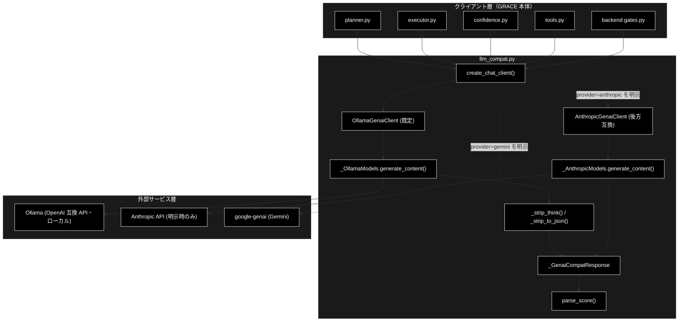
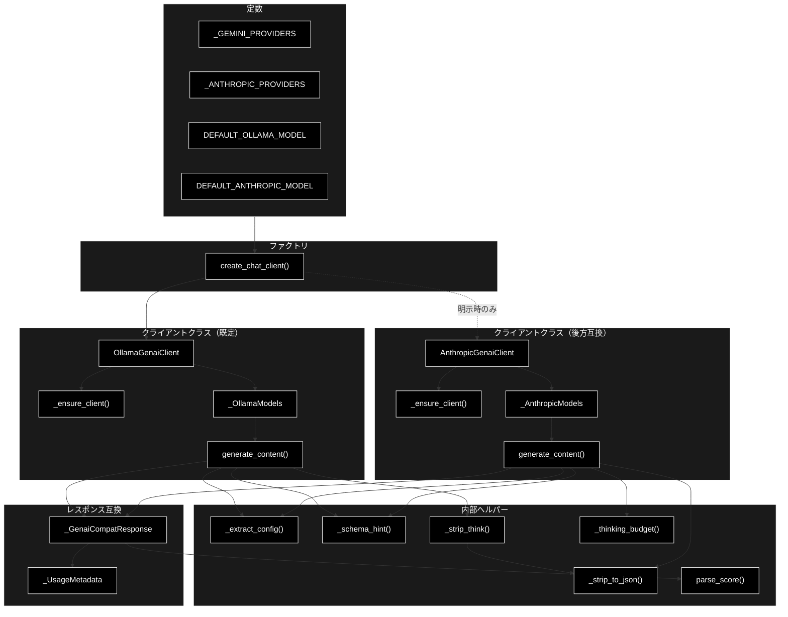
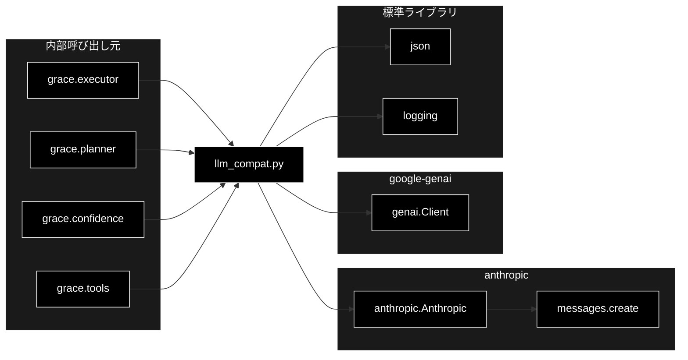

# llm_compat.py - GRACE LLM 互換クライアント ドキュメント

**Version 2.0** | 最終更新: 2026-09-04

---

## 目次

1. [概要](#概要)
2. [アーキテクチャ構成図](#1-アーキテクチャ構成図)
3. [モジュール構成図](#2-モジュール構成図)
4. [クラス・関数一覧表](#3-クラス関数一覧表)
5. [クラス・関数 IPO詳細](#4-クラス関数-ipo詳細)
6. [設定・定数](#5-設定定数)
7. [使用例](#6-使用例)
8. [エクスポート](#7-エクスポート)
9. [変更履歴](#8-変更履歴)
10. [付録: 依存関係図](#付録-依存関係図)

---

## 概要

`llm_compat.py`は、GRACE 本体（planner / executor / confidence / tools）が当初 google-genai の `client.models.generate_content(...)` 形式で実装されていたインターフェースを保ったまま、LLM プロバイダーとして **Ollama（ローカル LLM・既定 `gemma4:12b-mlx`）** を呼び出すためのアダプター層です。

各呼び出しサイトのコードは以下の形を維持できます（クライアント生成のみ `create_chat_client(config)` に置き換える）。

```python
response = client.models.generate_content(
    model=...,
    contents="...",
    config={"temperature": ..., "max_output_tokens": ...},
)
text = response.text
```

> ⚠️ **既定は Ollama であり、LLM 用の API キーは不要**です（CLAUDE.md §3）。
> `provider="anthropic"` を**明示したときだけ** `AnthropicGenaiClient` が使われます。これは
> 姉妹リポジトリ `grace_v2`（Anthropic 版）との A/B 比較のために残してある**後方互換経路**です。

Embedding（`client.models.embed_content`）は Gemini（`gemini-embedding-001`・3072次元）を継続利用するため、本アダプターは LLM テキスト生成（generate_content）のみを対象とします。

### 主な責務

- genai 互換インターフェース（`.models.generate_content`）を保ったまま **Ollama（OpenAI 互換 API）** へ橋渡しする
- 生成設定（dict）から temperature / max_output_tokens / response_mime_type / response_schema を抽出し、各プロバイダーのパラメータへ変換する
- JSON 出力要求時にシステム指示・スキーマヒントを付与し、応答から純粋な JSON 本体を抽出する
- **thinking 系ローカルモデルが出す `<think>…</think>` を剥がし**、呼び出しサイトを無変更で守る
- LLM 応答から 0.0〜1.0 のスコアを安全に取り出す（`parse_score`。`float()` 直変換の代替）
- genai 互換のレスポンスオブジェクト（`.text` / `.parsed` / `.usage_metadata`）を構築する
- config のプロバイダー設定に応じて Ollama / Anthropic（後方互換）/ Gemini を切り替えるファクトリを提供する

### 各責務対応のモジュール

| # | 責務 | 対応モジュール | 説明 |
|---|------|--------------|------|
| 1 | genai 互換インターフェースの提供（**既定**） | `llm_compat.py` | `OllamaGenaiClient` / `_OllamaModels` が `.models.generate_content` を実装 |
| 2 | 同（**後方互換**） | `llm_compat.py` | `AnthropicGenaiClient` / `_AnthropicModels`（`provider="anthropic"` 明示時のみ） |
| 3 | 設定変換 | `llm_compat.py` | `_extract_config()` が必要キーを抽出 |
| 4 | JSON 出力の補助 | `llm_compat.py` | `_schema_hint()` / `_strip_to_json()` がスキーマ提示と JSON 抽出を担当 |
| 5 | 思考タグの除去 | `llm_compat.py` | `_strip_think()`（**Ollama 経路のみ**） |
| 6 | スコア抽出 | `llm_compat.py` | `parse_score()` |
| 7 | genai 互換レスポンスの構築 | `llm_compat.py` | `_GenaiCompatResponse` / `_UsageMetadata` |
| 8 | プロバイダー切り替えファクトリ | `llm_compat.py` | `create_chat_client()` が Ollama / Anthropic / Gemini を分岐 |

### 主要機能一覧

| 機能 | 説明 |
|------|------|
| `OllamaGenaiClient` | **genai.Client 互換の Ollama クライアント（既定）** |
| `OllamaGenaiClient.__init__()` | 既定モデル・`base_url`・`timeout` を保持（接続は遅延） |
| `OllamaGenaiClient._ensure_client()` | `helper.helper_llm.create_llm_client("ollama")` を遅延生成 |
| `_OllamaModels` | `client.models` 互換ラッパー（generate_content のみ） |
| `_OllamaModels.generate_content()` | genai 互換シグネチャで `OllamaClient.generate_content` を呼ぶ |
| `AnthropicGenaiClient` | genai.Client 互換の Anthropic クライアント（**後方互換・明示時のみ**） |
| `AnthropicGenaiClient.__init__()` | コンストラクタ（既定モデル・APIキー指定、クライアントは遅延生成） |
| `AnthropicGenaiClient._ensure_client()` | anthropic SDK を遅延 import しクライアントを生成 |
| `_AnthropicModels` | `client.models` 互換ラッパー（generate_content のみ） |
| `_AnthropicModels.generate_content()` | genai 互換シグネチャで Anthropic `messages.create` を呼ぶ |
| `_GenaiCompatResponse` | genai レスポンス互換オブジェクト（`.text` / `.parsed` / `.usage_metadata`） |
| `_UsageMetadata` | genai usage_metadata 互換オブジェクト |
| `create_chat_client()` | config に応じて Ollama / Anthropic / Gemini クライアントを返すファクトリ |
| `parse_score()` | **LLM 応答から 0.0〜1.0 のスコアを抽出**（`float()` 直変換の代替） |
| `_extract_config()` | 生成設定から必要キーを抽出 |
| `_schema_hint()` | response_schema から JSON Schema ヒントを生成 |
| `_strip_think()` | **`<think>…</think>` を除去**（閉じタグ無しなら空文字を返す） |
| `_strip_to_json()` | Markdown フェンス等を除去し JSON 本体を抽出 |
| `_thinking_budget()` | 拡張思考 budget の正規化（**Anthropic 経路のみ有効**） |

---

## 1. アーキテクチャ構成図

### 1.1 システム全体構成



### 1.2 データフロー

1. GRACE 本体が `create_chat_client(config)` でクライアントを取得する
2. `config.llm.provider` に応じて分岐する。**未指定・`"ollama"` なら `OllamaGenaiClient`（既定）**、
   `"anthropic"` なら `AnthropicGenaiClient`（後方互換）、`"gemini"`/`"google"` なら素の `genai.Client()`
3. 呼び出しサイトが `client.models.generate_content(model, contents, config)` を実行する
4. `_OllamaModels` が設定を抽出し、`max_output_tokens` を **Ollama の `max_tokens` へ読み替え**、
   JSON 要求時は `response_format={"type":"json_object"}` とシステム指示を付与して `OllamaClient.generate_content` を呼ぶ
5. 応答から **`_strip_think()` で思考タグを除去**（⚠️ JSON 抽出より**先**。`<think>` 内のサンプル JSON を拾わないため）
6. JSON モード時はさらに `_strip_to_json()` でコードフェンス・前後の散文を除去する
7. `.text` / `.usage_metadata` を持つ genai 互換レスポンスを返却する
   （**ローカル実行のためコストは常に 0**。`usage` は互換のため空で返す）

---

## 2. モジュール構成図

### 2.1 内部モジュール構成



### 2.2 外部依存関係

| ライブラリ | バージョン | 用途 |
|-----------|-----------|------|
| `anthropic` | - | Anthropic Claude API クライアント（遅延 import） |
| `google-genai` | - | Gemini プロバイダー利用時のクライアント（遅延 import） |
| `json`（標準） | - | JSON Schema 生成・JSON 本体抽出 |
| `logging`（標準） | - | ロガー取得 |

### 2.3 内部依存モジュール

| モジュール | 用途 |
|-----------|------|
| `grace.executor` | `create_chat_client` を利用（呼び出し元） |
| `grace.planner` | `create_chat_client` を利用（呼び出し元） |
| `grace.confidence` | `create_chat_client` を利用（呼び出し元） |
| `grace.tools` | `create_chat_client` を利用（呼び出し元） |

---

## 3. クラス・関数一覧表

### 3.1 クラス一覧

#### OllamaGenaiClient（既定）

| メソッド | 概要 |
|---------|------|
| `__init__(default_model, base_url=None, timeout=None)` | 既定モデル・接続先・**1 リクエスト期限**を保持（接続は遅延） |
| `_ensure_client()` | `helper.helper_llm.create_llm_client("ollama")` を遅延生成 |

> ⚠️ `timeout` を渡さないと **openai SDK の既定 600 秒 × 3 回**が効き、1 呼び出しが最大 30 分ブロックする。
> `create_chat_client()` は `config.llm.timeout` をここへ渡している。

#### _OllamaModels（既定）

| メソッド | 概要 |
|---------|------|
| `__init__(client_getter, default_model)` | クライアント遅延取得 callable と既定モデルを保持 |
| `generate_content(model=None, contents=None, config=None, **_kwargs)` | genai 互換シグネチャで Ollama を呼ぶ |

#### AnthropicGenaiClient（後方互換・`provider="anthropic"` 明示時のみ）

| メソッド | 概要 |
|---------|------|
| `__init__(default_model, api_key=None)` | コンストラクタ（既定モデル・APIキー指定、SDK は遅延生成） |
| `_ensure_client()` | anthropic SDK を遅延 import し Anthropic クライアントを生成 |

#### _AnthropicModels（後方互換）

| メソッド | 概要 |
|---------|------|
| `__init__(client_getter, default_model)` | クライアント遅延取得 callable と既定モデルを保持 |
| `generate_content(model=None, contents=None, config=None, **_kwargs)` | genai 互換シグネチャで Anthropic を呼ぶ |

#### _GenaiCompatResponse

| メソッド | 概要 |
|---------|------|
| `__init__(text, usage=None)` | `.text` / `.parsed` / `.usage_metadata` を保持 |

#### _UsageMetadata

| メソッド | 概要 |
|---------|------|
| `__init__(prompt_token_count=0, candidates_token_count=0)` | トークン使用量を保持 |

### 3.2 関数一覧（カテゴリ別）

#### ファクトリ関数

| 関数名 | 概要 |
|-------|------|
| `create_chat_client(config=None)` | config に応じて **Ollama（既定）** / Anthropic（後方互換）/ Gemini のクライアントを返す |

#### 公開ヘルパー関数

| 関数名 | 概要 |
|-------|------|
| `parse_score(text)` | **LLM 応答から 0.0〜1.0 のスコアを抽出**。抽出できなければ `None`（呼び出し側が既定値へフォールバック） |

#### 内部ヘルパー関数

| 関数名 | 概要 |
|-------|------|
| `_extract_config(config)` | 生成設定（dict／属性アクセス両対応）から設定キーを抽出 |
| `_strip_think(text)` | **`<think>…</think>` を除去**。閉じタグが無い場合は**空文字**を返す |
| `_thinking_budget(requested, max_tokens)` | **拡張思考の budget を正規化**（0 / None / 不正値は無効。有効時は API 下限まで引き上げ） |
| `_schema_hint(response_schema)` | response_schema から JSON Schema ヒント文字列を生成 |
| `_strip_to_json(text)` | Markdown フェンス・散文を除去し JSON 本体を抽出 |

---

## 4. クラス・関数 IPO詳細

### 4.1 OllamaGenaiClient クラス（既定）

genai.Client 互換の Ollama クライアント。`.models.generate_content(...)` のみをサポートし、内部で
`helper.helper_llm.OllamaClient` を遅延生成する。

**シグネチャ**

```python
class OllamaGenaiClient:
    def __init__(self, default_model: str,
                 base_url: Optional[str] = None,
                 timeout: Optional[float] = None)
    def _ensure_client(self) -> Any
```

| パラメータ | 型 | 既定 | 説明 |
|---|---|---|---|
| `default_model` | `str` | - | `generate_content` で `model` 未指定時に使うモデル |
| `base_url` | `Optional[str]` | `None` | 未指定なら `helper_llm` が `OLLAMA_BASE_URL` → 既定値で解決 |
| `timeout` | `Optional[float]` | `None` | **ローカル LLM の 1 リクエスト期限（秒）** |

| 区分 | 内容 |
|---|---|
| **Input** | `default_model` / `base_url` / `timeout` |
| **Process** | `genai.Client()` と同様、**構築時には接続も SDK import も行わない**。`self.models` に `_OllamaModels` を割り当て、最初の `generate_content` で `_ensure_client()` が `create_llm_client("ollama", ...)` を呼ぶ |
| **Output** | `.models.generate_content(...)` を提供するクライアント |

> ⚠️ **`timeout` を通さないと openai SDK の既定 600 秒 × 3 回が効く**（1 呼び出しが最大 30 分ブロック）。
> `create_chat_client()` は `config.llm.timeout`（既定 180）をここへ渡している。

---

### 4.2 _OllamaModels クラス（既定）

`client.models` 互換ラッパー。genai 形式の引数を Ollama（OpenAI 互換 API）へ読み替える。

**シグネチャ**

```python
class _OllamaModels:
    def __init__(self, client_getter: Any, default_model: str)
    def generate_content(self, model=None, contents=None, config=None,
                         **_kwargs) -> _GenaiCompatResponse
```

| 区分 | 内容 |
|---|---|
| **Input** | `model`（未指定なら `default_model`）／`contents`（str）／`config`（dict） |
| **Process** | 1. `_extract_config()` で設定を抽出<br>2. JSON 要求（`response_mime_type=="application/json"` または `response_schema` あり）なら、システム指示＋`_schema_hint()` を付与し **`response_format={"type":"json_object"}`** を設定<br>3. **`max_output_tokens` → `max_tokens` へ読み替え**（既定 4096）<br>4. ⚠️ **`thinking_budget_tokens` は意図的に無視**（Ollama に拡張思考は無い。設定互換のため残置）<br>5. `OllamaClient.generate_content(prompt, **kwargs)` を呼ぶ<br>6. **`_strip_think()` を JSON 抽出より先に**適用（`<think>` 内の波括弧やサンプル JSON を `_strip_to_json` が拾わないようにするため）<br>7. JSON モード時は `_strip_to_json()` |
| **Output** | `_GenaiCompatResponse`。**ローカル実行のためコストは常に 0** で、`usage` は空の `_UsageMetadata` |

**使用例**

```python
from grace.llm_compat import create_chat_client

client = create_chat_client(config)          # 既定 → OllamaGenaiClient
response = client.models.generate_content(
    model="gemma4:12b-mlx",
    contents="日本の首都は？",
    config={"temperature": 0.0, "max_output_tokens": 512},
)
print(response.text)                          # 東京です。
```

---

### 4.3 AnthropicGenaiClient クラス（後方互換）

> ⚠️ **ここから §4.4 までは既定の経路ではない。** 本リポジトリ（`grace_v2_local`）の既定は
> **Ollama**（§4.1 / §4.2）で、以下は `config.llm.provider` に **`"anthropic"` を明示したときだけ**
> 使われる。姉妹リポジトリ `grace_v2`（Anthropic 版）との A/B 比較のために残してある経路であり、
> 通常運用では `ANTHROPIC_API_KEY` も不要（CLAUDE.md §3）。

`genai.Client` 互換の Anthropic クライアント。`.models.generate_content(...)` のみをサポートする。

#### コンストラクタ: `__init__`

**概要**: 既定モデルと API キーを保持し、`.models` に `_AnthropicModels` を割り当てる。SDK import や API キー検証は行わず、最初の generate_content 呼び出し時に遅延生成する。

```python
AnthropicGenaiClient(default_model: str, api_key: Optional[str] = None)
```

| パラメータ | 型 | デフォルト | 説明 |
|------------|------|-----------|------|
| `default_model` | str | - | 既定モデル名（model 未指定時に使用） |
| `api_key` | Optional[str] | None | API キー。None の場合は環境変数から解決 |

| 項目 | 内容 |
|------|------|
| **Input** | `default_model: str`, `api_key: Optional[str] = None` |
| **Process** | 1. 既定モデル・APIキーを保持<br>2. `_client` を None に初期化（遅延生成）<br>3. `self.models = _AnthropicModels(self._ensure_client, default_model)` |
| **Output** | `AnthropicGenaiClient` インスタンス |

**戻り値例**:
```python
# AnthropicGenaiClient インスタンス（.models 属性を持つ）
client.models  # -> _AnthropicModels
```

```python
# 使用例
from grace.llm_compat import AnthropicGenaiClient

client = AnthropicGenaiClient(default_model="claude-sonnet-4-6")
# 構築時点では anthropic SDK は import されない
```

#### メソッド: `_ensure_client`

**概要**: anthropic パッケージを遅延 import し、Anthropic クライアントを 1 度だけ生成して返す。

```python
def _ensure_client(self) -> Any
```

| パラメータ | 型 | デフォルト | 説明 |
|------------|------|-----------|------|
| なし | - | - | self のみ |

| 項目 | 内容 |
|------|------|
| **Input** | なし（selfのみ） |
| **Process** | 1. `_client` が None なら `import anthropic`（失敗時 ImportError）<br>2. `api_key` 指定時は `anthropic.Anthropic(api_key=...)`、未指定時は `anthropic.Anthropic()`<br>3. 生成済みクライアントを返す |
| **Output** | `anthropic.Anthropic`: Anthropic クライアント |

**戻り値例**:
```python
# anthropic.Anthropic インスタンス
# APIキー・ベースURLは ANTHROPIC_API_KEY / ANTHROPIC_BASE_URL から解決
```

```python
# 使用例（内部呼び出し）
anthropic_client = client._ensure_client()
message = anthropic_client.messages.create(model="claude-sonnet-4-6", max_tokens=1024, messages=[...])
```

### 4.4 _AnthropicModels クラス（後方互換）

genai の `client.models` 互換ラッパー（generate_content のみ）。

#### コンストラクタ: `__init__`

**概要**: クライアントを遅延生成する callable と既定モデル名を保持する。

```python
_AnthropicModels(client_getter: Any, default_model: str)
```

| パラメータ | 型 | デフォルト | 説明 |
|------------|------|-----------|------|
| `client_getter` | Any | - | 呼び出し時に Anthropic クライアントを返す callable |
| `default_model` | str | - | model 未指定時に使う既定モデル名 |

| 項目 | 内容 |
|------|------|
| **Input** | `client_getter: Any`, `default_model: str` |
| **Process** | client_getter と default_model を内部に保持 |
| **Output** | `_AnthropicModels` インスタンス |

**戻り値例**:
```python
# _AnthropicModels インスタンス（generate_content を提供）
```

```python
# 使用例（AnthropicGenaiClient 内部で生成される）
models = _AnthropicModels(client._ensure_client, "claude-sonnet-4-6")
```

#### メソッド: `generate_content`

**概要**: genai 互換シグネチャで呼び出され、config を Anthropic パラメータに変換して `messages.create` を実行し、genai 互換レスポンスを返す。

```python
def generate_content(
    self,
    model: Optional[str] = None,
    contents: Any = None,
    config: Any = None,
    **_kwargs: Any,
) -> _GenaiCompatResponse
```

| パラメータ | 型 | デフォルト | 説明 |
|------------|------|-----------|------|
| `model` | Optional[str] | None | モデル名。None なら既定モデル |
| `contents` | Any | None | プロンプト本文（GRACE 本体では常に str） |
| `config` | Any | None | `types.GenerateContentConfig` 相当の設定オブジェクト |
| `**_kwargs` | Any | - | 互換のため受け取るが未使用 |

| 項目 | 内容 |
|------|------|
| **Input** | `model: Optional[str] = None`, `contents: Any = None`, `config: Any = None`, `**_kwargs` |
| **Process** | 1. `_extract_config(config)` で設定抽出、model 未指定なら既定モデル<br>2. contents を文字列化<br>3. response_mime_type=="application/json" または response_schema 有で JSON 要求と判定し system 指示・スキーマヒントを付与<br>4. max_tokens（未指定時 2048）・temperature を組み立て `messages.create` を呼ぶ<br>5. content の text ブロックを連結<br>6. JSON 要求時は `_strip_to_json` で JSON 本体を抽出<br>7. usage から `_UsageMetadata` を構築 |
| **Output** | `_GenaiCompatResponse`: `.text` / `.parsed`(None) / `.usage_metadata` |

**戻り値例**:
```python
# _GenaiCompatResponse
response.text             # "生成されたテキスト"
response.parsed           # None
response.usage_metadata.prompt_token_count      # 120
response.usage_metadata.candidates_token_count  # 340
```

```python
# 使用例
response = client.models.generate_content(
    model="claude-sonnet-4-6",
    contents="日本の首都はどこですか？",
    config=None,
)
print(response.text)
# 東京です。
```

### 4.5 _GenaiCompatResponse クラス

genai の generate_content レスポンス互換オブジェクト。呼び出しサイトが参照する属性のみを提供する。

#### コンストラクタ: `__init__`

**概要**: 生成テキスト・parsed（常に None）・usage_metadata を保持する。

```python
_GenaiCompatResponse(text: str, usage: Optional[_UsageMetadata] = None)
```

| パラメータ | 型 | デフォルト | 説明 |
|------------|------|-----------|------|
| `text` | str | - | 生成テキスト |
| `usage` | Optional[_UsageMetadata] | None | トークン使用量。None なら空の `_UsageMetadata` |

| 項目 | 内容 |
|------|------|
| **Input** | `text: str`, `usage: Optional[_UsageMetadata] = None` |
| **Process** | 1. `self.text = text`<br>2. `self.parsed = None`<br>3. `self.usage_metadata = usage or _UsageMetadata()` |
| **Output** | `_GenaiCompatResponse` インスタンス |

**戻り値例**:
```python
{
    "text": "生成テキスト",
    "parsed": None,
    "usage_metadata": "_UsageMetadata インスタンス"
}
```

```python
# 使用例
resp = _GenaiCompatResponse(text="hello")
print(resp.text)    # hello
print(resp.parsed)  # None
```

### 4.6 _UsageMetadata クラス

genai の usage_metadata 互換オブジェクト。

#### コンストラクタ: `__init__`

**概要**: 入力・出力トークン数を保持する。

```python
_UsageMetadata(prompt_token_count: int = 0, candidates_token_count: int = 0)
```

| パラメータ | 型 | デフォルト | 説明 |
|------------|------|-----------|------|
| `prompt_token_count` | int | 0 | 入力トークン数 |
| `candidates_token_count` | int | 0 | 出力トークン数 |

| 項目 | 内容 |
|------|------|
| **Input** | `prompt_token_count: int = 0`, `candidates_token_count: int = 0` |
| **Process** | 両トークン数を属性として保持 |
| **Output** | `_UsageMetadata` インスタンス |

**戻り値例**:
```python
{
    "prompt_token_count": 120,
    "candidates_token_count": 340
}
```

```python
# 使用例
usage = _UsageMetadata(prompt_token_count=120, candidates_token_count=340)
print(usage.prompt_token_count)  # 120
```

### 4.7 ファクトリ関数

#### `create_chat_client`

**概要**: `config.llm.provider` に応じて **Ollama（既定）** / Anthropic（後方互換）/ Gemini のクライアントを返すファクトリ。いずれの戻り値も `client.models.generate_content(...)` を提供する。

```python
def create_chat_client(config: Any = None) -> Any
```

| パラメータ | 型 | デフォルト | 説明 |
|------------|------|-----------|------|
| `config` | Any | None | `config.llm`（provider / model / timeout）と `config.ollama`（base_url）を参照 |

| 項目 | 内容 |
|------|------|
| **Input** | `config: Any = None` |
| **Process** | 1. **`provider="ollama"` を初期値**とし、`config.llm` があれば `provider` / `model` / `timeout` で上書き<br>2. `provider` が `_GEMINI_PROVIDERS`（`gemini`/`google`/`google-genai`/`genai`）なら `genai.Client()` を返す<br>3. `_ANTHROPIC_PROVIDERS`（`anthropic`/`claude`）なら `AnthropicGenaiClient(default_model=model or DEFAULT_ANTHROPIC_MODEL)` を返す<br>4. それ以外（**既定**）は `config.ollama.base_url` を拾い、`OllamaGenaiClient(default_model=model or DEFAULT_OLLAMA_MODEL, base_url=..., timeout=...)` を返す |
| **Output** | `Any`: `OllamaGenaiClient` / `AnthropicGenaiClient` / `genai.Client` |

**戻り値例**:
```python
# provider 未指定 または "ollama"（既定）
# -> OllamaGenaiClient(default_model="gemma4:12b-mlx", timeout=config.llm.timeout)

# provider="anthropic"（後方互換・明示時のみ）
# -> AnthropicGenaiClient(default_model="claude-sonnet-4-6")

# provider="gemini"
# -> genai.Client()
```

```python
# 使用例
from grace.llm_compat import create_chat_client

client = create_chat_client(config)  # config.llm.provider に従う（既定 Ollama）
response = client.models.generate_content(
    model="gemma4:12b-mlx",
    contents="要約してください: ...",
)
print(response.text)
```

### 4.8 ヘルパー関数

#### `parse_score`

**概要**: LLM 応答から 0.0〜1.0 のスコアを抽出する。**`float(text)` の直変換の代替**。

```python
def parse_score(text: Any) -> Optional[float]
```

| 項目 | 内容 |
|------|------|
| **Input** | `text`: LLM の生応答（`None` 可） |
| **Process** | `_SCORE_RE`（`[01]?\.\d+` を先に試し、無ければ単独の `0`/`1`）で最初の数値を探し、**0.0〜1.0 にクランプ**する |
| **Output** | `Optional[float]`。抽出できなければ `None`（呼び出し側がそれぞれの既定値へフォールバック） |

> ⚠️ **なぜ必要か**: ローカル LLM は「数値のみを出力」と指示しても
> 「答えは 0.8 です。」のように前置きを付けて返すことがあり、`float(text)` は `ValueError` になる。
> `planner.estimate_complexity_with_llm` / `confidence` の各評価器はこれを使う（CLAUDE.md §3）。

**使用例**

```python
from grace.llm_compat import parse_score

parse_score("答えは 0.8 です。")   # 0.8
parse_score("1")                   # 1.0
parse_score("わかりません")         # None
```

---

#### `_strip_think`

**概要**: thinking 系ローカルモデル（qwen3.5 系が代表）が出す `<think>…</think>` を取り除き、本文だけを返す。

```python
def _strip_think(text: str) -> str
```

| 項目 | 内容 |
|------|------|
| **Input** | `text`: Ollama の生応答 |
| **Process** | 1. `<think` を含まなければそのまま返す<br>2. `_THINK_BLOCK_RE`（`DOTALL`）で閉じタグまで含めて除去<br>3. **閉じられていない `<think>` が残っていたら、そこから先を切り捨てる** |
| **Output** | `str`。⚠️ **閉じタグが無い場合は空文字**（＝出力枠を思考で使い切り本文へ到達しなかった） |

> ⚠️ **なぜ必要か**: Ollama に Anthropic の拡張思考に相当する API 機能は無いが、**モデルが自前で
> 思考タグを出す**。GRACE の呼び出しサイトは `response.text` をそのまま「回答」「JSON」「数値」と
> して扱うため、混ざると `parse_score()` が思考中の数字を拾い、`json.loads()` が失敗して replan
> ループへ落ち、回答欄に思考がそのまま出る。ここで 1 回だけ剥がして呼び出しサイトを無変更で守る。
>
> ⚠️ 中途半端な思考を回答として扱うより、**空応答として呼び出し側のフォールバックへ渡すほうが安全**
> なため、閉じタグ無しでは空文字を返す設計になっている。

---

#### `_extract_config`

**概要**: `types.GenerateContentConfig` から temperature / max_output_tokens / response_mime_type / response_schema を辞書に取り出す。

```python
def _extract_config(config: Any) -> dict[str, Any]
```

| パラメータ | 型 | デフォルト | 説明 |
|------------|------|-----------|------|
| `config` | Any | - | GenerateContentConfig 相当のオブジェクト（None 可） |

| 項目 | 内容 |
|------|------|
| **Input** | `config: Any` |
| **Process** | 1. config が None なら空辞書を返す<br>2. 4 つのキーを `getattr(config, key, None)` で抽出 |
| **Output** | `dict[str, Any]`: 抽出した設定 |

**戻り値例**:
```python
{
    "temperature": 0.0,
    "max_output_tokens": 1024,
    "response_mime_type": "application/json",
    "response_schema": None
}
```

```python
# 使用例
cfg = _extract_config(config)
max_tokens = cfg.get("max_output_tokens") or 2048
```

#### `_schema_hint`

**概要**: response_schema が Pydantic モデルクラスの場合、その JSON Schema を文字列化して返す。

```python
def _schema_hint(response_schema: Any) -> str
```

| パラメータ | 型 | デフォルト | 説明 |
|------------|------|-----------|------|
| `response_schema` | Any | - | Pydantic モデルクラス等（None 可） |

| 項目 | 内容 |
|------|------|
| **Input** | `response_schema: Any` |
| **Process** | 1. None なら空文字列<br>2. `model_json_schema` が callable なら `json.dumps(...)`<br>3. 失敗時・非対応時は空文字列 |
| **Output** | `str`: JSON Schema 文字列、または空文字列 |

**戻り値例**:
```python
'{"properties": {"answer": {"type": "string"}}, "required": ["answer"], "type": "object"}'
```

```python
# 使用例
hint = _schema_hint(MyPydanticModel)
if hint:
    system_parts.append(f"出力は次の JSON Schema に厳密に従ってください:\n{hint}")
```

#### `_strip_to_json`

**概要**: Markdown コードフェンスや前後の散文を除去し、JSON 本体（`{...}` または `[...]`）を抽出する。

```python
def _strip_to_json(text: str) -> str
```

| パラメータ | 型 | デフォルト | 説明 |
|------------|------|-----------|------|
| `text` | str | - | LLM の生応答テキスト |

| 項目 | 内容 |
|------|------|
| **Input** | `text: str` |
| **Process** | 1. trim 後、先頭が ``` ならフェンスを剥がす<br>2. `{` と `[` のうち先に出現する位置を開始点に<br>3. 最後の `}` または `]` の次を終端に<br>4. JSON 本体を切り出して返す（候補無しなら入力をそのまま返す） |
| **Output** | `str`: 抽出した JSON 本体 |

**戻り値例**:
```python
'{"answer": "東京", "confidence": 0.9}'
```

```python
# 使用例
raw = "```json\n{\"answer\": \"東京\"}\n```"
body = _strip_to_json(raw)
# '{"answer": "東京"}'
```

---

## 5. 設定・定数

### 5.1 DEFAULT_OLLAMA_MODEL（既定）

config 未指定時にフォールバックする **Ollama の既定モデル**。実体は `config.py::get_default_ollama_model()`
の **1 箇所**で管理されており、既定モデルを変えるときはその関数のフォールバック文字列だけを書き換える。

```python
DEFAULT_OLLAMA_MODEL = get_default_ollama_model()   # 現在値 "gemma4:12b-mlx"
```

| 定数名 | 値 | 説明 |
|-------|-----|------|
| `DEFAULT_OLLAMA_MODEL` | `get_default_ollama_model()` の戻り値（現在値 `"gemma4:12b-mlx"`） | provider 未指定・`"ollama"` かつ model 未指定時の既定モデル |

### 5.2 _ANTHROPIC_PROVIDERS

Anthropic を**明示指定**する場合のプロバイダー名集合（後方互換）。

```python
_ANTHROPIC_PROVIDERS = {"anthropic", "claude"}
```

| 値 | 説明 |
|-----|------|
| `"anthropic"` | Anthropic 経路を明示（`grace_v2` との A/B 用） |
| `"claude"` | 同上（別名） |

### 5.3 _GEMINI_PROVIDERS

Gemini（google-genai）をそのまま使う場合のプロバイダー名集合。`create_chat_client` の分岐に使用する。

```python
_GEMINI_PROVIDERS = {"gemini", "google", "google-genai", "genai"}
```

| 値 | 説明 |
|-----|------|
| `"gemini"` | Gemini を指定 |
| `"google"` | Gemini を指定（別名） |
| `"google-genai"` | Gemini を指定（別名） |
| `"genai"` | Gemini を指定（別名） |

### 5.4 DEFAULT_ANTHROPIC_MODEL

config 未指定時にフォールバックする Anthropic デフォルトモデル名。

```python
DEFAULT_ANTHROPIC_MODEL = "claude-sonnet-4-6"
```

| 定数名 | 値 | 説明 |
|-------|-----|------|
| `DEFAULT_ANTHROPIC_MODEL` | `"claude-sonnet-4-6"` | provider=anthropic かつ model 未指定時の既定モデル |

### 5.5 拡張思考の下限（M-1・Anthropic 経路のみ）

拡張思考（thinking）を有効にしたとき、Anthropic API が要求する下限を満たすための定数。

> ⚠️ **Ollama 経路ではこの機構は動かない。** Ollama に拡張思考に相当する API 機能は無く、
> `_OllamaModels.generate_content()` は `thinking_budget_tokens` を**意図的に無視**する
> （設定は `grace_v2` との互換のために残してあるだけ・CLAUDE.md §3）。以下は
> **`provider="anthropic"` を明示したときだけ**効く。

```python
_MIN_TEXT_TOKENS = 1024      # 本文用に確保する最小トークン
_MIN_THINKING_BUDGET = 1024  # Anthropic が要求する thinking budget の下限
```

| 定数名 | 値 | 説明 |
|-------|-----|------|
| `_MIN_TEXT_TOKENS` | `1024` | 思考とは別に本文出力へ確保する最小トークン |
| `_MIN_THINKING_BUDGET` | `1024` | thinking budget の下限（API 要件） |

**`_thinking_budget(requested, max_tokens)` の挙動**:

| 入力 | 戻り値 |
|---|---|
| `None` / `0` / 負値 / 型変換不能 | `0`（**無効**） |
| `1` 〜 `1023` | `1024`（下限まで引き上げ） |
| `1024` 以上 | そのままの値 |

> 📝 **呼び出し側を壊さないための正規化。** 呼び出し元が `max_output_tokens` しか
> 意識していないケースがあるため、budget を要求されたときはここで API 要件
> （下限）を満たすまで引き上げます。`max_tokens` 側は呼び出し元で
> `budget + _MIN_TEXT_TOKENS` まで広げます。

> ⚠️ **思考予算をいくつにしても、`llm.heavy_model` が未設定なら拡張思考は走りません。**
> `config.heavy_thinking_budget()` が 0 を返すためです
> （[`config.md`](./config.md) §4.5）。

### 5.6 関連環境変数

| 環境変数 | 用途 |
|----------|------|
| `OLLAMA_BASE_URL` | Ollama の接続先（既定 `http://localhost:11434/v1`。`config.ollama.base_url` 未指定時に `helper_llm` が解決） |
| `OLLAMA_DEFAULT_MODEL` | 既定モデルの上書き（`get_default_ollama_model()` が参照） |
| `ANTHROPIC_API_KEY` | Anthropic API キー（**後方互換経路のみ**。`_ensure_client` で解決） |
| `ANTHROPIC_BASE_URL` | Anthropic ベース URL（任意・後方互換経路のみ） |

> ⚠️ **既定（Ollama）では LLM 用の API キーは不要**。`ANTHROPIC_API_KEY` が要るのは
> `provider="anthropic"` を明示したときだけ。Embedding 用の `GOOGLE_API_KEY` は別途必要。

---

## 6. 使用例

### 6.1 基本的なワークフロー

```python
from grace.llm_compat import create_chat_client

# 1. config に基づきクライアントを生成（provider 未指定なら Ollama）
client = create_chat_client(config)

# 2. genai 互換インターフェースで生成
response = client.models.generate_content(
    model="gemma4:12b-mlx",
    contents="次の文章を1行で要約してください: ...",
)

# 3. 結果を確認
print(response.text)

# ⚠️ Ollama 経路では usage は常に空（ローカル実行のためコストは 0）。
#    トークン数が返るのは provider="anthropic" を明示したときだけ。
print(response.usage_metadata.prompt_token_count)      # Ollama では 0
print(response.usage_metadata.candidates_token_count)  # Ollama では 0
```

### 6.2 応用的なワークフロー（JSON 構造化出力）

```python
from pydantic import BaseModel

class Answer(BaseModel):
    answer: str
    confidence: float

# ⚠️ 呼び出しサイトは plain dict で設定を渡す（_extract_config は属性アクセスにも対応）
config = {
    "temperature": 0.0,
    "max_output_tokens": 512,        # Ollama では max_tokens へ読み替えられる
    "response_mime_type": "application/json",
    "response_schema": Answer,
}

client = create_chat_client(grace_config)
response = client.models.generate_content(
    model="gemma4:12b-mlx",
    contents="日本の首都を JSON で答えてください。",
    config=config,
)

# response.text は <think> タグと Markdown フェンスが除去された純粋な JSON 本体
parsed = Answer.model_validate_json(response.text)
print(parsed.answer, parsed.confidence)
```

---

## 7. エクスポート

`llm_compat.py` には `__all__` 定義はありません。GRACE 本体は各サブモジュールから直接 import します。

```python
# 各呼び出しサイトでの import 例
from .llm_compat import create_chat_client

# 公開的に利用される主な要素
# - create_chat_client      （ファクトリ関数）
# - parse_score             （LLM 応答からのスコア抽出。float() 直変換の代替）
# - OllamaGenaiClient       （genai 互換 Ollama クライアント・既定）
# - DEFAULT_OLLAMA_MODEL    （既定モデル定数。get_default_ollama_model() の戻り値）
# - AnthropicGenaiClient    （genai 互換 Anthropic クライアント・後方互換）
# - DEFAULT_ANTHROPIC_MODEL （Anthropic 経路の既定モデル定数）
```

> 📝 **注意**: `_OllamaModels` / `_AnthropicModels` / `_GenaiCompatResponse` / `_UsageMetadata` および `_`接頭辞のヘルパー関数は内部実装であり、外部からの直接利用は想定していません。

---

## 8. 変更履歴

| バージョン | 変更内容 |
|-----------|---------|
| 1.0 | 初版作成（llm_compat.py のソースに基づくドキュメント化） |
| 1.1 | 実装（07-27）へ追随（2026-08-01）。`_thinking_budget()` と `_MIN_TEXT_TOKENS` / `_MIN_THINKING_BUDGET`（M-1 拡張思考）を §3.2 と §5.3 に追加。0 / None / 不正値は無効、有効時は API 下限 1024 まで引き上げるという正規化の表を付け、`heavy_model` 未設定ならそもそも走らない点を明記。旧 §5.3（関連環境変数）を §5.4 へ繰り下げ |
| 2.0 | 2026-09-04: **既定プロバイダの誤りを訂正し、未記載だった Ollama 経路を追加**。v1.1 までは本モジュールを「Anthropic Claude へ橋渡しするアダプター層」と説明し、**既定である `OllamaGenaiClient` / `_OllamaModels` を 1 度も記述していなかった**（実装の docstring は当時すでに「Ollama を LLM プロバイダーとする」と明記しており矛盾していた）。本版で ① 概要・責務・機能一覧・アーキテクチャ図・モジュール構成図を **Ollama 主・Anthropic 後方互換**の構成へ改め、② `OllamaGenaiClient`（§4.1）/ `_OllamaModels`（§4.2）の IPO を新規記述、③ 未記載だった **`parse_score()`**（`float()` 直変換の代替・CLAUDE.md §3 が使用を求める）と **`_strip_think()`**（`<think>` 除去。JSON 抽出より先に適用する理由つき）を追加、④ `create_chat_client()` の分岐順（ollama 既定 → gemini → anthropic）と `timeout` 引き渡しを実装どおりに修正、⑤ 定数へ `DEFAULT_OLLAMA_MODEL` / `_ANTHROPIC_PROVIDERS` を追加し、拡張思考は Ollama では無効である旨を明記、⑥ 使用例のモデル名・設定の渡し方（plain dict）・usage が Ollama では 0 である点を訂正 |

---

## 付録: 依存関係図


