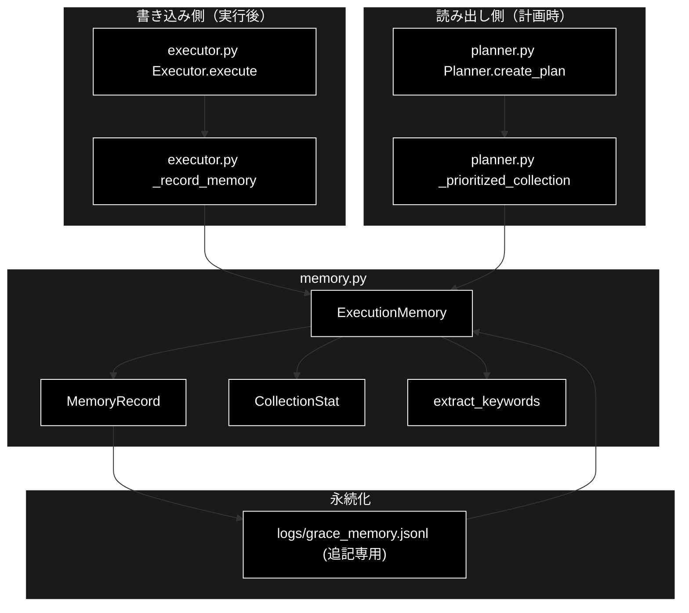
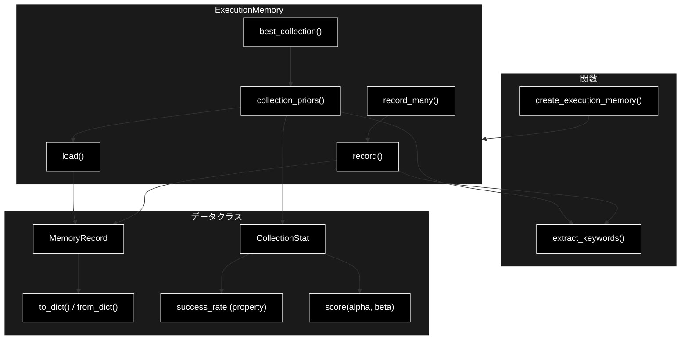
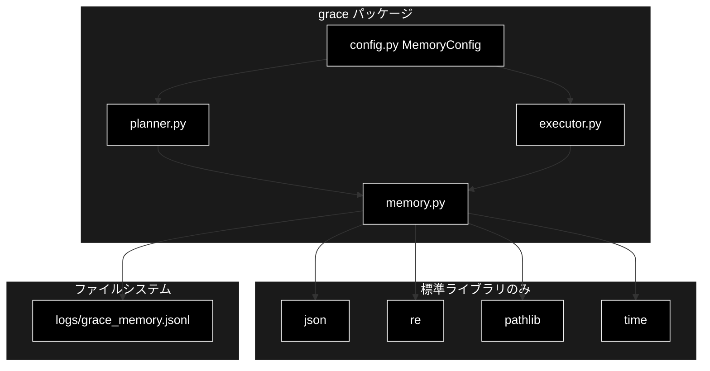

# memory.py - GRACE 実行メモリ層（P4） ドキュメント

**Version 1.0** | 最終更新: 2026-09-04

---

## 目次

1. [概要](#概要)
2. [アーキテクチャ構成図](#1-アーキテクチャ構成図)
3. [モジュール構成図](#2-モジュール構成図)
4. [クラス・関数一覧表](#3-クラス関数一覧表)
5. [クラス・関数 IPO詳細](#4-クラス関数-ipo詳細)
6. [設定・定数](#5-設定定数)
7. [使用例](#6-使用例)
8. [エクスポート](#7-エクスポート)
9. [変更履歴](#8-変更履歴)
10. [付録: 依存関係図](#付録-依存関係図)

---

## 概要

`memory.py` は、GRACE の **実行メモリ層（P4）** を提供するモジュールです。実行のたびに
「(質問キーワード, 当たったコレクション, 成否, confidence)」を JSONL へ蓄積し、次回以降の
`Planner` のコレクション優先順位に反映します。**「この種の質問はどのコレクションで当たりやすいか」を
実績から学習する**のが役割です。

> 📌 **LLM も Embedding も使わない。** 本モジュールは外部依存なし・決定的で、キーワード抽出も
> 正規表現ベース（形態素解析非依存）です。そのためユニットテストが容易です。

### 主な責務

- 実行結果（質問・コレクション・成否・confidence）の JSONL への追記
- 破損行を飛ばした頑健な読み込み
- コレクションごとの成功率×平均 confidence の集計（Laplace 平滑化つき）
- 質問キーワードで絞り込んだ「その種の質問に対する」事前分布の算出
- 十分な実績があるときだけ最良コレクションを返す（早まった固定を避ける）

### 各責務対応のモジュール

| # | 責務 | 対応モジュール | 説明 |
|---|------|--------------|------|
| 1 | 実行結果の記録 | `grace/memory.py` | `ExecutionMemory.record()` / `record_many()` |
| 2 | 記録の読み込み | `grace/memory.py` | `ExecutionMemory.load()`（破損行はスキップ） |
| 3 | 事前分布の集計 | `grace/memory.py` | `ExecutionMemory.collection_priors()` / `CollectionStat.score()` |
| 4 | 優先コレクションの決定 | `grace/memory.py` | `ExecutionMemory.best_collection()` |
| 5 | 記録の発生源 | `grace/executor.py` | `Executor._record_memory()` が実行完了時に `record_many()` を呼ぶ |
| 6 | 記録の利用先 | `grace/planner.py` | `Planner._prioritized_collection()` が `best_collection()` を呼ぶ |

### 主要機能一覧

| 機能 | 説明 |
|------|------|
| `extract_keywords()` | 正規表現による軽量キーワード抽出（決定的・形態素解析非依存） |
| `MemoryRecord` | 1 実行レコードのデータクラス |
| `MemoryRecord.to_dict()` / `from_dict()` | JSONL との相互変換 |
| `CollectionStat` | コレクション単位の集計結果データクラス |
| `CollectionStat.success_rate` | 成功率（プロパティ） |
| `CollectionStat.score()` | Laplace 平滑化した成功率 × 平均 confidence |
| `ExecutionMemory` | 実行レコードの蓄積と事前分布の算出 |
| `ExecutionMemory.record()` | 1 レコードを JSONL へ追記（best-effort） |
| `ExecutionMemory.record_many()` | 複数コレクションをまとめて記録（重複除去つき） |
| `ExecutionMemory.load()` | JSONL を読み込む（破損行はスキップ） |
| `ExecutionMemory.collection_priors()` | コレクション事前分布を score 降順で返す |
| `ExecutionMemory.best_collection()` | 条件を満たす最良コレクションを返す（無ければ `None`） |
| `create_execution_memory()` | `ExecutionMemory` を生成するファクトリ関数 |

---

## 1. アーキテクチャ構成図

### 1.1 システム全体構成



### 1.2 データフロー

1. `Executor` が実行を終えると `_record_memory()` が `state.used_collections` を集める
   （**コレクション未使用＝Web のみ等は記録しない**）
2. `record_many()` が質問・各コレクション・成否・`overall_confidence` を JSONL へ 1 行ずつ追記
3. 次回以降、`Planner._prioritized_collection()` が `best_collection(query=...)` を呼ぶ
4. `collection_priors()` が JSONL を読み、質問キーワードが重なるレコードだけを集計
5. `count >= min_count` かつ `score >= min_score` を満たす先頭を優先コレクションとして返す
6. 条件を満たすものが無ければ `None` を返し、**全コレクション検索へフォールバック**する

---

## 2. モジュール構成図

### 2.1 内部モジュール構成



### 2.2 外部依存関係

| ライブラリ | バージョン | 用途 |
|-----------|-----------|------|
| `json` | 標準ライブラリ | JSONL の読み書き |
| `logging` | 標準ライブラリ | 失敗時の警告出力 |
| `re` | 標準ライブラリ | キーワード抽出 |
| `time` | 標準ライブラリ | タイムスタンプ |
| `dataclasses` | 標準ライブラリ | `MemoryRecord` / `CollectionStat` |
| `pathlib` | 標準ライブラリ | ファイルパス操作 |

> 📌 **サードパーティ依存はゼロ**。LLM クライアントも Embedding クライアントも使わない。

### 2.3 内部依存モジュール

なし（`grace/` 内の他モジュールを import しない）。逆に `planner.py` と `executor.py` から
`create_execution_memory` として import される。

---

## 3. クラス・関数一覧表

### 3.1 データクラス一覧

#### MemoryRecord

| フィールド | 型 | 概要 |
|---|---|---|
| `query` | `str` | 実行時の質問文 |
| `keywords` | `list[str]` | `extract_keywords()` の結果 |
| `collection` | `Optional[str]` | 使用したコレクション名 |
| `success` | `bool` | 実行が成功したか |
| `confidence` | `float` | `overall_confidence` |
| `timestamp` | `float` | 記録時刻（既定 `time.time()`） |

#### CollectionStat

| フィールド/プロパティ | 型 | 概要 |
|---|---|---|
| `collection` | `str` | コレクション名 |
| `count` | `int` | レコード件数 |
| `success_count` | `int` | 成功件数 |
| `mean_confidence` | `float` | confidence の平均 |
| `success_rate` | `float`（プロパティ） | `success_count / count`（0 件なら 0.0） |

### 3.2 クラス一覧

#### ExecutionMemory

| メソッド | 概要 |
|---|---|
| `__init__(path)` | JSONL のパスを保持 |
| `record(query, collection, success, confidence, keywords=None)` | 1 レコードを追記 |
| `record_many(query, collections, success, confidence, keywords=None)` | 複数コレクションを重複除去して記録 |
| `load()` | JSONL を読み込む（破損行はスキップ） |
| `collection_priors(query=None, min_keyword_overlap=1)` | 事前分布を score 降順で返す |
| `best_collection(query=None, min_count=3, min_score=0.6)` | 条件を満たす最良コレクション |

### 3.3 ファクトリ関数一覧

| 関数 | 概要 |
|---|---|
| `create_execution_memory(path=DEFAULT_MEMORY_PATH)` | `ExecutionMemory` を生成 |

---

## 4. クラス・関数 IPO詳細

### 4.1 `extract_keywords`

**概要**: 軽量なキーワード抽出（形態素解析非依存・決定的）。

```python
def extract_keywords(text: str, top_n: int = 8) -> list[str]
```

| パラメータ | 型 | 既定 | 説明 |
|---|---|---|---|
| `text` | `str` | - | 対象テキスト（質問文） |
| `top_n` | `int` | `8` | 抽出する最大件数 |

| 区分 | 内容 |
|---|---|
| **Input** | `text`（空なら即 `[]`） |
| **Process** | `_KEYWORD_RE`（英数字 2 文字以上、または漢字・かな・カナ 2 文字以上）で走査し、小文字化して**出現順に重複排除**。`top_n` 件に達したら打ち切る |
| **Output** | `list[str]`（出現順・重複なし・最大 `top_n` 件） |

**戻り値例**

```python
extract_keywords("住民票の写しの取り方と、その手数料を教えてください")
# ['住民票', 'その手数料', ...]  ※実際の分割は正規表現による
```

---

### 4.2 `MemoryRecord.to_dict` / `from_dict`

**概要**: JSONL 1 行との相互変換。

```python
def to_dict(self) -> dict
@classmethod
def from_dict(cls, d: dict) -> "MemoryRecord"
```

| 区分 | 内容 |
|---|---|
| **Input** | `to_dict`: なし ／ `from_dict`: `dict`（欠損キーを許容） |
| **Process** | `from_dict` は `d.get(...)` と型変換で**欠損・型違いを吸収**する（`keywords` は `list`、`success` は `bool`、`confidence`/`timestamp` は `float`） |
| **Output** | `dict` ／ `MemoryRecord` |

---

### 4.3 `CollectionStat.score`

**概要**: Laplace 平滑化した成功率 × 平均 confidence。

```python
def score(self, alpha: float = 1.0, beta: float = 1.0) -> float
```

| 区分 | 内容 |
|---|---|
| **Input** | `alpha` / `beta`（平滑化パラメータ） |
| **Process** | `smoothed_sr = (success_count + alpha) / (count + alpha + beta)` を計算し、`mean_confidence` を掛ける。**平滑化により、1〜2 件しか実績が無いコレクションが満点を取らない** |
| **Output** | `float`（スコア） |

**戻り値例**

```python
# count=1, success_count=1, mean_confidence=0.9 の場合
# smoothed_sr = (1+1)/(1+1+1) = 0.667 → score = 0.667 * 0.9 = 0.600
```

---

### 4.4 `ExecutionMemory.record` / `record_many`

**概要**: 実行レコードを JSONL へ追記する（**best-effort**）。

```python
def record(self, query: str, collection: Optional[str], success: bool,
           confidence: float, keywords: Optional[list[str]] = None) -> None

def record_many(self, query: str, collections: list[Optional[str]], success: bool,
                confidence: float, keywords: Optional[list[str]] = None) -> None
```

| 区分 | 内容 |
|---|---|
| **Input** | `query` / `collection`（`record_many` は `collections`）/ `success` / `confidence` / `keywords`（省略時は `extract_keywords(query)`） |
| **Process** | `record`: 親ディレクトリを作成し 1 行追記。**例外は握りつぶして警告ログのみ**（記録失敗で実行を止めない）<br>`record_many`: キーワードを 1 度だけ計算して使い回し、**同一コレクションの重複を除去**して `record()` を繰り返す |
| **Output** | なし（副作用のみ） |

**使用例**

```python
from grace.memory import create_execution_memory

mem = create_execution_memory("logs/grace_memory.jsonl")
mem.record_many(
    query="住民票の写しの取り方は？",
    collections=["gov_faq", "gov_faq"],   # 重複は除去される
    success=True,
    confidence=0.82,
)
```

---

### 4.5 `ExecutionMemory.load`

**概要**: JSONL を読み込む。**1 行の破損で全件を捨てない。**

```python
def load(self) -> list[MemoryRecord]
```

| 区分 | 内容 |
|---|---|
| **Input** | なし（`self.path`） |
| **Process** | ファイルが無ければ `[]`。1 行ずつ `json.loads` し、**壊れた行だけスキップして件数を警告ログに残す**。JSONL は追記専用のため、マージコンフリクトのマーカー混入・書き込み中断・手編集ミスで壊れた行が混ざりうる |
| **Output** | `list[MemoryRecord]` |

> ⚠️ **以前は `try` が `for` 全体を囲んでおり、1 行目以外の破損でもそれ以降が丸ごと失われていた。**
> 現在は行単位で例外を捕捉する。

---

### 4.6 `ExecutionMemory.collection_priors`

**概要**: コレクション事前分布を score 降順で返す。

```python
def collection_priors(
    self,
    query: Optional[str] = None,
    min_keyword_overlap: int = 1,
) -> list[CollectionStat]
```

| パラメータ | 型 | 既定 | 説明 |
|---|---|---|---|
| `query` | `Optional[str]` | `None` | 指定時はキーワードが重なるレコードのみ対象 |
| `min_keyword_overlap` | `int` | `1` | 重なりとみなすキーワード数の下限 |

| 区分 | 内容 |
|---|---|
| **Input** | `query` / `min_keyword_overlap` |
| **Process** | 1. `load()` で全レコード取得（0 件なら `[]`）<br>2. `query` 指定時はキーワード重なりで絞り込み。**該当が 0 件なら全体集計へフォールバック**<br>3. コレクションごとに件数・成功数・confidence 合計を集計<br>4. `CollectionStat` を作り `score()` 降順にソート |
| **Output** | `list[CollectionStat]`（score 降順） |

---

### 4.7 `ExecutionMemory.best_collection`

**概要**: 十分な実績があるコレクションだけを優先先として返す。

```python
def best_collection(
    self,
    query: Optional[str] = None,
    min_count: int = 3,
    min_score: float = 0.6,
) -> Optional[str]
```

| 区分 | 内容 |
|---|---|
| **Input** | `query` / `min_count` / `min_score`（呼び出し元は `config.memory` の値を渡す） |
| **Process** | `collection_priors(query)` を先頭から走査し、`count >= min_count` かつ `score() >= min_score` を満たす最初のコレクションを返す |
| **Output** | `Optional[str]`。条件を満たすものが無ければ **`None`（＝全コレクション検索）** |

> 📌 **早まった固定を避ける設計。** 実績が薄いコレクションに絞り込むと、本来当たるはずの
> 別コレクションを検索しなくなる。`min_count` / `min_score` の二重条件がその歯止めになっている。

---

## 5. 設定・定数

### 5.1 モジュール定数

| 定数 | 値 | 説明 |
|---|---|---|
| `DEFAULT_MEMORY_PATH` | `"logs/grace_memory.jsonl"` | 既定の永続化先 |
| `_KEYWORD_RE` | 正規表現 | 英数字 2 文字以上、または漢字・かな・カナ 2 文字以上 |

### 5.2 `GraceConfig.memory`（`MemoryConfig`）

| 項目 | 型 | 既定 | 説明 |
|---|---|---|---|
| `enabled` | `bool` | `True` | 実行メモリ層を使うか。`False` なら `planner` / `executor` は `ExecutionMemory` を生成しない |
| `path` | `str` | `"logs/grace_memory.jsonl"` | JSONL の保存先 |
| `min_count` | `int` | `3` | `best_collection` が要求する最小実績件数 |
| `min_score` | `float` | `0.6` | `best_collection` が要求する最小スコア |

---

## 6. 使用例

### 6.1 パイプラインでの実際の流れ

```python
# --- 書き込み側: executor.py::Executor._record_memory ---
# 実行完了時、使用したコレクションと結果を記録する。
# コレクション未使用（Web のみ等）は記録対象外。
collections = list(state.used_collections)
if collections:
    self._memory.record_many(
        query=state.plan.original_query,
        collections=collections,
        success=success,                      # 全ステップ success かつ最終回答あり
        confidence=state.overall_confidence,
    )

# --- 読み出し側: planner.py::Planner._prioritized_collection ---
mc = self.config.memory
best = self._memory.best_collection(
    query=query, min_count=mc.min_count, min_score=mc.min_score
)
# best が None なら全コレクション検索へフォールバック
```

### 6.2 単体での利用

```python
from grace.memory import create_execution_memory

mem = create_execution_memory()

# 実績を積む
mem.record(query="住民票の取り方", collection="gov_faq", success=True, confidence=0.85)

# 事前分布を見る
for stat in mem.collection_priors(query="住民票の手数料"):
    print(stat.collection, stat.count, round(stat.success_rate, 2), round(stat.score(), 3))

# 優先コレクションを決める（実績不足なら None）
print(mem.best_collection(query="住民票の手数料"))
```

---

## 7. エクスポート

`memory.py` に `__all__` は定義されていない。`grace/__init__.py` からも再エクスポートされておらず、
利用側は `from grace.memory import create_execution_memory` のように**モジュールを直接 import** する
（`planner.py` / `executor.py` の実装がそうしている）。

---

## 8. 変更履歴

| バージョン | 変更内容 |
|-----------|---------|
| 1.0 | 2026-09-04: 初版作成。`grace/memory.py` は実行メモリ層（P4）として `planner.py` / `executor.py` から現に使われているにもかかわらず、`grace/docs/` に対応ドキュメントが存在しなかったため新規作成した。全公開シンボル（`extract_keywords` / `MemoryRecord` / `CollectionStat` / `ExecutionMemory` / `create_execution_memory`）と `MemoryConfig` の既定値を実装から確認して記載 |

---

## 付録: 依存関係図


