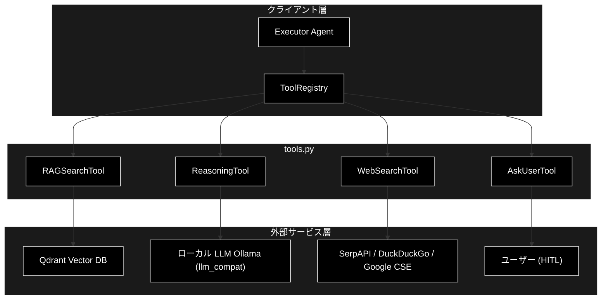
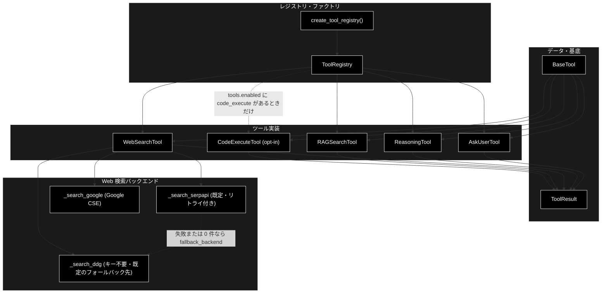
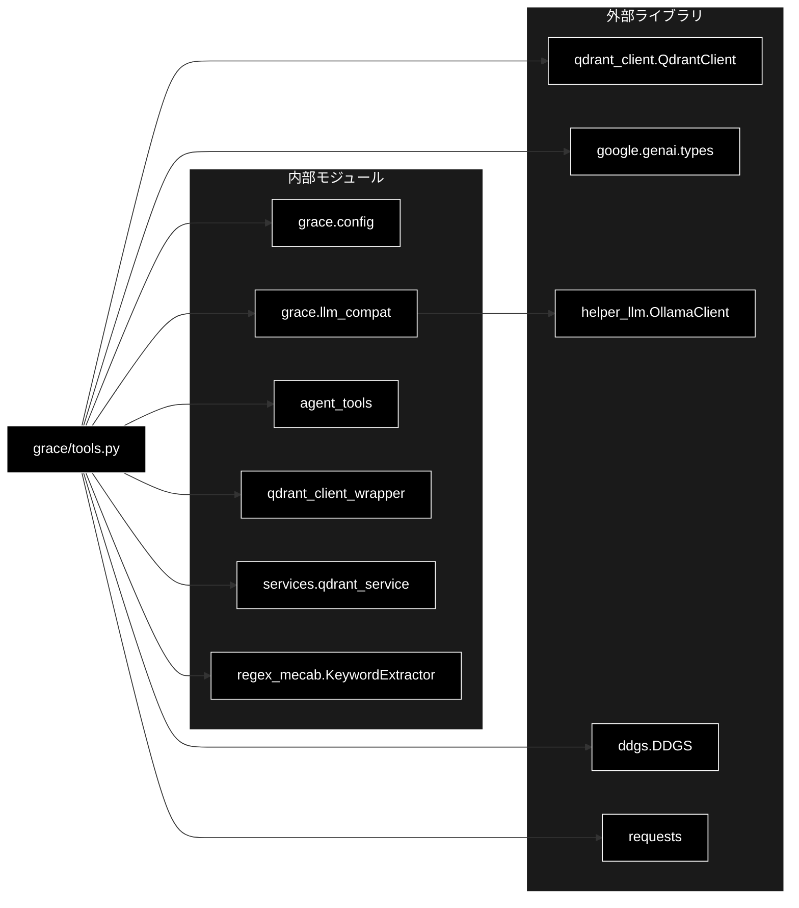

# tools.py - ツール定義モジュール ドキュメント

**Version 4.0** | 最終更新: 2026-09-04

---

## 目次

1. [概要](#概要)
   - [主な責務](#主な責務)
   - [各責務対応のモジュール](#各責務対応のモジュール)
   - [主要機能一覧](#主要機能一覧)
2. [アーキテクチャ構成図](#1-アーキテクチャ構成図)
   - [システム全体構成](#11-システム全体構成)
   - [データフロー](#12-データフロー)
3. [モジュール構成図](#2-モジュール構成図)
   - [内部モジュール構成](#21-内部モジュール構成)
   - [外部依存関係](#22-外部依存関係)
   - [内部依存モジュール](#23-内部依存モジュール)
4. [クラス・関数一覧表](#3-クラス関数一覧表)
   - [データクラス一覧](#31-データクラス一覧)
   - [クラス一覧](#32-クラス一覧)
   - [ファクトリ関数一覧](#33-ファクトリ関数一覧)
5. [クラス・関数 IPO詳細](#4-クラス関数-ipo詳細)
   - [ToolResult データクラス](#41-toolresult-データクラス)
   - [BaseTool クラス（抽象基底）](#42-basetool-クラス抽象基底)
   - [RAGSearchTool クラス](#43-ragsearchtool-クラス)
   - [ReasoningTool クラス](#44-reasoningtool-クラス)
   - [AskUserTool クラス](#45-askusertool-クラス)
   - [WebSearchTool クラス](#46-websearchtool-クラス)
   - [CodeExecuteTool クラス](#47-codeexecutetool-クラス)
   - [ToolRegistry クラス](#48-toolregistry-クラス)
   - [ファクトリ関数](#49-ファクトリ関数)
6. [設定・定数](#5-設定定数)
   - [ツール関連設定](#51-ツール関連設定)
   - [Web 検索設定（WebSearchConfig）の全項目](#52-web-検索設定websearchconfigの全項目)
   - [バックエンド別の比較](#53-バックエンド別の比較)
   - [クラス定数](#54-クラス定数)
   - [動的閾値（RAGSearchTool）](#55-動的閾値ragsearchtool)
7. [使用例](#6-使用例)
8. [エクスポート](#7-エクスポート)
9. [変更履歴](#8-変更履歴)
10. [付録: 依存関係図](#付録-依存関係図)

---

## 概要

`tools.py` は、GRACE エージェントが実行計画の各ステップで呼び出す **ツール群** を定義するモジュールです。RAG 検索・Web 検索・LLM 推論・ユーザーへの問い合わせ（HITL）という 4 種を既定とし、opt-in の Python サンドボックス実行（`code_execute`）を加えた計 5 種のツールを統一インターフェース（`BaseTool` / `ToolResult`）の下に実装し、`ToolRegistry` を通じて名前ベースで呼び出せるようにします。

LLM 推論は**ローカル LLM（Ollama・既定 `gemma4:12b-mlx`）**を使用しますが、GRACE 本体は当初 google-genai 形式（`client.models.generate_content(...)`）で実装されているため、`grace/llm_compat.py` の互換アダプター（`create_chat_client`）を介して Ollama（OpenAI 互換 API）を呼び出します。**LLM 用の API キーは不要**です。Embedding（Qdrant 検索）は Gemini `gemini-embedding-001`（3072次元）を継続利用します。

### 主な責務

- ツール実行結果の統一表現（`ToolResult`）と統一インターフェース（`BaseTool`）の提供
- Qdrant ベクトルDBからの RAG 検索（動的コレクションフォールバック・動的閾値調整付き）
- 外部 Web 検索（SerpAPI / DuckDuckGo / Google CSE の切り替え）
- 収集情報を統合した LLM 推論による回答生成
- ユーザーへの追加情報要求（Human-in-the-Loop）
- ツールのレジストリ管理と名前ベースの実行ディスパッチ

### 各責務対応のモジュール

| # | 責務 | 対応モジュール | 説明 |
|---|------|--------------|------|
| 1 | ツール結果・基底IFの提供 | `grace/tools.py` | `ToolResult` データクラスと `BaseTool` 抽象基底クラス |
| 2 | Qdrant RAG 検索 | `grace/tools.py` | `RAGSearchTool` が `agent_tools.search_rag_knowledge_base_structured` へ委譲 |
| 3 | 外部 Web 検索 | `grace/tools.py` | `WebSearchTool` が SerpAPI/DDG/Google CSE を切替 |
| 4 | LLM 推論による回答生成 | `grace/tools.py` | `ReasoningTool` が `grace/llm_compat.create_chat_client`（genai 互換 → Ollama）を使用 |
| 5 | ユーザーへの追加情報要求 | `grace/tools.py` | `AskUserTool`（HITL、Function Calling 定義付き） |
| 6 | レジストリ管理・実行ディスパッチ | `grace/tools.py` | `ToolRegistry` と `create_tool_registry()` |
| 7 | Python コードのサンドボックス実行 | `grace/tools.py` | `CodeExecuteTool`（**既定は `tools.enabled` に含めず opt-in**） |

### 主要機能一覧

| 機能 | 説明 |
|------|------|
| `ToolResult` | ツール実行結果を表すデータクラス |
| `BaseTool` | 全ツールの抽象基底クラス（`execute()` を定義） |
| `RAGSearchTool` | Qdrant ベクトルDB検索ツール |
| `RAGSearchTool.execute()` | RAG 検索の実行（コレクションフォールバック付き） |
| `RAGSearchTool._get_all_collections_dynamic()` | Qdrantから全コレクションを動的取得し優先順位付け |
| `RAGSearchTool._calculate_confidence_factors()` | スコア統計（件数・平均・分散など）を算出 |
| `RAGSearchTool.clear_collections_cache()` | 有効コレクションのキャッシュをクリア（classmethod。テスト・再登録後用） |
| `ReasoningTool` | LLM 推論ツール（ローカル LLM＝Ollama） |
| `ReasoningTool.execute()` | 参照情報を統合して回答を生成 |
| `ReasoningTool._build_prompt()` | 推論用プロンプトを構築 |
| `AskUserTool` | ユーザーへの追加情報要求ツール（HITL） |
| `CodeExecuteTool` | Python コードのサンドボックス実行ツール（**既定は無効・opt-in**） |
| `AskUserTool.execute()` | 質問情報を `ToolResult` として返す |
| `WebSearchTool` | Web 検索ツール（複数バックエンド対応） |
| `WebSearchTool.execute()` | Web 検索の実行と RAG 互換変換 |
| `ToolRegistry` | ツールレジストリ |
| `ToolRegistry.execute()` | 名前指定でツールを実行 |
| `create_tool_registry()` | `ToolRegistry` を生成するファクトリ関数 |

---

## 1. アーキテクチャ構成図

### 1.1 システム全体構成



### 1.2 データフロー

1. Executor が `ToolRegistry.execute(name, **kwargs)` でツールを名前指定実行する
2. レジストリが該当 `BaseTool` の `execute()` を呼び出す
3. 各ツールが外部サービス（Qdrant / Ollama / Web 検索 API / ユーザー）へアクセスする
4. 各ツールはスコア統計などを `confidence_factors` に格納する
5. 結果を `ToolResult`（`success` / `output` / `confidence_factors` / `error` / `execution_time_ms`）として返却する

---

## 2. モジュール構成図

### 2.1 内部モジュール構成



### 2.2 外部依存関係

| ライブラリ | バージョン | 用途 |
|-----------|-----------|------|
| `qdrant-client` | 1.15.x | Qdrant への接続・コレクション一覧取得 |
| `google-genai` | - | `types.GenerateContentConfig`（生成設定の構造体） |
| `openai`（Ollama の OpenAI 互換 API 用） | - | LLM 呼び出し（`llm_compat` → `helper_llm.OllamaClient` 経由で遅延 import）。**LLM 用 API キーは不要** |
| `ddgs` | - | DDGS メタ検索バックエンド（遅延 import。旧名 `duckduckgo-search` は更新停止） |
| `requests` | - | SerpAPI / Google CSE への HTTP リクエスト（遅延 import） |

### 2.3 内部依存モジュール

| モジュール | 用途 |
|-----------|------|
| `grace.config` | `get_config` / `GraceConfig`（設定取得） |
| `grace.llm_compat` | `create_chat_client`（Ollama を genai 互換インターフェースで呼び出す。`provider="anthropic"` 指定時のみ後方互換で Anthropic） |
| `agent_tools` | `search_rag_knowledge_base_structured`（RAG 検索本体・遅延 import） |
| `qdrant_client_wrapper` | `search_collection` / `embed_query_unified` / `embed_sparse_query_unified` |
| `services.qdrant_service` | `get_collection_embedding_params` |
| `regex_mecab` | `KeywordExtractor`（キーワード抽出） |

---

## 3. クラス・関数一覧表

### 3.1 データクラス一覧

#### ToolResult

| フィールド | 概要 |
|---------|------|
| `success: bool` | 実行成功フラグ |
| `output: Any` | ツールの出力（検索結果リスト・回答文字列・質問dict等） |
| `confidence_factors: Dict[str, Any]` | Confidence 計算用の統計情報（既定 `{}`） |
| `error: Optional[str]` | エラーメッセージ（既定 `None`） |
| `execution_time_ms: Optional[int]` | 実行時間（ミリ秒、既定 `None`） |

### 3.2 クラス一覧

#### BaseTool（抽象基底）

| メソッド | 概要 |
|---------|------|
| `execute(**kwargs)` | 抽象メソッド。ツールを実行し `ToolResult` を返す |

#### RAGSearchTool

| メソッド | 概要 |
|---------|------|
| `__init__(config, qdrant_url)` | コンストラクタ。KeywordExtractor を初期化 |
| `client` (property) | Qdrant クライアントの遅延初期化 |
| `execute(query, collection, limit, score_threshold, **kwargs)` | RAG 検索の実行 |
| `_get_all_collections_dynamic()` | 全コレクションを動的取得し優先順位付け |
| `_calculate_confidence_factors(scores, backend=None)` | スコア統計を算出。**`Executor` が読む正準キー `max_score` / `score_variance` を返すこと**（`top_score` / `score_spread` は表示互換のため併存） |
| `clear_collections_cache()` | 有効コレクションのキャッシュをクリア（`@classmethod`） |

#### ReasoningTool

| メソッド | 概要 |
|---------|------|
| `__init__(config, model_name)` | コンストラクタ。genai 互換クライアント（既定 Ollama）を生成 |
| `execute(query, context, sources, **kwargs)` | LLM 推論で回答生成 |
| `_build_prompt(query, context, sources)` | 推論用プロンプトを構築 |

#### AskUserTool

| メソッド | 概要 |
|---------|------|
| `execute(question, reason, urgency, options, **kwargs)` | 質問情報を `ToolResult` として返す |

#### WebSearchTool

| メソッド | 概要 |
|---------|------|
| `__init__(config)` | コンストラクタ。バックエンド・件数・言語を設定 |
| `execute(query, num_results, language, **kwargs)` | Web 検索の実行。主バックエンドが失敗/0 件なら `fallback_backend` で 1 度だけ再試行 |
| `_search_with_backend(backend, query, num_results, language)` | バックエンド名から実処理メソッドへディスパッチ。未知の名前は `ValueError` |
| `_search_ddg(query, num_results, language)` | DDGS メタ検索バックエンド。**パッケージは `ddgs`**（旧 `duckduckgo_search` は 8.1.1 で更新停止し、HTTP 200 でも 0 件しか解析できない）。未導入の環境では旧名へ落ちる。0 件は warning でパッケージ名を残す（解析失敗と「見つからない」を区別するため） |
| `_search_google(query, num_results, language)` | Google CSE バックエンド |
| `_search_serpapi(query, num_results, language)` | SerpAPI バックエンド（リトライ付き）。失敗時は**応答本文**（SerpAPI の `{"error": ...}`）をログに残す。ログ・例外に **API キーを出さない**（`_mask_secret`。requests の例外メッセージは URL を含み、SerpAPI はキーをクエリパラメータで受け取るため） |
| `_parse_to_rag_format(raw_results, num_results, backend=None)` | RAG 互換フォーマットへ変換。**`backend` はフォールバック時に実際に使ったもの**を渡す（項目名がバックエンドごとに違うため）。最後に `_prefer_domains()` を通す |
| `_unescape_json_escapes(text)`（モジュール関数） | 検索結果に残った `\uXXXX` エスケープを実文字へ戻す（`_parse_to_rag_format` が title / source / answer に適用） |
| `_prefer_domains(formatted)` | **優先ドメインを加点して上位へ並べ替える**（W-1・除外はしない） |
| `_calculate_confidence_factors(scores)` | スコア統計を算出 |

#### モジュール関数

| 関数名 | 概要 |
|-------|------|
| `_url_host(url)` | URL からホスト名（小文字・ポート除去）を取り出す。取れなければ空文字 |

#### ToolRegistry

| メソッド | 概要 |
|---------|------|
| `__init__(config)` | コンストラクタ。デフォルトツールを登録 |
| `_register_default_tools()` | 有効ツールを登録 |
| `register(tool)` | ツールを登録 |
| `get(name)` | ツールを取得 |
| `list_tools()` | 登録済みツール名のリスト |
| `execute(name, **kwargs)` | 名前指定でツールを実行 |

### 3.3 ファクトリ関数一覧

| 関数名 | 概要 |
|-------|------|
| `create_tool_registry(config)` | `ToolRegistry` インスタンスを生成 |

---

## 4. クラス・関数 IPO詳細

### 4.1 ToolResult データクラス

ツール実行結果を統一表現するデータクラス。全ツールの `execute()` はこの型を返します。

#### コンストラクタ: `ToolResult`

**概要**: ツール実行結果を保持するデータクラス。

```python
@dataclass
class ToolResult:
    success: bool
    output: Any
    confidence_factors: Dict[str, Any] = field(default_factory=dict)
    error: Optional[str] = None
    execution_time_ms: Optional[int] = None
```

| パラメータ | 型 | デフォルト | 説明 |
|------------|------|-----------|------|
| `success` | bool | - | 実行成功フラグ |
| `output` | Any | - | ツールの出力 |
| `confidence_factors` | Dict[str, Any] | `{}` | Confidence 計算用の統計情報 |
| `error` | Optional[str] | None | エラーメッセージ |
| `execution_time_ms` | Optional[int] | None | 実行時間（ミリ秒） |

| 項目 | 内容 |
|------|------|
| **Input** | `success: bool`, `output: Any`, `confidence_factors: Dict = {}`, `error: Optional[str] = None`, `execution_time_ms: Optional[int] = None` |
| **Process** | フィールドを保持する |
| **Output** | `ToolResult` インスタンス |

**戻り値例**:
```python
{
    "success": True,
    "output": ["result1", "result2"],
    "confidence_factors": {"result_count": 2, "avg_score": 0.85},
    "error": None,
    "execution_time_ms": 142
}
```

```python
# 使用例
result = ToolResult(success=True, output=["doc1"], execution_time_ms=120)
print(result.success)
# True
```

---

### 4.2 BaseTool クラス（抽象基底）

全ツールの抽象基底クラス。クラス属性 `name`・`description` と抽象メソッド `execute()` を定義します。

#### メソッド: `execute`

**概要**: ツールを実行する抽象メソッド（サブクラスで実装必須）。

```python
@abstractmethod
def execute(self, **kwargs) -> ToolResult
```

| パラメータ | 型 | デフォルト | 説明 |
|------------|------|-----------|------|
| `**kwargs` | Any | - | ツール固有の引数 |

| 項目 | 内容 |
|------|------|
| **Input** | `**kwargs`（ツール固有） |
| **Process** | サブクラスで具体的な処理を実装 |
| **Output** | `ToolResult` |

**戻り値例**:
```python
ToolResult(success=True, output="...", confidence_factors={})
```

```python
# 使用例
class MyTool(BaseTool):
    name = "my_tool"
    def execute(self, **kwargs) -> ToolResult:
        return ToolResult(success=True, output="ok")
```

---

### 4.3 RAGSearchTool クラス

Qdrant ベクトルDBから関連情報を検索するツール。`agent_tools.search_rag_knowledge_base_structured` に委譲し、コレクションの動的フォールバックと動的閾値調整を行います。

> ⚠️ **「Qdrant 未接続」と「コレクション 0 件」を区別する**（2026-09-02 の実測に基づく修正）。
> - 検索候補が 1 つも無い場合は、存在しない名前を順に叩かず**その場で打ち切り**、
>   `success=False` と理由（`Qdrant 未起動、または未登録`）を返す。
> - コレクション一覧の取得が**接続エラー**で失敗したときは、`search_priority` へ
>   フォールバック**しない**。あれは「Qdrant に在るかもしれない名前の希望リスト」であって
>   実在の裏付けが無く、返すと `allowed_collections` と一致せず**業界プロファイルの検索制限が外れて**
>   無関係な汎用コーパスを延々と検索してしまう。空を返し、呼び出し側に「検索不能」を判断させる。

#### コンストラクタ: `__init__`

**概要**: 設定と Qdrant URL を保持し、KeywordExtractor を初期化する。

```python
def __init__(
    self,
    config: Optional[GraceConfig] = None,
    qdrant_url: Optional[str] = None
)
```

| パラメータ | 型 | デフォルト | 説明 |
|------------|------|-----------|------|
| `config` | Optional[GraceConfig] | None | GRACE 設定（None なら `get_config()`） |
| `qdrant_url` | Optional[str] | None | Qdrant URL（None なら `config.qdrant.url`） |

| 項目 | 内容 |
|------|------|
| **Input** | `config: Optional[GraceConfig] = None`, `qdrant_url: Optional[str] = None` |
| **Process** | 1. config / qdrant_url を解決<br>2. Qdrant クライアントは遅延初期化（None で保持）<br>3. `KeywordExtractor(prefer_mecab=True)` を初期化（失敗時は None） |
| **Output** | `RAGSearchTool` インスタンス |

**戻り値例**:
```python
RAGSearchTool(config=<GraceConfig>, qdrant_url="http://localhost:6333")
```

```python
# 使用例
tool = RAGSearchTool()
print(tool.name)
# rag_search
```

#### メソッド: `execute`

**概要**: RAG 検索を実行する。コレクションを優先順位順に試行し、結果が出た時点で採用する。

```python
def execute(
    self,
    query: str,
    collection: Optional[str] = None,
    limit: Optional[int] = None,
    score_threshold: Optional[float] = None,
    **kwargs
) -> ToolResult
```

| パラメータ | 型 | デフォルト | 説明 |
|------------|------|-----------|------|
| `query` | str | - | 検索クエリ |
| `collection` | Optional[str] | None | 検索対象コレクション（指定時は最優先で試行） |
| `limit` | Optional[int] | None | 取得件数上限 |
| `score_threshold` | Optional[float] | None | スコア閾値 |
| `**kwargs` | Any | - | 追加引数 |

| 項目 | 内容 |
|------|------|
| **Input** | `query: str`, `collection: Optional[str] = None`, `limit: Optional[int] = None`, `score_threshold: Optional[float] = None` |
| **Process** | 1. 検索候補コレクションを決定（指定 + `_get_all_collections_dynamic()`）<br>2. 候補を順次 `search_rag_knowledge_base_structured` で検索<br>3. 結果が出たコレクションを採用しループ終了<br>4. 動的閾値調整（1位が 0.98 以上なら上位1件のみ残す）<br>5. スコア統計を算出し `used_collection` を記録 |
| **Output** | `ToolResult`: 検索結果リスト（成功時）/ 空リスト（結果なし時は `success=False`） |

**戻り値例**:
```python
ToolResult(
    success=True,
    output=[
        {"score": 0.92, "payload": {"question": "...", "answer": "..."}, "collection": "wikipedia_ja"}
    ],
    confidence_factors={
        "result_count": 1,
        "avg_score": 0.92,
        "score_variance": 0.0,
        "max_score": 0.92,
        "min_score": 0.92,
        "used_collection": "wikipedia_ja"
    },
    execution_time_ms=210
)
```

```python
# 使用例
tool = RAGSearchTool()
result = tool.execute(query="退職手続きについて教えて")
if result.success:
    print(f"{len(result.output)}件ヒット（{result.confidence_factors['used_collection']}）")
```

#### メソッド: `_get_all_collections_dynamic`

**概要**: Qdrant から全コレクション一覧を動的取得し、設定の優先順位に従って並べ替える。

```python
def _get_all_collections_dynamic(self) -> List[str]
```

| パラメータ | 型 | デフォルト | 説明 |
|------------|------|-----------|------|
| なし（selfのみ） | - | - | - |

| 項目 | 内容 |
|------|------|
| **Input** | なし（selfのみ） |
| **Process** | 1. `client.get_collections()` で全コレクション取得<br>2. `config.qdrant.search_priority` を先頭に配置<br>3. 残りを後ろに追加<br>4. 失敗時は `search_priority` をそのまま返す |
| **Output** | `List[str]`: 優先順位付きコレクション名リスト |

**戻り値例**:
```python
["wikipedia_ja", "livedoor", "cc_news", "japanese_text"]
```

```python
# 使用例
tool = RAGSearchTool()
collections = tool._get_all_collections_dynamic()
print(collections[0])
# wikipedia_ja
```

#### メソッド: `_calculate_confidence_factors`

**概要**: スコアのリストから件数・平均・分散・最大・最小を算出する。

```python
def _calculate_confidence_factors(self, scores: List[float]) -> Dict[str, Any]
```

| パラメータ | 型 | デフォルト | 説明 |
|------------|------|-----------|------|
| `scores` | List[float] | - | スコアのリスト |

| 項目 | 内容 |
|------|------|
| **Input** | `scores: List[float]` |
| **Process** | 1. 空なら全ゼロの統計を返す<br>2. 平均を算出<br>3. 件数2以上なら分散を算出<br>4. 件数・平均・分散・最大・最小を返す |
| **Output** | `Dict[str, Any]`: `{result_count, avg_score, score_variance, max_score, min_score}` |

**戻り値例**:
```python
{
    "result_count": 3,
    "avg_score": 0.81,
    "score_variance": 0.004,
    "max_score": 0.92,
    "min_score": 0.71
}
```

```python
# 使用例
tool = RAGSearchTool()
stats = tool._calculate_confidence_factors([0.92, 0.80, 0.71])
print(stats["avg_score"])
# 0.81
```

---

### 4.4 ReasoningTool クラス

収集した情報を統合して回答を生成する LLM 推論ツール。`grace/llm_compat.create_chat_client` 経由でローカル LLM（Ollama・既定 `gemma4:12b-mlx`）を genai 互換インターフェースで呼び出します。

#### コンストラクタ: `__init__`

**概要**: 設定とモデル名を保持し、genai 互換クライアント（既定 Ollama）を生成する。モデルは `resolve_heavy_model(config)`（`heavy_model` 未設定なら `llm.model`）で解決する。

```python
def __init__(
    self,
    config: Optional[GraceConfig] = None,
    model_name: Optional[str] = None
)
```

| パラメータ | 型 | デフォルト | 説明 |
|------------|------|-----------|------|
| `config` | Optional[GraceConfig] | None | GRACE 設定（None なら `get_config()`） |
| `model_name` | Optional[str] | None | モデル名（None なら `config.llm.model`） |

| 項目 | 内容 |
|------|------|
| **Input** | `config: Optional[GraceConfig] = None`, `model_name: Optional[str] = None` |
| **Process** | 1. config / model_name を解決<br>2. `create_chat_client(config)` でクライアント生成 |
| **Output** | `ReasoningTool` インスタンス |

**戻り値例**:
```python
ReasoningTool(config=<GraceConfig>, model_name="gemma4:12b-mlx")
```

```python
# 使用例
tool = ReasoningTool()
print(tool.model_name)
# gemma4:12b-mlx
```

#### メソッド: `execute`

**概要**: クエリ・コンテキスト・参照ソースからプロンプトを構築し、ローカル LLM（Ollama）で回答を生成する。

```python
def execute(
    self,
    query: str,
    context: Optional[str] = None,
    sources: Optional[List[Dict]] = None,
    **kwargs
) -> ToolResult
```

| パラメータ | 型 | デフォルト | 説明 |
|------------|------|-----------|------|
| `query` | str | - | 元のクエリ |
| `context` | Optional[str] | None | 追加コンテキスト |
| `sources` | Optional[List[Dict]] | None | 参照ソース（RAG 検索結果など） |
| `**kwargs` | Any | - | 追加引数 |

| 項目 | 内容 |
|------|------|
| **Input** | `query: str`, `context: Optional[str] = None`, `sources: Optional[List[Dict]] = None` |
| **Process** | 1. `_build_prompt()` でプロンプト構築<br>2. `client.models.generate_content()`（互換層 → Ollama）で生成<br>3. `response.text` を回答とし、`usage_metadata` からトークン使用量を取得<br>4. 失敗時は `success=False` を返す |
| **Output** | `ToolResult`: 生成された回答文字列（成功時） |

**戻り値例**:
```python
ToolResult(
    success=True,
    output="社内ナレッジ（faq.csv）によると、退職手続きは...",
    confidence_factors={
        "has_sources": True,
        "source_count": 2,
        "answer_length": 312,
        "token_usage": {"input_tokens": 850, "output_tokens": 210}
    },
    execution_time_ms=1840
)
```

```python
# 使用例
tool = ReasoningTool()
result = tool.execute(query="退職手続きは？", sources=rag_results)
print(result.output)
```

#### メソッド: `_build_prompt`

**概要**: システム指示・参照情報・補足コンテキスト・質問・回答ルールを連結した推論用プロンプトを構築する。

> ⚠️ **`config.llm.prompt_closing` は【回答の構成ルール】の後ろに置く。**
> 0-(B) が注入する「担当範囲外の断り」を業務方針側（参照情報の手前）で渡していたとき、
> 後段の【回答の構成ルール（最重要）】に負けてモデルが断りを落とす事象が実測 2 回連続で
> 起きた（2026-08-30）。そのため `prompt_closing` は
> `### 【この回答で必ず守ること】` として**最後に**連結する。

```python
def _build_prompt(
    self,
    query: str,
    context: Optional[str],
    sources: Optional[List[Dict]]
) -> str
```

| パラメータ | 型 | デフォルト | 説明 |
|------------|------|-----------|------|
| `query` | str | - | ユーザーの質問 |
| `context` | Optional[str] | - | 補足コンテキスト |
| `sources` | Optional[List[Dict]] | - | 参照情報（payload に question/answer/content/source） |

| 項目 | 内容 |
|------|------|
| **Input** | `query: str`, `context: Optional[str]`, `sources: Optional[List[Dict]]` |
| **Process** | 1. システム指示を追加<br>2. ソースを「情報源 i」として列挙（信頼度・コレクション・Q/A・出典）<br>3. 補足コンテキストを追加<br>4. 質問と回答ルール（正確性・出典明示・捏造禁止など）を追加 |
| **Output** | `str`: 構築済みプロンプト |

**戻り値例**:
```python
"あなたは社内ドキュメント検索システムと連携した...\n### 【参照情報】\n--- 情報源 1 ..."
```

```python
# 使用例
tool = ReasoningTool()
prompt = tool._build_prompt("退職手続きは？", None, rag_results)
print(prompt[:30])
```

---

### 4.5 AskUserTool クラス

ユーザーに追加情報や確認を求める HITL ツール。クラス属性 `FUNCTION_DECLARATION` に Function Calling 用の関数定義（`ask_user_for_clarification`）を持ちます。

#### メソッド: `execute`

**概要**: 質問情報を `ToolResult` として返す（実際の UI 連携は Executor が担当）。

```python
def execute(
    self,
    question: str,
    reason: str,
    urgency: str = "blocking",
    options: Optional[List[str]] = None,
    **kwargs
) -> ToolResult
```

| パラメータ | 型 | デフォルト | 説明 |
|------------|------|-----------|------|
| `question` | str | - | ユーザーへの質問 |
| `reason` | str | - | 質問の理由 |
| `urgency` | str | "blocking" | 緊急度（blocking / optional） |
| `options` | Optional[List[str]] | None | 選択肢リスト |
| `**kwargs` | Any | - | 追加引数 |

| 項目 | 内容 |
|------|------|
| **Input** | `question: str`, `reason: str`, `urgency: str = "blocking"`, `options: Optional[List[str]] = None` |
| **Process** | 1. 質問内容をログ出力<br>2. 質問情報を dict にまとめ `awaiting_response=True` を付与 |
| **Output** | `ToolResult`: 質問情報 dict（`success=True`） |

**戻り値例**:
```python
ToolResult(
    success=True,
    output={
        "question": "対象の年度はいつですか？",
        "reason": "複数年度の情報が存在するため",
        "urgency": "blocking",
        "options": ["2024年度", "2025年度"],
        "awaiting_response": True
    },
    confidence_factors={"requires_user_input": True, "urgency": "blocking"}
)
```

```python
# 使用例
tool = AskUserTool()
result = tool.execute(question="対象年度は？", reason="複数年度あり", urgency="blocking")
print(result.output["awaiting_response"])
# True
```

---

### 4.6 WebSearchTool クラス

Web 検索で最新情報を取得するツール。SerpAPI / DuckDuckGo / Google CSE のバックエンドを設定で切り替え、結果を rag_search 互換フォーマットに変換します。

#### コンストラクタ: `__init__`

**概要**: 設定からバックエンド・件数・言語・タイムアウトを読み込む。

```python
def __init__(self, config: Optional[GraceConfig] = None)
```

| パラメータ | 型 | デフォルト | 説明 |
|------------|------|-----------|------|
| `config` | Optional[GraceConfig] | None | GRACE 設定（None なら `get_config()`） |

| 項目 | 内容 |
|------|------|
| **Input** | `config: Optional[GraceConfig] = None` |
| **Process** | `config.web_search` から `backend` / `num_results` / `language` / `timeout` / `max_retries`（下限 1）/ `retry_backoff_seconds` / `fallback_backend` を取得 |
| **Output** | `WebSearchTool` インスタンス |

**戻り値例**:
```python
WebSearchTool(config=<GraceConfig>)  # backend="serpapi", num_results=5,
                                     # max_retries=3, fallback_backend="duckduckgo"
```

```python
# 使用例
tool = WebSearchTool()
print(tool.backend)
# serpapi
```

#### メソッド: `execute`

**概要**: 設定バックエンドで Web 検索を実行し、rag_search 互換形式に変換して返す。

```python
def execute(
    self,
    query: str,
    num_results: Optional[int] = None,
    language: Optional[str] = None,
    **kwargs
) -> ToolResult
```

| パラメータ | 型 | デフォルト | 説明 |
|------------|------|-----------|------|
| `query` | str | - | 検索クエリ |
| `num_results` | Optional[int] | None | 取得件数（None なら config 値） |
| `language` | Optional[str] | None | 検索言語（None なら config 値） |
| `**kwargs` | Any | - | 追加引数 |

| 項目 | 内容 |
|------|------|
| **Input** | `query: str`, `num_results: Optional[int] = None`, `language: Optional[str] = None` |
| **Process** | 1. `_search_with_backend()` が backend に応じて `_search_ddg` / `_search_google` / `_search_serpapi` を呼ぶ<br>2. **主バックエンドが失敗または 0 件なら `fallback_backend` で再試行**（`backends = [backend] + [fallback_backend]`）。空振りすると下流で「情報なし回答」が生成され ④' の誤エスカレへ連鎖するため、ここで粘る<br>3. `_parse_to_rag_format()` で rag_search 互換に変換（実際に使ったバックエンド名を伴う）<br>4. 結果なしなら `success=False`<br>5. スコア統計を算出 |

> 📌 **出典 URL のエスケープ復元（`_unescape_json_escapes`）**: `_parse_to_rag_format` は
> 検索結果の `title` / `source` / `answer` に本関数を適用する。SerpAPI が返す `link` は
> **二重エスケープ**されていることがあり（`=` が `\u003d`、`&` が `\u0026`）、そのままだと
> 引用一覧のリンクが開けず、reasoning プロンプトの【参照情報】にも壊れた文字列が入る
> （grace_v2 実測 2026-08-17）。
>
> ⚠️ `codecs.decode(text, "unicode_escape")` は**使わない** — latin-1 経由の復号なので
> 日本語のタイトル・スニペットを壊す。`\uXXXX` の並びだけを対象にし、単独では不正な文字になる
> サロゲート（D800–DFFF）は literal のまま残す。
>
> 📝 これは **Web 検索バックエンドの癖であり LLM プロバイダとは無関係**なので、
> LLM をローカル実行する本リポジトリでもそのまま起きる。
| **Output** | `ToolResult`: rag_search 互換の検索結果リスト |

**戻り値例**:
```python
ToolResult(
    success=True,
    output=[
        {"score": 1.0, "payload": {"answer": "...", "source": "https://...", "title": "..."}, "collection": "web_search"}
    ],
    confidence_factors={"result_count": 5, "avg_score": 0.8, "max_score": 1.0, "min_score": 0.6,
                        "score_variance": 0.02, "top_score": 1.0, "score_spread": 0.4,
                        "search_engine": "serpapi"},
    execution_time_ms=920
)
```

```python
# 使用例
tool = WebSearchTool()
result = tool.execute(query="2026年 日本の祝日")
print(result.confidence_factors["search_engine"])
# serpapi
```

#### メソッド: `_prefer_domains`（W-1）

**概要**: 優先ドメインの結果を**加点して上位へ並べ替える**。**除外はしない。**

```python
def _prefer_domains(self, formatted: list) -> list
```

| パラメータ | 型 | デフォルト | 説明 |
|------------|------|-----------|------|
| `formatted` | list | - | `_parse_to_rag_format` の出力（RAG 互換 dict のリスト） |

| 項目 | 内容 |
|------|------|
| **Input** | `formatted`、`config.web_search.preferred_domains` / `preferred_domain_boost` |
| **Process** | 1. 優先ドメインを正規化（`strip` / 小文字化 / 先頭 `.` 除去）。**空なら何もせず返す**<br>2. 各結果の `payload.source` から `_url_host()` でホストを取り出す<br>3. `host == d` または `host.endswith("." + d)` で**接尾辞一致**を判定し `preferred_domain` を立てる<br>4. 一致した結果の `score` に `boost` を足す（上限 1.0・小数 2 桁）<br>5. 「一致 → スコア」の順で**安定ソート**（同条件なら元の検索順位を保つ） |
| **Output** | `list`: 並べ替え済みの結果（**件数は変わらない**） |

> ⚠️ **絞り込みではなく順位付けである理由。** 検索スコープ（`VerticalProfile.collections`）が
> 効くのは内部 RAG だけで、Web 検索にはドメインの概念がありません。`gov` プロファイルで
> 一般の天気サイトが引用に載る取り違えが実測で確認されています。ただし取得側を
> 「一致したものだけ」に絞ると、**優先ドメインに情報が無い質問で結果が 0 件**になり、
> 情報なし回答 → ④' の誤エスカレへ連鎖します。順位だけを変えるので、
> 最悪でも「並び順が変わるだけ」で情報量は減りません。

> 📝 **スコア加点だけで並べ替えない理由**: スコアが 1.0 で頭打ちになると一致・非一致の
> 区別がつかなくなるため、`preferred_domain` フラグを第 1 キーにしています。

**戻り値例**:
```python
[{"score": 0.95, "preferred_domain": True,  "payload": {"source": "https://www.city.example.lg.jp/..."}},
 {"score": 0.90, "preferred_domain": False, "payload": {"source": "https://tenki.example.com/..."}}]
```

```python
# 使用例（gov プロファイル適用時）
config.web_search.preferred_domains = ["go.jp", "lg.jp"]
# → 公的機関のページが上位へ。非一致の結果も残る
```

#### メソッド: `_search_with_backend`

**概要**: バックエンド名から実処理メソッドへディスパッチする。`execute` がフォールバックを含めてこれを呼ぶ。

```python
def _search_with_backend(self, backend: str, query: str,
                         num_results: int, language: str) -> list
```

| 項目 | 内容 |
|------|------|
| **Input** | `backend`（`"duckduckgo"` / `"google_cse"` / `"serpapi"`）, `query`, `num_results`, `language` |
| **Process** | 名前に対応する `_search_ddg` / `_search_google` / `_search_serpapi` を呼ぶ。**未知の名前は `ValueError`** |
| **Output** | `list`: 各バックエンド生の結果（正規化前） |

#### メソッド: `_search_ddg`

**概要**: DDGS メタ検索バックエンド。**主バックエンドが落ちたときの受け皿**として既定の `fallback_backend` になっている（API キー不要のため）。

```python
def _search_ddg(self, query: str, num_results: int, language: str) -> list
```

| 項目 | 内容 |
|------|------|
| **Input** | `query`, `num_results`, `language` |
| **Process** | 1. **`ddgs` パッケージを優先**して import し、`ImportError` のときだけ旧名 `duckduckgo_search` へ落ちる<br>2. `region` は `language == "ja"` なら `"jp-jp"`、それ以外は `"wt-wt"`<br>3. `DDGS(timeout=self.timeout)` で `ddgs.text(query, region=..., max_results=...)`<br>4. **0 件なら `logger.warning`** を出す |
| **Output** | `list`: `{"title": ..., "href": ..., "body": ...}` の並び |

> ⚠️ **パッケージは `duckduckgo_search` から `ddgs` へ改名されている。** 旧名は 8.1.1 が最終
> リリースで更新が止まっており、実測 2026-08-29 では検索先から HTTP 200 を受け取りながら
> **0 件しか解析できていなかった**（＝SerpAPI が 500 で落ちたときの受け皿が、実は機能して
> いなかった）。戻り値のキー（`title` / `href` / `body`）は同じなので `_parse_to_rag_format`
> 側は変更不要。
>
> 📝 **0 件で警告を出すのは「見つからなかった」と区別できないから。** ライブラリが解析に失敗
> しても 0 件になる。下流では「情報なし」→ ④' の誤エスカレにつながるため、ここで見えるようにする。

#### メソッド: `_search_google`

**概要**: Google CSE 検索バックエンド。

```python
def _search_google(self, query: str, num_results: int, language: str) -> list
```

| 項目 | 内容 |
|------|------|
| **Input** | `query`, `num_results`, `language` |
| **Process** | 1. API キーとエンジン ID を **環境変数優先**で解決（`GOOGLE_CSE_API_KEY` / `GOOGLE_CSE_ENGINE_ID` → `config.web_search.*`）<br>2. どちらか欠けていれば `ValueError`<br>3. `https://www.googleapis.com/customsearch/v1` へ `key` / `cx` / `q` / `lr=lang_{language}` / `num` を渡して GET<br>4. `raise_for_status()` 後、`items` を返す（**リトライしない**） |
| **Output** | `list`: `{"title": ..., "link": ..., "snippet": ...}` の並び |

#### メソッド: `_search_serpapi`

**概要**: SerpAPI 検索バックエンド（既定）。**設定可能なリトライ付き。**

```python
def _search_serpapi(self, query: str, num_results: int, language: str) -> list
```

| 項目 | 内容 |
|------|------|
| **Input** | `query`, `num_results`, `language` |
| **Process** | 1. API キーを環境変数優先で解決（`SERPAPI_KEY` → `config.web_search.serpapi_api_key`）。無ければ `ValueError`<br>2. `hl=language` / `gl=("jp" if ja else "us")` / `num` で `https://serpapi.com/search.json` へ GET<br>3. **400 以上なら本文の先頭 300 文字をマスクしてログ出力**<br>4. **5xx とタイムアウト/接続エラーはリトライ対象**、`retry_backoff_seconds × 試行回数` の線形バックオフで最大 `max_retries` 回<br>5. **4xx は即時送出**（キー不正・クォータ超過は再試行で解消しない）<br>6. `organic_results` を返す |
| **Output** | `list`: `{"title": ..., "link": ..., "snippet": ...}` の並び |

> ⚠️ **SerpAPI は失敗時も本文に理由を返す**（`{"error": "..."}`）。`raise_for_status()` は
> ステータス行しか持たないので、本文を捨てると「500 Server Error」としか分からないログになる
> （実測 2026-08-29: 3 回連続で 500。理由が一切残らず、一時障害なのかパラメータの問題なのか
> 切り分けできなかった）。
>
> ⚠️ **HTTPError は元の例外をそのまま投げない。** メッセージに URL が入り、クエリパラメータの
> API キーが上位のログ（`exc_info=True`）へ**平文で流れる**。`_mask_secret()` を通したうえで
> `from None` で元の連鎖ごと断ち切っている。

#### メソッド: `_parse_to_rag_format`

**概要**: 各バックエンドの生結果を **rag_search 互換フォーマット**へ変換する。

```python
def _parse_to_rag_format(self, raw_results: list, num_results: int,
                         backend: Optional[str] = None) -> list
```

| パラメータ | 型 | デフォルト | 説明 |
|------------|------|-----------|------|
| `raw_results` | list | - | バックエンドの生結果 |
| `num_results` | int | - | スコア正規化の母数 |
| `backend` | Optional[str] | None | **実際に使ったバックエンド**（フォールバック時に渡す）。None なら主バックエンド |

| 項目 | 内容 |
|------|------|
| **Input** | `raw_results`, `num_results`, `backend` |
| **Process** | 1. **検索順位ベースの正規化スコア**を付ける: `score = round(1.0 - (i / max(num_results, 1)) * 0.5, 2)`（1 位 = 1.0、最下位 ≒ 0.5）<br>2. `duckduckgo` は `body` / `href` / `title`、`serpapi` と `google_cse` は `snippet` / `link` / `title` を読む<br>3. 各文字列に `_unescape_json_escapes()` を適用<br>4. `collection` は一律 `"web_search"`<br>5. 最後に **`_prefer_domains()` を通して**返す |
| **Output** | `list`: `{"score", "payload": {question, answer, content, source, title}, "collection"}` |

> 📌 **`backend` を引数で受け取る理由**: フォールバックで DuckDuckGo に切り替わったのに主
> バックエンド（SerpAPI）のキー名で読むと、`snippet` も `link` も無いので**全項目が空文字**に
> なる。実際に使ったバックエンド名を渡す必要がある。

#### メソッド: `_calculate_confidence_factors`

**概要**: 検索結果のスコアリストから Confidence 統計を算出する。

```python
def _calculate_confidence_factors(self, scores: list,
                                  backend: Optional[str] = None) -> dict
```

| 項目 | 内容 |
|------|------|
| **Input** | `scores: list[float]`, `backend: Optional[str]` |
| **Process** | 空なら `result_count=0` / スコア類 `0.0` / **`score_variance=1.0`**（RAG 側と同じ「0 件は最悪」の既定）。<br>そうでなければ `avg_score`（2 桁丸め）・`max_score`・`min_score`・`score_variance`（1 件なら `0.0`）・`top_score`・`score_spread`（= `max - min`）・`search_engine` を返す |
| **Output** | `dict`: Confidence 統計 |

> ⚠️ **キー名は `Executor` が読む正準名（`max_score` / `score_variance`）に合わせること。**
> `Executor._build_confidence_factors` はこの 2 つを読み、無ければ**黙って** `avg_score` /
> 既定 `1.0` へフォールバックする。以前ここが `top_score` / `score_spread` だけを返していたため、
> Web ステップの信頼度が実測でこうなっていた:
>
> ```
> Initial factors : {'avg_score': 0.6, 'top_score': 1.0, 'score_spread': 0.8}
> ConfidenceFactors: search_max_score=0.6        ← avg が入っている
>                    search_score_variance=1.0   ← 既定値（最大ばらつき）
> ```
>
> 最高スコア 1.0 が 0.6 に潰れ、ばらつきは常に最悪値として扱われるので、Web ステップの信頼度が
> 不当に低く出る（実測の `[CONFIRM] 66.6%`）。**RAG 側は正準名を返していたため、Web だけが
> 静かに壊れていた。** `top_score` / `score_spread` は表示・ログ互換のため残してある
> （`score_spread` は range であって variance ではないので、別キーのまま両方返す）。

**戻り値例（結果あり）**:
```python
{
    "result_count": 5, "avg_score": 0.8,
    "max_score": 1.0, "min_score": 0.6, "score_variance": 0.02,
    "top_score": 1.0, "score_spread": 0.4,
    "search_engine": "serpapi",
}
```

**戻り値例（結果なし）**:
```python
{
    "result_count": 0, "avg_score": 0.0,
    "max_score": 0.0, "min_score": 0.0, "score_variance": 1.0,   # ← 0 件は最悪扱い
    "top_score": 0.0, "score_spread": 0.0,
    "search_engine": "serpapi",
}
```

---

### 4.7 CodeExecuteTool クラス

Python コードをサンドボックスで実行し、標準出力を返すツール。

> ⚠️ **既定では登録されない（opt-in）。** `ToolsConfig.enabled` の既定は
> `["rag_search", "web_search", "reasoning", "ask_user"]` で `code_execute` を**含まない**。
> `create_tool_registry()` は `"code_execute" in enabled_tools` のときだけ登録する。
> セキュリティ上の判断であり、有効化するときは設定で明示する。

| 項目 | 内容 |
|---|---|
| `name` | `"code_execute"` |
| `description` | `"Python コードをサンドボックスで実行し標準出力を返す"` |
| 設定 | `GraceConfig.code_execute`（`CodeExecuteConfig`） |

**シグネチャ**

```python
class CodeExecuteTool(BaseTool):
    def __init__(self, config: Optional[GraceConfig] = None)
    def execute(self, code: Optional[str] = None, query: Optional[str] = None,
                **kwargs) -> ToolResult
```

| パラメータ | 型 | 既定 | 説明 |
|---|---|---|---|
| `code` | `Optional[str]` | `None` | 実行する Python コード |
| `query` | `Optional[str]` | `None` | `code` 未指定時のフォールバック入力（`source = code or query`） |

**IPO**

| 区分 | 内容 |
|---|---|
| **Input** | `code`（無ければ `query`）。どちらも空なら即 `success=False` |
| **Process** | 1. `_static_check()` が **AST で構文検証＋禁止 import／危険属性アクセスを拒否**（`denied_imports`、`system`/`popen`/`exec`/`fork`/`remove` 等）<br>2. 静的検査を通ったコードのみ**サブプロセス分離＋`resource` 制限＋isolated mode**で実行<br>3. 標準出力を `max_output_chars` で切り詰め |
| **Output** | `ToolResult`（`output`＝標準出力、失敗時は `error` に理由） |

**設定（`CodeExecuteConfig`）**

| 項目 | 既定 | 説明 |
|---|---|---|
| `timeout_seconds` | `5` | CPU／実時間のタイムアウト |
| `max_memory_mb` | `256` | アドレス空間上限（`RLIMIT_AS`） |
| `max_output_chars` | `10000` | 標準出力の最大文字数（超過分は切り詰め） |
| `denied_imports` | （設定参照） | AST レベルで import を禁止するモジュール |

> ⚠️ **これは best-effort サンドボックスである。** 実装コメントが明記するとおり、真の隔離が
> 必要な場合はコンテナ／gVisor 等の**外部境界を併用**すること。

---

### 4.8 ToolRegistry クラス

ツールを名前で登録・取得・実行するレジストリ。設定の `tools.enabled` に基づきデフォルトツールを自動登録します。

#### コンストラクタ: `__init__`

**概要**: 設定を保持し、有効ツールを登録する。

```python
def __init__(self, config: Optional[GraceConfig] = None)
```

| パラメータ | 型 | デフォルト | 説明 |
|------------|------|-----------|------|
| `config` | Optional[GraceConfig] | None | GRACE 設定（None なら `get_config()`） |

| 項目 | 内容 |
|------|------|
| **Input** | `config: Optional[GraceConfig] = None` |
| **Process** | 1. config を解決<br>2. `_register_default_tools()` で `tools.enabled` に含まれるツールを登録 |
| **Output** | `ToolRegistry` インスタンス |

**戻り値例**:
```python
ToolRegistry(config=<GraceConfig>)  # rag_search, web_search, reasoning, ask_user を登録
```

```python
# 使用例
registry = ToolRegistry()
print(registry.list_tools())
# ['rag_search', 'web_search', 'reasoning', 'ask_user']
```

#### メソッド: `execute`

**概要**: 名前指定でツールを取得し、`execute()` を呼び出す。

```python
def execute(self, name: str, **kwargs) -> ToolResult
```

| パラメータ | 型 | デフォルト | 説明 |
|------------|------|-----------|------|
| `name` | str | - | 実行するツール名 |
| `**kwargs` | Any | - | ツールへ渡す引数 |

| 項目 | 内容 |
|------|------|
| **Input** | `name: str`, `**kwargs` |
| **Process** | 1. `get(name)` でツール取得<br>2. 未登録なら `success=False`<br>3. 登録済みなら `tool.execute(**kwargs)` を呼ぶ |
| **Output** | `ToolResult` |

**戻り値例**:
```python
ToolResult(success=True, output=[...], confidence_factors={...})
```

```python
# 使用例
registry = ToolRegistry()
result = registry.execute("rag_search", query="退職手続きについて")
print(result.success)
```

---

### 4.9 ファクトリ関数

#### `create_tool_registry`

**概要**: `ToolRegistry` インスタンスを生成するファクトリ関数。

```python
def create_tool_registry(config: Optional[GraceConfig] = None) -> ToolRegistry
```

| パラメータ | 型 | デフォルト | 説明 |
|------------|------|-----------|------|
| `config` | Optional[GraceConfig] | None | GRACE 設定（None なら `get_config()`） |

| 項目 | 内容 |
|------|------|
| **Input** | `config: Optional[GraceConfig] = None` |
| **Process** | `ToolRegistry(config=config)` を生成して返す |
| **Output** | `ToolRegistry` インスタンス |

**戻り値例**:
```python
ToolRegistry(config=<GraceConfig>)
```

```python
# 使用例
registry = create_tool_registry()
result = registry.execute("reasoning", query="...", sources=[...])
```

---

## 5. 設定・定数

ツール群は `GraceConfig`（`grace/config.py`）の各セクションを参照します。

### 5.1 ツール関連設定

| 設定キー | デフォルト値 | 説明 |
|---------|-------------|------|
| `tools.enabled` | `["rag_search", "web_search", "reasoning", "ask_user"]` | レジストリが自動登録するツール |
| `tools.disabled` | `[]` | 恒久的に禁止するツール |
| `llm.provider` | `"ollama"` | LLM プロバイダー（既定はローカル LLM。`"anthropic"` を明示した場合のみ後方互換経路） |
| `llm.model` | `get_default_ollama_model()`（現在値 `gemma4:12b-mlx`） | ReasoningTool が使用するモデル（実際は `resolve_heavy_model()` で解決） |
| `llm.temperature` | `0.7` | 生成温度 |
| `llm.max_tokens` | `4096` | 最大出力トークン |
| `qdrant.url` | `"http://localhost:6333"` | Qdrant 接続先 |
| `qdrant.search_priority` | `["wikipedia_ja", "livedoor", "cc_news", "japanese_text"]` | コレクション探索の優先順位 |
| `web_search.backend` | `"serpapi"` | Web 検索バックエンド（serpapi / duckduckgo / google_cse） |
| `web_search.num_results` | `5` | 取得件数 |
| `web_search.language` | `"ja"` | 検索言語 |
| `web_search.timeout` | `30` | リクエストタイムアウト（秒） |

### 5.2 Web 検索設定（`WebSearchConfig`）の全項目

| 設定キー | デフォルト値 | 説明 |
|---------|-------------|------|
| `backend` | `"serpapi"` | 主バックエンド（`serpapi` / `duckduckgo` / `google_cse`） |
| `num_results` | `5` | 取得件数 |
| `language` | `"ja"` | 検索言語 |
| `timeout` | `30` | リクエストタイムアウト（秒） |
| `max_retries` | `3` | **試行回数の上限**（＝リトライは最大 2 回）。`WebSearchTool.__init__` が下限 1 でクランプする |
| `retry_backoff_seconds` | `2.0` | 待機 = `backoff × 試行回数` の線形バックオフ |
| `fallback_backend` | `"duckduckgo"` | 主バックエンドが**失敗または 0 件**のとき 1 度だけ試す代替（`""` で無効） |
| `google_cse_api_key` / `google_cse_engine_id` | `""` | Google CSE 用（環境変数が優先） |
| `serpapi_api_key` | `""` | SerpAPI 用（環境変数 `SERPAPI_KEY` が優先） |
| `preferred_domains` | `[]` | W-1 の**加点**リスト（除外リストではない）。業界プロファイルがリクエストごとに注入する |
| `preferred_domain_boost` | `0.15` | 優先ドメイン一致時に `score` へ加える値（上限 1.0） |

> 📝 リトライとフォールバックが設定可能なのは、**タイムアウト起因の「検索 0 件 → 情報なし回答
> → ④' の誤エスカレ」連鎖**を抑えるため（saas の 500 エラー報告で顕在化）。

### 5.3 バックエンド別の比較

| バックエンド | 検索手段 | 認証 | リトライ | 状態 |
|-------------|---------|------|---------|------|
| `serpapi` | `GET https://serpapi.com/search.json` → `organic_results` | `SERPAPI_KEY` または `serpapi_api_key` | ✅ あり（5xx・タイムアウト） | ✅ 既定 |
| `duckduckgo` | `ddgs.DDGS().text()`（旧名 `duckduckgo_search` へフォールバック） | **不要** | ❌ なし | ✅ 既定のフォールバック先 |
| `google_cse` | `GET https://www.googleapis.com/customsearch/v1` → `items` | `GOOGLE_CSE_API_KEY` + `GOOGLE_CSE_ENGINE_ID` | ❌ なし | ⚠️ 新規受付停止 |

**環境変数**（いずれも `config.web_search.*` より**優先**される）:

| 変数名 | 必須条件 | 説明 |
|--------|---------|------|
| `SERPAPI_KEY` | `backend=serpapi` | SerpAPI の API キー |
| `GOOGLE_CSE_API_KEY` | `backend=google_cse` | Google API キー（⚠️ 新規受付停止） |
| `GOOGLE_CSE_ENGINE_ID` | `backend=google_cse` | CSE Engine ID（⚠️ 新規受付停止） |

> 📝 **Web 検索の鍵は LLM の鍵とは無関係。** 本リポジトリの LLM はローカル実行（Ollama）で
> API キー不要だが、`serpapi` / `google_cse` を使うなら**その鍵は要る**。鍵を置きたくない場合は
> `backend="duckduckgo"` にする。

### 5.4 クラス定数

| 定数 | 所属クラス | 説明 |
|------|-----------|------|
| `name` / `description` | 各 `BaseTool` サブクラス | ツール名・説明（`rag_search` / `web_search` / `reasoning` / `ask_user`） |
| `FUNCTION_DECLARATION` | `AskUserTool` | Function Calling 用の関数定義（`ask_user_for_clarification`） |

### 5.5 動的閾値（RAGSearchTool）

| 項目 | 値 | 説明 |
|------|----|------|
| Dynamic Thresholding | `top_score >= 0.98` | 1位スコアが 0.98 以上かつ複数件のとき、上位1件のみ残す |

---

## 6. 使用例

### 6.1 基本的なワークフロー

```python
from grace.tools import create_tool_registry

# 1. レジストリ生成（デフォルトツールを自動登録）
registry = create_tool_registry()

# 2. RAG 検索
rag_result = registry.execute("rag_search", query="退職手続きについて教えて")

# 3. 検索結果を使って推論
if rag_result.success:
    answer = registry.execute(
        "reasoning",
        query="退職手続きについて教えて",
        sources=rag_result.output,
    )
    print(answer.output)
```

### 6.2 応用的なワークフロー（フォールバック）

```python
from grace.tools import create_tool_registry

registry = create_tool_registry()

# RAG が不十分なら Web 検索へフォールバック
rag = registry.execute("rag_search", query="最新の為替レート")
if not rag.success or rag.confidence_factors.get("avg_score", 0) < 0.7:
    web = registry.execute("web_search", query="最新の為替レート")
    sources = web.output
else:
    sources = rag.output

# それでも曖昧ならユーザーに確認（HITL）
if not sources:
    ask = registry.execute(
        "ask_user",
        question="どの通貨ペアの為替レートですか？",
        reason="検索結果が見つからなかったため",
        urgency="blocking",
        options=["USD/JPY", "EUR/JPY"],
    )
```

---

## 7. エクスポート

`grace/tools.py` の `__all__`：

```python
__all__ = [
    # Data classes
    "ToolResult",

    # Base class
    "BaseTool",

    # Tools
    "RAGSearchTool",
    "WebSearchTool",
    "ReasoningTool",
    "AskUserTool",

    # Registry
    "ToolRegistry",
    "create_tool_registry",
]
```

`grace/__init__.py` からも上記すべて（`ToolResult`, `BaseTool`, `RAGSearchTool`, `WebSearchTool`, `ReasoningTool`, `AskUserTool`, `ToolRegistry`, `create_tool_registry`）が再エクスポートされます。

---

## 8. 変更履歴

| バージョン | 変更内容 |
|-----------|---------|
| 1.0 | 初版作成 |
| 2.0 | WebSearchTool 追加、動的コレクションフォールバック・動的閾値の反映 |
| 2.1 | 実ソース（v2）に整合（2026-06-16）。LLM を Anthropic Claude（`llm_compat` 経由）として正確化、`ReasoningTool`/`RAGSearchTool` の挙動・パラメータ・`confidence_factors` を実装に一致、Mermaid 図を黒背景・白文字スタイルに統一、設定・定数を `GraceConfig` 実値で更新 |
| 2.2 | 実装（07-27）へ追随（2026-08-01）。`WebSearchTool._prefer_domains`（W-1・優先ドメインの**加点並べ替え**）とモジュール関数 `_url_host` を追加。絞り込みにすると 0 件化 → 情報なし回答 → 誤エスカレへ連鎖するため順位付けだけを変えること、スコアが 1.0 で頭打ちになるため `preferred_domain` フラグを第 1 ソートキーにしていることを明記 |
| 3.0 | 2026-09-04: **プロバイダ誤記の訂正と未記載機能の補完**。① LLM 表記 18 箇所を **Anthropic Claude → ローカル LLM（Ollama・既定 `gemma4:12b-mlx`）** へ訂正（Mermaid ノード 2 箇所・依存表・`llm.provider`/`llm.model` の既定値を含む）。`provider="anthropic"` は明示時のみの後方互換として限定記述（CLAUDE.md §3・§9.3）。② **未記載だった `CodeExecuteTool`（§4.7）を追加** — 実装は登録されるが `tools.enabled` の既定に含まれない **opt-in** である点、AST 静的検査・サブプロセス分離・best-effort である旨を明記。③ `RAGSearchTool.clear_collections_cache()` を一覧へ追加。④ 2026-08-29 以降の実装 3 コミットを反映 — **Qdrant 未接続とコレクション 0 件の区別**（接続エラー時に `search_priority` へフォールバックしない理由）、**Web 検索のフォールバック連鎖**（主バックエンド失敗/0 件で `fallback_backend` を再試行）、**`prompt_closing` を構成ルールの後ろに置く**理由 |
| 4.0 | 2026-09-04: **`web_search.md` を統合し、本書を `tools.py` の唯一のドキュメントにした**（旧 `grace/docs/web_search.md` は削除）。統合にあたり旧稿を**そのまま移さず実装と突き合わせた**ところ、旧稿（v1.1・2026-06-16）は次の点で実装から遅れていた: (a) `_calculate_confidence_factors` が `top_score` / `score_spread` だけを返す**修正前の姿**で書かれていた（正準キー `max_score` / `score_variance` が無いと `Executor` が黙って `avg_score` と既定 1.0 へ落ち、Web ステップの信頼度だけが不当に低く出る）、(b) DuckDuckGo のパッケージが旧名 `duckduckgo_search` のまま（現在は `ddgs` を優先）、(c) `max_retries` を `2` 固定と記載（実際は設定可能で既定 `3`）。§4.6 に `_search_with_backend` / `_search_ddg` / `_search_google` / `_search_serpapi` / `_parse_to_rag_format` / `_calculate_confidence_factors` の IPO を追加（`_search_with_backend` は旧稿にも本書にも無かった）。§5 に `WebSearchConfig` の全 11 項目とバックエンド別比較・環境変数表を追加し、§2.1 構成図にバックエンド 3 種とフォールバック経路を追記。`execute` の戻り値例に載っていた旧キーのみの `confidence_factors` も正準キーへ訂正 |

---

## 付録: 依存関係図


