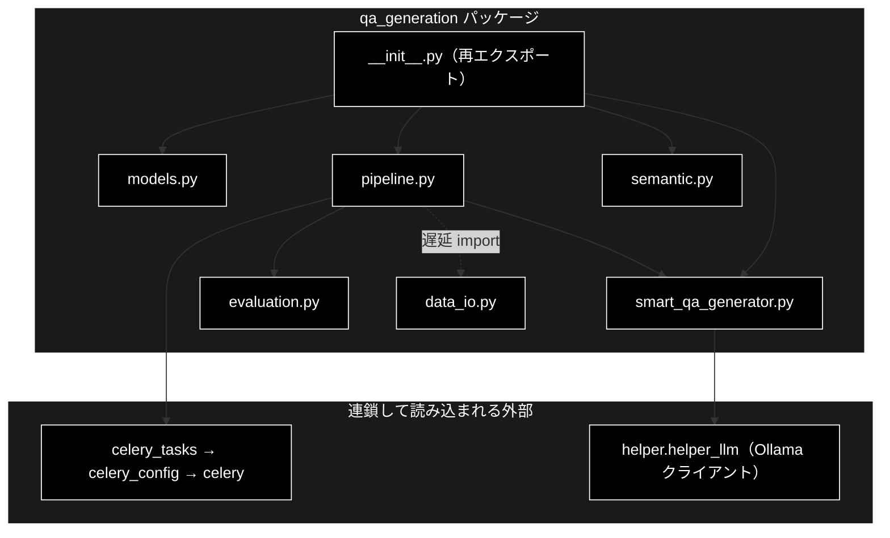

# \_\_init\_\_.py 完全ガイド

**Version 1.0** | 最終更新: 2026-09-21

## 概要

`qa_generation/__init__.py` は、**`qa_generation` パッケージの公開 API を定義する再エクスポート専用モジュール**です。自前のロジックは持たず、4 つのサブモジュールから 11 シンボルを取り込んで `__all__` に並べます。

ただし、**この再エクスポートには import 副作用がある**。`from qa_generation.pipeline import QAPipeline` が連鎖して `celery_tasks` まで読み込むため、パッケージ内のどのモジュールを import しても Celery が立ち上がる（[実測](#import-副作用の実測)）。

### 主な責務

- モジュール構成をパッケージ docstring として示す
- データモデル 8 クラスを再エクスポートする
- `QAPipeline` / `SemanticCoverage` / `SmartQAGenerator` を再エクスポートする
- `__all__` で公開範囲を明示する

### 主要機能一覧

| 区分 | 再エクスポートするシンボル | 由来 |
|---|---|---|
| Models | `QAPair` / `QAPairsList` / `ChainOfThoughtAnalysis` / `ChainOfThoughtQAPair` / `ChainOfThoughtResponse` / `EnhancedQAPair` / `EnhancedQAPairsList` / `QAGenerationConsiderations` | `qa_generation/models.py` |
| Pipeline | `QAPipeline` | `qa_generation/pipeline.py` |
| Semantic Coverage | `SemanticCoverage` | `qa_generation/semantic.py` |
| Smart QA Generator | `SmartQAGenerator` | `qa_generation/smart_qa_generator.py` |

---

## 目次

1. [パッケージ構成](#パッケージ構成)
2. [再エクスポートの一覧](#再エクスポートの一覧)
3. [import 副作用の実測](#import-副作用の実測)
4. [`qa_qdrant/__init__.py` との違い](#qa_qdrant__init__py-との違い)
5. [使用方法](#使用方法)
6. [注意点](#注意点)
7. [関連モジュール](#関連モジュール)
8. [変更履歴](#変更履歴)

---

## パッケージ構成

docstring が示すモジュール構成（実体と一致している）。

| モジュール | 役割 | 文書 |
|---|---|---|
| `models.py` | Pydantic データモデル | [`models.md`](./models.md) |
| `semantic.py` | セマンティック分析・カバレッジ | [`semantic.md`](./semantic.md) |
| `smart_qa_generator.py` | チャンク単位の Q/A 生成 | [`smart_qa_generator.md`](./smart_qa_generator.md) |
| `evaluation.py` | Q/A 評価 | [`evaluation.md`](./evaluation.md) |
| `pipeline.py` | 生成パイプライン | [`pipeline.md`](./pipeline.md) |
| `data_io.py` | データ入出力 | [`data_io.md`](./data_io.md) |

> 📌 **`evaluation` と `data_io` は再エクスポートされない。** docstring には 6 モジュールが
> 並ぶが、`__all__` に載るのは 4 モジュール由来の 11 シンボルだけである。
> `analyze_coverage()` や `load_uploaded_file()` はフルパスで import する。



破線は `QAPipeline.load_data()` / `save()` の中で行う遅延 import を表す。

---

## 再エクスポートの一覧

| # | シンボル | 由来モジュール | 種別 |
|---:|---|---|---|
| 1 | `QAPair` | `models` | Pydantic モデル |
| 2 | `QAPairsList` | `models` | Pydantic モデル |
| 3 | `ChainOfThoughtAnalysis` | `models` | Pydantic モデル |
| 4 | `ChainOfThoughtQAPair` | `models` | Pydantic モデル |
| 5 | `ChainOfThoughtResponse` | `models` | Pydantic モデル |
| 6 | `EnhancedQAPair` | `models` | Pydantic モデル |
| 7 | `EnhancedQAPairsList` | `models` | Pydantic モデル |
| 8 | `QAGenerationConsiderations` | `models` | Pydantic モデル |
| 9 | `SemanticCoverage` | `semantic` | クラス |
| 10 | `SmartQAGenerator` | `smart_qa_generator` | クラス |
| 11 | `QAPipeline` | `pipeline` | クラス |

`__all__` の並びは「Models → Semantic coverage → Smart QA Generator → Pipeline」で、
import 文の並び（Models → Pipeline → Semantic → Smart）とは順序が違うが、
内容は 11 件で一致している。

---

## import 副作用の実測

**パッケージ内のどのモジュールを import しても `__init__.py` が先に実行される。**
`data_io`（pandas とファイル I/O しか使わないモジュール）で測ると次のとおり。

| 測定 | ロード済みモジュール数 | 所要 |
|---|---:|---:|
| `data_io.py` が実際に必要とする依存だけ（`pandas` / `config` / `helper.helper_rag`） | 1,682 | 1.87 秒 |
| `import qa_generation.data_io`（＝`__init__.py` 経由） | 1,799 | 9.58 秒 |
| **差分** | **+117** | **+7.7 秒** |

追加で読み込まれるトップレベルモジュール（実測）:

```
amqp, billiard, celery, celery_config, celery_tasks, cffi,
kombu, qa_generation, resource, shelve, tzlocal, vine
```

経路は `__init__.py` → `pipeline.py` → `celery_tasks` → `celery_config` → `celery` 本体である。
`celery_config` は import 時にログを出すため、**`qa_generation` を触るだけで
Celery の起動ログが標準エラーに出る**。

```
[2026-09-21 13:05:25,368] INFO [celery_config] ✅ celery_tasks.pyのインポート成功
[2026-09-21 13:05:25,368] INFO [celery_config] 💻 開発環境設定を適用
```

> 📌 測定は `uv run --no-sync python -c ...` で 1 回ずつ実行した実測値である
> （2026-09-21）。ディスクキャッシュの状態で秒数は動くが、モジュール数の差 117 は安定する。

> ⚠️ **これは「壊れている」という意味ではない。** 本番経路（`QAPipeline`）は
> どのみち `celery_tasks` を使うので、実害は「Celery を使わない用途
> （`data_io` だけ・`models` だけ）でも起動コストを払う」点に限られる。
> 解消するには `pipeline.py` の `celery_tasks` import を遅延化するか、
> `__init__.py` の再エクスポートをやめる必要があり、**どちらも公開 API の変更**になる。
> 判断は未了で、索引の残タスクとして扱う。

---

## `qa_qdrant/__init__.py` との違い

姉妹パッケージ `qa_qdrant` の `__init__.py` は 2026-09-21 に**空（docstring のみ）**へ変更した。
両者は事情が違うので、同じ扱いにしてはいけない。

| 観点 | `qa_qdrant/__init__.py` | `qa_generation/__init__.py`（本モジュール） |
|---|---|---|
| 変更前の中身 | `make_qa.py` の**陳腐化したコピー 236 行**（`main()` まで含む） | 再エクスポート 65 行 |
| 公開 API | **誰も使っていなかった**（`main` / `PROJECT_ROOT` / `logger` の参照ゼロ） | `__all__` に 11 件。パッケージの公開 API そのもの |
| 対応 | docstring のみに置き換え（モジュール数 1,799 → 1,683） | **未変更**。消すと公開 API が消える |

> 📌 `qa_qdrant` 側の詳細は [`qa_qdrant/docs/README.md`](../../qa_qdrant/docs/README.md) §4 にある。

---

## 使用方法

### パッケージ経由（公開 API）

```python
from qa_generation import QAPipeline, SmartQAGenerator, SemanticCoverage, QAPair

pipeline = QAPipeline(input_file="output_chunked/cc_news_1per_chunks.csv")
```

### 再エクスポートされていないものはフルパスで

```python
from qa_generation.data_io import load_uploaded_file, save_results
from qa_generation.evaluation import analyze_coverage
```

### Celery を読み込ませたくない場合

**回避できない。** `qa_generation.models` だけを import しても `__init__.py` は走るため、
Celery は読み込まれる。モデル定義だけが欲しいなら、直下の `models.py`（別物・
`services/qa_service.py` が使う現役の定義）を検討する。

---

## 注意点

| # | 内容 |
|---|---|
| 1 | **`__init__.py` が公開 API を決めている。** 中身を空にすると `from qa_generation import QAPipeline` が壊れる |
| 2 | **import 副作用で Celery が読み込まれる**（+117 モジュール・上記実測） |
| 3 | **`evaluation` / `data_io` は再エクスポートされない。** docstring の 6 モジュールと `__all__` の 4 モジュールを混同しない |
| 4 | **`QAPair` は直下の `models.py` にも別定義がある。** `from qa_generation import QAPair` と `from models import QAPair` は別クラス（[`models.md`](./models.md)） |
| 5 | **循環 import には今のところなっていない。** サブモジュール側は `qa_generation.xxx` をフルパスで import しており、`from . import` を使っていない |

---

## 関連モジュール

| モジュール | 関係 |
|---|---|
| [`models.md`](./models.md) | 再エクスポートするモデル 8 件の定義元 |
| [`pipeline.md`](./pipeline.md) | `QAPipeline` の定義元。`celery_tasks` を読み込む張本人 |
| [`semantic.md`](./semantic.md) | `SemanticCoverage` の定義元 |
| [`smart_qa_generator.md`](./smart_qa_generator.md) | `SmartQAGenerator` の定義元 |
| [`data_io.md`](./data_io.md) | 再エクスポートされない入出力モジュール |
| `celery_config.py` / `celery_tasks.py` | import 副作用の到達先 |

---

## 変更履歴

| Version | 日付 | 内容 |
|---|---|---|
| 1.0 | 2026-09-21 | 初版作成。再エクスポート 11 件を実装（65 行）から起こし、**import 副作用を実測**（`data_io` 単体 1,682 → パッケージ経由 1,799・+117 モジュール／+7.7 秒）して記録した。あわせて `qa_qdrant/__init__.py` を空にした判断との違いを整理した。索引 `qa_generation/docs/README.md` §6 の残タスク 1（文書欠落）に対応 |
