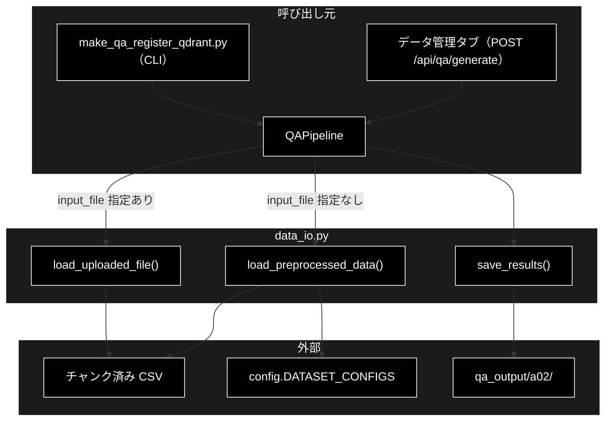
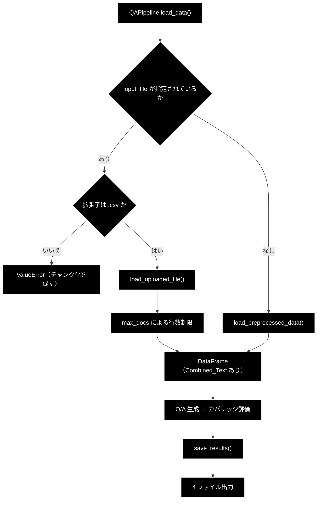
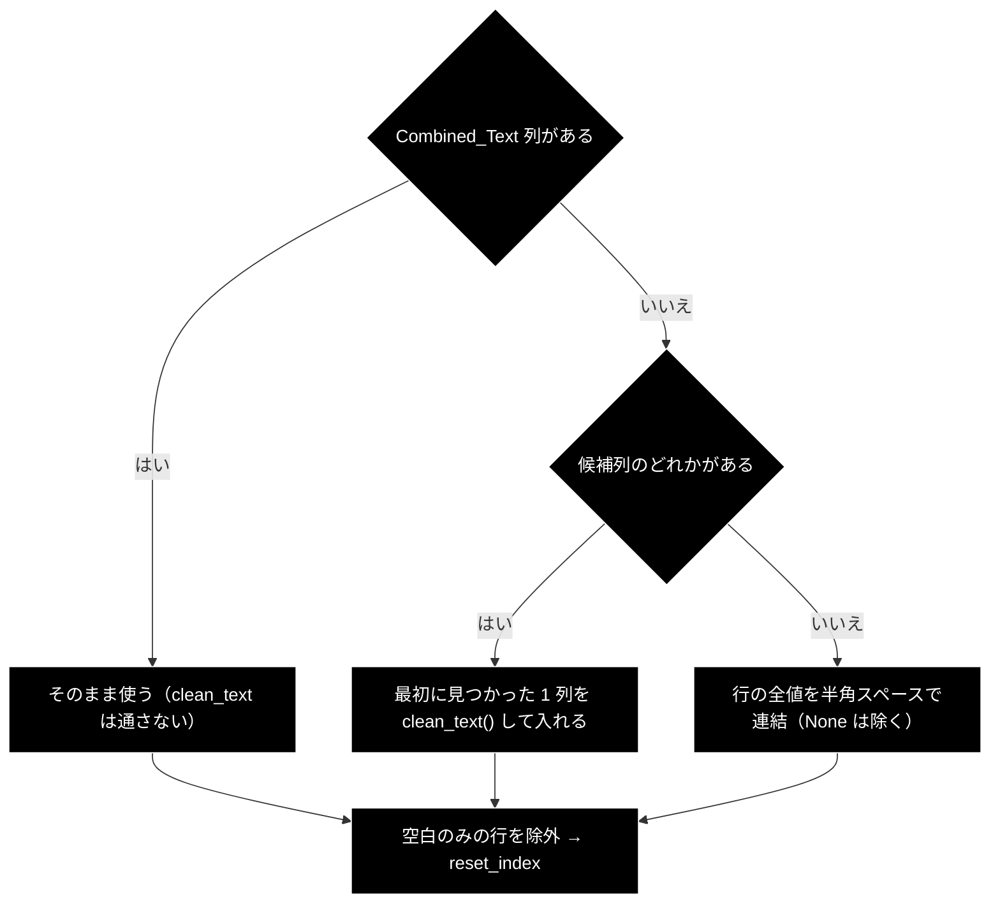

# data_io.py 完全ガイド

**Version 1.0** | 最終更新: 2026-09-21

## 概要

`qa_generation/data_io.py` は、**Q/A 生成パイプラインの入口（データ読み込み）と出口（結果保存）を担うモジュール**です。LLM も Embedding も呼ばず、ファイル I/O と `pandas.DataFrame` の整形だけを行います。

`QAPipeline`（`qa_generation/pipeline.py`）から**遅延 import** で呼ばれる現役経路です。CLI（`qa_qdrant/make_qa_register_qdrant.py`）と「データ管理」タブの Q/A 作成は、どちらも `QAPipeline` を経由してこのモジュールに到達します。

### 主な責務

- 任意形式のローカルファイル（CSV / TXT / JSON / JSONL）を `DataFrame` へ読み込む
- 読み込んだ `DataFrame` に **`Combined_Text` 列**を保証する（無ければ候補列から生成する）
- データセット名（`DATASET_CONFIGS` のキー）から前処理済み CSV を解決して読み込む
- 実ファイルが無いときに**タイムスタンプ付きファイルを自動選択**する
- Q/A ペア・カバレッジ結果・サマリーを 4 ファイルへ保存する

### 各責務対応の関数

| # | 責務 | 対応関数 |
|---|---|---|
| 1 | 任意形式のローカルファイル読み込み | `load_uploaded_file()` |
| 2 | `Combined_Text` 列の保証 | `load_uploaded_file()`（内部処理） |
| 3 | データセット名からの解決・読み込み | `load_preprocessed_data()` |
| 4 | タイムスタンプ付きファイルの自動選択 | `load_preprocessed_data()`（内部処理） |
| 5 | 結果の保存（4 ファイル） | `save_results()` |

### 主要機能一覧

| 機能 | 説明 |
|---|---|
| `load_uploaded_file(file_path)` | ローカルファイルを読み、`Combined_Text` 列を持つ `DataFrame` を返す |
| `load_preprocessed_data(dataset_type)` | `DATASET_CONFIGS` からファイルを解決して読む |
| `save_results(qa_pairs, coverage_results, dataset_type, output_dir)` | JSON / CSV / カバレッジ / サマリーの 4 ファイルを書き出す |

---

## 目次

1. [アーキテクチャ](#アーキテクチャ)
2. [関数一覧](#関数一覧)
3. [IPO詳細（Input/Process/Output）](#ipo詳細inputprocessoutput)
4. [Combined_Text 列の解決規則](#combined_text-列の解決規則)
5. [タイムスタンプ付きファイルの自動選択](#タイムスタンプ付きファイルの自動選択)
6. [出力ファイルの仕様](#出力ファイルの仕様)
7. [使用方法](#使用方法)
8. [注意点](#注意点)
9. [関連モジュール](#関連モジュール)
10. [変更履歴](#変更履歴)

---

## アーキテクチャ

### パイプライン内の位置づけ



### 処理フロー概要



> 📌 **`max_docs` による行数制限は `QAPipeline` 側**（`pipeline.py:148`）で行う。
> `load_uploaded_file()` 自体に上限の概念は無い。

---

## 関数一覧

| 関数 | 行 | 戻り値 | 例外 |
|---|---:|---|---|
| `load_uploaded_file()` | 20 | `pd.DataFrame` | `FileNotFoundError` / `ValueError` |
| `load_preprocessed_data()` | 76 | `pd.DataFrame` | `ValueError` / `FileNotFoundError` |
| `save_results()` | 107 | `Dict[str, str]` | （握りつぶさず伝播） |

いずれもモジュールレベルの関数で、クラスは持たない。`__all__` は定義していない。

---

## IPO詳細（Input/Process/Output）

### load_uploaded_file()

任意形式のローカルファイルを読み込み、**`Combined_Text` 列を必ず持つ** `DataFrame` を返す。

```python
def load_uploaded_file(file_path: str) -> pd.DataFrame
```

| 区分 | 項目 | 内容 |
|---|---|---|
| **Input** | `file_path` | 読み込むファイルのパス（`str`） |
| | 対応拡張子 | `csv` / `txt` / `text` / `json` / `jsonl` |
| **Process** | 1 | `Path.exists()` を確認。無ければ `FileNotFoundError` |
| | 2 | 拡張子（小文字・先頭のドット除去）で分岐して読み込む |
| | 3 | `Combined_Text` 列が無ければ候補列から生成する（[次章](#combined_text-列の解決規則)） |
| | 4 | `Combined_Text` が空白のみの行を除外 |
| | 5 | `reset_index(drop=True)` で連番を振り直す |
| **Output** | 戻り値 | `Combined_Text` 列を持つ `pd.DataFrame` |
| | 例外 | 未対応拡張子 / 不正な JSON 構造 → `ValueError`（ログ出力後に再 raise） |

**形式別の読み込み方法**

| 拡張子 | 読み込み | 備考 |
|---|---|---|
| `csv` | `pd.read_csv()` | 区切り文字・エンコーディングは pandas 既定 |
| `txt` / `text` | 1 行 1 レコード | 空行を除外し `text` 列へ入れる |
| `json` | `json.load()` | `list` → そのまま、`dict` → 1 行の `DataFrame`。それ以外は `ValueError` |
| `jsonl` | 1 行 1 JSON | 空行はスキップ |

### load_preprocessed_data()

データセット名から前処理済み CSV を解決して読み込む。

```python
def load_preprocessed_data(dataset_type: str) -> pd.DataFrame
```

| 区分 | 項目 | 内容 |
|---|---|---|
| **Input** | `dataset_type` | `config.DATASET_CONFIGS` のキー（例: `wikipedia_ja_5per`） |
| **Process** | 1 | `DATASET_CONFIGS.get()` で設定を取得。無ければ `ValueError` |
| | 2 | `config["file"]` のパスを確認。無ければタイムスタンプ付きを探す（[後述](#タイムスタンプ付きファイルの自動選択)） |
| | 3 | `pd.read_csv()` で読み込む |
| | 4 | `config["text_column"]` の存在を確認。無ければ `ValueError` |
| | 5 | そのカラムが `NaN` / 空白のみの行を除外 |
| **Output** | 戻り値 | `pd.DataFrame`（**`reset_index()` はしない**） |

> ⚠️ **`Combined_Text` 列は作らない。** 参照するのは `config["text_column"]` であり、
> データセットによって `Combined_Text` だったり `text` だったりする
> （`config.py::DatasetConfig.DATASETS`）。`load_uploaded_file()` と戻り値の形が
> 揃っていない点に注意。

### save_results()

Q/A ペアとカバレッジ結果を 4 ファイルへ保存する。

```python
def save_results(
    qa_pairs: List[Dict],
    coverage_results: Dict,
    dataset_type: str,
    output_dir: str = "qa_output/a02",
) -> Dict[str, str]
```

| 区分 | 項目 | 内容 |
|---|---|---|
| **Input** | `qa_pairs` | Q/A ペアの `dict` リスト |
| | `coverage_results` | カバレッジ評価の結果（`evaluation.analyze_coverage()` の戻り値） |
| | `dataset_type` | ファイル名に埋め込むデータセット識別子 |
| | `output_dir` | 出力先（既定 `qa_output/a02`。`QAPipeline` は自身の `output_dir` を渡す） |
| **Process** | 1 | `mkdir(parents=True, exist_ok=True)` で出力先を作成 |
| | 2 | `datetime.now()` から `YYYYmmdd_HHMMSS` のタイムスタンプを作る |
| | 3 | Q/A を JSON（`ensure_ascii=False, indent=2`）と CSV の 2 形式で書く |
| | 4 | カバレッジを**浅いコピー**し、`uncovered_chunks` を軽量な要約へ置き換えて書く |
| | 5 | 件数・カバレッジ率・出力先を含むサマリー JSON を書く |
| **Output** | 戻り値 | `{"qa_json", "qa_csv", "coverage", "summary"}` の 4 パス（`str`） |

**戻り値例**

```python
{
    "qa_json": "qa_output/a02/qa_pairs_cc_news_20260921_041500.json",
    "qa_csv":  "qa_output/a02/qa_pairs_cc_news_20260921_041500.csv",
    "coverage": "qa_output/a02/coverage_cc_news_20260921_041500.json",
    "summary":  "qa_output/a02/summary_cc_news_20260921_041500.json",
}
```

---

## Combined_Text 列の解決規則

`load_uploaded_file()` は、下流（`QAPipeline._load_chunks_from_csv()` など）が
`Combined_Text` を前提にしているため、**無ければ必ず作る**。



**候補列の探索順（先に見つかったものを採用）**

| 順 | 列名 |
|---:|---|
| 1 | `text` |
| 2 | `content` |
| 3 | `body` |
| 4 | `document` |
| 5 | `answer` |
| 6 | `question` |

`clean_text()`（`helper.helper_text`。`helper.helper_rag` が再エクスポート）は、
`None` / pandas NA を空文字にし、改行を半角スペースへ置換したうえで連続空白を 1 つに畳み、
前後の空白を除去する。

> ⚠️ **全列連結のフォールバックだけ `clean_text()` を通らない。**
> 候補列が 1 つも無かった場合は素の `str(v)` を連結するだけなので、改行がそのまま残る。

---

## タイムスタンプ付きファイルの自動選択

`load_preprocessed_data()` は、設定の `file` が存在しないとき諦めずに探す。

| 手順 | 内容 |
|---|---|
| 1 | `file` を `stem` と `suffix` に分解する |
| 2 | 同じディレクトリで `{stem}_*{suffix}` を `glob` する |
| 3 | 1 件も無ければ `FileNotFoundError` |
| 4 | **ファイル名で昇順ソートし、最後の 1 件**を採用してログに出す |

例: `OUTPUT/preprocessed_wikipedia_ja.csv` が無い場合、
`OUTPUT/preprocessed_wikipedia_ja_20260920_101500.csv` が拾われる。

> 📌 **名前順であって更新日時順ではない。** タイムスタンプが
> `YYYYmmdd_HHMMSS` 形式なら名前順＝時刻順になるので実用上は「最新」になるが、
> 別形式のサフィックスを付けると直感と食い違う。
> チャンク化の既定が固定ファイル名で、`--timestamp` を付けたときだけ
> 日時サフィックスが付く理由でもある（CLAUDE.md §8.2）。

---

## 出力ファイルの仕様

| ファイル | 内容 |
|---|---|
| `qa_pairs_{dataset}_{ts}.json` | Q/A ペア全件（`ensure_ascii=False`・インデント 2） |
| `qa_pairs_{dataset}_{ts}.csv` | 同じ内容を `DataFrame` 化した CSV（`index=False`） |
| `coverage_{dataset}_{ts}.json` | カバレッジ結果。`uncovered_chunks` のみ要約へ置換 |
| `summary_{dataset}_{ts}.json` | 件数・カバレッジ率・上 3 ファイルのパス |

**`uncovered_chunks` の要約**

元のカバレッジ結果は未カバーチャンクの本文を丸ごと抱えているため、そのままでは
巨大な JSON になる。保存時に次の 4 キーへ畳む。

| キー | 由来 |
|---|---|
| `chunk_id` | `uc["chunk"].get("id", "")` |
| `similarity` | `uc["similarity"]` |
| `gap` | `uc["gap"]` |
| `text_preview` | `uc["chunk"]["text"]` の**先頭 200 文字 + `...`** |

> 📌 置き換えは `coverage_results.copy()`（浅いコピー）に対するキーの差し替えなので、
> **呼び出し元が持っている元の辞書は書き換わらない**。

**サマリー JSON の構造**

```json
{
  "dataset_type": "cc_news",
  "dataset_name": "CC-News（英語ニュース）",
  "generated_at": "20260921_041500",
  "total_qa_pairs": 1240,
  "coverage_rate": 0.72,
  "files": {
    "qa_json": "qa_output/a02/qa_pairs_cc_news_20260921_041500.json",
    "qa_csv": "qa_output/a02/qa_pairs_cc_news_20260921_041500.csv",
    "coverage": "qa_output/a02/coverage_cc_news_20260921_041500.json"
  }
}
```

`dataset_name` は `DATASET_CONFIGS` に無い識別子だと `dataset_type` と同じ値になる。

---

## 使用方法

### チャンク済み CSV を読む

```python
from qa_generation.data_io import load_uploaded_file

df = load_uploaded_file("output_chunked/cc_news_1per_chunks.csv")
print(len(df), df.columns.tolist())   # Combined_Text が必ず含まれる
```

### データセット名から読む

```python
from qa_generation.data_io import load_preprocessed_data

df = load_preprocessed_data("wikipedia_ja_5per")
# 実ファイルが無ければ wikipedia_ja_5per_chunks_cleaned_*.csv を自動選択
```

### 結果を保存する

```python
from qa_generation.data_io import save_results

paths = save_results(
    qa_pairs=qa_pairs,
    coverage_results=coverage,
    dataset_type="cc_news",
    output_dir="qa_output/a02",
)
print(paths["summary"])
```

### パイプライン経由（通常はこちら）

```python
from qa_generation.pipeline import QAPipeline

# dataset_name と input_file は排他（両方渡すと ValueError）
pipeline = QAPipeline(
    input_file="output_chunked/cc_news_1per_chunks.csv",
    max_docs=100,
)
result = pipeline.run()   # load_data() → ... → save() の中で本モジュールが呼ばれる
```

> 📌 **`save_results()` へ渡る `dataset_type` は `QAPipeline` の `config["type"]`。**
> `dataset_name` 指定なら `DATASET_CONFIGS` の `type`、`input_file` 指定なら
> **入力ファイルの stem**（上の例では `cc_news_1per_chunks`）になる。後者は
> `DATASET_CONFIGS` に無いキーなので、サマリーの `dataset_name` は
> `dataset_type` と同じ値になる。

---

## 注意点

| # | 内容 |
|---|---|
| 1 | **`QAPipeline` からは CSV しか渡ってこない。** `pipeline.py:135` が `.csv` 以外を `ValueError` で弾くため、`txt` / `json` / `jsonl` の分岐は直接呼び出したときだけ通る |
| 2 | **2 つのローダで戻り値の形が違う。** `load_uploaded_file()` は `Combined_Text` を保証するが、`load_preprocessed_data()` は `config["text_column"]` を見るだけで `Combined_Text` を作らない |
| 3 | **`reset_index()` の有無も違う。** 前者はする、後者はしない |
| 4 | **例外はログに出してから再 raise する。** 握りつぶさないので、呼び出し元は必ず失敗を検知できる |
| 5 | **`save_results()` は上書きしない。** ファイル名に秒までのタイムスタンプが入るため、同一秒内の再実行以外で衝突しない |
| 6 | **LLM・Embedding を呼ばない。** プロバイダ（Ollama / Gemini）に依存しないので、`ollama serve` も `GOOGLE_API_KEY` も不要 |

---

## 関連モジュール

| モジュール | 関係 |
|---|---|
| `qa_generation/pipeline.py` | 唯一の本番呼び出し元。`load_data()` と `save()` から**遅延 import** する |
| `config.py` | `DATASET_CONFIGS`（`DatasetConfig.DATASETS` から生成される後方互換の辞書）を提供 |
| `helper/helper_rag.py` | `clean_text` の再エクスポート元。**import すると `services.token_service` まで芋づるで読み込まれる**（`helper_rag.py:115`）ので、本モジュールの import は見た目より重い |
| `helper/helper_text.py` | `clean_text` の実体 |
| `qa_generation/evaluation.py` | `save_results()` が受け取るカバレッジ結果の生成元 |
| `services/__init__.py` | 「データセット読み込みの現役経路は `qa_generation/data_io.py`」と明記している（旧 `dataset_service.py` は削除済み） |

---

## 変更履歴

| Version | 日付 | 内容 |
|---|---|---|
| 1.0 | 2026-09-21 | 初版作成。実装（162 行）を読み起こして IPO・`Combined_Text` の解決規則・タイムスタンプ自動選択・出力 4 ファイルの仕様を記述。索引 `qa_generation/docs/README.md` §6 の残タスク 1（文書欠落）に対応 |
