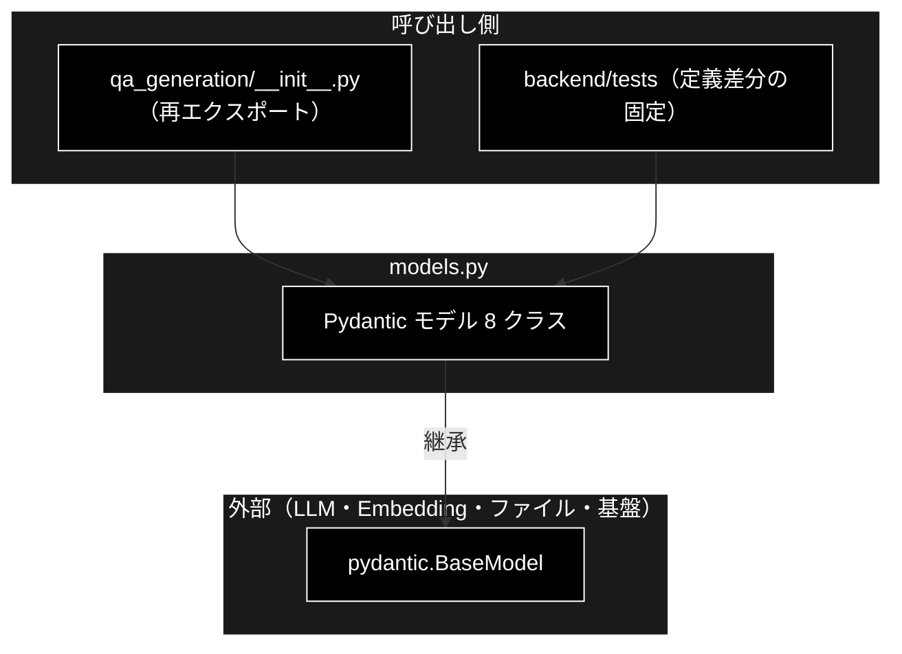

# models.py - Q/A データモデル ドキュメント

**Version 1.2** | 最終更新: 2026-09-24

---

## 目次

1. [概要](#概要)
2. [アーキテクチャ構成図](#1-アーキテクチャ構成図)
3. [モジュール構成図](#2-モジュール構成図)
4. [⚠️ 同名クラスが 3 箇所にある](#3-️-同名クラスが-3-箇所にある)
5. [クラス・関数一覧表](#4-クラス関数一覧表)
6. [クラス・関数 IPO詳細](#5-クラス関数-ipo詳細)
7. [設定・定数（QAGenerationConsiderations の既定値）](#6-設定定数qagenerationconsiderations-の既定値)
8. [エクスポート](#7-エクスポート)
9. [関連モジュール](#8-関連モジュール)
10. [変更履歴](#9-変更履歴)

---

## 概要

`qa_generation/models.py` は、**Q/A 生成で使う Pydantic データモデルの定義だけを持つモジュール**です。ロジックは一切持たず、LLM も I/O も呼びません。`helper/helper_rag_qa.py` に散在していた 8 クラスを 1 箇所へ集約する目的で作られました（モジュール docstring の「統合元」）。

### 主な責務

- Q/A ペアとそのリストのスキーマを定義する
- Chain-of-Thought 方式の分析結果・Q/A・レスポンスのスキーマを定義する
- LLM 品質向上用の簡易 Q/A スキーマを定義する
- Q/A 生成前のチェックリスト（文書特性・抽出要件・品質基準・Q/A 特性）を定義する

### 各責務対応のモジュール

| # | 責務 | 対応モジュール | 説明 |
|---|---|---|---|
| 1 | Q/A ペアとそのリストのスキーマを定義する | `QAPair` / `QAPairsList` | 質問・回答＋メタ 3 項目 |
| 2 | Chain-of-Thought 方式の分析結果・Q/A・レスポンスのスキーマを定義する | `ChainOfThoughtAnalysis` / `ChainOfThoughtQAPair` / `ChainOfThoughtResponse` | 推論過程と信頼度を持つ |
| 3 | LLM 品質向上用の簡易 Q/A スキーマを定義する | `EnhancedQAPair` / `EnhancedQAPairsList` | 質問・回答だけの最小モデル |
| 4 | Q/A 生成前のチェックリスト（文書特性・抽出要件・品質基準・Q/A 特性）を定義する | `QAGenerationConsiderations` | 4 つの設定辞書（§6） |

### 主要機能一覧

| クラス | 説明 |
|---|---|
| `QAPair` | Q/A ペアの基本モデル（質問・回答＋メタ 3 項目） |
| `QAPairsList` | `QAPair` のリスト |
| `ChainOfThoughtAnalysis` | CoT の文書分析結果 |
| `ChainOfThoughtQAPair` | 推論過程と信頼度を持つ Q/A ペア |
| `ChainOfThoughtResponse` | 分析＋Q/A リストの複合 |
| `EnhancedQAPair` | 質問・回答だけの最小モデル |
| `EnhancedQAPairsList` | `EnhancedQAPair` のリスト |
| `QAGenerationConsiderations` | Q/A 生成前のチェックリスト（4 つの設定辞書） |

---

## 1. アーキテクチャ構成図

### 1.1 システム全体構成



### 1.2 データフロー

1. 利用側が `qa_generation`（または `qa_generation.models`）からモデルを import する
2. Pydantic がフィールドの型・範囲制約を検証してインスタンスを作る
3. 構造化出力のスキーマとして使う場合は `model_json_schema()` で JSON Schema を得る
4. ※ ロジック・I/O・LLM 呼び出しは持たない

---

## 2. モジュール構成図

```mermaid
flowchart TB
    subgraph Basic["基本Q/Aペアモデル"]
        QAPair["QAPair"]
        QAPairsList["QAPairsList"]
    end
    subgraph CoT["Chain-of-Thought関連モデル"]
        Analysis["ChainOfThoughtAnalysis"]
        CoTPair["ChainOfThoughtQAPair"]
        CoTResp["ChainOfThoughtResponse"]
    end
    subgraph Enh["拡張Q/Aペアモデル"]
        EPair["EnhancedQAPair"]
        EList["EnhancedQAPairsList"]
    end
    subgraph Cfg["Q/A生成要件・設定モデル"]
        Consider["QAGenerationConsiderations"]
    end
    QAPairsList -->|"List[QAPair]"| QAPair
    CoTResp -->|"analysis"| Analysis
    CoTResp -->|"List[ChainOfThoughtQAPair]"| CoTPair
    EList -->|"List[EnhancedQAPair]"| EPair
classDef default fill:#000,stroke:#fff,color:#fff
classDef subgraphStyle fill:#1a1a1a,stroke:#fff,color:#fff
class QAPair,QAPairsList,Analysis,CoTPair,CoTResp,EPair,EList,Consider default
style Basic fill:#1a1a1a,stroke:#fff,color:#fff
style CoT fill:#1a1a1a,stroke:#fff,color:#fff
style Enh fill:#1a1a1a,stroke:#fff,color:#fff
style Cfg fill:#1a1a1a,stroke:#fff,color:#fff
```



`QAGenerationConsiderations` はどのモデルも参照せず、独立している。

---

## 3. ⚠️ 同名クラスが 3 箇所にある

**`QAPair` という名前のクラスは、このリポジトリに 3 つ存在する。互いに別物である。**

| 定義場所 | 使われ方 | フィールド |
|---|---|---|
| **`models.py`（リポジトリ直下）** | **現役**。`services/qa_service.py` が `from models import QAPair` で使う | `question` / `answer` / `question_type` / `difficulty_level` ほか |
| **`qa_generation/models.py`（本モジュール）** | `qa_generation/__init__.py` が再エクスポートするだけで、**ほかに import 元が無い**（2026-09-21 実測） | `question` / `answer` / `question_type` / `difficulty` / `source_span` |
| `helper/helper_rag_qa.py` | 統合元として残っている旧定義 | 同系だが独立 |

> ⚠️ **`from models import QAPair` と `from qa_generation.models import QAPair` は別のクラスを指す。**
> 前者は `difficulty_level`、後者は `difficulty` と `source_span` を持つ。
> import 文を「短く」書き換えると、フィールド名が合わずに壊れる。
>
> 📌 本モジュールに**本番の利用者はいない**（`qa_generation/__init__.py` 経由の再エクスポートのみ）。
> `services/qa_service.py` が使うのは直下の `models.py` である。
>
> 📌 **統合はしない**（2026-09-21 の判断）。本モジュールのクラスは
> `qa_generation.__all__` に載っている公開 API なので、削除も直下 `models.py` への
> 寄せ替えも**破壊的変更**になる。フィールドが違うため単純な別名にもできない
> （`difficulty_level` ⇔ `difficulty` + `source_span`）。
> 代わりに、3 箇所すべての docstring へ相互参照の警告を入れ、差分を
> `backend/tests/qa_generation/test_qa_pair_definitions.py`（4 件）で固定した。
> **片側のフィールドだけが変わるとテストが落ちる**ので、気づかないままの乖離を防げる。

---

## 4. クラス・関数一覧表

| クラス | 基底 | 行 | 必須フィールド |
|---|---|---:|---|
| `QAPair` | `BaseModel` | 27 | `question` / `answer` |
| `QAPairsList` | `BaseModel` | 36 | なし（既定は空リスト） |
| `ChainOfThoughtAnalysis` | `BaseModel` | 45 | なし |
| `ChainOfThoughtQAPair` | `BaseModel` | 52 | `question` / `answer` |
| `ChainOfThoughtResponse` | `BaseModel` | 60 | なし |
| `EnhancedQAPair` | `BaseModel` | 70 | `question` / `answer` |
| `EnhancedQAPairsList` | `BaseModel` | 76 | なし |
| `QAGenerationConsiderations` | `BaseModel` | 85 | なし（4 辞書すべて既定値あり） |

---

## 5. クラス・関数 IPO詳細

> データモデルのみのモジュールのため、IPO の代わりに各クラスのフィールド定義を示す。

### 5.1 使用例

#### 5.1.1 基本

```python
from qa_generation.models import QAPair, QAPairsList

pair = QAPair(
    question="AES-256の鍵長は？",
    answer="256ビットです。",
    question_type="fact",
    difficulty="easy",
    source_span="256ビットの鍵長を持ちます",
)
lst = QAPairsList(qa_pairs=[pair])
print(lst.model_dump())
```

#### 5.1.2 構造化出力のスキーマとして使う

```python
from helper.helper_llm import create_llm_client
from qa_generation.models import QAPairsList

client = create_llm_client(provider="ollama")
result = client.generate_structured(
    prompt="次のテキストからQ/Aを作ってください: ...",
    response_schema=QAPairsList,   # オブジェクト型（配列トップレベルは不可）
)
```

> 📌 Ollama の構造化出力は**オブジェクトのみ**を返せる。`List[QAPair]` を直接
> スキーマにはできないので、`QAPairsList` のように `qa_pairs` キーで包んだ形を使う
> （CLAUDE.md §3「Ollama 固有の落とし穴」）。
> `SmartQAGenerator` が使うのは本モジュールではなく、自前の `SmartQAResult` である。

#### 5.1.3 範囲制約の確認

```python
from pydantic import ValidationError
from qa_generation.models import ChainOfThoughtQAPair

try:
    ChainOfThoughtQAPair(question="Q", answer="A", confidence=1.5)
except ValidationError as e:
    print(e)   # confidence は 0.0〜1.0
```

### 5.2 QAPair

Q/A ペアの基本モデル。

| フィールド | 型 | 既定 | 説明 |
|---|---|---|---|
| `question` | `str` | **必須** | 質問文 |
| `answer` | `str` | **必須** | 回答文 |
| `question_type` | `str` | `"fact"` | 質問タイプ（`fact` / `reason` / `comparison` / `application`） |
| `difficulty` | `str` | `"medium"` | 難易度（`easy` / `medium` / `hard`） |
| `source_span` | `str` | `""` | 回答の根拠となる元テキストの一部 |

> 📌 `question_type` / `difficulty` は**自由文字列**である。`Enum` でも `Literal` でもないため、
> 説明にない値を入れてもバリデーションは通る。

### 5.3 QAPairsList

| フィールド | 型 | 既定 | 説明 |
|---|---|---|---|
| `qa_pairs` | `List[QAPair]` | 空リスト | Q/A ペアのリスト |

### 5.4 ChainOfThoughtAnalysis

| フィールド | 型 | 既定 | 説明 |
|---|---|---|---|
| `main_topics` | `List[str]` | 空リスト | 主要トピック |
| `key_concepts` | `List[str]` | 空リスト | 重要概念 |
| `information_density` | `str` | `"medium"` | 情報密度（`low` / `medium` / `high`） |

### 5.5 ChainOfThoughtQAPair

| フィールド | 型 | 既定 | 制約 | 説明 |
|---|---|---|---|---|
| `question` | `str` | **必須** | — | 質問文 |
| `answer` | `str` | **必須** | — | 回答文 |
| `reasoning` | `str` | `""` | — | 推論過程 |
| `confidence` | `float` | `0.8` | `0.0 <= x <= 1.0` | 信頼度スコア |

`confidence` は**このモジュールで唯一の範囲制約付きフィールド**で、範囲外は
`ValidationError` になる。

### 5.6 ChainOfThoughtResponse

| フィールド | 型 | 既定 | 説明 |
|---|---|---|---|
| `analysis` | `ChainOfThoughtAnalysis` | 既定インスタンス | 分析結果 |
| `qa_pairs` | `List[ChainOfThoughtQAPair]` | 空リスト | Q/A ペア |

### 5.7 EnhancedQAPair / EnhancedQAPairsList

| クラス | フィールド | 型 | 既定 |
|---|---|---|---|
| `EnhancedQAPair` | `question` / `answer` | `str` | **必須** |
| `EnhancedQAPairsList` | `qa_pairs` | `List[EnhancedQAPair]` | 空リスト |

「LLM 品質向上用」の最小スキーマで、メタ情報を持たない。

---

## 6. 設定・定数（QAGenerationConsiderations の既定値）

4 つの辞書フィールドをまとめて持つ設定モデル。いずれも `default_factory` で生成されるため、
インスタンスごとに独立した辞書になる（クラス間で共有されない）。

### 6.1 document_characteristics（文書特性）

| キー | 既定 | 意味 |
|---|---|---|
| `domain` | `"general"` | 専門分野 |
| `text_type` | `"informative"` | 説明文・対話 など |
| `complexity` | `"medium"` | 複雑度 |
| `length` | `"medium"` | 文書長 |

### 6.2 extraction_requirements（抽出要件）

| キー | 既定 | 意味 |
|---|---|---|
| `focus_areas` | `[]` | 重点領域 |
| `key_entities` | `[]` | 重要エンティティ |
| `ignore_sections` | `[]` | 無視するセクション |

### 6.3 quality_standards（品質基準）

| キー | 既定 | 意味 |
|---|---|---|
| `min_answer_length` | `10` | 最小回答文字数 |
| `max_answer_length` | `200` | 最大回答文字数 |
| `require_source_span` | `True` | 出典必須 |
| `diversity_threshold` | `0.7` | 多様性閾値 |

### 6.4 qa_characteristics（Q/A 特性）

| キー | 既定 |
|---|---|
| `question_types` | `["fact", "reason", "comparison", "application"]` |
| `difficulty_distribution` | `{"easy": 0.3, "medium": 0.5, "hard": 0.2}` |
| `answer_formats` | `["短答", "説明", "リスト", "段落"]` |
| `coverage_targets` | `{"minimum": 0.3, "optimal": 0.6, "comprehensive": 0.8}` |

> ⚠️ **これらの既定値を読んで動くコードは現在存在しない。** `QAGenerationConsiderations` は
> 定義されているだけで、生成パイプライン（`SmartQAGenerator` / `QAPipeline`）は
> 参照していない。実際の Q/A 数の決定は `SmartQAGenerator.COMBINED_PROMPT` の
> 基準（0〜5 個）が行う。

---

## 7. エクスポート

```python
__all__ = [
    # 基本モデル
    "QAPair",
    "QAPairsList",
    # Chain-of-Thoughtモデル
    "ChainOfThoughtAnalysis",
    "ChainOfThoughtQAPair",
    "ChainOfThoughtResponse",
    # 拡張モデル
    "EnhancedQAPair",
    "EnhancedQAPairsList",
    # 設定モデル
    "QAGenerationConsiderations",
]
```

8 クラスすべてを公開しており、`qa_generation/__init__.py` も同じ 8 件を再エクスポートする。

---

## 8. 関連モジュール

| モジュール | 関係 |
|---|---|
| `qa_generation/__init__.py` | 8 クラスすべてを再エクスポートする**唯一の import 元** |
| `models.py`（リポジトリ直下） | **別物の同名クラス群**。`services/qa_service.py` が使う現役の定義 |
| `helper/helper_rag_qa.py` | 統合元。同系のクラスが今も定義されている |
| `qa_generation/smart_qa_generator.py` | Q/A 生成の実装。**本モジュールを使わず** `SmartQAPair` / `SmartQAResult` を自前で持つ |

---

## 9. 変更履歴

| Version | 日付 | 内容 |
|---|---|---|
| 1.2 | 2026-09-24 | 基本フォーマット `a_class_method_md_format.md` の章構成へ組み替え。概要に「主な責務」と「各責務対応のモジュール」（1:1）を置き、`## 1. アーキテクチャ構成図`（3 層＋データフロー）を新設。既存の構成図は `## 2. モジュール構成図` へ、使用方法は IPO 詳細の冒頭（`### 5.1 使用例`）へ移した。固有の解説章（「⚠️ 同名クラスが 3 箇所にある」）は §1.3 に従い一覧表の前に置き、章・小節に番号を振った。本文の内容は変えていない |
| 1.1 | 2026-09-21 | 3 重定義の扱いを**「統合しない」で決着**。3 箇所の docstring に相互参照の警告を入れ、差分を固定する `test_qa_pair_definitions.py`（4 件）を追加した |
| 1.0 | 2026-09-21 | 初版作成。実装（155 行・8 クラス）を読み起こしてフィールドと既定値を記述。あわせて**同名 `QAPair` が 3 箇所にある**こと、本モジュールの本番利用者が `qa_generation/__init__.py` 以外に無いことを実測して明記した。索引 `qa_generation/docs/README.md` §6 の残タスク 1（文書欠落）に対応 |
