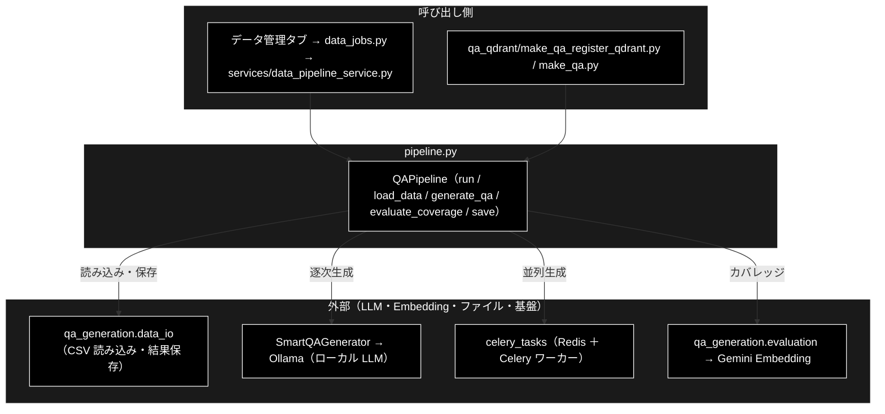

# pipeline.py - Q/A 生成パイプライン ドキュメント

**Version 1.6** | 最終更新: 2026-09-26

---

## 目次

1. [概要](#概要)
2. [アーキテクチャ構成図](#1-アーキテクチャ構成図)
3. [モジュール構成図](#2-モジュール構成図)
4. [クラス・関数一覧表](#3-クラス関数一覧表)
5. [クラス・関数 IPO詳細](#4-クラス関数-ipo詳細)
6. [設定・定数（パラメータリファレンス）](#5-設定定数パラメータリファレンス)
7. [使用例（応用ワークフロー）](#6-使用例応用ワークフロー)
8. [出力ファイル](#7-出力ファイル)
9. [トラブルシューティング](#8-トラブルシューティング)
10. [関連モジュール](#9-関連モジュール)
11. [ベストプラクティス](#10-ベストプラクティス)
12. [v3.0 の変更点](#11-v30-の変更点)
13. [変更履歴](#12-変更履歴)

---

## 概要

`qa_generation/pipeline.py` は、**チャンク済みCSVからQ/A生成、カバレッジ分析、結果保存までを一貫して実行するパイプライン制御モジュール**です。

### 主な責務

- 入力を検証し設定を解決する
- チャンク済み CSV を読み込みチャンクリストへ変換する
- Q/A を生成する（逐次 / Celery 並列）
- 中断時の再開に備えて進捗を記録する
- カバレッジを分析する
- 結果を保存する
- 一連の工程を 1 回で実行する

### 各責務対応のモジュール

| # | 責務 | 対応モジュール | 説明 |
|---|---|---|---|
| 1 | 入力を検証し設定を解決する | `QAPipeline.__init__()` / `_validate_inputs()` / `_load_config()` | データセット名と入力ファイルの排他チェック、`DATASET_CONFIGS` からの設定取得。種別 `type` は入力ファイル名（拡張子なし）かデータセット名（`DATASET_CONFIGS` に `type` キーが無いため補う。出力名・チャンク ID・途中経過ファイル `qa_progress_<種別>.jsonl` に使う） |
| 2 | チャンク済み CSV を読み込みチャンクリストへ変換する | `load_data()` / `_load_chunks_from_csv()` | `data_io` で読み込み、`text` / `Combined_Text` 列からチャンク辞書を作る |
| 3 | Q/A を生成する（逐次 / Celery 並列） | `generate_qa()` / `_generate_sync()` / `_generate_with_celery()` | `SmartQAGenerator`（Ollama（ローカル LLM））を直接、または Celery ワーカー経由で呼ぶ |
| 4 | 中断時の再開に備えて進捗を記録する | `_load_progress()` / `_append_progress()` / `_clear_progress()` | チャンク単位の生成結果を進捗ファイルへ追記・復元する |
| 5 | カバレッジを分析する | `evaluate_coverage()` | `evaluation.analyze_coverage()` へ委譲 |
| 6 | 結果を保存する | `save()` | `data_io.save_results()` へ委譲（Q/A・カバレッジ・サマリー） |
| 7 | 一連の工程を 1 回で実行する | `run()` | 読み込み → 生成 → 分析 → 保存を順に実行し、結果辞書を返す |

### 主要機能一覧

| 機能 | 説明 |
|---|---|
| `QAPipeline(dataset_name=..., input_file=..., model=..., output_dir=...)` | パイプラインを構成する |
| `run(use_celery=..., celery_workers=..., batch_chunks=..., analyze_coverage=...)` | 全工程を実行するメイン API |
| `generate_qa(chunks, ...)` | Q/A 生成のみを行う |
| `evaluate_coverage(chunks, qa_pairs, ...)` | カバレッジ分析のみを行う |

### 主な特徴

- **チャンク済みCSV専用**: 前段処理（`csv_text_to_chunks_text_csv.py`）で作成されたチャンクCSVを入力として使用
- **SmartQAGenerator統合**: コンテンツを分析し、適切なQ/A数を動的に決定
- **Celery並列処理対応**: 大規模データセットの高速処理
- **多段階カバレッジ分析**: Strict/Standard/Lenientの3段階で評価
- **チャンク特性分析**: 長さ別・位置別のカバレッジ分析

### 前提条件

- 入力CSVは既にチャンク済み（`csv_text_to_chunks_text_csv.py`で処理済み）
- チャンクCSVには `text` または `Combined_Text` カラムが必要

---

## 1. アーキテクチャ構成図

### 1.1 システム全体構成



### 1.2 データフロー

1. Web（データ管理タブ）または CLI が `QAPipeline` を構成し `run()` を呼ぶ
2. `load_data()` が `data_io` でチャンク済み CSV を読み、`_load_chunks_from_csv()` がチャンクリストへ変換する
3. `generate_qa()` が逐次なら `SmartQAGenerator`（Ollama（ローカル LLM））、並列なら Celery ワーカーへ投入して Q/A を集める
4. `evaluate_coverage()` が `evaluation.analyze_coverage()` でカバレッジを測る（任意）
5. `save()` が `data_io.save_results()` で Q/A・カバレッジ・サマリーを書き出し、結果辞書を返す

---

## 2. モジュール構成図

### 2.1 アーキテクチャ概要

```
csv_text_to_chunks_text_csv.py（前段処理）
              ↓
        チャンク済みCSV
              ↓
┌───────────────────────────────────────┐
│        pipeline.py (v3.0)             │
├───────────────────────────────────────┤
│ [1/3] load_data()                     │  ← CSV読み込み
│ [2/3] _load_chunks_from_csv()         │  ← チャンクリストに変換
│ [3/3] generate_qa()                   │  ← Q/A生成（SmartQAGenerator）
│       evaluate_coverage()             │  ← カバレッジ分析
│       save()                          │  ← 結果保存
└───────────────────────────────────────┘
```

### 2.2 システムアーキテクチャ

#### 依存関係

```
QAPipeline
├── qa_generation.data_io
│   ├── load_uploaded_file()         # ローカルファイル読み込み
│   ├── load_preprocessed_data()     # 前処理済みデータ読み込み
│   └── save_results()               # 結果保存
│
├── qa_generation.smart_qa_generator
│   └── SmartQAGenerator             # インテリジェントQ/A生成
│
├── qa_generation.evaluation
│   └── analyze_coverage()           # カバレッジ分析
│
├── celery_tasks                      # ★ 遅延 import（_generate_with_celery 内）
│   ├── submit_unified_qa_generation() # Celeryタスク投入
│   ├── collect_results()              # 結果収集
│   └── check_celery_workers()         # ワーカー確認
│
├── helper.helper_llm
    └── LLMClient                    # LLM操作

```

#### レイヤー構成

```
┌──────────────────────────────────────────┐
│  Application Layer (QAPipeline)          │  ← パイプライン制御
│  - run()                                 │
├──────────────────────────────────────────┤
│  Business Logic Layer                    │
│  ├─ データ読み込み (data_io)               │
│  ├─ Q/A生成 (smart_qa_generator)         │
│  ├─ カバレッジ分析 (evaluation)            │
│  └─ 結果保存 (data_io)                    │
├──────────────────────────────────────────┤
│  Infrastructure Layer                    │
│  ├─ Celery (並列処理)                     │
│  ├─ LLMClient (Ollama / OpenAI 互換 API)  │
│  └─ SemanticCoverage (埋め込み生成)        │
└──────────────────────────────────────────┘
```

---

## 3. クラス・関数一覧表

| メソッド | 種別 | 概要 |
|---|---|---|
| `__init__()` | 公開 | 初期化・入力検証 |
| `load_data()` | 公開 | データセット名 / 入力ファイルから `DataFrame` を読む |
| `generate_qa()` | 公開 | Q/A 生成（逐次 / Celery） |
| `evaluate_coverage()` | 公開 | カバレッジ分析 |
| `save()` | 公開 | 結果保存 |
| `run()` | 公開 | 全工程の実行（メイン） |
| `_validate_inputs()` / `_load_config()` | 内部 | 入力の排他制御・設定解決 |
| `_load_chunks_from_csv()` | 内部 | チャンク CSV → チャンクリスト |
| `_generate_sync()` / `_generate_with_celery()` | 内部 | 逐次生成 / Celery 並列生成 |
| `_progress_path()` / `_load_progress()` / `_append_progress()` / `_clear_progress()` | 内部 | 進捗ファイルの管理（再開用） |

```
QAPipeline
├── __init__()                    # 初期化、入力検証
├── _validate_inputs()            # 入力の排他制御
├── _load_config()                # 設定ロード
│
├── load_data()                   # データ読み込み（データセット/ファイル）
├── _load_chunks_from_csv()       # チャンクCSV→チャンクリスト変換
│
├── generate_qa()                 # Q/A生成（Celery/逐次）
│   ├── _generate_with_celery()   # Celery並列処理
│   └── _generate_sync()          # 逐次処理（SmartQAGenerator使用）
│
├── evaluate_coverage()           # カバレッジ分析
├── save()                        # 結果保存（JSON/CSV）
│
└── run()                         # パイプライン実行 ⭐メイン
```

---

## 4. クラス・関数 IPO詳細

### 4.1 使用例

#### 4.1.1 基本的な使用例

```python
from qa_generation.pipeline import QAPipeline

# チャンク済みCSVからQ/A生成
pipeline = QAPipeline(
    input_file="output_chunked/data_chunks.csv",
    model="gemma4:12b-mlx",
    output_dir="qa_output/pipeline"
)

result = pipeline.run(
    use_celery=True,
    concurrency=8,
)

print(f"生成Q/A数: {result['qa_count']}")
print(f"カバレッジ率: {result['coverage_results']['coverage_rate']:.1%}")
```

#### 4.1.2 データセットモード

```python
# 事前定義されたデータセットを使用
pipeline = QAPipeline(
    dataset_name="wikipedia_ja",
    max_docs=100
)

result = pipeline.run()
```

#### 4.1.3 逐次処理モード（デバッグ用）

```python
pipeline = QAPipeline(input_file="chunks.csv")

result = pipeline.run(
    use_celery=False,  # Celeryを使用しない
)
```

### 4.2 `__init__()`

パイプラインの初期化を行います。

```python
def __init__(self,
             dataset_name: Optional[str] = None,
             input_file: Optional[str] = None,
             model: str = get_default_ollama_model(),
             output_dir: str = "qa_output/pipeline",
             max_docs: Optional[int] = None,
             client: Optional[LLMClient] = None,
             text_column: Optional[str] = None)
```

| パラメータ | 型 | デフォルト | 説明 |
|----------|---|----------|------|
| `dataset_name` | Optional[str] | None | 事前定義データセット名 |
| `input_file` | Optional[str] | None | チャンク済みCSVファイルパス |
| `model` | str | `get_default_ollama_model()` | 使用モデル（ローカル LLM / Ollama。既定 `gemma4:12b-mlx`） |
| `output_dir` | str | "qa_output/pipeline" | 出力ディレクトリ |
| `max_docs` | Optional[int] | None | 最大処理チャンク数 |
| `client` | Optional[LLMClient] | None | LLMクライアント（DI用） |
| `text_column` | Optional[str] | None | チャンク本文の列名。指定時は `_load_chunks_from_csv()` がその列だけを使い、無ければ `ValueError`（別の列へ黙って落ちない）。`None` なら従来どおり `text` → `Combined_Text` → `content` → `chunk_text` の順で探す。`make_qa_register_qdrant.py` の `--text-column` がここへ渡る（2026-09-26 追加） |

**入力の排他制御**: `dataset_name` と `input_file` は同時に指定できません。

### 4.3 `load_data()`

データを読み込みます。CSVファイルのみ対応。

```python
def load_data(self) -> pd.DataFrame
```

- `input_file` 指定時: `load_uploaded_file()` でCSV読み込み
- `dataset_name` 指定時: `load_preprocessed_data()` で前処理済みデータ読み込み

### 4.4 `_load_chunks_from_csv()`

チャンク済みCSVをチャンクリストに変換します。

```python
def _load_chunks_from_csv(self, df: pd.DataFrame) -> List[Dict]
```

**対応カラム**:

| カラム種別 | 対応カラム名（優先順） |
|-----------|---------------------|
| テキスト | `text`, `Combined_Text`, `content`, `chunk_text` |
| ID | `chunk_id`, `id`, `chunk_idx` |

**出力形式**:

```python
{
    'id': 'chunk_0',
    'text': 'チャンクテキスト...',
    'type': 'pre_chunked',
    'tokens': 250,
    'dataset_type': 'data_chunks'
}
```

### 4.5 `generate_qa()`

Q/Aペアを生成します。

```python
def generate_qa(self, chunks: List[Dict],
                use_celery: bool = False,
                celery_workers: int = 1,
                concurrency: int = 8,
                batch_chunks: int = 3) -> List[Dict]
```

| パラメータ | 型 | デフォルト | 説明 |
|----------|---|----------|------|
| `chunks` | List[Dict] | - | チャンクのリスト |
| `use_celery` | bool | False | Celery並列処理を使用するか |
| `celery_workers` | int | 1 | ワーカープロセス数チェック用 |
| `concurrency` | int | 8 | 並列タスク数 |
| `batch_chunks` | int | 3 | 1回のAPIで処理するチャンク数 |

### 4.6 `_generate_sync()`

SmartQAGeneratorを使用した同期生成。

```python
def _generate_sync(self, chunks: List[Dict], batch_size: int) -> List[Dict]
```

**処理フロー**:

1. 各チャンクに対して `SmartQAGenerator.process_chunk()` を実行
2. `analyze_and_generate()` による構造化出力1回呼び出しで、適切なQ/A数の決定とQ/A生成を同時実行（ローカル LLM / Ollama）
3. 結果をリストに蓄積

### 4.7 `evaluate_coverage()`

カバレッジを評価します。

```python
def evaluate_coverage(self, chunks: List[Dict], qa_pairs: List[Dict],
                      threshold: Optional[float] = None) -> Dict
```

**出力に含まれる情報**:

- 基本メトリクス（coverage_rate, covered_chunks, total_chunks）
- 多段階カバレッジ（strict, standard, lenient）
- チャンク特性別分析（長さ別、位置別）

### 4.8 `run()`

パイプライン全体を実行します。

```python
def run(self,
        use_celery: bool = False,
        celery_workers: int = 1,
        concurrency: int = 8,
        batch_chunks: int = 3,
        analyze_coverage: bool = True,
        coverage_threshold: Optional[float] = None) -> Dict
```

| パラメータ | 型 | デフォルト | 説明 |
|----------|---|----------|------|
| `use_celery` | bool | False | Celery並列処理を使用するか |
| `celery_workers` | int | 1 | ワーカープロセス数チェック用 |
| `concurrency` | int | 8 | 並列タスク数 |
| `batch_chunks` | int | 3 | 1回のAPIで処理するチャンク数 |
| `analyze_coverage` | bool | True | カバレッジ分析を実行するか |
| `coverage_threshold` | Optional[float] | None | カスタム閾値 |

**戻り値**:

```python
{
    "saved_files": {
        "qa_json": "path/to/qa_pairs.json",
        "qa_csv": "path/to/qa_pairs.csv",
        "coverage": "path/to/coverage.json",
        "summary": "path/to/summary.json"
    },
    "qa_count": 150,
    "coverage_results": {...},
    "success": True
}
```

---

## 5. 設定・定数（パラメータリファレンス）

### 5.1 QAPipeline初期化パラメータ

| パラメータ | 必須 | 型 | デフォルト | 説明 |
|----------|:---:|---|----------|------|
| `dataset_name` | △ | str | None | データセット名 |
| `input_file` | △ | str | None | 入力CSVパス |
| `model` | - | str | `get_default_ollama_model()` | LLMモデル（ローカル LLM / Ollama） |
| `output_dir` | - | str | "qa_output/pipeline" | 出力先 |
| `max_docs` | - | int | None | 最大処理数 |
| `client` | - | LLMClient | None | カスタムクライアント |

※ `dataset_name` と `input_file` はいずれか1つを必ず指定

### 5.2 run()メソッドパラメータ

| パラメータ | 型 | デフォルト | 説明 |
|----------|---|----------|------|
| `use_celery` | bool | False | Celery使用 |
| `celery_workers` | int | 1 | ワーカー数チェック |
| `concurrency` | int | 8 | 並列タスク数 |
| `batch_chunks` | int | 3 | バッチサイズ |
| `analyze_coverage` | bool | True | カバレッジ分析実行 |
| `coverage_threshold` | float | None | カスタム閾値 |

---

## 6. 使用例（応用ワークフロー）

### 6.1 ワークフロー1: 小規模テスト（逐次処理）

```python
pipeline = QAPipeline(
    input_file="test_chunks.csv",
    max_docs=10
)

result = pipeline.run(use_celery=False)
```

**所要時間**: 数分

### 6.2 ワークフロー2: 中規模処理（Celery並列）

```bash
# Celery起動（別ターミナル）
./start_celery.sh restart -w 8
```

```python
pipeline = QAPipeline(input_file="data_chunks.csv")

result = pipeline.run(
    use_celery=True,
    celery_workers=8,
    concurrency=8
)
```

**所要時間**: 10〜30分

### 6.3 ワークフロー3: 大規模処理

```bash
# Celery起動（最大ワーカー）
./start_celery.sh restart -w 24
```

```python
pipeline = QAPipeline(
    input_file="large_chunks.csv",
    max_docs=5000
)

result = pipeline.run(
    use_celery=True,
    celery_workers=24,
    concurrency=24
)
```

**所要時間**: 数時間

---

## 7. 出力ファイル

パイプライン実行後、以下のファイルが生成されます:

```
qa_output/pipeline/
├── qa_pairs_{dataset}_{timestamp}.json    # Q/Aペア（JSON）
├── qa_pairs_{dataset}_{timestamp}.csv     # Q/Aペア（CSV）
├── coverage_{dataset}_{timestamp}.json    # カバレッジ分析結果
└── summary_{dataset}_{timestamp}.json     # 実行サマリー
```

### 7.1 Q/Aペアの構造

```json
{
    "question": "AES-256暗号化の鍵長は何ビットですか？",
    "answer": "AES-256暗号化の鍵長は256ビットです。",
    "chunk_id": "chunk_0",
    "topic": "暗号化方式",
    "dataset_type": "data_chunks"
}
```

### 7.2 カバレッジ分析結果の構造

```json
{
    "coverage_rate": 0.85,
    "covered_chunks": 85,
    "total_chunks": 100,
    "threshold": 0.7,
    "multi_threshold": {
        "strict": {"threshold": 0.8, "coverage_rate": 0.72},
        "standard": {"threshold": 0.7, "coverage_rate": 0.85},
        "lenient": {"threshold": 0.6, "coverage_rate": 0.93}
    },
    "chunk_analysis": {
        "by_length": {...},
        "by_position": {...}
    }
}
```

---

## 8. トラブルシューティング

### 8.1 問題1: 入力検証エラー

**症状**:
```
ValueError: dataset_name, input_file のいずれか1つを指定してください
```

**対処法**:
```python
# ❌ 誤り: 何も指定していない
pipeline = QAPipeline()

# ❌ 誤り: 両方指定
pipeline = QAPipeline(dataset_name="wiki", input_file="data.csv")

# ✅ 正しい
pipeline = QAPipeline(input_file="data_chunks.csv")
```

### 8.2 問題2: テキストカラムが見つからない

**症状**:
```
ValueError: テキストカラムが見つかりません。
```

**対処法**:
```python
# CSVカラム名を確認
import pandas as pd
df = pd.read_csv("chunks.csv")
print(df.columns.tolist())

# 必要に応じてカラム名を変更
df = df.rename(columns={'content': 'text'})
df.to_csv("chunks_fixed.csv", index=False)
```

### 8.3 問題3: Celeryワーカー未起動

**症状**:
```
RuntimeError: Celery workers are not running
```

**対処法**:
```bash
# ワーカー起動
./start_celery.sh restart -w 8

# ステータス確認
./start_celery.sh status

# または、Celeryなしで実行
pipeline.run(use_celery=False)
```

### 8.4 問題4: カバレッジ率が低い

**症状**:
```
coverage_rate: 0.45  # 期待: 0.70以上
```

**対処法**:

1. Q/A生成数を確認（SmartQAGeneratorは自動調整するため、チャンク内容に依存）
2. チャンクサイズが適切か確認（小さすぎると情報不足でQ/A生成されない）
3. カスタム閾値を下げてみる

```python
result = pipeline.run(coverage_threshold=0.6)
```

### 8.5 問題5: メモリ不足

**症状**:
```
MemoryError: Unable to allocate array
```

**対処法**:
```python
# max_docsで制限
pipeline = QAPipeline(input_file="large.csv", max_docs=100)

# または、Celeryで分散処理
result = pipeline.run(use_celery=True, celery_workers=24)
```

---

## 9. 関連モジュール

| モジュール | 説明 |
|-----------|------|
| `qa_generation/data_io.py` | データ入出力 |
| `qa_generation/smart_qa_generator.py` | インテリジェントQ/A生成 |
| `qa_generation/evaluation.py` | カバレッジ分析 |
| `qa_generation/semantic.py` | セマンティック分析・埋め込み生成 |
| `qa_generation/models.py` | Pydanticモデル定義 |
| `celery_tasks.py` | Celeryタスク定義。**`_generate_with_celery()` 内の遅延 import**（モジュールレベルに置くと `qa_generation` を import しただけで Celery が載る） |

### 9.1 SmartQAGenerator

コンテンツを分析し、適切なQ/A数を動的に決定するインテリジェント生成システム。

**主な機能**:
- チャンク分析（情報密度、重要度、複雑さ）
- 0〜5個の動的Q/A数決定
- 重要トピックの抽出と優先化

**使用例**:
```python
from qa_generation.smart_qa_generator import SmartQAGenerator

generator = SmartQAGenerator(model="gemma4:12b-mlx")
result = generator.process_chunk(chunk_text)

print(f"分析結果: {result['analysis']}")
print(f"生成Q/A数: {len(result['qa_pairs'])}")
```

### 9.2 カバレッジ分析（evaluation.py）

**多段階カバレッジ**:
- Strict（閾値0.8）: 厳格な評価
- Standard（閾値0.7）: 標準評価
- Lenient（閾値0.6）: 緩やかな評価

**チャンク特性分析**:
- 長さ別（short/medium/long）
- 位置別（beginning/middle/end）

---

## 10. ベストプラクティス

### 10.1 開発フロー

```
1. チャンクCSV作成（csv_text_to_chunks_text_csv.py）
      ↓
2. チャンク品質確認
      ↓
3. 小規模テスト（max_docs=10, use_celery=False）
      ↓
4. 中規模テスト（max_docs=100, use_celery=True）
      ↓
5. 本番実行
```

### 10.2 Celeryの活用

```python
# チャンク数に応じた選択
chunk_count = len(chunks)

if chunk_count < 50:
    use_celery = False
elif chunk_count < 500:
    use_celery = True
    celery_workers = 8
else:
    use_celery = True
    celery_workers = 24
```

### 10.3 エラーハンドリング

```python
import logging

logging.basicConfig(level=logging.INFO)

try:
    pipeline = QAPipeline(input_file="chunks.csv")
    result = pipeline.run()

except ValueError as e:
    logging.error(f"設定エラー: {e}")
except RuntimeError as e:
    logging.error(f"実行時エラー: {e}")
except Exception as e:
    logging.error(f"予期しないエラー: {e}")
```

### 10.4 結果の検証

```python
import pandas as pd

# CSV読み込み
df = pd.read_csv(result['saved_files']['qa_csv'])

# 基本統計
print(f"Q/A数: {len(df)}")
print(f"チャンク別Q/A数:\n{df.groupby('chunk_id').size().describe()}")

# サンプル確認
for i in range(min(3, len(df))):
    print(f"\nQ: {df.iloc[i]['question']}")
    print(f"A: {df.iloc[i]['answer']}")
```

---

**作成日**: 2025-01-27
**対象ファイル**: `qa_generation/pipeline.py`
**バージョン**: v3.0（チャンク処理削除版）

---

## 11. v3.0 の変更点

### 11.1 削除された機能

| 削除項目 | 理由 |
|---------|------|
| `create_chunks()` メソッド | 前段のchunkingで完了済み |
| `_convert_df_to_chunks()` メソッド | 不要 |
| `skip_chunking` パラメータ | チャンク処理自体を削除 |
| `merge_chunks` パラメータ | 不要 |
| `min_tokens` / `max_tokens` パラメータ | 不要 |
| `overlap_tokens` パラメータ | 不要 |
| `use_similarity` / `similarity_threshold` パラメータ | 不要 |
| `structure.py` への依存 | 削除 |
| `input_chunks` パラメータ | `input_file` に統合 |

### 11.2 追加・変更された機能

| 項目 | 内容 |
|-----|------|
| SmartQAGenerator | Q/A生成の中核として直接使用 |
| `_load_chunks_from_csv()` | チャンクCSV→チャンクリスト変換用の新メソッド |
| `use_smart_generation` パラメータ | スマート生成モードの制御（デフォルト: True）。**その後削除**（スマート生成が唯一の方式になり、現行の `run()` / `generate_qa()` には無い） |

---

## 12. 変更履歴

| バージョン | 変更内容 |
|---|---|
| 1.6 | `_load_config()` が `--dataset` の種別をデータセット名で補うようになったのに追随（2026-09-26）。それまでは一律 `unknown` で、途中経過ファイルがデータセット間で共有されていた（`backend/tests/test_qa_pipeline_dataset_type.py`） |
| 1.5 | `QAPipeline.__init__()` に `text_column` 引数を追加したのに追随（2026-09-26）。§4.2 のシグネチャと引数表を更新。`make_qa_register_qdrant.py` の `--text-column` が Q/A 生成に渡らなかった問題の修正（`qa_qdrant/docs/make_qa_register_qdrant_ipo.md` §3.3 の 4） |
| 1.4 | `QAPipeline` の引数の記述を実装に合わせた（2026-09-24）。削除済みの `use_smart_generation` を `generate_qa()` / `run()` / `_generate_sync()` のシグネチャ・引数表・使用例から外した。主要機能一覧の `batch_size` を実引数名 `batch_chunks` へ直し、v3.0 の変更点表に「その後削除」を注記 |
| 1.3 | 基本フォーマット `a_class_method_md_format.md` の章構成へ組み替え（2026-09-24）。概要に「主な責務」と「各責務対応のモジュール」（1:1）を置き、`## 1. アーキテクチャ構成図`（3 層＋データフロー）を新設。既存の構成図は `## 2. モジュール構成図` へ、使用方法は IPO 詳細の冒頭（`### 4.1 使用例`）へ移した。章・小節に番号を振った。本文の内容は変えていない |
| 1.2 | **`celery_tasks` を遅延 import へ**（2026-09-21）。モジュールレベル import だと `qa_generation` パッケージの `__init__.py` 経由で Celery が常に載っていた（1,799 → 1,689 モジュール）。3 シンボルとも `_generate_with_celery()` でしか使っておらず、Celery 経路の動作は変わらない |
| 1.1 | **LLM 表記とモデル既定値を Ollama へ是正**（2026-09-21）。実装の既定は `get_default_ollama_model()`（`pipeline.py:54`・実値 `gemma4:12b-mlx`）だが、文書は `claude-sonnet-4-6` のままだった。あわせて `**Version X.X**` ヘッダーを追加 |
| 1.0 | 初版（2026-06-21 時点。当時は LLM を Anthropic Claude へ統一していた） |
