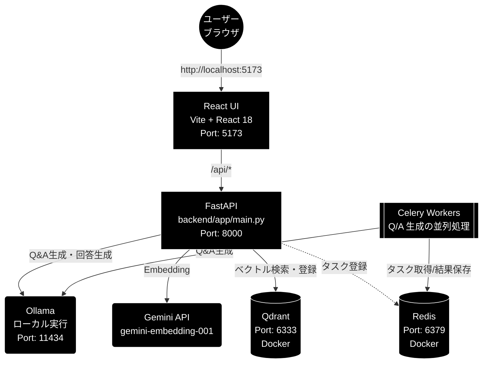

# インストール・環境構築ガイド（Q/A 生成・Qdrant 登録まわり）

**Version 2.0** | 最終更新: 2026-09-20

本ドキュメントは **Q/A 生成 → Qdrant 登録**（`qa_qdrant/` / `qa_generation/` / `chunking/`）を
動かすための環境構築を解説します。Ollama・MeCab・Docker（Qdrant / Redis）・Celery 並列など、
**このパイプライン固有の準備**が対象です。

> ## ⚠️ 2026-09-20 に全面改訂した（v1 は Streamlit 版の手順だった）
>
> v1 は `streamlit run agent_rag.py --server.port=8500` でアプリを起動する前提で
> 書かれていたが、**`agent_rag.py` はこのリポジトリに存在せず**（CLAUDE.md §9.4）、
> Streamlit も使っていない。現在の UI は **Vite + React 18（:5173）+ FastAPI（:8000）**で、
> `./run_dev.sh` が両方を起動する。Q/A 生成の LLM も **ローカル LLM（Ollama）** である
> （Gemini は Embedding 専用）。
>
> **アプリ全体のセットアップ（uv / Node.js / Ollama / .env / 起動）は
> [`backend/docs/install_and_setup.md`](../../backend/docs/install_and_setup.md) が正。**
> 本書はそれを前提に、パイプライン固有の準備だけを扱う。

## 目次

- [1. はじめに](#1-はじめに)
  - [1.1 本ドキュメントの目的](#11-本ドキュメントの目的)
  - [1.2 システム構成図](#12-システム構成図)
  - [1.3 前提条件・動作環境](#13-前提条件動作環境)
- [2. Python環境構築](#2-python環境構築)
  - [2.1 Pythonインストール(3.10+)](#21-pythonインストール310)
  - [2.2 仮想環境の作成](#22-仮想環境の作成)
  - [2.3 依存パッケージのインストール](#23-依存パッケージのインストール)
  - [2.4 MeCabのインストール(日本語処理用)](#24-mecabのインストール日本語処理用)
- [3. 環境変数設定](#3-環境変数設定)
  - [3.1 .envファイルの作成](#31-envファイルの作成)
  - [3.2 必要な API キー](#32-必要な-api-キー)
  - [3.3 設定項目一覧](#33-設定項目一覧)
  - [3.4 設定確認](#34-設定確認)
- [4. Dockerサービス起動](#4-dockerサービス起動)
  - [4.1 Docker/Docker Composeのインストール](#41-dockerdocker-composeのインストール)
  - [4.2 Qdrant + Redisの起動](#42-qdrant--redisの起動)
  - [4.3 サービス確認方法](#43-サービス確認方法)
  - [4.4 Docker トラブルシューティング](#44-docker-トラブルシューティング)
- [5. Celery並列処理環境](#5-celery並列処理環境)
  - [5.1 Celery概要(なぜ必要か)](#51-celery概要なぜ必要か)
  - [5.2 Celery設定ファイルの解説](#52-celery設定ファイルの解説)
  - [5.3 Celeryワーカーの起動](#53-celeryワーカーの起動)
  - [5.4 start_celery.sh の使い方](#54-start_celerysh-の使い方)
  - [5.5 Redisキャッシュのクリア](#55-redisキャッシュのクリア)
  - [5.6 Flower監視UI(オプション)](#56-flower監視uiオプション)
  - [5.7 Celery動作確認](#57-celery動作確認)
- [6. アプリケーション起動](#6-アプリケーション起動)
  - [6.1 ディレクトリ準備](#61-ディレクトリ準備)
  - [6.2 パイプラインの実行](#62-パイプラインの実行)
  - [6.3 起動確認](#63-起動確認)
- [7. 起動チェックリスト](#7-起動チェックリスト)
  - [7.1 全サービス確認コマンド](#71-全サービス確認コマンド)
  - [7.2 正常起動時の状態](#72-正常起動時の状態)
  - [7.3 起動スクリプト(一括起動)](#73-起動スクリプト一括起動)
- [8. トラブルシューティング](#8-トラブルシューティング)
  - [8.1 よくあるエラーと対処法](#81-よくあるエラーと対処法)
  - [8.2 ログの確認方法](#82-ログの確認方法)
  - [8.3 サービス再起動手順](#83-サービス再起動手順)
- [付録](#付録)
  - [A. コマンドリファレンス](#a-コマンドリファレンス)
  - [B. ポート一覧](#b-ポート一覧)
  - [C. 環境変数一覧](#c-環境変数一覧)
  - [D. ファイル構成](#d-ファイル構成)

---

## 1. はじめに

### 1.1 本ドキュメントの目的

本ドキュメントは以下を目的とします:

- Python環境の構築
- 依存パッケージのインストール
- Docker(Qdrant, Redis)のセットアップ
- Celery並列処理環境の構築
- ローカル LLM（Ollama）の準備
- 開発サーバ（backend + frontend）の起動

### 1.2 システム構成図



### 1.3 前提条件・動作環境


| 項目     | 要件                                |
| -------- | ----------------------------------- |
| OS       | macOS / Linux / Windows (WSL2推奨)  |
| Python   | 3.10 以上                           |
| Docker   | Docker Desktop または Docker Engine |
| メモリ   | 8GB 以上推奨                        |
| ディスク | 10GB 以上の空き容量                 |

---

## 2. Python環境構築

### 2.1〜2.3 は本書では扱わない（現行ガイドを参照）

> ⚠️ **本リポジトリは `uv` で依存を管理する。** v1 に書かれていた
> `python -m venv` ＋ `pip install -r requirements.txt` の手順は現行ではない。
>
> Python・`uv`・Node.js・**Ollama** の導入と依存インストールは
> **[`backend/docs/install_and_setup.md`](../../backend/docs/install_and_setup.md) §2〜§3** が正。

```bash
# 依存インストール（リポジトリルートで）
uv sync --extra dev

# フロントエンド依存
cd frontend && npm install
```

**ローカル LLM（Ollama）の準備**（別ターミナルで常駐させる）:

```bash
ollama serve
ollama pull gemma4:12b-mlx    # 既定モデル（config.py::get_default_ollama_model() 参照）
# Embedding 用の pull は不要（Gemini を使う）
```

> ⚠️ **`ollama serve` が動いていないと LLM 呼び出しが全部落ちる。**
> API キーの設定漏れではないので、まず `curl http://localhost:11434/api/tags` で確認する。

**Q/A 生成・Qdrant 登録で使う主なパッケージ**（`pyproject.toml` に定義）:

| パッケージ | 用途 |
|---|---|
| `openai` | **Ollama の OpenAI 互換エンドポイント**（`http://localhost:11434/v1`）を叩くクライアント |
| `google-genai` | **Embedding 専用**（`gemini-embedding-001`・3072 次元） |
| `qdrant-client` | Qdrant クライアント |
| `celery` / `redis` / `kombu` | Q/A 生成の並列処理 |
| `flower` | Celery 監視 UI（`start_celery.sh --flower`） |
| `mecab-python3` | 形態素解析（`regex_mecab.py`）。**本体と辞書は別途必要**（§2.4） |
| `pandas` / `tiktoken` | データ処理・トークンカウント |

> 📌 **`anthropic` も依存に入っているが、LLM の既定は Ollama である。**
> Anthropic 経路は `provider="anthropic"` を明示したときだけ動く後方互換
> （姉妹リポジトリ grace_v2 との A/B 用）で、**`ANTHROPIC_API_KEY` は不要**（CLAUDE.md §3）。

### 2.4 MeCabのインストール(日本語処理用)

mecab-python3 はPythonバインディングのみのため、MeCab本体と辞書のインストールが必要です。

#### macOS

```bash
# MeCab本体と辞書をインストール
brew install mecab mecab-ipadic

# 動作確認
echo "日本語の形態素解析" | mecab
```

#### Ubuntu/Debian

```bash
sudo apt install mecab libmecab-dev mecab-ipadic-utf8

# 動作確認
echo "日本語の形態素解析" | mecab
```

#### 動作確認(Python)

```python
import MeCab
tagger = MeCab.Tagger()
print(tagger.parse("日本語の形態素解析"))
```

---

## 3. 環境変数設定

### 3.1 .env ファイルの作成

リポジトリルートに `.env` を作成する。

```bash
touch .env
```

### 3.2 必要な API キー

> ⚠️ **v1 は `GEMINI_API_KEY` を必須としていたが、変数名が誤り。**
> 現行は **LLM = ローカル LLM（Ollama・キー不要）/ Embedding = Gemini** で、
> 必要な API キーは **`GOOGLE_API_KEY` の 1 本だけ**である（CLAUDE.md §3）。

| 用途 | 変数 | 既定 | 取得先 |
|---|---|---|---|
| **LLM 全般**（Q/A 生成・回答生成・根拠検証 等） | **不要** | `gemma4:12b-mlx`（Ollama） | — （`ollama serve` が動いていればよい） |
| **Embedding のみ**（検索） | `GOOGLE_API_KEY` | `gemini-embedding-001`（3072 次元） | Google AI Studio |

```bash
# .env
GOOGLE_API_KEY=AIzaxxxxxxxxxxxxxxxxxxxxxxxxxxxxxxxxxxxx
```

### 3.3 設定項目一覧

```bash
# === 必須 ===
GOOGLE_API_KEY=AIza...           # Embedding（gemini-embedding-001）

# === オプション ===
# LLM_PROVIDER=ollama                        # 既定のため省略可
# OLLAMA_DEFAULT_MODEL=gemma4:26b-mlx        # 既定 gemma4:12b-mlx を変えるときだけ
# OLLAMA_BASE_URL=http://localhost:11434/v1  # 既定のため省略可
QDRANT_URL=http://localhost:6333   # 既定値と同じなら省略可
REDIS_URL=redis://localhost:6379/0 # Celery 並列を使うときだけ
LOG_LEVEL=INFO
```

### 3.4 設定確認

```bash
# backend を起動して /api/health で確認するのが確実
uv run uvicorn backend.app.main:app --port 8000 &
curl http://localhost:8000/api/health
# {"status":"ok","google_api_key":true}
```

`google_api_key` が `false` なら `.env` が読めていない。

> 📝 **`/api/health` に LLM のキーは出ない。** LLM はローカル実行でキーを持たないため、
> 可視化しているのは Embedding 用の `GOOGLE_API_KEY` だけである
> （`backend/app/api/meta.py::health`）。LLM 側の疎通は
> `curl http://localhost:11434/api/tags` で確認する。

---

## 4. Dockerサービス起動

### 4.1 Docker/Docker Composeのインストール

#### macOS

Docker Desktop for Mac([https://www.docker.com/products/docker-desktop/)をインストール。](https://www.docker.com/products/docker-desktop/)%E3%82%92%E3%82%A4%E3%83%B3%E3%82%B9%E3%83%88%E3%83%BC%E3%83%AB%E3%80%82)

#### Ubuntu/Debian

```bash
# Docker Engine インストール
sudo apt update
sudo apt install docker.io docker-compose-plugin

# ユーザーをdockerグループに追加(再ログイン必要)
sudo usermod -aG docker $USER
```

#### 動作確認

```bash
docker --version
docker compose version
```

### 4.2 Qdrant + Redisの起動

```bash
# docker-composeディレクトリに移動
cd docker-compose

# サービス起動(バックグラウンド)
docker compose up -d

# 起動確認
docker compose ps
```

**期待される出力:**

```
NAME                    IMAGE                 STATUS              PORTS
docker-compose-qdrant-1 qdrant/qdrant:latest  Up (healthy)        0.0.0.0:6333->6333/tcp
docker-compose-redis-1  redis:7-alpine        Up (healthy)        0.0.0.0:6379->6379/tcp
```

### 4.3 サービス確認方法

#### Qdrant

```bash
# ヘルスチェック
curl http://localhost:6333/healthz

# コレクション一覧
curl http://localhost:6333/collections
```

**ブラウザでも確認可能:** [http://localhost:6333/dashboard](http://localhost:6333/dashboard)

#### Redis

```bash
# 接続テスト
redis-cli ping
# PONG

# 情報確認
redis-cli info server | head -5
```

### 4.4 Docker トラブルシューティング


| 問題                 | 原因           | 対処法                                       |
| -------------------- | -------------- | -------------------------------------------- |
| port already in use  | ポート競合     | 既存プロセスを停止するか、ポート変更         |
| permission denied    | Docker権限なし | sudo usermod -aG docker $USER 後に再ログイン |
| コンテナが起動しない | リソース不足   | Docker Desktopのメモリ割り当てを増加         |

```bash
# サービス停止
docker compose down

# ログ確認
docker compose logs qdrant
docker compose logs redis

# 完全にリセット(データも削除)
docker compose down -v
docker compose up -d
```

---

## 5. Celery並列処理環境

### 5.1 Celery概要(なぜ必要か)

Q&A生成処理では、Gemini APIを大量に呼び出します。同期処理では:

- 1000チャンク x 3秒/チャンク = 50分

Celery並列処理(24ワーカー)では:

- 1000チャンク / 24ワーカー = 2-3分

**並列化により処理時間を大幅に短縮できます。**

### 5.2 Celery設定ファイルの解説

celery_config.py の主要設定:

```python
# Redis接続
broker_url = 'redis://localhost:6379/0'
result_backend = 'redis://localhost:6379/0'

# ワーカー設定
worker_prefetch_multiplier = 1    # 一度に取得するタスク数
worker_max_tasks_per_child = 50   # メモリリーク対策

# タイムアウト設定
task_time_limit = 300             # 5分
task_soft_time_limit = 270        # 4.5分

# リトライ設定
task_retry_kwargs = {
    'max_retries': 3,
    'countdown': 60,              # 60秒後にリトライ
}
```

### 5.3 Celeryワーカーの起動

#### 方法1: start_celery.sh を使用(推奨)

```bash
# 実行権限を付与(初回のみ)
chmod +x start_celery.sh

# ワーカー起動（-c = 1 ワーカーあたりの並列タスク数。既定 8）
# ※PCのスペック(CPUコア数/メモリ)に合わせて調整してください(例: 4~8~16)
./start_celery.sh start -c 8

# ステータス確認
./start_celery.sh status

# 停止
./start_celery.sh stop

# 再起動
./start_celery.sh restart -c 8
```

#### 方法2: 直接起動

```bash
# Celeryワーカーを直接起動
celery -A celery_config worker \
    --loglevel=info \
    --concurrency=8 \
    --pool=prefork \
    -Q celery,high_priority,normal_priority,low_priority
```

> ⚠️ **`-A` は `celery_config`、キューは上記 4 つ。**
> `celery_config.py` が定義しているのは `celery`（既定）/ `high_priority` /
> `normal_priority` / `low_priority` で、**`qa_generation` というキューは無い**
> （`qa_generation` は `Celery('qa_generation')` の**アプリ名**であってキュー名ではない）。
> `-Q qa_generation` で起動したワーカーは何も消費しないので、タスクは
> 既定キュー `celery` に溜まったまま進まない。

### 5.4 start_celery.sh の使い方

```bash
使用方法: ./start_celery.sh {start|stop|restart|status} [-c concurrency] [--flower] [--flower-port PORT]

コマンド:
  start   - ワーカーを起動
  stop    - ワーカーを停止
  restart - ワーカーを再起動
  status  - ワーカーの状態を表示

オプション:
  -c, --concurrency  並列タスク数 (デフォルト: 8)
  -w, --workers      -c の別名（後方互換性）
  --flower           Flowerも起動
  --flower-port      Flowerポート (デフォルト: 5555)

例:
  ./start_celery.sh start -c 8 --flower      # concurrency=8 + Flower
  ./start_celery.sh restart -c 4             # concurrency=4で再起動
  ./start_celery.sh status                   # 状態確認
```

> 📝 **ワーカーは 1 台固定で、`-c` は「1 ワーカーあたりの並列タスク数」。**
> 旧版の説明にあった `-w NUM`（ワーカー数）は `-c` の別名として残してあるが、
> 意味は並列タスク数である。`-l/--loglevel` は無い。

### 5.5 Redisキャッシュのクリア

タスクが滞留している場合や、再起動時にクリアすることを推奨:

```bash
# Redisキャッシュをクリアしてワーカー再起動
redis-cli FLUSHDB && ./start_celery.sh restart -c 8
```

### 5.6 Flower監視UI(オプション)

Flowerを使用すると、Celeryタスクの状態をWebブラウザで監視できます。

```bash
# Flower起動
celery -A celery_config flower --port=5555
```

**ブラウザでアクセス:** [http://localhost:5555](http://localhost:5555)

Flower画面で確認できる情報:

- アクティブなワーカー一覧
- タスクの実行状況
- 成功/失敗の統計
- タスクの詳細ログ

### 5.7 Celery動作確認

```bash
# 1. ワーカーステータス確認
./start_celery.sh status

# 期待される出力:
# Redis: (ok) 起動中
# キュー長: 0
# ワーカー: (ok) 起動中

# 2. Celery inspectコマンドで詳細確認
celery -A celery_tasks inspect active
celery -A celery_tasks inspect stats
```

---

## 6. アプリケーション起動

### 6.1 ディレクトリ準備

アプリケーションが使用するディレクトリを作成します:

```bash
# 必要なディレクトリを作成
mkdir -p datasets OUTPUT qa_output logs
```


| ディレクトリ | 用途                     |
| ------------ | ------------------------ |
| datasets/    | ダウンロードした生データ |
| OUTPUT/      | 前処理済みデータ         |
| qa_output/   | 生成されたQ&Aペア        |
| logs/        | Celeryログファイル       |

### 6.2 パイプラインの実行

> ⚠️ **v1 の `streamlit run agent_rag.py --server.port=8500` は誤り。**
> `agent_rag.py` はこのリポジトリに存在せず（CLAUDE.md §9.4）、ポート 8500 も使わない。

#### 方法 1: 画面から（データ管理タブ）

```bash
# 前提: 別ターミナルで ollama serve が動いていること
ollama serve

# backend(:8000) + frontend(:5173) を同時起動
./run_dev.sh
```

ブラウザで <http://localhost:5173> を開き、**「データ管理」タブ**を選ぶ。
サブタブは **① チャンキング / ② Q/A 作成 / ③ Qdrant 登録 / ④ コレクション管理**。
CLI と同じ関数（`QAPipeline` など）を呼ぶので結果は変わらない。

#### 方法 2: CLI（大規模バッチ向け）

```bash
# 1. チャンク化
uv run python -m chunking.csv_text_to_chunks_text_csv

# 2-3. Q/A 生成 + Qdrant 登録
uv run python qa_qdrant/make_qa_register_qdrant.py
#   登録のみ: uv run python qa_qdrant/register_to_qdrant.py
```

`--resume` つきの大規模バッチは CLI の方が適している。
Celery 並列を使うときは `--use-celery`（先に §5 のワーカー起動が必要）。

### 6.3 起動確認

| 確認 | コマンド / 操作 | 正常時 |
|---|---|---|
| Ollama | `curl http://localhost:11434/api/tags` | pull 済みモデルの一覧（`gemma4:12b-mlx` が含まれること） |
| backend | `curl http://localhost:8000/api/health` | `{"status":"ok","google_api_key":true}` |
| frontend | ブラウザで <http://localhost:5173> | 4 つのタブ（基本版 / GRACE-Support / GRACE-Review / データ管理） |
| Qdrant | `curl http://localhost:6333/healthz` | 応答あり |
| API ドキュメント | <http://localhost:8000/docs> | FastAPI の自動ドキュメント |

---

## 7. 起動チェックリスト

### 7.1 全サービス確認コマンド

```bash
# === 1. Dockerサービス ===
echo "=== Docker Services ==="
docker compose -f docker-compose/docker-compose.yml ps

# === 2. Qdrant ===
echo "=== Qdrant ==="
curl -s http://localhost:6333/healthz && echo " OK" || echo " NG"

# === 3. Ollama（ローカル LLM） ===
echo "=== Ollama ==="
curl -s http://localhost:11434/api/tags > /dev/null && echo " OK" || echo " NG"

# === 4. Redis（Celery 並列を使う場合のみ） ===
echo "=== Redis ==="
redis-cli ping

# === 5. Celeryワーカー（同上） ===
echo "=== Celery Workers ==="
./start_celery.sh status

# === 6. API キー ===
echo "=== API keys ==="
curl -s http://localhost:8000/api/health
```

### 7.2 正常起動時の状態

| サービス | ポート | 確認方法 | 正常時の応答 |
|---|---|---|---|
| **React UI（Vite）** | **5173** | ブラウザアクセス | 4 タブの画面表示 |
| **FastAPI** | **8000** | `curl localhost:8000/api/health` | `{"status":"ok","google_api_key":true}` |
| **Ollama** | **11434** | `curl localhost:11434/api/tags` | pull 済みモデルの一覧 |
| Qdrant | 6333 | `curl localhost:6333/healthz` | 応答あり |
| Redis | 6379 | `redis-cli ping` | `PONG` |
| Celery | - | `./start_celery.sh status` | ワーカー: (ok) 起動中 |

> 📝 **Redis と Celery は Q/A 生成の並列（`--use-celery`）を使うときだけ必要。**
> 逐次実行なら Qdrant と Ollama だけあればよい。

### 7.3 起動スクリプト（一括起動）

```bash
#!/bin/bash
# start_all.sh

echo "1. Docker（Qdrant + Redis）起動..."
docker compose -f docker-compose/docker-compose.yml up -d
sleep 5

echo "2. Celery ワーカー起動（Q/A 生成を並列にする場合のみ）..."
./start_celery.sh start -c 8

echo "3. 開発サーバ起動（backend :8000 + frontend :5173）..."
#    ※ ollama serve は別ターミナルで常駐させておくこと
./run_dev.sh
```

---

## 8. トラブルシューティング

### 8.1 よくあるエラーと対処法

#### Qdrant接続エラー

**エラー:** Connection refused: localhost:6333

**対処:**

```bash
# Dockerサービス確認
docker compose -f docker-compose/docker-compose.yml ps

# 起動していない場合
docker compose -f docker-compose/docker-compose.yml up -d

# ログ確認
docker compose -f docker-compose/docker-compose.yml logs qdrant
```

#### Redis接続エラー

**エラー:** Error connecting to Redis

**対処:**

```bash
# Redisコンテナ確認
docker compose -f docker-compose/docker-compose.yml ps redis

# または、ローカルRedis起動(macOS)
brew services start redis
```

#### Celeryワーカーが起動しない

**エラー:** No module named 'celery_tasks'

**対処:**

```bash
# プロジェクトルートにいることを確認
pwd
# /path/to/gemini_rag_qa

# 仮想環境が有効化されていることを確認
which python
# /path/to/gemini_rag_qa/venv/bin/python

# celeryパッケージがインストールされていることを確認
pip show celery
```

#### LLM（Ollama）が応答しない

**エラー:** `Connection refused` / `Failed to connect to localhost:11434`

**これは API キーの問題ではない。** LLM はローカル実行なのでキーを持たない。
`ollama serve` が動いていないか、モデルが pull されていないかのどちらかである。

```bash
# 1. サーバが生きているか
curl http://localhost:11434/api/tags

# 2. 既定モデルが pull 済みか（無ければ pull する）
ollama pull gemma4:12b-mlx

# 3. 別ポート・別ホストで動かしているなら .env で明示
#    OLLAMA_BASE_URL=http://localhost:11434/v1
```

> ⚠️ **tool calling 非対応のモデルを選ぶと ReAct が動かない。**
> `phi3` / `gemma2` が該当する（`config.OllamaConfig.MODEL_CONSTRAINTS` /
> `supports_tool_calls()`）。

#### Embedding（Gemini）の API キーエラー

**エラー:** `AuthenticationError: Incorrect API key`

Embedding だけがクラウド（Gemini）なので、落ちるのは検索・登録の経路である。

```bash
# キーが読めているかを確認
curl -s http://localhost:8000/api/health
# {"status":"ok","google_api_key":false}   ← 未設定

# .env を確認（空白や改行が混ざっていないか。AIza で始まる）
grep -E 'GOOGLE_API_KEY' .env
```

> ⚠️ **`.env` を変えたら backend を再起動する。** 起動時に一度だけ読み込むため、
> 書き換えただけでは反映されない。

#### Embedding（Gemini）の 429エラー (Resource Exhausted)

**エラー:** 429 Resource has been exhausted (e.g. check quota).

**対処:**

* **原因**: APIのレート制限(RPM/TPM)を超過しています。
* **対策**:
  1. Celeryのワーカー数を減らす (`./start_celery.sh restart -w 4`)
  2. `celery_rate_limit_fix.py` (もしあれば) を適用するか、リトライ設定を確認する
  3. Pay-as-you-goプランへの移行を検討する

#### MeCabエラー

**エラー:** MeCab: Failed to initialize

**対処:**

```bash
# macOS
brew install mecab mecab-ipadic

# Ubuntu
sudo apt install mecab libmecab-dev mecab-ipadic-utf8

# 辞書パスの確認
mecab-config --dicdir
```

### 8.2 ログの確認方法

```bash
# Celeryログ
tail -f logs/celery_qa_*.log

# Dockerログ
docker compose -f docker-compose/docker-compose.yml logs -f

# backend / frontend のログ
# ./run_dev.sh を起動したターミナルに両方が出る
#   backend : uvicorn のアクセスログとアプリのログ
#   frontend: Vite の HMR ログ

# Ollama のログ
# ollama serve を起動したターミナルに出る
```

### 8.3 サービス再起動手順

問題が解決しない場合、以下の順序で再起動:

```bash
# 1. 全サービス停止
./start_celery.sh stop
docker compose -f docker-compose/docker-compose.yml down

# 2. キャッシュクリア
redis-cli FLUSHALL 2>/dev/null || true

# 3. 再起動
docker compose -f docker-compose/docker-compose.yml up -d
sleep 5
./start_celery.sh start -c 8

# 4. 開発サーバ起動（backend :8000 + frontend :5173）
#    ※ ollama serve は別ターミナルで常駐させておくこと
./run_dev.sh
```

---

## 付録

### A. コマンドリファレンス

#### 環境構築

```bash
# 依存インストール（uv。venv / pip ではない）
uv sync --extra dev

# フロントエンド依存
cd frontend && npm install

# ローカル LLM（別ターミナルで常駐）
ollama serve
ollama pull gemma4:12b-mlx

# MeCab 本体と辞書（§2.4）
brew install mecab mecab-ipadic        # macOS
# sudo apt install mecab libmecab-dev mecab-ipadic-utf8   # Ubuntu/Debian
```

#### Docker操作

```bash
# 起動
docker compose -f docker-compose/docker-compose.yml up -d

# 停止
docker compose -f docker-compose/docker-compose.yml down

# ログ確認
docker compose -f docker-compose/docker-compose.yml logs -f

# 完全リセット(データ削除)
docker compose -f docker-compose/docker-compose.yml down -v
```

#### Celery操作

```bash
# ワーカー起動（-c は 1 ワーカーあたりの並列タスク数）
./start_celery.sh start -c 8

# ワーカー停止
./start_celery.sh stop

# ステータス確認
./start_celery.sh status

# キャッシュクリア + 再起動
redis-cli FLUSHDB && ./start_celery.sh restart -c 8

# Flower監視
celery -A celery_config flower --port=5555
```

#### アプリケーション起動

```bash
# 開発サーバ（backend :8000 + frontend :5173）
./run_dev.sh

# バックエンド単体
uv run uvicorn backend.app.main:app --reload --port 8000

# CLI で Q/A 生成 + Qdrant 登録
uv run python qa_qdrant/make_qa_register_qdrant.py
#   Celery 並列を使う場合（先にワーカー起動が必要・§5）
uv run python qa_qdrant/make_qa_register_qdrant.py --use-celery
```

> ⚠️ **`a02_make_qa_para.py` は存在しない。** a-prefixed スクリプトは
> このリポジトリには無い（CLAUDE.md §9.4）。

### B. ポート一覧


| サービス         | ポート | 用途             |
| ---------------- | ------ | ---------------- |
| **React UI（Vite）** | **5173** | **ブラウザで開くのはこちら** |
| **FastAPI**      | **8000** | Web API（`/docs` に自動ドキュメント） |
| **Ollama**       | **11434** | ローカル LLM（`ollama serve`） |
| Qdrant           | 6333   | ベクトルDB API   |
| Qdrant Dashboard | 6333   | 管理画面         |
| Redis            | 6379   | Celeryブローカー |
| Flower           | 5555   | Celery監視UI     |

### C. 環境変数一覧


| 変数名         | 必須 | デフォルト                                     | 説明            |
| -------------- | ---- | ---------------------------------------------- | --------------- |
| GOOGLE_API_KEY | **Yes** | -                                           | **Embedding 専用**（`gemini-embedding-001`）。LLM 用のキーは不要 |
| LLM_PROVIDER   | No   | ollama                                         | LLM プロバイダ |
| OLLAMA_DEFAULT_MODEL | No | gemma4:12b-mlx                            | 既定の LLM モデル |
| OLLAMA_BASE_URL | No  | http://localhost:11434/v1                      | Ollama の接続先 |
| QDRANT_URL     | No   | [http://localhost:6333](http://localhost:6333) | Qdrant URL      |
| REDIS_URL      | No   | redis://localhost:6379/0                       | Redis URL       |
| LOG_LEVEL      | No   | INFO                                           | ログレベル      |

### D. ファイル構成

```
grace_v2_local/
├── .env                      # 環境変数(作成必要)
├── pyproject.toml            # Python 依存（uv が読む）
├── run_dev.sh                # backend + frontend 一括起動
├── celery_config.py          # Celery設定
├── celery_tasks.py           # Celeryタスク定義
├── start_celery.sh           # Celery起動スクリプト
├── backend/app/              # FastAPI（:8000）
├── frontend/                 # Vite + React 18（:5173）
├── chunking/                 # ① チャンク化
├── qa_generation/            # ② Q/A 生成
├── qa_qdrant/                # ③ Qdrant 登録
├── docker-compose/
│   └── docker-compose.yml    # Qdrant + Redis
├── datasets/                 # ダウンロードデータ
├── OUTPUT/                   # 前処理済みデータ
├── qa_output/                # Q&Aペア出力
└── logs/                     # ログファイル
```

---

## 更新履歴


| 日付       | 版 | 変更内容 |
| ---------- | --- | --------------------------------------------- |
| 2026-09-20 | 2.0 | **全面改訂。** v1 は Streamlit 版（`streamlit run agent_rag.py --server.port=8500`）の手順だったが、`agent_rag.py` は存在せず Streamlit も使っていない。現行の React（:5173）+ FastAPI（:8000）へ差し替え、LLM を **ローカル LLM（Ollama・`gemma4:12b-mlx`・API キー不要）** として明記し、必須キーを `GEMINI_API_KEY` から **`GOOGLE_API_KEY`（Embedding 専用）** へ是正。依存管理も venv/pip から **uv** へ。Celery の `-A` / キュー名 / `start_celery.sh` の引数も実装に合わせた。汎用セットアップは `backend/docs/install_and_setup.md` へ委譲し、本書は Q/A 生成・Qdrant 登録固有の準備（Ollama / MeCab / Docker / Celery）に絞った |
| 2025-12-03 | 1.1 | 構成図のMermaid化、トラブルシューティング追記 |
| 2025-11-28 | 1.0 | 初版作成 |
