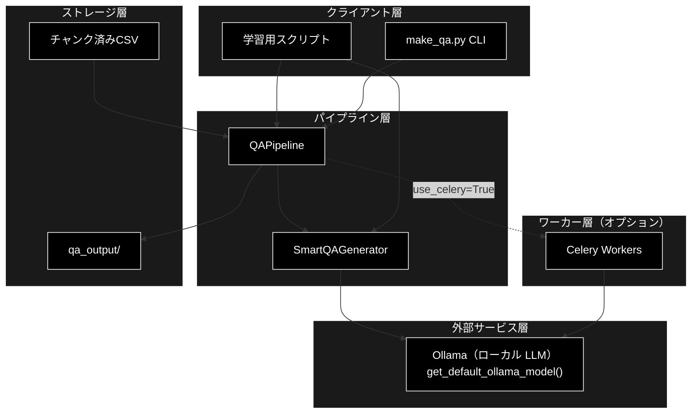
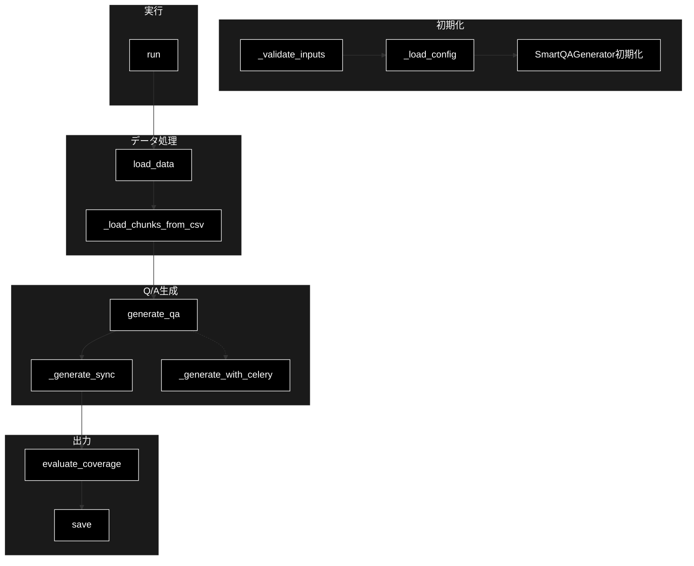
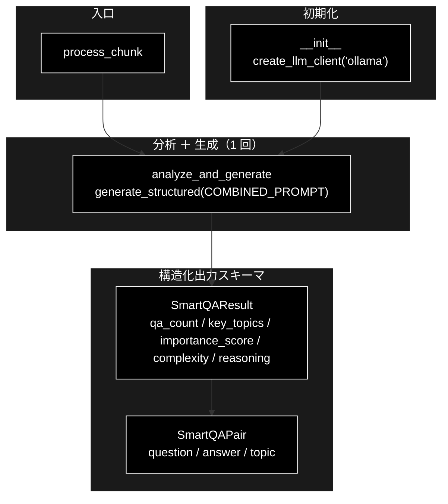
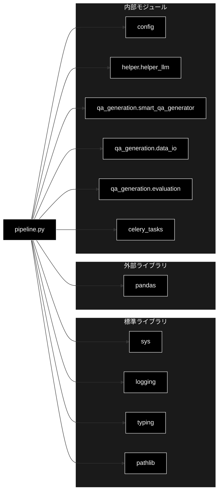
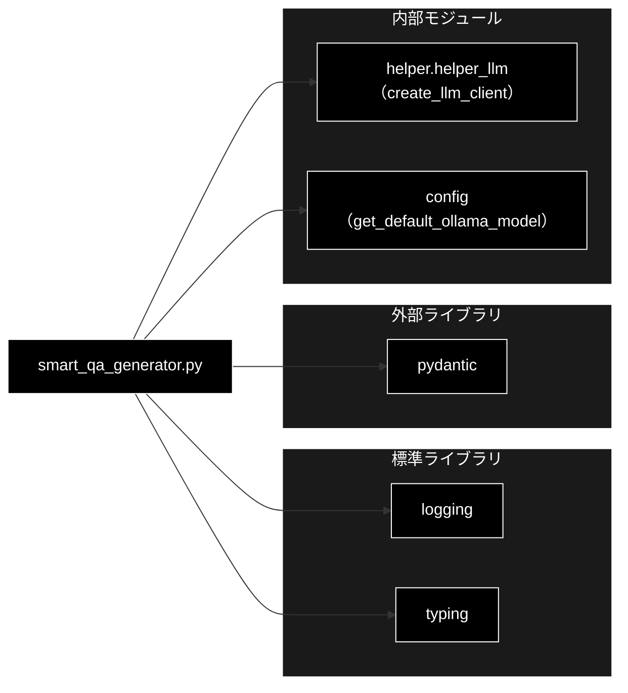
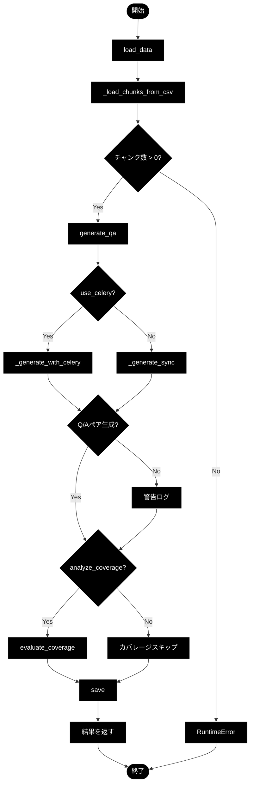
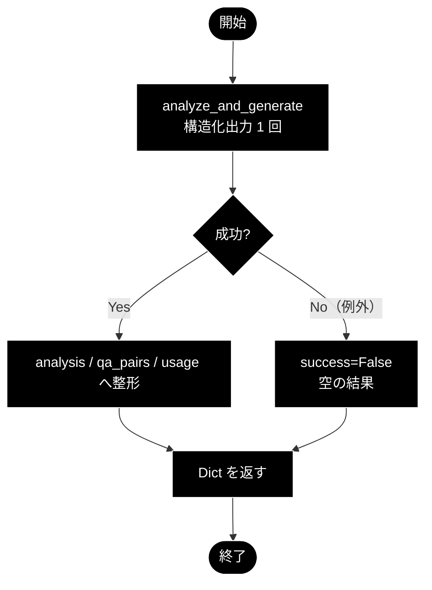

# QAPipeline & SmartQAGenerator - Q/Aペア生成システム ドキュメント

**Version 1.2** | 最終更新: 2026-09-24

---

## 目次

1. [概要](#概要)
2. [アーキテクチャ構成図](#1-アーキテクチャ構成図)
3. [モジュール構成図](#2-モジュール構成図)
4. [クラス・関数一覧表](#3-クラス関数一覧表)
5. [クラス・関数 IPO詳細](#4-クラス関数-ipo詳細)
6. [設定・定数](#5-設定定数)
7. [変更履歴](#6-変更履歴)
8. [付録: 依存関係図](#付録-依存関係図)

---

## 概要

`QAPipeline`と`SmartQAGenerator`は、チャンク済みテキストからQ/A（質問・回答）ペアを自動生成するためのシステムです。

- **QAPipeline** (`qa_generation/pipeline.py`): パイプライン全体のオーケストレーション
- **SmartQAGenerator** (`qa_generation/smart_qa_generator.py`): LLMを使用したインテリジェントQ/A生成

### 主な責務

- チャンク済みCSVファイルの読み込みと検証
- チャンクデータの分析とQ/A数の動的決定
- LLM（Ollama・ローカル LLM）を使用したQ/Aペアの生成
- 生成結果の保存（CSV、JSONサマリー）
- オプションでカバレージ分析の実行
- Celery並列処理のサポート（オプション）

### 各責務対応のモジュール

| # | 責務 | 対応モジュール | 説明 |
|---|---|---|---|
| 1 | チャンク済みCSVファイルの読み込みと検証 | `qa_generation/pipeline.py`（`QAPipeline.load_data()` / `_load_chunks_from_csv()`） | 読み込み自体は `qa_generation/data_io.py` へ委譲 |
| 2 | チャンクデータの分析とQ/A数の動的決定 | `qa_generation/smart_qa_generator.py`（`SmartQAGenerator.analyze_and_generate()`） | 情報密度・重要度・複雑さから 0〜5 件を決める |
| 3 | LLM（Ollama・ローカル LLM）を使用したQ/Aペアの生成 | `qa_generation/smart_qa_generator.py` ＋ `helper/helper_llm.py` | `create_llm_client(provider="ollama")`（ローカル LLM） の `generate_structured()` で分析と生成を 1 回で行う |
| 4 | 生成結果の保存（CSV、JSONサマリー） | `qa_generation/pipeline.py`（`save()`）→ `qa_generation/data_io.py` | `save_results()` が出力ファイルを書く |
| 5 | オプションでカバレージ分析の実行 | `qa_generation/pipeline.py`（`evaluate_coverage()`）→ `qa_generation/evaluation.py` | Embedding は Gemini |
| 6 | Celery並列処理のサポート（オプション） | `qa_generation/pipeline.py`（`_generate_with_celery()`）→ `celery_tasks.py` | ワーカー側でも `SmartQAGenerator.process_chunk()` を呼ぶ |

### 主要機能一覧

| 機能 | 説明 |
|------|------|
| `QAPipeline` | Q/A生成パイプライン制御クラス |
| `QAPipeline.__init__()` | パイプラインの初期化 |
| `QAPipeline.load_data()` | チャンク済みCSVの読み込み |
| `QAPipeline._load_chunks_from_csv()` | DataFrameをチャンクリストに変換 |
| `QAPipeline.generate_qa()` | Q/Aペアの生成（メインメソッド） |
| `QAPipeline.run()` | パイプライン全体の実行 |
| `SmartQAGenerator` | インテリジェントQ/A生成クラス |
| `SmartQAGenerator.analyze_and_generate()` | チャンク分析と Q/A 生成を構造化出力 1 回（`SmartQAResult`）で実行 |
| `SmartQAGenerator.process_chunk()` | `analyze_and_generate()` の結果を辞書へ整形（失敗時は `success=False`） |

### 前提条件

- LLM: `ollama serve` が起動し、既定モデルが pull 済みであること（API キーは不要）
- `GOOGLE_API_KEY`: カバレージ分析（Gemini Embedding）を使う場合のみ必要
- 入力CSVは既にチャンク済み（`csv_text_to_chunks_text_csv.py`で処理済み）
- チャンクCSVには `text` または `Combined_Text` カラムが必要

---

## 1. アーキテクチャ構成図

### 1.1 システム全体構成



### 1.2 データフロー


### 1.3 処理の流れ

1. ユーザーがCLI引数を指定して`make_qa.py`を実行
2. `QAPipeline`を初期化（設定ロード、SmartQAGenerator初期化）
3. `load_data()`でチャンク済みCSVを読み込み
4. `_load_chunks_from_csv()`でチャンクリストに変換
5. `generate_qa()`でQ/Aペアを生成
   - 内部で`SmartQAGenerator.process_chunk()`を呼び出し
   - `analyze_and_generate()` が分析（Q/A 数の決定）と Q/A 生成を構造化出力 1 回（`SmartQAResult`）で行う
   - `process_chunk()` が結果を辞書へ整形する（失敗時は `success=False` でそのチャンクをスキップ）
6. `save()`で結果をファイルに保存
7. サマリーをログ出力

---

## 2. モジュール構成図

### 2.1 QAPipeline 内部構成



### 2.2 SmartQAGenerator 内部構成



### 2.3 外部依存関係

| ライブラリ | バージョン | 用途 |
|-----------|-----------|------|
| `openai` | 最新 | **Q/A 生成の LLM**（Ollama の OpenAI 互換 API 経由。API キー不要） |
| `google-genai` | 最新 | **Embedding 専用**（`gemini-embedding-001`・3072 次元・鍵 `GOOGLE_API_KEY`） |
| `pandas` | - | DataFrame処理 |
| `pathlib` | 標準 | パス操作 |

### 2.4 内部依存モジュール

| モジュール | 用途 |
|-----------|------|
| `qa_generation.smart_qa_generator` | Q/A生成エンジン |
| `qa_generation.data_io` | データ入出力 |
| `qa_generation.evaluation` | カバレージ分析 |
| `config.DATASET_CONFIGS` | データセット設定 |
| `helper.helper_llm.LLMClient` | LLMクライアント（DI用） |
| `celery_tasks` | Celery並列処理 |

---

## 3. クラス・関数一覧表

### 3.1 QAPipeline クラス

| メソッド | 概要 |
|---------|------|
| `__init__(dataset_name, input_file, model, output_dir, max_docs, client)` | パイプラインを初期化 |
| `_validate_inputs()` | 入力パラメータの検証 |
| `_load_config()` | 設定のロード |
| `load_data()` | チャンク済みCSVを読み込み |
| `_load_chunks_from_csv(df)` | DataFrameをチャンクリストに変換 |
| `generate_qa(chunks, use_celery, ...)` | Q/Aペアを生成 |
| `_generate_sync(chunks, batch_size)` | 同期処理でQ/A生成 |
| `_generate_with_celery(chunks, workers, concurrency, ...)` | Celery並列処理でQ/A生成 |
| `evaluate_coverage(chunks, qa_pairs, threshold)` | カバレージを評価 |
| `save(qa_pairs, coverage_results)` | 結果を保存 |
| `run(use_celery, celery_workers, concurrency, ...)` | パイプライン全体を実行 |

### 3.2 SmartQAGenerator クラス

| メソッド | 概要 |
|---------|------|
| `__init__(model, api_key)` | ジェネレーターを初期化 |
| `analyze_and_generate(chunk_text)` | 分析と Q/A 生成を構造化出力 1 回で実行し `SmartQAResult` を返す |
| `process_chunk(chunk_text)` | `analyze_and_generate()` の結果を辞書へ整形（パイプライン・Celery の入口） |
| `COMBINED_PROMPT`（クラス定数） | 分析基準と生成ガイドラインを 1 つにまとめたプロンプト |
| `SmartQAPair` / `SmartQAResult`（Pydantic） | 構造化出力のスキーマ |

### 3.3 ユーティリティ関数

| 関数名 | 概要 |
|-------|------|
| `analyze_qa_statistics(results)` | Q/A生成結果の統計分析 |

---

## 4. クラス・関数 IPO詳細

### 4.1 使用例

#### 4.1.1 SmartQAGenerator 単体使用

```python
from qa_generation.smart_qa_generator import SmartQAGenerator

# 初期化
generator = SmartQAGenerator()  # 既定モデルは config.py::get_default_ollama_model()

# チャンクテキスト
chunk_text = """
AES-256暗号化アルゴリズムは、対称鍵暗号方式の一種で、
256ビットの鍵長を持ちます。NISTにより承認されており、
機密情報の保護に広く使用されています。
"""

# 一括処理（推奨）
result = generator.process_chunk(chunk_text)

if result['success']:
    print(f"Q/A数: {len(result['qa_pairs'])}")
    for qa in result['qa_pairs']:
        print(f"Q: {qa['question']}")
        print(f"A: {qa['answer']}")
```

#### 4.1.2 QAPipeline 基本使用

```python
from qa_generation.pipeline import QAPipeline

# パイプライン初期化
pipeline = QAPipeline(
    input_file="output_chunked/data_chunks.csv",
    # model は省略可（既定: get_default_ollama_model()）
    output_dir="qa_output/pipeline",
    max_docs=10  # テスト用に制限
)

# パイプライン実行（同期処理）
result = pipeline.run(
    use_celery=False,
    analyze_coverage=True
)

print(f"生成Q/A数: {result['qa_count']}")
print(f"出力ファイル: {result['saved_files']['qa_csv']}")
```

#### 4.1.3 Celery並列処理

```bash
# 1. Celeryワーカーを起動（別ターミナル）
./start_celery.sh -c 8

# 2. パイプライン実行
python qa_qdrant/make_qa.py \
  --input-file output_chunked/data_chunks.csv \
  --use-celery \
  -c 8 \
  --analyze-coverage
```

#### 4.1.4 ステップバイステップ処理

```python
from qa_generation.pipeline import QAPipeline

# 初期化
pipeline = QAPipeline(
    input_file="output_chunked/data_chunks.csv",
    max_docs=5
)

# Step 1: データ読み込み
df = pipeline.load_data()
print(f"読み込み行数: {len(df)}")

# Step 2: チャンク変換
chunks = pipeline._load_chunks_from_csv(df)
print(f"チャンク数: {len(chunks)}")

# Step 3: Q/A生成
qa_pairs = pipeline.generate_qa(
    chunks,
    use_celery=False,
)
print(f"生成Q/A数: {len(qa_pairs)}")

# Step 4: 保存
coverage_results = {"coverage_rate": 0, "total_chunks": len(chunks)}
saved_files = pipeline.save(qa_pairs, coverage_results)
print(f"保存先: {saved_files['qa_csv']}")
```

### 4.2 QAPipeline クラス

Q/A生成パイプライン全体を制御するクラス。チャンク済みCSVの読み込みからQ/A生成、保存までを一括管理する。

#### コンストラクタ: `__init__`

**概要**: パイプラインを初期化し、設定をロードしてSmartQAGeneratorを準備する。

```python
QAPipeline(
    dataset_name: Optional[str] = None,
    input_file: Optional[str] = None,
    model: str = get_default_ollama_model(),
    output_dir: str = "qa_output/pipeline",
    max_docs: Optional[int] = None,
    client: Optional[LLMClient] = None
)
```

| パラメータ | 型 | デフォルト | 説明 |
|------------|------|-----------|------|
| `dataset_name` | Optional[str] | None | 事前定義データセット名（cc_news, wikipedia_ja等） |
| `input_file` | Optional[str] | None | チャンク済みCSVファイルのパス |
| `model` | str | `get_default_ollama_model()` | 既定は `config.py::get_default_ollama_model()` の値（ローカル LLM・Ollama） |
| `output_dir` | str | "qa_output/pipeline" | 出力ディレクトリ |
| `max_docs` | Optional[int] | None | 処理する最大チャンク数 |
| `client` | Optional[LLMClient] | None | LLMクライアント（DI用） |

| 項目 | 内容 |
|------|------|
| **Input** | `dataset_name` または `input_file`（排他的） |
| **Process** | 1. `_validate_inputs()`で入力を検証<br>2. `_load_config()`で設定をロード<br>3. `SmartQAGenerator`を初期化 |
| **Output** | `QAPipeline`インスタンス |

> 📝 **注意**: `dataset_name` と `input_file` は排他的。いずれか一方のみ指定可能。

---

#### メソッド: `load_data`

**概要**: チャンク済みCSVファイルを読み込み、DataFrameとして返す。

```python
def load_data(self) -> pd.DataFrame
```

| 項目 | 内容 |
|------|------|
| **Input** | `self.input_file` または `self.dataset_name` |
| **Process** | 1. ファイル形式を確認（CSV以外はエラー）<br>2. `load_uploaded_file()`でCSVを読み込み<br>3. `max_docs`で行数を制限 |
| **Output** | `pd.DataFrame`: チャンクデータを含むDataFrame |

**戻り値例**:
```python
#    chunk_id                text  tokens  ...
# 0  chunk_0   "Daughter Duo..."    223  ...
# 1  chunk_1   "New York City..."   11  ...
# 2  chunk_2   "The Board of..."   226  ...
```

---

#### メソッド: `_load_chunks_from_csv`

**概要**: DataFrameをチャンクリスト（List[Dict]）に変換する。テキストカラムとIDカラムを自動検出。

```python
def _load_chunks_from_csv(self, df: pd.DataFrame) -> List[Dict]
```

| パラメータ | 型 | デフォルト | 説明 |
|------------|------|-----------|------|
| `df` | pd.DataFrame | - | チャンクデータを含むDataFrame |

| 項目 | 内容 |
|------|------|
| **Input** | `df: pd.DataFrame` |
| **Process** | 1. テキストカラムを検出（`text`, `Combined_Text`, `content`, `chunk_text`）<br>2. IDカラムを検出（`chunk_id`, `id`, `chunk_idx`）<br>3. 各行をDict形式に変換 |
| **Output** | `List[Dict]`: チャンクのリスト |

**戻り値例**:
```python
[
    {
        'id': 'cc_news_5per_chunk_0',
        'text': 'Daughter Duo is Dancing...',
        'type': 'llm_chunk',
        'tokens': 223,
        'dataset_type': 'cc_news_5per'
    },
    # ...
]
```

---

#### メソッド: `generate_qa`

**概要**: チャンクリストからQ/Aペアを生成する。同期処理またはCelery並列処理を選択可能。

```python
def generate_qa(
    self,
    chunks: List[Dict],
    use_celery: bool = False,
    celery_workers: int = 1,
    concurrency: int = 8,
    batch_chunks: int = 3
) -> List[Dict]
```

| パラメータ | 型 | デフォルト | 説明 |
|------------|------|-----------|------|
| `chunks` | List[Dict] | - | チャンクのリスト |
| `use_celery` | bool | False | Celery並列処理を使用するか |
| `celery_workers` | int | 1 | Celeryワーカー数チェック用 |
| `concurrency` | int | 8 | 並列タスク数 |
| `batch_chunks` | int | 3 | 1回のAPIで処理するチャンク数 |

| 項目 | 内容 |
|------|------|
| **Input** | `chunks: List[Dict]`, 処理オプション |
| **Process** | 1. `use_celery`に応じて処理方法を選択<br>2. `_generate_sync()`または`_generate_with_celery()`を実行<br>3. 各チャンクに対してQ/Aペアを生成 |
| **Output** | `List[Dict]`: Q/Aペアのリスト |

**戻り値例**:
```python
[
    {
        'question': 'Amara Ramasarはどのバレエ団に所属していますか？',
        'answer': 'Amara RamasarはNYCBに所属しています。',
        'chunk_id': 'cc_news_5per_chunk_0',
        'topic': 'バレエ団所属',
        'dataset_type': 'cc_news_5per'
    },
    # ...
]
```

---

#### メソッド: `run`

**概要**: パイプライン全体を実行する統合メソッド。

```python
def run(
    self,
    use_celery: bool = False,
    celery_workers: int = 1,
    concurrency: int = 8,
    batch_chunks: int = 3,
    analyze_coverage: bool = True,
    coverage_threshold: Optional[float] = None
) -> Dict
```

| パラメータ | 型 | デフォルト | 説明 |
|------------|------|-----------|------|
| `use_celery` | bool | False | Celery並列処理を使用するか |
| `celery_workers` | int | 1 | Celeryワーカー数 |
| `concurrency` | int | 8 | 並列タスク数 |
| `batch_chunks` | int | 3 | バッチサイズ |
| `analyze_coverage` | bool | True | カバレージ分析を実行するか |
| `coverage_threshold` | Optional[float] | None | カバレージ判定閾値 |

| 項目 | 内容 |
|------|------|
| **Input** | 実行オプション |
| **Process** | 1. `load_data()`でデータ読み込み<br>2. `_load_chunks_from_csv()`でチャンク変換<br>3. `generate_qa()`でQ/A生成<br>4. `evaluate_coverage()`でカバレージ分析<br>5. `save()`で結果保存 |
| **Output** | `Dict`: 実行結果 |

**戻り値例**:
```python
{
    'saved_files': {
        'summary': 'qa_output/pipeline/summary_20250130_123456.json',
        'qa_csv': 'qa_output/pipeline/qa_pairs_20250130_123456.csv'
    },
    'qa_count': 15,
    'coverage_results': {
        'coverage_rate': 0.85,
        'covered_chunks': 17,
        'total_chunks': 20,
        'uncovered_chunks': [...]
    },
    'success': True
}
```

---

### 4.3 SmartQAGenerator クラス

コンテンツを考慮したインテリジェントQ/A生成クラス。LLMでチャンクを分析し、適切なQ/A数を動的に決定する。
**分析と生成は構造化出力 1 回**で行う（旧実装の `analyze_chunk()` ＋ `generate_qa_pairs()` の 2 段階は v3.0 で廃止）。
モジュール単位の正本は [`qa_generation/docs/smart_qa_generator.md`](../../qa_generation/docs/smart_qa_generator.md)。

#### コンストラクタ: `__init__`

**概要**: SmartQAGeneratorを初期化し、統一 LLM クライアント（`create_llm_client(provider="ollama")`（ローカル LLM））を準備する。

```python
SmartQAGenerator(
    model: str = get_default_ollama_model(),
    api_key: Optional[str] = None
)
```

| パラメータ | 型 | デフォルト | 説明 |
|------------|------|-----------|------|
| `model` | str | `get_default_ollama_model()` | 既定は `config.py::get_default_ollama_model()` の値（ローカル LLM・Ollama） |
| `api_key` | Optional[str] | None | 未使用（統一クライアントが接続先を設定から解決する） |

| 項目 | 内容 |
|------|------|
| **Input** | `model`, `api_key`（未使用） |
| **Process** | 1. `create_llm_client(provider="ollama", default_model=model)` でクライアントを生成<br>2. トークン使用量 `last_usage` を 0 で初期化 |
| **Output** | `SmartQAGenerator`インスタンス |

---

#### メソッド: `analyze_and_generate`

**概要**: チャンクを分析して Q/A 数（0〜5）を決め、その数の Q/A ペアを生成する。**LLM 呼び出しは 1 回**（`generate_structured()` ＋ `response_schema=SmartQAResult`）。

```python
def analyze_and_generate(self, chunk_text: str) -> SmartQAResult
```

| パラメータ | 型 | デフォルト | 説明 |
|------------|------|-----------|------|
| `chunk_text` | str | - | 分析対象のチャンクテキスト |

| 項目 | 内容 |
|------|------|
| **Input** | `chunk_text: str` |
| **Process** | 1. `COMBINED_PROMPT` にチャンクを埋め込む<br>2. `generate_structured(response_schema=SmartQAResult, max_output_tokens=4096, temperature=0.2)` を呼ぶ<br>3. 空応答なら `ValueError`<br>4. クライアントの `last_usage` を取り込む |
| **Output** | `SmartQAResult`（分析結果＋`qa_pairs`） |

**戻り値例**（`SmartQAResult` を辞書で表したもの）:
```python
{
    'qa_count': 3,              # 生成すべきQ/A数（0-5）
    'key_topics': ['バレエ団', '引退', '共演'],  # 主要トピック
    'importance_score': 0.75,   # 重要度（0.0-1.0）
    'complexity': 'medium',     # 複雑さ（low/medium/high）
    'reasoning': '複数の関連情報を含む標準的な説明パラグラフ',
    'qa_pairs': [
        {'question': 'レジーナ・ウィロビーは何歳で引退しますか？',
         'answer': 'レジーナは40歳で、3月に舞台から引退します。', 'topic': '引退'},
        # ... qa_count 件
    ]
}
```

**Q/A数の判断基準**（`COMBINED_PROMPT` の Step 1）:

| Q/A数 | 判断基準 |
|-------|---------|
| 0個 | 補足情報のみ、メタ情報のみ（ページ番号、参照リンク等） |
| 1個 | 単純な事実の記述（1つの情報のみ） |
| 2個 | 関連する2つの事実 |
| 3個 | 複数の関連情報、標準的な説明パラグラフ |
| 4-5個 | 高密度な技術情報、重要な警告・注意事項を含む |

---

#### メソッド: `process_chunk`

**概要**: `analyze_and_generate()` を呼び、結果を辞書へ整形する。実際のパイプライン（`_generate_sync()`）と Celery ワーカーはこのメソッドを使う。

```python
def process_chunk(self, chunk_text: str) -> Dict
```

| パラメータ | 型 | デフォルト | 説明 |
|------------|------|-----------|------|
| `chunk_text` | str | - | チャンクテキスト |

| 項目 | 内容 |
|------|------|
| **Input** | `chunk_text: str` |
| **Process** | 1. `analyze_and_generate()` を実行<br>2. 分析 5 項目と `qa_pairs` を辞書へ詰め替え（`topic` が空なら「その他」）<br>3. 例外時は `success=False` と空の結果を返す（呼び出し側がそのチャンクをスキップ） |
| **Output** | `Dict`: 処理結果（`analysis` / `qa_pairs` / `usage` / `success`） |

**戻り値例**:
```python
{
    'analysis': {
        'qa_count': 3,
        'key_topics': ['バレエ団', '引退'],
        'importance_score': 0.75,
        'complexity': 'medium',
        'reasoning': '...'
    },
    'qa_pairs': [
        {'question': '...', 'answer': '...', 'topic': '...'},
        # ...
    ],
    'usage': {'input_tokens': 812, 'output_tokens': 356},
    'success': True
}
```

```python
# 使用例
generator = SmartQAGenerator()  # 既定モデルは config.py::get_default_ollama_model()
result = generator.process_chunk("チャンクテキスト...")

if result['success']:
    print(f"生成Q/A数: {len(result['qa_pairs'])}")
    for qa in result['qa_pairs']:
        print(f"Q: {qa['question']}")
        print(f"A: {qa['answer']}")
```

---

### 4.4 ユーティリティ関数

#### `analyze_qa_statistics`

**概要**: Q/A生成結果の統計分析を行う。

```python
def analyze_qa_statistics(results: List[Dict]) -> Dict
```

| パラメータ | 型 | デフォルト | 説明 |
|------------|------|-----------|------|
| `results` | List[Dict] | - | `process_chunk()`の結果リスト |

| 項目 | 内容 |
|------|------|
| **Input** | `results: List[Dict]` |
| **Process** | 1. 総チャンク数をカウント<br>2. 総Q/A数をカウント<br>3. Q/A数分布を計算<br>4. 平均重要度を計算 |
| **Output** | `Dict`: 統計情報 |

**戻り値例**:
```python
{
    'total_chunks': 10,
    'total_qa_pairs': 25,
    'avg_qa_per_chunk': 2.5,
    'avg_importance_score': 0.68,
    'qa_distribution': {
        0: 1,   # 0個生成: 1チャンク
        2: 3,   # 2個生成: 3チャンク
        3: 5,   # 3個生成: 5チャンク
        4: 1    # 4個生成: 1チャンク
    }
}
```

---

## 5. 設定・定数

### 5.1 QAPipeline 設定

パイプライン設定は`config.py`の`DATASET_CONFIGS`または動的生成される。

**ローカルファイル用の動的設定**:
```python
{
    "name": "ローカルファイル (data_chunks)",
    "text_column": "text",
    "title_column": None,
    "lang": "ja",
    "qa_per_chunk": 3,
    "type": "data_chunks"
}
```

**事前定義データセット設定例（cc_news）**:
```python
{
    "name": "CC-News（英語ニュース）",
    "icon": "🌐",
    "description": "Common Crawl英語ニュース記事",
    "text_column": "Combined_Text",
    "lang": "en",
    "qa_per_chunk": 5,
    "type": "cc_news"
}
```

### 5.2 SmartQAGenerator 設定

| 設定項目 | 値 | 説明 |
|---------|-----|------|
| デフォルトモデル | `get_default_ollama_model()` | 既定は `config.py::get_default_ollama_model()` の値（ローカル LLM・Ollama） |
| temperature | 0.2 | 分析＋生成（構造化出力 1 回）の温度 |
| max_output_tokens | 4096 | 構造化出力の上限トークン数 |
| Q/A数範囲 | 0-5 | 1チャンクあたりの生成Q/A数 |


---

## 6. 変更履歴

| バージョン | 変更内容 |
|-----------|---------|
| 1.0 | 初版作成（QAPipeline v3.0、SmartQAGenerator v2.5 対応） |
| 1.1 | 使用例を IPO 詳細の冒頭（`### 4.1 使用例`）へ移し、末尾の「## 6. 使用例」章を削除（基本フォーマット `a_class_method_md_format.md` v1.6〜 §6.1 に準拠。2026-09-24）。IPO の小節を 4.2 以降へ繰り下げ、後続の章番号を 1 つ繰り上げた。文書内の `§4.x` 参照も追随。あわせて **SmartQAGenerator の記述を現行実装（v3.0・構造化出力 1 回方式）へ是正**した: 廃止済みの `analyze_chunk()` / `generate_qa_pairs()` / `_generate_content()` を `analyze_and_generate()` に置き換え（§4.3 全面改稿・§1.2/§1.3/§2.2/§3.2/付録 A.2・B.2）、LLM を Gemini（`gemini-2.0-flash`・`google.genai`）と誤記していた箇所を Ollama（`get_default_ollama_model()`）へ、前提条件の API キー記述も是正。概要に「各責務対応のモジュール」（1:1）を追加 |
| 1.2 | `QAPipeline` の引数の記述を実装に合わせた（2026-09-24）。削除済みの `use_smart_generation` を `generate_qa()` / `run()` / `_generate_sync()` のシグネチャ・引数表・使用例から外した |

---

## 付録: 依存関係図

### A.1 QAPipeline 依存関係



### A.2 SmartQAGenerator 依存関係



---

## 付録: 処理フローチャート

### B.1 QAPipeline.run() フローチャート



### B.2 SmartQAGenerator.process_chunk() フローチャート


