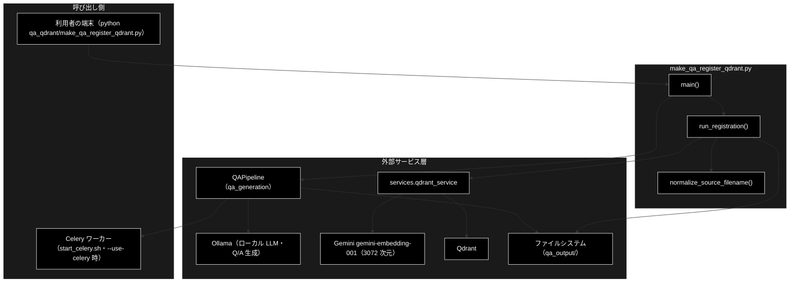
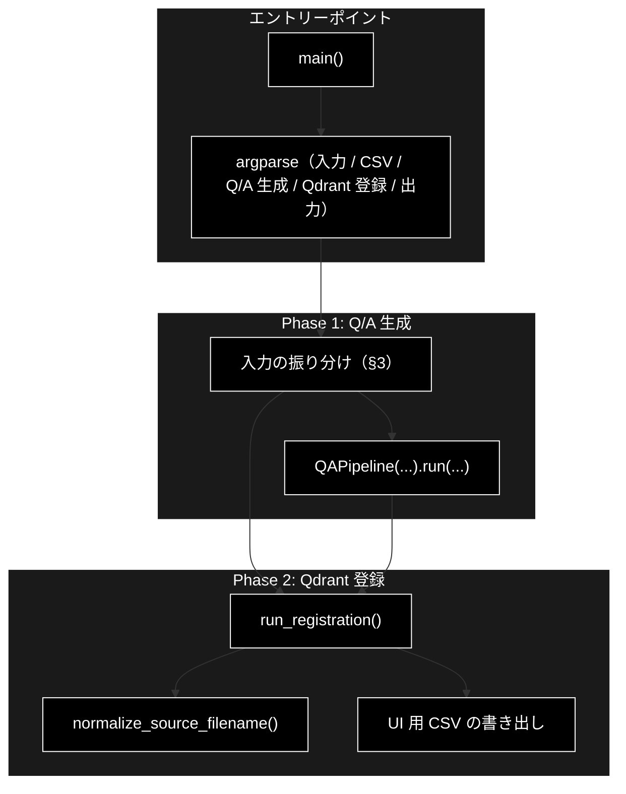
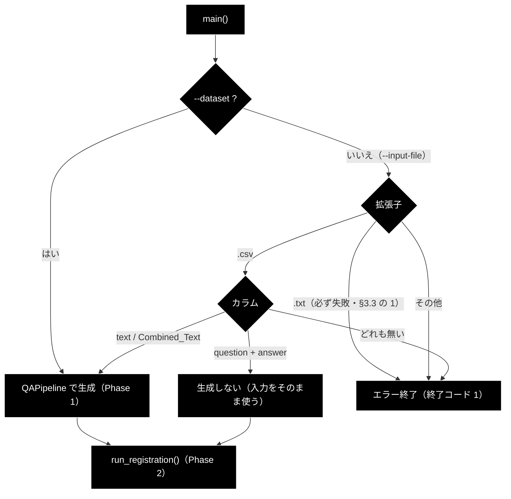
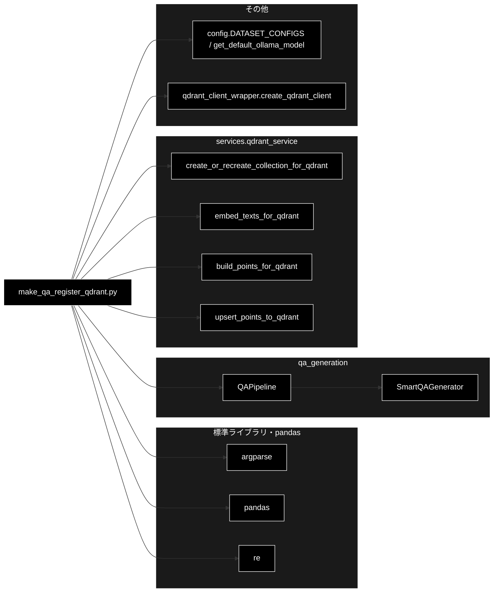

# make_qa_register_qdrant.py - Q/A 生成 → Qdrant 登録 統合 CLI ドキュメント

**Version 1.0** | 最終更新: 2026-09-26

---

## 目次

1. [概要](#概要)
2. [アーキテクチャ構成図](#1-アーキテクチャ構成図)
3. [モジュール構成図](#2-モジュール構成図)
4. [入力の振り分けと既知の問題（重点解説）](#3-入力の振り分けと既知の問題重点解説)
5. [クラス・関数一覧表](#4-クラス関数一覧表)
6. [クラス・関数 IPO詳細](#5-クラス関数-ipo詳細)
7. [設定・定数](#6-設定定数)
8. [エクスポート](#7-エクスポート)
9. [変更履歴](#8-変更履歴)
10. [付録: 依存関係図](#付録-依存関係図)

---

## 概要

`qa_qdrant/make_qa_register_qdrant.py` は、チャンク済み CSV または事前定義データセットから Q/A ペアを生成し（Phase 1）、
その Q/A を Embedding して Qdrant コレクションへ登録する（Phase 2）**統合 CLI** です。
Q/A 生成は `qa_generation.pipeline.QAPipeline`（ローカル LLM・Ollama。既定は `config.py::get_default_ollama_model()` = `gemma4:12b-mlx`）に、
Embedding と Qdrant 操作は `services/qdrant_service.py`（Gemini `gemini-embedding-001`・3072 次元）に委譲し、
本モジュールは**入力の振り分け・2 フェーズの順序制御・登録ループ・UI 用 CSV の出力**を受け持ちます。

> 📎 **使い方（運用手順）は [`make_qa_register_qdrant.md`](make_qa_register_qdrant.md)（種別 B・手順書）**、
> 本書はモジュール仕様（IPO）です。同名の手順書が先にあったため、本書はファイル名に `_ipo` を付けています
> （姉妹リポジトリ grace_v2 と同じ命名）。
>
> 📌 **データ管理タブ（Web）はこの CLI を呼ばない。** Q/A 生成は `services/data_pipeline_service.py::run_qa_generation_sync()`、
> 登録は `qa_qdrant/register_to_qdrant.py` を通る。Phase 1 は同じ `QAPipeline` なので生成結果は変わらない。
>
> ⚠️ **[§3.3 既知の問題](#33-既知の問題2026-09-26-実測) の 6 件は未修正**（2026-09-26 時点）。
> 姉妹リポジトリ grace_v2 では同種の 5 件を 2026-09-25 に修正済みだが、本リポジトリへは移植していない。

### 主な責務

- 入力ソース（`--dataset` / `--input-file`）の排他検証と、ファイル種別・カラムによる処理の振り分け
- Q/A 生成（Phase 1）の `QAPipeline` への委譲と、生成された Q/A CSV の特定
- Q/A の `question` 列のバッチ Embedding と Qdrant へのアップサート（Phase 2）
- UI 用に `question` / `answer` だけを持つ CSV を、日時サフィックスを外した固定名で出力する
- ファイル名から日時サフィックスを除いた正規化名の生成（Qdrant の `source` と UI 用 CSV 名に使う）

### 各責務対応のモジュール

| # | 責務 | 対応モジュール | 説明 |
|---|------|--------------|------|
| 1 | 入力の排他検証と振り分け | `make_qa_register_qdrant.py` | `main()` が引数を解析し、`.txt` / `.csv`（Q/A 列あり・本文列あり）/ データセットで分岐（§3） |
| 2 | Q/A 生成の委譲 | `qa_generation/pipeline.py` | `QAPipeline.run()` が `SmartQAGenerator` で生成し、`saved_files["qa_csv"]` を返す |
| 3 | Embedding と Qdrant 登録 | `services/qdrant_service.py` | `run_registration()` が `embed_texts_for_qdrant()` / `build_points_for_qdrant()` / `upsert_points_to_qdrant()` を呼ぶ |
| 4 | UI 用 CSV の出力 | `make_qa_register_qdrant.py` | `run_registration()` の末尾で `question` / `answer` 列だけを `--ui-output` へ書く |
| 5 | ファイル名の正規化 | `make_qa_register_qdrant.py` | `normalize_source_filename()` が `_YYYYMMDD_HHMMSS` を除去 |

### 主要機能一覧

| 機能 | 説明 |
|------|------|
| `main()` | CLI エントリーポイント。引数解析 → 入力検証 → Phase 1 → Phase 2 |
| `run_registration()` | Q/A CSV を Embedding して Qdrant へ登録し、UI 用 CSV を書く（Phase 2） |
| `normalize_source_filename()` | ファイル名から日時サフィックス（`_YYYYMMDD_HHMMSS`）を除去 |

---

## 1. アーキテクチャ構成図

### 1.1 システム全体構成



### 1.2 データフロー

1. `main()` が引数を解析し、`--dataset` / `--input-file` のどちらか 1 つだけが指定されていること、`GOOGLE_API_KEY`（Embedding 用）があることを確かめる。LLM（Ollama）への接続は確かめない
2. **Phase 1**: 入力に応じて `QAPipeline.run()` で Q/A を生成し、`<--output>/qa_pairs_<種別>_<日時>.csv` を得る
   （入力 CSV が既に `question` / `answer` 列を持つ場合は生成を飛ばし、その CSV をそのまま使う）
3. **Phase 2**: `run_registration()` が Q/A CSV を読み、`question` 列だけを `--batch-size` 件ずつ Embedding する
4. 各バッチを Qdrant のポイントに組み立て、`source` をファイル名の正規化名に揃えてアップサートする
5. 最後に `question` / `answer` 列だけの CSV を `<--ui-output>/<正規化名>` へ書き出す

---

## 2. モジュール構成図

### 2.1 内部モジュール構成



### 2.2 外部依存関係

| ライブラリ | 用途 |
|-----------|------|
| `pandas` | 入力 CSV の判定・Q/A CSV の読み込み・UI 用 CSV の書き出し |
| `argparse` / `logging` / `re` / `pathlib`（標準） | 引数解析・ログ・日時サフィックスの除去・拡張子判定 |

### 2.3 内部依存モジュール

| モジュール | 用途 |
|-----------|------|
| `config.DATASET_CONFIGS` | `--dataset` の選択肢（`wikipedia_ja` / `wikipedia_ja_5per` / `japanese_text` / `fineweb_edu_ja` / `cc_news` / `livedoor`） |
| `config.get_default_ollama_model` | `--model` の既定値（環境変数 `OLLAMA_DEFAULT_MODEL` があればそちら） |
| `qa_generation.pipeline.QAPipeline` | Phase 1 の Q/A 生成（`SmartQAGenerator`・Celery 並列対応） |
| `qdrant_client_wrapper.create_qdrant_client` | Qdrant クライアントの生成 |
| `services.qdrant_service.create_or_recreate_collection_for_qdrant` | コレクションの作成・再作成（既定 3072 次元） |
| `services.qdrant_service.embed_texts_for_qdrant` | Gemini Embedding（`gemini-embedding-001`。プロバイダは固定） |
| `services.qdrant_service.build_points_for_qdrant` | DataFrame → `PointStruct`（payload: `domain` / `question` / `answer` / `source` / `created_at` / `schema`=`qa:v1` ほか） |
| `services.qdrant_service.upsert_points_to_qdrant` | ポイントのアップサート |

---

## 3. 入力の振り分けと既知の問題（重点解説）

### 3.1 入力ごとの処理

`main()` は入力の種類で Phase 1 を切り替えます。**判定はこの順に行われる**（上から最初に当てはまった行）。

| # | 入力 | 判定条件 | Phase 1 | Phase 2 に渡す CSV |
|---|------|---------|---------|-------------------|
| 1 | `--dataset <名前>` | — | `QAPipeline(dataset_name=...)` で生成 | 生成した Q/A CSV |
| 2 | `--input-file *.txt` | 拡張子 `.txt` | `QAPipeline(input_file=<.txt>)` を呼ぶが、**`QAPipeline.load_data()` が `.csv` しか受け付けないため必ず失敗**（§3.3 の 1） | — |
| 3 | `--input-file *.csv` | `question` 列と `answer` 列が両方ある | **生成しない**（Q/A 済みとみなす） | 入力 CSV そのもの |
| 4 | `--input-file *.csv` | `--text-column`（既定 `text`）列、または `Combined_Text` 列がある | `QAPipeline(input_file=...)` で生成。**列名は渡さない**（§3.3 の 4） | 生成した Q/A CSV |
| 5 | `--input-file *.csv` | 上のどれにも当てはまらない | エラー（必要なカラムを表示）・終了コード 1 | — |
| 6 | `--input-file` のその他の拡張子 | — | エラー（「未対応のファイル形式」）・終了コード 1 | — |



> 📌 `.txt` から Q/A を作りたいときは、先にチャンク化 CLI（`python -m chunking.csv_text_to_chunks_text_csv`）で
> `<入力名>_chunks.csv` を作り、その CSV を `--input-file` に渡す（§3.1 の 4）。

### 3.2 出力ファイル

| 出力 | 場所・名前 | 中身 |
|------|-----------|------|
| Q/A CSV（Phase 1） | `<--output>/qa_pairs_<種別>_<YYYYMMDD_HHMMSS>.csv`（`qa_generation/data_io.py::save_results`） | 生成した Q/A と付随列。**実行ごとに新しいファイル** |
| Q/A JSON（Phase 1） | `<--output>/qa_pairs_<種別>_<YYYYMMDD_HHMMSS>.json` | 同上の JSON 版 |
| カバレッジ（Phase 1） | `<--output>/coverage_<種別>_<YYYYMMDD_HHMMSS>.json` | カバレッジ分析の結果（常に実行・§6.1） |
| UI 用 CSV（Phase 2） | `<--ui-output>/<Q/A CSV 名から日時を除いた名前>`（例 `qa_output/qa_pairs_cc_news_1per_chunks.csv`） | `question` / `answer` の 2 列だけ。**同じ入力なら上書き** |
| Qdrant | コレクション `--collection` | Q/A 1 件 = 1 ポイント。`source` payload は UI 用 CSV と同じ正規化名 |

`<種別>` は `QAPipeline` の設定の `type` です。`--input-file` のときは入力ファイル名の拡張子を除いた部分
（例 `cc_news_1per_chunks`）。**`--dataset` のときは `unknown`** になります。`config.DATASET_CONFIGS` の各エントリに
`type` キーが無く、`QAPipeline` が `self.config.get("type", "unknown")` で既定値へ倒れるためです（2026-09-26 に
`DATASET_CONFIGS` のキー一覧で確認）。そのため、どのデータセットでも UI 用 CSV は `qa_output/qa_pairs_unknown.csv` になり、
別のデータセットを登録すると上書きされます。

### 3.3 既知の問題（2026-09-26 実測）

本書を書く際に実装を読み、ダミーの `GOOGLE_API_KEY`（外部 API へは届かない）・Qdrant 停止・Ollama 停止の状態で
CLI を実行して確かめたものです。**本書ではコードを変えていない**（挙動の記録のみ）。

| # | 問題 | 実測・根拠 | 影響 | grace_v2 |
|---|------|-----------|------|:--:|
| 1 | **`.txt` 入力は必ず失敗する。** | `.txt` をそのまま `QAPipeline` へ渡し、`QAPipeline.load_data()` が `.csv` 以外を `ValueError: 未対応のファイル形式: .txt` で拒否する → `main()` の例外処理で**終了コード 1**。docstring の使用例 5・`--input-file` の help（`.txt, .csv`）と食い違う | `.txt` は使えない。§3.1 の注記のとおり先にチャンク化する | ✅ 修正済み |
| 2 | **Qdrant 登録が失敗しても終了コードは 0。** | `run_registration()` が `False` を返しても、`main()` は `❌ Qdrant登録フェーズで失敗しました。` をログに出すだけ。Q/A 列ありの CSV を Qdrant 停止中に渡すと `Qdrant接続エラー: [Errno 111] Connection refused` のあと**終了コード 0** | シェルスクリプトや CI から呼ぶと失敗に気付けない | ✅ 修正済み |
| 3 | **`--provider` は効かない。** | `run_registration(provider=...)` は受け取るだけで使わず、`embed_texts_for_qdrant()` は常に Gemini で Embedding する。`--provider openai` を渡してもエラーにならない（終了コード 0） | 指定しても黙って Gemini・3072 次元になる | ✅ 修正済み |
| 4 | **`--text-column` は Q/A 生成に渡らない。** | `main()` は判定（§3.1 の 4）にだけ使う。`QAPipeline` は `text_column` 引数を持たず、読み込み（`qa_generation/data_io.py::load_uploaded_file`）が `text` → `content` → `body` → `document` → `answer` → `question` の順で最初に見つかった列から `Combined_Text` を作り、どれも無ければ**全列を連結**する | `text` 列もある CSV で別の列を指定しても無視される。候補に無い列名だけの CSV は、全列の連結が本文になる | ✅ 修正済み |
| 5 | **起動時に LLM（Ollama）への接続を確かめない。** | 確かめるのは `GOOGLE_API_KEY` だけ。Ollama 停止中にチャンク済み CSV を渡すと、各チャンクで `チャンク処理エラー（構造化出力に失敗）: Connection error.` が出たまま `Q/A生成完了: 0 ペア` まで進む | 失敗が生成の最後まで分からない（次の 6 につながる） | —（grace_v2 は API キーの確認を追加） |
| 6 | **Q/A が 0 件でも異常終了しない。** | 5 の状態では、空の Q/A CSV が作られ、`run_registration()` が `ファイル読み込みエラー: No columns to parse from file` で `False` を返す。2 と重なって、**何も登録されていないのに終了コード 0** | Ollama を起動し忘れても成功したように見える | — |

> 📝 `normalize_source_filename()` の docstring は「UI（agent_rag.py）での参照を安定させるため」と書くが、
> `agent_rag.py` は本リポジトリに存在しない（CLAUDE.md §9.4）。現在は、データ管理タブの「③ Qdrant 登録」の
> 選択肢（`services/data_pipeline_service.py::list_input_files()`）が `qa_output/` **直下**のファイルを列挙するので、
> UI 用 CSV（既定 `qa_output/`）はそこに現れる。一方、本 CLI の Q/A CSV の既定出力先 `qa_output/pipeline/` は
> サブディレクトリなので列挙されない（同関数は `iterdir()` で入れ子を見ない）。

---

## 4. クラス・関数一覧表

### 4.1 クラス一覧

クラスはありません。

### 4.2 関数一覧（カテゴリ別）

#### エントリーポイント

| 関数 | 説明 |
|------|------|
| `main()` | CLI 引数を解析し、Phase 1（Q/A 生成）→ Phase 2（Qdrant 登録）を実行する |

#### Qdrant 登録

| 関数 | 説明 |
|------|------|
| `run_registration(csv_path, collection_name, recreate, batch_size, provider, ui_output_dir="qa_output")` | Q/A CSV を Embedding して Qdrant へ登録し、UI 用 CSV を書く。成功で `True` |

#### ユーティリティ

| 関数 | 説明 |
|------|------|
| `normalize_source_filename(filename)` | `_YYYYMMDD_HHMMSS` を除いたファイル名を返す |

---

## 5. クラス・関数 IPO詳細

### 5.1 使用例

#### 5.1.1 基本的なワークフロー（チャンク済み CSV → Q/A 生成 → 登録）

```bash
# 前提: ollama serve 起動済み（既定モデル gemma4:12b-mlx を pull 済み）、
#       .env に GOOGLE_API_KEY（Embedding）、Qdrant 起動済み
# ⚠️ Ollama を起動し忘れても終了コード 0 で終わる（§3.3 の 5・6）。ログの Q/A 件数を必ず確かめる

# 1. チャンク化（.txt / 生 CSV から始める場合。本 CLI は .txt を受け付けない・§3.3 の 1）
python -m chunking.csv_text_to_chunks_text_csv \
  --input-file OUTPUT/cc_news_1per.csv --output output_chunked

# 2. Q/A 生成 → Qdrant 登録（Celery 不使用・同期）
python qa_qdrant/make_qa_register_qdrant.py \
  --input-file output_chunked/cc_news_1per_chunks.csv \
  --collection cc_news_1per \
  --recreate

# 出力例（ログの末尾）:
# 🎉 統合処理が正常に完了しました！
#    コレクション: cc_news_1per
#    データ件数  : 1234 件
#    Q/A CSV     : qa_output/pipeline/qa_pairs_cc_news_1per_chunks_20260926_101500.csv
#    UI用CSV     : qa_output/qa_pairs_cc_news_1per_chunks.csv
```

#### 5.1.2 Celery 並列で生成する

```bash
# 1. ワーカーを起動（別ターミナル）。-c はこの CLI の --concurrency と同じ値にそろえる
./start_celery.sh restart -c 8 --flower

# 2. --use-celery を付けて実行
python qa_qdrant/make_qa_register_qdrant.py \
  --input-file output_chunked/cc_news_1per_chunks.csv \
  --collection cc_news_1per \
  --use-celery --concurrency 8 \
  --recreate
```

#### 5.1.3 生成済みの Q/A CSV を登録だけする

```bash
# question / answer 列を持つ CSV を渡すと Phase 1 を飛ばす（§3.1 の 3）。Ollama は不要
python qa_qdrant/make_qa_register_qdrant.py \
  --input-file qa_output/qa_pairs_cc_news_1per_chunks.csv \
  --collection cc_news_1per

# 出力例:
# ✅ Q/Aカラムが存在します - Q/A生成をスキップして登録へ
```

> ⚠️ 登録に失敗しても終了コードは 0（§3.3 の 2）。`❌ Qdrant登録フェーズで失敗しました。` がログに無いことを確かめる。

### 5.2 エントリーポイント

#### `main`

**概要**: CLI エントリーポイント。引数を解析・検証し、Phase 1（Q/A 生成）と Phase 2（Qdrant 登録）を順に実行する。

```python
def main() -> None
```

| パラメータ | 型 | デフォルト | 説明 |
|------------|------|-----------|------|
| （なし） | — | — | `sys.argv` から CLI 引数を読む（§6.1） |

| 項目 | 内容 |
|------|------|
| **Input** | CLI 引数（§6.1）、環境変数 `GOOGLE_API_KEY` |
| **Process** | 1. `argparse` で引数を解析（`--collection` は必須）<br>2. `--dataset` と `--input-file` がちょうど 1 つであることを確かめる（0 個・2 個ならエラー終了）<br>3. `GOOGLE_API_KEY` が無ければエラー終了（Ollama への接続は確かめない・§3.3 の 5）<br>4. 入力の種類で Phase 1 を振り分け（§3.1）。生成する場合は `QAPipeline(input_file or dataset_name, model, output_dir, max_docs).run(use_celery, celery_workers, concurrency, batch_chunks, analyze_coverage=True)` を呼び、`result["saved_files"]["qa_csv"]` を Q/A CSV とする<br>5. Q/A CSV が作られていなければエラー終了（**0 件の空 CSV は「作られた」扱いで先へ進む**・§3.3 の 6）<br>6. `run_registration()` で Phase 2 を実行<br>7. 成功なら件数・Q/A CSV・UI 用 CSV のパスをログに出す。**失敗ならエラーログを出すだけ**（§3.3 の 2）<br>8. 途中の例外は「致命的なエラー」としてトレースバックを出して終了コード 1 |
| **Output** | `None`。副作用として Q/A CSV / JSON・UI 用 CSV・Qdrant のポイントを作る。**終了コード**: 入力・カラム・キー不備・Phase 1 の例外（`.txt` 入力を含む）で `1`。**Phase 2 の失敗と Q/A 0 件では `0`** |

**戻り値例**:
```python
None  # 戻り値は使わない。結果はログ・ファイル・Qdrant で確かめる（終了コードだけでは判定できない）
```

```python
# 使用例（Python から呼ぶ場合。通常は CLI として実行する）
import sys
from qa_qdrant.make_qa_register_qdrant import main

sys.argv = [
    "make_qa_register_qdrant.py",
    "--input-file", "output_chunked/cc_news_1per_chunks.csv",
    "--collection", "cc_news_1per",
]
main()
```

> ⚠️ **注意**: import した時点で `logging.basicConfig()`（`%(asctime)s - %(levelname)s - %(message)s`）と
> `sys.path.insert(0, <プロジェクトルート>)` が走る（§6.3）。

### 5.3 Qdrant 登録関数

#### `run_registration`

**概要**: Q/A CSV の `question` 列を Embedding して Qdrant コレクションへアップサートし、UI 用 CSV を書き出す（Phase 2）。

```python
def run_registration(
        csv_path: str,
        collection_name: str,
        recreate: bool,
        batch_size: int,
        provider: str,
        ui_output_dir: str = "qa_output"
) -> bool
```

| パラメータ | 型 | デフォルト | 説明 |
|------------|------|-----------|------|
| `csv_path` | str | - | Q/A CSV のパス（`question` / `answer` 列が必要） |
| `collection_name` | str | - | 登録先コレクション名。payload の `domain` にも入る |
| `recreate` | bool | - | `True` ならコレクションを作り直す（既存ポイントは消える） |
| `batch_size` | int | - | 1 回の Embedding・アップサートで扱う行数 |
| `provider` | str | - | Embedding プロバイダ名。**受け取るだけで使わない**（Embedding は常に Gemini・§3.3 の 3） |
| `ui_output_dir` | str | `"qa_output"` | UI 用 CSV の出力先ディレクトリ |

| 項目 | 内容 |
|------|------|
| **Input** | `csv_path`, `collection_name`, `recreate`, `batch_size`, `provider`, `ui_output_dir = "qa_output"` |
| **Process** | 1. `csv_path` が無ければ `False`<br>2. CSV を読む（失敗なら `False`。0 件の空 CSV もここで `No columns to parse from file` になる）<br>3. `question` と `answer` の両列が無ければ `False`。ベクトル化の対象は **`question` 列だけ**（検索クエリとの対称性を保つため。`question + answer` を結合すると類似度が下がる）<br>4. `create_qdrant_client()` → `create_or_recreate_collection_for_qdrant(recreate=...)`（接続失敗なら `False`）<br>5. `batch_size` 行ずつ `embed_texts_for_qdrant()` → `build_points_for_qdrant(domain=collection_name, source_file=正規化名, start_index=i)` → payload の `source` を正規化名で上書き → `upsert_points_to_qdrant()`。ベクトルが空のバッチは警告を出して**飛ばす**<br>6. ループ中の例外は `False`<br>7. `question` / `answer` 列だけを `<ui_output_dir>/<正規化名>` へ書く（失敗しても警告のみで結果は変えない） |
| **Output** | `bool`: 登録まで終われば `True`。入力・接続・登録のいずれかで失敗すれば `False`（例外は投げない） |

**戻り値例**:
```python
True
```

```python
# 使用例
from qa_qdrant.make_qa_register_qdrant import run_registration

ok = run_registration(
    csv_path="qa_output/pipeline/qa_pairs_cc_news_1per_chunks_20260926_101500.csv",
    collection_name="cc_news_1per",
    recreate=False,
    batch_size=100,
    provider="gemini",
    ui_output_dir="qa_output",
)
print(ok)
# True
# （qa_output/qa_pairs_cc_news_1per_chunks.csv が作られる）
```

> ⚠️ **注意**: ベクトル生成に失敗したバッチはスキップされ、それでも `True` が返る。登録件数はログの
> `✅ 進捗: N / M 件完了` で確かめること。

### 5.4 ユーティリティ関数

#### `normalize_source_filename`

**概要**: ファイル名に含まれる日時サフィックス `_YYYYMMDD_HHMMSS` を取り除き、実行のたびに変わらない名前にする。

```python
def normalize_source_filename(filename: str) -> str
```

| パラメータ | 型 | デフォルト | 説明 |
|------------|------|-----------|------|
| `filename` | str | - | ファイル名（パスではなく basename を想定） |

| 項目 | 内容 |
|------|------|
| **Input** | `filename: str` |
| **Process** | 正規表現 `_\d{8}_\d{6}` に一致する部分を**すべて**空文字に置き換える |
| **Output** | `str`: 正規化したファイル名（一致が無ければ入力のまま） |

**戻り値例**:
```python
"qa_pairs_cc_news_1per_chunks.csv"
```

```python
# 使用例
from qa_qdrant.make_qa_register_qdrant import normalize_source_filename

print(normalize_source_filename("qa_pairs_cc_news_1per_chunks_20260926_101500.csv"))
# qa_pairs_cc_news_1per_chunks.csv
print(normalize_source_filename("qa_pairs_livedoor.csv"))
# qa_pairs_livedoor.csv
```

---

## 6. 設定・定数

### 6.1 CLI 引数

`python qa_qdrant/make_qa_register_qdrant.py --help` が正。以下は 2026-09-26 時点の実装値。

| グループ | 引数 | 既定値 | 説明 |
|---------|------|-------|------|
| 入力（どちらか 1 つ） | `--dataset` | — | 事前定義データセット名（`config.DATASET_CONFIGS` のキー） |
| | `--input-file` | — | 入力ファイル。help は `.txt, .csv` だが **`.txt` は必ず失敗する**（§3.3 の 1） |
| CSV 処理 | `--text-column` | `text` | 本文列の列名。**§3.1 の判定にだけ使い、Q/A 生成には渡らない**（§3.3 の 4） |
| Q/A 生成 | `--model` | `gemma4:12b-mlx` | `QAPipeline` に渡すローカル LLM（Ollama）。既定値は `config.py::get_default_ollama_model()`（環境変数 `OLLAMA_DEFAULT_MODEL` で上書き可） |
| | `--max-docs` | `None` | 処理する最大チャンク数 |
| | `--use-celery` | off | Celery 並列で生成する |
| | `-c`, `--concurrency` | `8` | 並列タスク数。`start_celery.sh -c` と同じ値を推奨 |
| | `--celery-workers` | `1` | **非推奨**。ワーカー数チェック用（後方互換のため残っている） |
| | `--batch-chunks` | `3` | 1 回の LLM 呼び出しで処理するチャンク数 |
| Qdrant 登録 | `--collection` | —（**必須**） | 登録先コレクション名 |
| | `--recreate` | off | コレクションを作り直す |
| | `--batch-size` | `100` | Embedding・アップサートのバッチサイズ |
| | `--provider` | `gemini` | Embedding プロバイダ。**どの値を渡しても効かない**（§3.3 の 3） |
| 出力 | `--output` | `qa_output/pipeline` | Q/A CSV / JSON の出力先 |
| | `--ui-output` | `qa_output` | UI 用 CSV の出力先 |

> カバレッジ分析（`analyze_coverage`）は常に `True` で `QAPipeline.run()` に渡され、CLI からは切り替えられない。

### 6.2 環境変数

| 変数 | 起動時の検査 | 用途 |
|------|:-----------:|------|
| `GOOGLE_API_KEY` | ✅（無ければ終了コード 1） | Embedding（Gemini `gemini-embedding-001`） |
| `OLLAMA_DEFAULT_MODEL` | — | `--model` の既定値を変える（`config.py::get_default_ollama_model()`） |
| `OLLAMA_BASE_URL` | —（接続も確かめない・§3.3 の 5） | Ollama の接続先（既定 `http://localhost:11434/v1`） |

> API キーは LLM には不要（ローカル実行）。`ANTHROPIC_API_KEY` は使わない。

### 6.3 モジュール定数・副作用

| 項目 | 値 |
|------|----|
| ログ設定 | import 時に `logging.basicConfig(level=INFO, format='%(asctime)s - %(levelname)s - %(message)s')` |
| `sys.path` | import 時に先頭へプロジェクトルートを挿入 |
| 日時サフィックスの正規表現 | `_\d{8}_\d{6}`（`normalize_source_filename()`） |

---

## 7. エクスポート

`__all__` の定義はありません。外部から使える要素は次の 3 つです（`__main__` 実行時は `main()` を呼ぶ）。

```python
main                        # CLI エントリーポイント
run_registration            # Phase 2（Embedding → Qdrant 登録 → UI 用 CSV）
normalize_source_filename   # 日時サフィックスの除去
```

> 📌 本モジュールを直接 import しているのはテストだけ（2026-09-26 grep。ほかはコメント・docstring での言及）。
> テストは `backend/tests/test_make_qa_register_qdrant_csv.py`（2 件）と
> `backend/tests/test_make_qa_register_qdrant_csv_fixed.py`（1 件）で、どちらも `run_registration()` を対象にしている。
> `main()` の振り分け・終了コード（§3.3）を確かめるテストは無い。

---

## 8. 変更履歴

| バージョン | 変更内容 |
|-----------|---------|
| 1.0 | 初版作成（2026-09-26）。`qa_qdrant/docs/README.md` の残タスク 5（本モジュールの IPO 文書が無い）を解消。姉妹リポジトリ grace_v2 の同名文書を写さず、本リポジトリの実装（609 行）を読んで書き起こした。ダミーの `GOOGLE_API_KEY`・Qdrant 停止・Ollama 停止の状態で CLI を実行し、`.txt` 入力が必ず失敗すること・Qdrant 登録失敗でも終了コード 0・`--provider openai` が通ること・`--text-column` が生成に渡らないこと・Ollama 停止で Q/A 0 件でも終了コード 0 になることを確かめ、§3.3 に 6 件として記録した（コードは未変更） |

---

## 付録: 依存関係図


