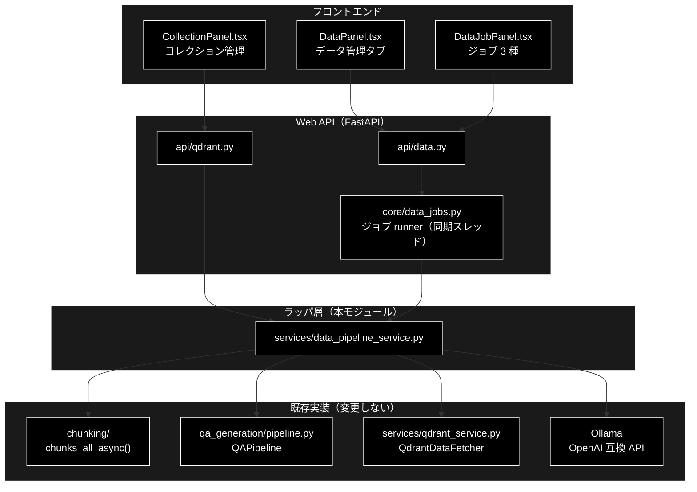
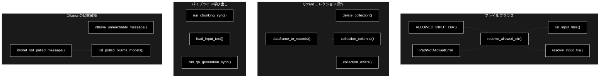
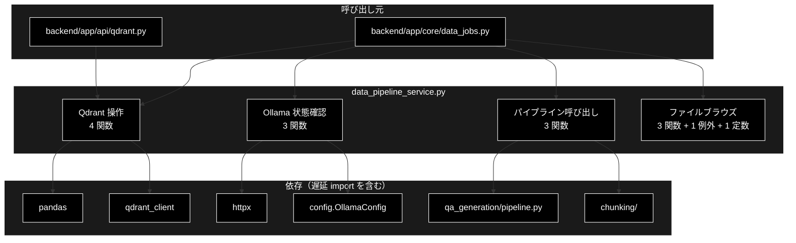

# data_pipeline_service.py - データ準備パイプラインの Web 向けラッパ層 ドキュメント

**Version 1.0** | 最終更新: 2026-09-20

---

## 目次

1. [概要](#概要)
2. [アーキテクチャ構成図](#1-アーキテクチャ構成図)
3. [モジュール構成図](#2-モジュール構成図)
4. [クラス・関数一覧表](#3-クラス関数一覧表)
5. [クラス・関数 IPO詳細](#4-クラス関数-ipo詳細)
6. [設定・定数](#5-設定定数)
7. [使用例](#6-使用例)
8. [エクスポート](#7-エクスポート)
9. [変更履歴](#8-変更履歴)
10. [付録: 依存関係図](#付録-依存関係図)

---

## 概要

`data_pipeline_service.py` は、CLI スクリプトに埋め込まれていたデータ準備処理を
**Web API から呼べる関数として提供する**ラッパ層です。「データ管理」タブ
（チャンク化 → Q/A 作成 → Qdrant 登録 → コレクション管理）の Web 経路は、
すべてこのモジュールを経由して既存実装へ届きます。

**既存モジュールの中身は一切変更しません。** 呼び出し口だけをここへ集約します。
チャンク化・Q/A 生成・Qdrant 登録のロジックは `chunking/` `qa_generation/`
`qa_qdrant/` `services/qdrant_service.py` が持ち続けます。CLI と Web で
結果が食い違わないようにするための設計です。

### この層が必要になった理由

| 既存 | 問題 |
|---|---|
| `qdrant_delete_collection.py` | 単一コレクション削除が `main()` に直書きで、関数が無い |
| `QdrantDataFetcher` | pandas DataFrame を返すため API でそのまま返せない |
| `chunks_all_async()` | async。ジョブ runner は同期スレッドで動く |
| （なし） | 入力ファイル一覧を返す API が無い |

### 主な責務

- 入力ファイルのブラウズを、許可ディレクトリ内に限定して提供する
- Qdrant コレクションの存在確認・削除を関数として提供する
- pandas DataFrame を JSON 化できる素の `list[dict]` へ変換する
- async なチャンキング処理を、同期のジョブ runner から呼べるようにラップする
- Q/A 生成パイプラインを CLI と同じ経路で同期呼び出しする
- ローカル LLM（Ollama）の疎通とモデル pull 状況を**ジョブ開始前に**確認する

### 各責務対応のモジュール

| # | 責務 | 対応モジュール | 説明 |
|---|------|--------------|------|
| 1 | 入力ファイルのブラウズ | `data_pipeline_service.py` | ホワイトリスト ＋ `resolve()` の二段でパスを検証 |
| 2 | Qdrant コレクション操作 | `data_pipeline_service.py` | `qdrant_delete_collection.py` の `main()` から切り出し |
| 3 | DataFrame の JSON 化 | `data_pipeline_service.py` | `QdrantDataFetcher` の戻り値を FastAPI 応答に載せる |
| 4 | async → sync 変換 | `chunking/csv_text_to_chunks_text_csv.py` | `chunks_all_async()` を `asyncio.run()` で包む |
| 5 | Q/A 生成の呼び出し | `qa_generation/pipeline.py` | `QAPipeline.run()` へ引数を詰め替えるだけ |
| 6 | Ollama の事前確認 | `config.py::OllamaConfig` | `BASE_URL` の OpenAI 互換 `GET /models` を叩く |

### 主要機能一覧

| 機能 | 説明 |
|------|------|
| `PathNotAllowedError` | 許可ディレクトリの外を指すパスに対する例外 |
| `resolve_allowed_dir()` | 許可ディレクトリ名を絶対パスへ解決する |
| `list_input_files()` | 許可ディレクトリ内の入力ファイル候補を列挙する |
| `resolve_input_file()` | `dir/name` 形式のパスを実パスへ戻す |
| `delete_collection()` | Qdrant コレクションを 1 つ削除する |
| `collection_exists()` | コレクションの存在を確認する |
| `dataframe_to_records()` | DataFrame を `list[dict]` へ変換する（NaN → None） |
| `collection_columns()` | レコード列から列名を出現順に抽出する |
| `run_chunking_sync()` | `chunks_all_async()` の同期ラッパー |
| `load_input_text()` | チャンク化の入力テキストを読み込む（CSV / テキスト） |
| `run_qa_generation_sync()` | `QAPipeline.run()` の同期ラッパー |
| `ollama_unreachable_message()` | Ollama へ**確実に**繋がらないかを判定する |
| `model_not_pulled_message()` | モデルが pull 済みかを判定する |
| `list_pulled_ollama_models()` | pull 済みモデル名の一覧を返す |

---

## 1. アーキテクチャ構成図

### 1.1 システム全体構成



### 1.2 データフロー

```mermaid
flowchart LR
    Sel["① 入力ファイル選択<br>list_input_files()"] --> Res["resolve_input_file()<br>パス検証"]
    Res --> Pre["事前確認<br>ollama_unreachable_message()<br>model_not_pulled_message()"]
    Pre --> Load["load_input_text()<br>CSV / テキスト"]
    Load --> Ch["run_chunking_sync()<br>asyncio.run()"]
    Ch --> Csv["output_chunked/*.csv"]
    Csv --> Qa["run_qa_generation_sync()<br>QAPipeline.run()"]
    Qa --> QaOut["qa_output/*.csv, *.json"]
    QaOut --> Reg["Qdrant 登録<br>qa_qdrant/"]
    Reg --> Show["dataframe_to_records()<br>collection_columns()"]
classDef default fill:#000,stroke:#fff,color:#fff
class Sel,Res,Pre,Load,Ch,Csv,Qa,QaOut,Reg,Show default
```



---

## 2. モジュール構成図

### 2.1 内部モジュール構成



### 2.2 外部依存関係

| ライブラリ | 用途 |
|-----------|------|
| `qdrant-client` | `QdrantClient` の型注釈とコレクション操作 |
| `httpx` | Ollama の OpenAI 互換 `GET /models`（**関数内で遅延 import**） |
| `pandas` | DataFrame → records 変換（**`dataframe_to_records()` 内で遅延 import**） |

### 2.3 内部依存モジュール

| モジュール | 用途 | import のタイミング |
|-----------|------|---|
| `config.OllamaConfig` | `BASE_URL`（接続先） | モジュール先頭 |
| `chunking.checkpoint_manager.CheckpointManager` | 再開用チェックポイント | `run_chunking_sync()` 内（遅延） |
| `chunking.csv_text_to_chunks_text_csv` | `chunks_all_async()` / `load_text_from_csv()` | 各関数内（遅延） |
| `qa_generation.pipeline.QAPipeline` | Q/A 生成本体 | `run_qa_generation_sync()` 内（遅延） |

> ⚠️ **遅延 import は意図的である。** `chunking` は tqdm / LLM クライアント、
> `qa_generation` は celery を引き込む。これらを呼ばない経路（コレクション一覧など）で
> import コストを払わないようにしている。**モジュール先頭へ移さないこと。**

---

## 3. クラス・関数一覧表

### 3.1 クラス一覧

#### PathNotAllowedError

`ValueError` を継承した例外。メソッドは持たない。

| 項目 | 内容 |
|---|---|
| 継承 | `ValueError` |
| 発生条件 | ホワイトリスト外のディレクトリ名・形式不正なパス・基点の外を指すパス |

### 3.2 関数一覧（カテゴリ別）

#### ファイルブラウズ

| 関数名 | 概要 |
|-------|------|
| `resolve_allowed_dir(dir_name, base=None)` | 許可ディレクトリ名を絶対パスへ解決する |
| `list_input_files(dir_name, base=None, suffixes=(".csv", ".txt"))` | 入力ファイル候補を更新日時の降順で列挙する |
| `resolve_input_file(rel_path, base=None)` | `dir/name` を実パスへ戻す |

#### Qdrant コレクション操作

| 関数名 | 概要 |
|-------|------|
| `delete_collection(client, collection_name)` | コレクションを 1 つ削除する（例外を投げない） |
| `collection_exists(client, collection_name)` | 存在を確認する |
| `dataframe_to_records(df)` | DataFrame → `list[dict]`（NaN → None） |
| `collection_columns(records)` | 列名を出現順に抽出する |

#### パイプライン呼び出し

| 関数名 | 概要 |
|-------|------|
| `run_chunking_sync(text, *, model, max_workers, block_size, output_file, dataset_type, source_file=None, job_id=None)` | `chunks_all_async()` の同期ラッパー |
| `load_input_text(path, *, text_column=None, max_rows=None, combine_rows=False)` | 入力テキストを読み込む |
| `run_qa_generation_sync(input_file, *, model, output_dir, max_docs=None, use_celery=False, concurrency=8, batch_chunks=3, analyze_coverage=True)` | `QAPipeline.run()` の同期ラッパー |

#### ローカル LLM（Ollama）の状態確認

| 関数名 | 概要 |
|-------|------|
| `ollama_unreachable_message(timeout=5.0)` | 接続拒否なら文言、繋がるなら None |
| `model_not_pulled_message(model)` | 未 pull なら文言、あり・判定不能なら None |
| `list_pulled_ollama_models(timeout=5.0)` | pull 済みモデル名の一覧（失敗時は空リスト） |

---

## 4. クラス・関数 IPO詳細

### 4.1 ファイルブラウズ関数

#### `resolve_allowed_dir`

**概要**: 許可ディレクトリ名を絶対パスへ解決する。ホワイトリスト照合と
`resolve()` 後の基点内チェックの**二段**で検証する。

```python
def resolve_allowed_dir(dir_name: str, base: Optional[Path] = None) -> Path
```

| パラメータ | 型 | デフォルト | 説明 |
|------------|------|-----------|------|
| `dir_name` | str | - | `ALLOWED_INPUT_DIRS` のいずれか |
| `base` | Optional[Path] | None | 基点。省略時はカレントディレクトリ（リポジトリルート想定） |

| 項目 | 内容 |
|------|------|
| **Input** | `dir_name: str`, `base: Optional[Path] = None` |
| **Process** | 1. `dir_name` が `ALLOWED_INPUT_DIRS` に含まれるか照合<br>2. `base`（既定はカレント）を `resolve()`<br>3. 結合結果が基点配下にあることを確認 |
| **Output** | `Path`: 解決済みの絶対パス |

> ⚠️ **ホワイトリスト照合だけでは足りない。** `dir_name` に `OUTPUT/../..` のような
> 値が来た場合に備え、`resolve()` した結果が基点配下にあることも確認している。

```python
# 使用例
from services.data_pipeline_service import resolve_allowed_dir, PathNotAllowedError

path = resolve_allowed_dir("OUTPUT")
# PosixPath('/path/to/grace_v2_local/OUTPUT')

try:
    resolve_allowed_dir("/etc")
except PathNotAllowedError as e:
    print(e)
# 許可されていないディレクトリです: '/etc'（許可: ['OUTPUT', 'output_chunked', 'qa_output', 'datasets']）
```

---

#### `list_input_files`

**概要**: 許可ディレクトリ内の入力ファイル候補を、更新日時の降順で列挙する。

```python
def list_input_files(
    dir_name: str,
    base: Optional[Path] = None,
    suffixes: tuple[str, ...] = (".csv", ".txt"),
) -> List[Dict[str, Any]]
```

| パラメータ | 型 | デフォルト | 説明 |
|------------|------|-----------|------|
| `dir_name` | str | - | 許可ディレクトリ名 |
| `base` | Optional[Path] | None | 基点 |
| `suffixes` | tuple[str, ...] | `(".csv", ".txt")` | 対象とする拡張子（小文字で比較） |

| 項目 | 内容 |
|------|------|
| **Input** | `dir_name: str`, `base: Optional[Path] = None`, `suffixes: tuple[str, ...]` |
| **Process** | 1. `resolve_allowed_dir()` で検証<br>2. ディレクトリが無ければ**空リスト**（エラーにしない）<br>3. ファイルのみ・拡張子一致で絞る<br>4. `modified` の降順にソート |
| **Output** | `List[Dict[str, Any]]`: `name` / `path` / `size` / `modified` / `suffix` |

**戻り値例**:
```python
[
    {
        "name": "cc_news_1per_chunks.csv",
        "path": "output_chunked/cc_news_1per_chunks.csv",
        "size": 482913,
        "modified": 1758300000.0,
        "suffix": ".csv"
    }
]
```

> 📌 **`path` は `dir/name` 形式に限定し、絶対パスは返さない。** API が
> 受け取り直すときに `resolve_input_file()` で再検証できる形にしている。

---

#### `resolve_input_file`

**概要**: `list_input_files()` が返した `dir/name` を実パスへ戻す。

```python
def resolve_input_file(rel_path: str, base: Optional[Path] = None) -> Path
```

| パラメータ | 型 | デフォルト | 説明 |
|------------|------|-----------|------|
| `rel_path` | str | - | `ディレクトリ名/ファイル名` 形式 |
| `base` | Optional[Path] | None | 基点 |

| 項目 | 内容 |
|------|------|
| **Input** | `rel_path: str`, `base: Optional[Path] = None` |
| **Process** | 1. `/` で 2 分割できるか検証<br>2. ファイル名側に `.` / `..` / 区切り文字が混ざらないか検証<br>3. `resolve_allowed_dir()` でディレクトリを検証<br>4. 結合結果の親に許可ディレクトリが含まれるか確認<br>5. 実ファイルの存在を確認 |
| **Output** | `Path`: 実ファイルの絶対パス |

| 例外 | 発生条件 |
|---|---|
| `PathNotAllowedError` | 形式不正・許可外ディレクトリ・基点の外を指す |
| `FileNotFoundError` | 実ファイルが無い |

---

### 4.2 Qdrant コレクション操作関数

#### `delete_collection`

**概要**: コレクションを 1 つ削除する。`qdrant_delete_collection.py` の
`main()` に直書きされていた処理を関数として切り出したもの。

```python
def delete_collection(client: QdrantClient, collection_name: str) -> bool
```

| パラメータ | 型 | デフォルト | 説明 |
|------------|------|-----------|------|
| `client` | QdrantClient | - | 接続済みクライアント |
| `collection_name` | str | - | 削除するコレクション名 |

| 項目 | 内容 |
|------|------|
| **Input** | `client: QdrantClient`, `collection_name: str` |
| **Process** | 1. `client.delete_collection()` を呼ぶ<br>2. 成功をログへ出す<br>3. 例外は捕捉してログへ出す |
| **Output** | `bool`: 削除できたら True。存在しない・失敗なら False（**例外は投げない**） |

> ⚠️ **確認プロンプトは持たない。** 承認は呼び出し側の責務である
> （Web は HITL CONFIRM、CLI は `--yes`）。

---

#### `collection_exists`

**概要**: コレクションの存在を確認する（削除前チェック用）。

```python
def collection_exists(client: QdrantClient, collection_name: str) -> bool
```

| 項目 | 内容 |
|------|------|
| **Input** | `client: QdrantClient`, `collection_name: str` |
| **Process** | 1. `client.get_collections()` で一覧を取得<br>2. 名前の集合に含まれるか判定<br>3. 例外時はログを出して False |
| **Output** | `bool`: 存在すれば True |

---

#### `dataframe_to_records`

**概要**: pandas DataFrame を JSON 化できる `list[dict]` へ変換する。

```python
def dataframe_to_records(df: Any) -> List[Dict[str, Any]]
```

| 項目 | 内容 |
|------|------|
| **Input** | `df: Any`（DataFrame または None） |
| **Process** | 1. `None` / 空 DataFrame は空リスト<br>2. `astype(object).where(pd.notnull(df), None)` で **NaN を None へ寄せる**<br>3. `to_dict(orient="records")` |
| **Output** | `List[Dict[str, Any]]`: JSON 化可能なレコード列 |

> ⚠️ **NaN を None へ寄せるのは必須である。** JSON に NaN は無く、
> `json.dumps` が `NaN` という**不正なトークン**を出す。
>
> 📌 `QdrantDataFetcher` はエラー時に `{"Error": [...]}` / `{"Info": [...]}` という
> 1 列 DataFrame を返す。その形もそのまま records 化されるので、**呼び出し側で判定する**。

---

#### `collection_columns`

**概要**: レコード列から列名を出現順に抽出する。

```python
def collection_columns(records: List[Dict[str, Any]]) -> List[str]
```

| 項目 | 内容 |
|------|------|
| **Input** | `records: List[Dict[str, Any]]` |
| **Process** | 1. 各レコードのキーを走査<br>2. 未登録のキーを順に追加（`dict` は挿入順を保つ） |
| **Output** | `List[str]`: 列名のリスト |

> 📌 payload のキーはコレクションごとに違うため、画面側は列を固定できない。

---

### 4.3 パイプライン呼び出し関数

#### `run_chunking_sync`

**概要**: `chunks_all_async()` を同期呼び出しできるようにラップする。

```python
def run_chunking_sync(
    text: str,
    *,
    model: str,
    max_workers: int,
    block_size: int,
    output_file: str,
    dataset_type: str,
    source_file: Optional[str] = None,
    job_id: Optional[str] = None,
) -> List[str]
```

| パラメータ | 型 | デフォルト | 説明 |
|------------|------|-----------|------|
| `text` | str | - | チャンク化する原文 |
| `model` | str | - | ローカル LLM（Ollama）モデル名 |
| `max_workers` | int | - | 並列ワーカー数 |
| `block_size` | int | - | 1 ブロックの文字数 |
| `output_file` | str | - | 出力 CSV のパス |
| `dataset_type` | str | - | データセット種別 |
| `source_file` | Optional[str] | None | 元ファイル名（メタデータ用） |
| `job_id` | Optional[str] | None | `CheckpointManager` の再開用 ID。None なら新規発行 |

| 項目 | 内容 |
|------|------|
| **Input** | 上表のとおり（`model` 以降はキーワード専用） |
| **Process** | 1. `chunking` 系を**遅延 import**<br>2. `CheckpointManager` を生成（`job_id` があれば再開）<br>3. `asyncio.run(chunks_all_async(...))` で新しいイベントループを立てる |
| **Output** | `List[str]`: チャンク文字列のリスト |

> ⚠️ **`asyncio.run()` は「実行中のイベントループが無いこと」を要求する。**
> FastAPI のリクエストハンドラ（async）から直接呼ぶと
> `RuntimeError: asyncio.run() cannot be called from a running event loop` になる。
> **必ずジョブのワーカースレッド側から呼ぶこと。**

---

#### `load_input_text`

**概要**: チャンク化の入力テキストを読み込む（CSV / テキスト）。
`csv_text_to_chunks_text_csv.py` の `main()` が行っている分岐と同じ。

```python
def load_input_text(
    path: Path,
    *,
    text_column: Optional[str] = None,
    max_rows: Optional[int] = None,
    combine_rows: bool = False,
) -> str
```

| パラメータ | 型 | デフォルト | 説明 |
|------------|------|-----------|------|
| `path` | Path | - | 入力ファイル（`resolve_input_file()` の戻り値） |
| `text_column` | Optional[str] | None | CSV のテキスト列名 |
| `max_rows` | Optional[int] | None | 読み込む最大行数 |
| `combine_rows` | bool | False | 複数行を結合するか |

| 項目 | 内容 |
|------|------|
| **Input** | 上表のとおり |
| **Process** | 1. 拡張子が `.csv` なら `load_text_from_csv()` へ委譲<br>2. それ以外は `read_text(encoding="utf-8")` で素読み |
| **Output** | `str`: 読み込んだテキスト |

---

#### `run_qa_generation_sync`

**概要**: チャンク済み CSV から Q/A ペアを生成する（`QAPipeline` の同期ラッパー）。
`qa_qdrant/make_qa_register_qdrant.py` の Phase 1 と**同じ経路**を通る。

```python
def run_qa_generation_sync(
    input_file: str,
    *,
    model: str,
    output_dir: str,
    max_docs: Optional[int] = None,
    use_celery: bool = False,
    concurrency: int = 8,
    batch_chunks: int = 3,
    analyze_coverage: bool = True,
) -> Dict[str, Any]
```

| パラメータ | 型 | デフォルト | 説明 |
|------------|------|-----------|------|
| `input_file` | str | - | チャンク済み CSV のパス（`text` / `Combined_Text` / `content` / `chunk_text` のいずれかの列が要る） |
| `model` | str | - | Q/A 生成に使うローカル LLM（Ollama）モデル名 |
| `output_dir` | str | - | Q/A CSV・JSON の出力先 |
| `max_docs` | Optional[int] | None | 処理する最大チャンク数（None なら全件） |
| `use_celery` | bool | False | Celery 並列処理を使うか |
| `concurrency` | int | 8 | Celery の並列タスク数 |
| `batch_chunks` | int | 3 | 1 回の LLM 呼び出しで処理するチャンク数 |
| `analyze_coverage` | bool | True | カバレージ分析を実行するか |

| 項目 | 内容 |
|------|------|
| **Input** | 上表のとおり |
| **Process** | 1. `QAPipeline` を**遅延 import**<br>2. `input_file` / `model` / `output_dir` / `max_docs` でインスタンス化<br>3. `run()` に実行オプションを渡す（`celery_workers=1` はワーカー数の**チェック用**） |
| **Output** | `Dict[str, Any]`: `QAPipeline.run()` の戻り値そのまま（`saved_files` / `qa_count` / `coverage_results` / `success`） |

> 📌 **`run_chunking_sync()` と違い `asyncio.run()` は挟まない。**
> `QAPipeline.run()` は同期関数で、並列化は Celery か `ThreadPoolExecutor` の中に閉じている。
>
> ⚠️ **Celery ワーカーが立っていないときに `use_celery=True` を渡すと
> パイプラインが例外を投げる**（`check_celery_workers` が失敗する）。
> 呼び出し側で握って error イベントへ変換すること。

---

### 4.4 ローカル LLM（Ollama）の状態確認関数

この 3 関数は **LLM ループに入る前に弾く**ためにある。事後に気づくのでは遅い、
という実測に基づいて設計されている。

#### `ollama_unreachable_message`

**概要**: Ollama へ**確実に**繋がらないならエラーメッセージを、繋がるなら None を返す。

```python
def ollama_unreachable_message(timeout: float = 5.0) -> Optional[str]
```

| 項目 | 内容 |
|------|------|
| **Input** | `timeout: float = 5.0` |
| **Process** | 1. `httpx` を遅延 import<br>2. `OllamaConfig.BASE_URL` + `/models` へ GET<br>3. **`ConnectError` / `ConnectTimeout` のときだけ**文言を返す<br>4. その他の例外（HTTP は返るが中身が変・タイムアウト）は **None**（素通り） |
| **Output** | `Optional[str]`: 確実に落ちている場合のみエラーメッセージ |

> ## 「判定不能」と「確実に落ちている」を分ける
>
> `list_pulled_ollama_models()` は失敗を一律で空リストにする。応答形式が変わった・
> 一覧だけ拒否された、といった理由で**実際には動くジョブを止めない**ための設計で、
> そこは正しい。
>
> だが **接続拒否は曖昧ではない。** サーバが居ないのだから、これから投げる
> リクエストは 1 本残らず失敗する。それを「判定不能」に混ぜて素通りさせると、
> 9 秒前に分かっていた答えを伏せたまま `ChunkingAbortedError` の 3 候補を
> 利用者に当てさせることになる（実測 2026-09-11）。

**戻り値例**:
```python
(
    "❌ Ollama に接続できません（http://localhost:11434/v1）: [Errno 61] Connection refused\n"
    "   これから投げるリクエストはすべて失敗するので、ここで止めます。\n"
    "   起動してください:\n"
    "       ollama serve            # ターミナルで常駐させる\n"
    "       open -a Ollama          # または macOS アプリを起動する\n"
    "   起動済みのつもりなら接続先を確認してください"
    " （OLLAMA_BASE_URL の既定は http://localhost:11434/v1）。"
)
```

---

#### `model_not_pulled_message`

**概要**: モデルが Ollama に無ければエラーメッセージを、あれば None を返す。

```python
def model_not_pulled_message(model: str) -> Optional[str]
```

| パラメータ | 型 | デフォルト | 説明 |
|------------|------|-----------|------|
| `model` | str | - | 確認するモデル名 |

| 項目 | 内容 |
|------|------|
| **Input** | `model: str` |
| **Process** | 1. `list_pulled_ollama_models()` で一覧を取得<br>2. **空（判定不能）なら None**（実際には動くジョブを止めない）<br>3. 一覧に含まれていれば None<br>4. 含まれていなければ**一覧を添えて**文言を返す |
| **Output** | `Optional[str]`: 未 pull の場合のみエラーメッセージ |

> ⚠️ **LLM ループに入る前に弾くのが要点。** チャンク化も Q/A 生成も 1 ブロックあたり
> 3 回リトライしてから次へ進む作りなので、未 pull のモデル名で走らせると
> **止まらずにゴミを作り続ける**（実測: 1229 ブロックで 404 が 3,687 回、
> 結果は機械的な分割のまま「成功」）。
>
> ⚠️ **pull 済み一覧を必ずメッセージに載せる。** 実際の取り違えは
> 「`gemma4:e4b` と `gemma4:e4b-mlx`」のような **1 語の差**で起きる（実測 2026-09-11）。

---

#### `list_pulled_ollama_models`

**概要**: Ollama に pull 済みのモデル名を返す（OpenAI 互換 `GET /models`）。

```python
def list_pulled_ollama_models(timeout: float = 5.0) -> List[str]
```

| 項目 | 内容 |
|------|------|
| **Input** | `timeout: float = 5.0` |
| **Process** | 1. `httpx` を遅延 import<br>2. `BASE_URL` + `/models` へ GET、`raise_for_status()`<br>3. `payload["data"]` が list であることを確認<br>4. `item["id"]` を文字列で集める |
| **Output** | `List[str]`: モデル名のリスト。**確認できなかったときは空リスト** |

> ⚠️ **失敗を空リストで返すのは意図的。** ここは事前確認であって本処理ではない。
> Ollama の応答形式が変わった・一覧だけ拒否された、といった理由で
> 実際には動くジョブを止めてしまう方が害が大きい。
> **呼び出し側は「空 = 判定不能」として素通りさせること。**

---

## 5. 設定・定数

### 5.1 `ALLOWED_INPUT_DIRS`

画面から入力ファイルを選ばせる対象。**ここに無いディレクトリは参照させない。**

```python
ALLOWED_INPUT_DIRS: tuple[str, ...] = (
    "OUTPUT",          # 生データ（チャンク化の入力）
    "output_chunked",  # チャンク化の出力（Q/A 生成の入力）
    "qa_output",       # Q/A 生成の出力（Qdrant 登録の入力）
    "datasets",        # ダウンロードしたデータセット
)
```

| ディレクトリ | 役割 | パイプライン上の位置 |
|---|---|---|
| `OUTPUT` | 生データ | チャンク化の**入力** |
| `output_chunked` | チャンク済み CSV | Q/A 生成の**入力** |
| `qa_output` | Q/A ペア | Qdrant 登録の**入力** |
| `datasets` | ダウンロードしたデータセット | 任意 |

> 📌 ローカル専用のツールだが、`../../etc/passwd` のような相対パスを弾くために
> **ホワイトリスト＋`resolve()` の二段**で検証している。

### 5.2 参照する外部設定

| 設定 | 定義元 | 用途 |
|---|---|---|
| `OllamaConfig.BASE_URL` | `config.py` | Ollama の接続先（既定 `http://localhost:11434/v1`） |

---

## 6. 使用例

### 6.1 基本ワークフロー（チャンク化ジョブ）

```python
from pathlib import Path
from services.data_pipeline_service import (
    resolve_input_file,
    load_input_text,
    run_chunking_sync,
    ollama_unreachable_message,
    model_not_pulled_message,
)

model = "gemma4:12b-mlx"

# 1. LLM ループに入る前に弾く
for check in (ollama_unreachable_message(), model_not_pulled_message(model)):
    if check:
        raise RuntimeError(check)

# 2. 入力ファイルを検証して読み込む
path = resolve_input_file("OUTPUT/cc_news_1per.csv")
text = load_input_text(path, text_column="text", max_rows=100)

# 3. 同期ラッパー経由でチャンク化（**ワーカースレッドから呼ぶこと**）
chunks = run_chunking_sync(
    text=text,
    model=model,
    max_workers=4,
    block_size=2000,
    output_file="output_chunked/cc_news_1per_chunks.csv",
    dataset_type="cc_news",
    source_file=path.name,
)
print(len(chunks))
# 例: 128
```

### 6.2 応用ワークフロー（Q/A 生成 → コレクション表示）

```python
from qdrant_client import QdrantClient
from services.data_pipeline_service import (
    run_qa_generation_sync,
    collection_exists,
    dataframe_to_records,
    collection_columns,
)

# Q/A 生成（CLI の Phase 1 と同じ経路）
result = run_qa_generation_sync(
    input_file="output_chunked/cc_news_1per_chunks.csv",
    model="gemma4:12b-mlx",
    output_dir="qa_output",
    max_docs=50,
)
print(result["qa_count"], result["success"])

# 登録済みコレクションを画面向けに整形
client = QdrantClient(url="http://localhost:6333")
if collection_exists(client, "cc_news_2per_anthropic"):
    from services.qdrant_service import QdrantDataFetcher

    df = QdrantDataFetcher(client).fetch_collection_points("cc_news_2per_anthropic")
    records = dataframe_to_records(df)   # NaN → None
    columns = collection_columns(records)  # 出現順の列名
```

### 6.3 ファイルブラウズ（API から）

```python
from services.data_pipeline_service import list_input_files

files = list_input_files("output_chunked")
# [{"name": "...", "path": "output_chunked/...", "size": ..., "modified": ..., "suffix": ".csv"}, ...]
# 更新日時の降順。ディレクトリが無ければ空リスト（エラーにしない）
```

---

## 7. エクスポート

`__all__` は定義していない。`services/__init__.py` が本モジュールから
再エクスポートしている要素は無く、**呼び出し側は都度 `from services.data_pipeline_service import ...`
で個別に import する**（`backend/app/api/qdrant.py` / `backend/app/core/data_jobs.py` とも関数内の遅延 import）。

### 呼び出し元

| 呼び出し元 | 使う関数 |
|---|---|
| `backend/app/api/qdrant.py` | `collection_exists` / `collection_columns` / `dataframe_to_records` ほか |
| `backend/app/core/data_jobs.py` | `ollama_unreachable_message` / `model_not_pulled_message` / `resolve_input_file` / `load_input_text` / `run_chunking_sync` / `run_qa_generation_sync` / `delete_collection` / `collection_exists` |

---

## 8. 変更履歴

| バージョン | 変更内容 |
|-----------|---------|
| 1.0 | 初版作成（2026-09-20）。実装 475 行・関数 11 件・例外クラス 1 件・定数 1 件を IPO 形式で記述 |

---

## 付録: 依存関係図



### テスト

| テストファイル | 件数（実測 2026-09-20） | 対象 |
|---|---:|---|
| `backend/tests/test_data_pipeline.py` | 30 | パス検証・DataFrame 変換・削除 |
| `backend/tests/test_ollama_unreachable.py` | 10 | `ollama_unreachable_message` の「確実」判定 |
| `backend/tests/test_chunking_cli_preflight.py` | 5 | CLI 側の事前確認との整合 |

```bash
uv run --no-sync pytest backend/tests/test_data_pipeline.py -q   # 30 passed
```
