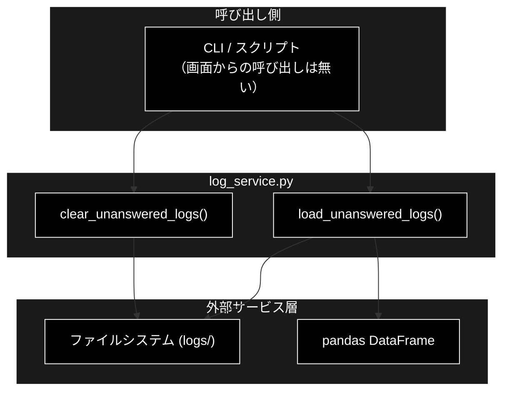
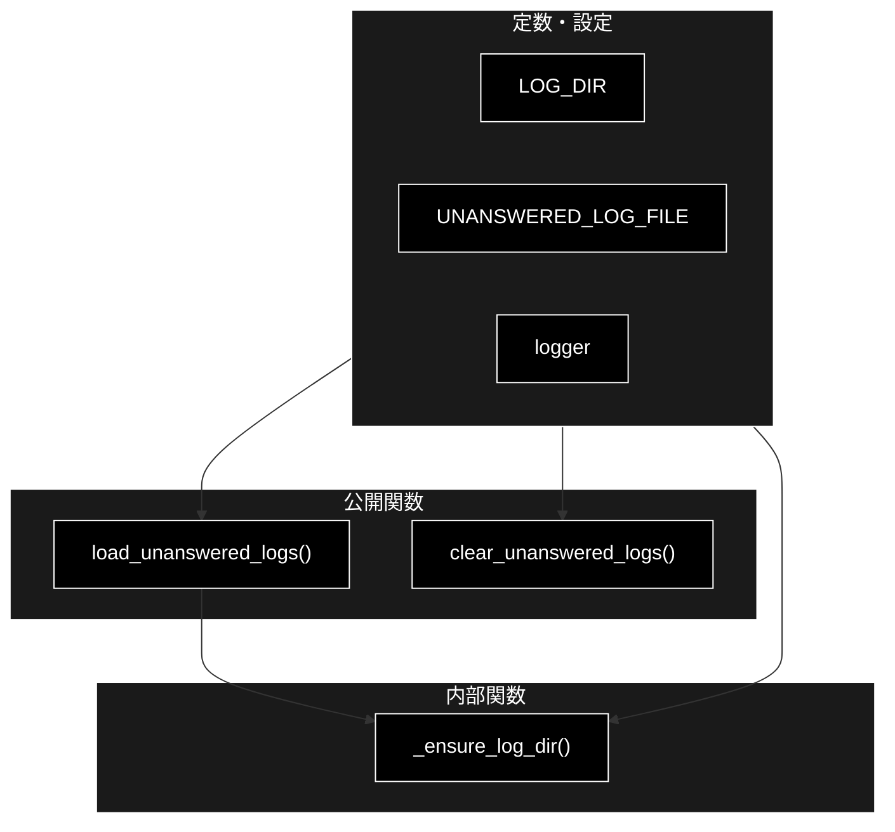
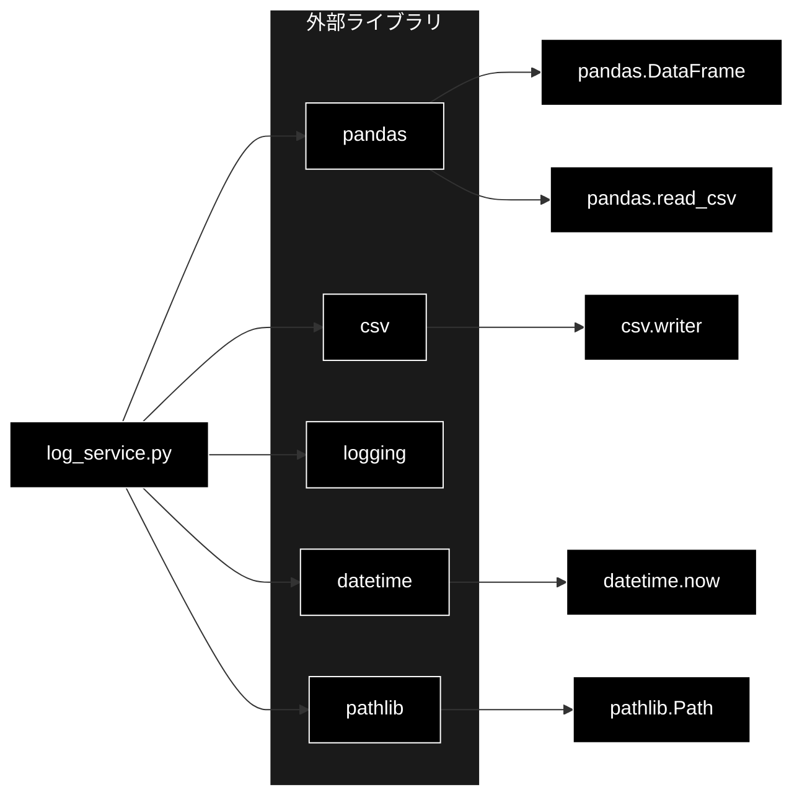

# log_service.py - ログ管理サービス ドキュメント

**Version 1.4** | 最終更新: 2026-10-10

---

## 目次

1. [概要](#概要)
2. [アーキテクチャ構成図](#1-アーキテクチャ構成図)
3. [モジュール構成図](#2-モジュール構成図)
4. [クラス・関数一覧表](#3-クラス関数一覧表)
5. [クラス・関数 IPO詳細](#4-クラス関数-ipo詳細)
6. [設定・定数](#5-設定定数)
7. [エクスポート](#6-エクスポート)
8. [変更履歴](#7-変更履歴)
9. [付録: 依存関係図](#付録-依存関係図)

---

## 概要

`log_service.py`は、未回答質問ログ（`logs/unanswered_questions.csv`）を読み込み・クリアするためのログ管理サービスです。

> ⚠️ **書き込み関数 `log_unanswered_question()` は 2026-10-10 に削除した。** 唯一の呼び出し元だった
> `services/agent_service.py`（Legacy ReAct）を同日に削除したため。GRACE-Support / GRACE-Review の
> Web 経路はもともとこのログを書いていなかったので、新しい行は追記されない（既存のファイルを読み・消すだけ）。

### 主な責務

- ログディレクトリ・ログファイルの初期化（存在しない場合の自動生成）
- 未回答質問ログの読み込み（pandas DataFrameとして提供）
- 未回答質問ログのクリア（ファイル再作成）
- 例外発生時のロギングによる安全な失敗（エラーを伝播させない）

### 各責務対応のモジュール

| # | 責務 | 対応モジュール | 説明 |
|---|------|--------------|------|
| 1 | ログディレクトリ・ファイルの初期化 | `log_service.py` | `_ensure_log_dir()`がディレクトリ作成とヘッダー書き込みを担当 |
| 2 | 未回答質問ログの読み込み | `log_service.py` | `load_unanswered_logs()`がDataFrameとして返却 |
| 3 | 未回答質問ログのクリア | `log_service.py` | `clear_unanswered_logs()`がファイルを再作成 |
| 4 | 例外発生時のロギング | `log_service.py` | 各関数が`try/except`で`logger.error()`記録 |

### 主要機能一覧

| 機能 | 説明 |
|------|------|
| `load_unanswered_logs()` | 未回答質問ログを読み込み、新しい順にソートしたDataFrameを返す |
| `clear_unanswered_logs()` | 未回答ログをクリア（ヘッダーのみのファイルに再作成） |
| `_ensure_log_dir()` | ログディレクトリとCSVファイルを初期化する（内部関数） |
| `LOG_DIR` | ログ保存先ディレクトリ定数 |
| `UNANSWERED_LOG_FILE` | 未回答質問ログCSVファイルパス定数 |

---

## 1. アーキテクチャ構成図

### 1.1 システム全体構成



### 1.2 データフロー

1. 呼び出し側（CLI / スクリプト）が`load_unanswered_logs()`を呼ぶ
2. `_ensure_log_dir()`でログディレクトリ・ファイルを初期化（未作成時はヘッダーだけのファイルを作る）
3. CSVを読み込み、新しい順に並べたDataFrameを返す
4. 必要に応じて`clear_unanswered_logs()`でログをリセット

---

## 2. モジュール構成図

### 2.1 内部モジュール構成



### 2.2 外部依存関係

| ライブラリ | バージョン | 用途 |
|-----------|-----------|------|
| `pandas` | - | ログCSVの読み込みとDataFrame化・ソート |
| `csv` | 標準 | CSVのヘッダー書き込み（初期化・クリア時） |
| `logging` | 標準 | 記録・エラーのロギング |
| `pathlib` | 標準 | ファイルパス操作・ディレクトリ作成 |

### 2.3 内部依存モジュール

| モジュール | 用途 |
|-----------|------|
| なし | 本モジュールは内部モジュールに依存しない（自己完結） |

---

## 3. クラス・関数一覧表

### 3.1 クラス一覧

本モジュールにクラスは定義されていません（関数ベースのサービスモジュール）。

### 3.2 関数一覧（カテゴリ別）

#### 内部関数

| 関数名 | 概要 |
|-------|------|
| `_ensure_log_dir()` | ログディレクトリとCSVファイルを初期化する |

#### 公開関数

| 関数名 | 概要 |
|-------|------|
| `load_unanswered_logs()` | 未回答質問ログを読み込み、新しい順にソートしたDataFrameを返す |
| `clear_unanswered_logs()` | 未回答ログをクリア（ヘッダーのみのファイルに再作成） |

---

## 4. クラス・関数 IPO詳細

### 4.1 使用例

#### 4.1.1 基本的なワークフロー（未回答ログの確認）

```python
from services.log_service import clear_unanswered_logs, load_unanswered_logs

# 1. 未回答質問ログを読み込む（新しい順の DataFrame。ファイルが無ければヘッダーだけ作って空を返す）
df = load_unanswered_logs()
print(df.to_string())

# 2. 確認が済んだらクリアする（ヘッダーだけのファイルに作り直す）
clear_unanswered_logs()
```

> 📝 **処理パターンは「読む → 消す」の 1 通りだけ**（書き込み関数は 2026-10-10 に削除）。
> 画面（React UI）からこの 2 関数を呼ぶ経路は無く、CLI / スクリプトから使う。

### 4.2 内部関数

#### `_ensure_log_dir`

**概要**: ログディレクトリが存在しなければ作成し、CSVファイルが存在しなければヘッダー行を書き込んで初期化する。

```python
def _ensure_log_dir() -> None
```

| パラメータ | 型 | デフォルト | 説明 |
|------------|------|-----------|------|
| なし | - | - | 引数なし |

| 項目 | 内容 |
|------|------|
| **Input** | なし |
| **Process** | 1. `LOG_DIR`が存在しなければ`mkdir(parents=True)`で作成<br>2. `UNANSWERED_LOG_FILE`が存在しなければヘッダー行（timestamp, query, collections, reason, agent_response）を書き込む |
| **Output** | `None`（副作用としてディレクトリ・ファイルを作成） |

**戻り値例**:
```python
None
```

```python
# 使用例（内部利用）
_ensure_log_dir()
# logs/ ディレクトリと logs/unanswered_questions.csv が存在する状態になる
```

### 4.3 公開関数

#### `load_unanswered_logs`

**概要**: 未回答質問ログCSVを読み込み、タイムスタンプの新しい順にソートしたpandas DataFrameを返す。ファイルが無い・空・読込失敗時は空のDataFrameを返す。

```python
def load_unanswered_logs() -> pd.DataFrame
```

| パラメータ | 型 | デフォルト | 説明 |
|------------|------|-----------|------|
| なし | - | - | 引数なし |

| 項目 | 内容 |
|------|------|
| **Input** | なし |
| **Process** | 1. `_ensure_log_dir()`でファイルを初期化<br>2. ファイル未存在または空サイズなら空DataFrameを返す<br>3. `pd.read_csv()`で読み込み<br>4. `timestamp`列があれば降順ソート<br>5. 例外時は`logger.error()`し空DataFrameを返す |
| **Output** | `pd.DataFrame`: 列 `timestamp, query, collections, reason, agent_response` を持つログデータ |

**戻り値例**:
```python
#              timestamp                 query                collections           reason    agent_response
# 0  2026-06-17 10:30:00  返品の手続きを教えて   faq_anthropic, manual...   No RAG results
# 1  2026-06-17 09:15:00  営業時間は？           faq_anthropic              Low score
```

```python
# 使用例
from services.log_service import load_unanswered_logs

df = load_unanswered_logs()
print(f"未回答件数: {len(df)}")
# 未回答件数: 2
```

#### `clear_unanswered_logs`

**概要**: 未回答質問ログをクリアする。CSVファイルをヘッダー行のみの状態に再作成する。例外時はログ出力のみで失敗を握りつぶす。

```python
def clear_unanswered_logs() -> None
```

| パラメータ | 型 | デフォルト | 説明 |
|------------|------|-----------|------|
| なし | - | - | 引数なし |

| 項目 | 内容 |
|------|------|
| **Input** | なし |
| **Process** | 1. `UNANSWERED_LOG_FILE`を`'w'`モードで開きヘッダー行のみ書き込む<br>2. `logger.info()`で記録、例外時は`logger.error()` |
| **Output** | `None`（副作用としてCSVを再作成しデータを消去） |

**戻り値例**:
```python
None
```

```python
# 使用例
from services.log_service import clear_unanswered_logs

clear_unanswered_logs()
# logs/unanswered_questions.csv がヘッダーのみの状態にリセットされる
```

---

## 5. 設定・定数

### 5.1 ログファイルパス定数

ログの保存先を定義する定数群です。

```python
LOG_DIR = Path("logs")
UNANSWERED_LOG_FILE = LOG_DIR / "unanswered_questions.csv"
```

| 定数名 | 値 | 説明 |
|-------|-----|------|
| `LOG_DIR` | `Path("logs")` | ログ保存先ディレクトリ（カレントディレクトリ基準の相対パス） |
| `UNANSWERED_LOG_FILE` | `logs/unanswered_questions.csv` | 未回答質問ログCSVファイルのパス |

### 5.2 CSVカラム定義

未回答質問ログCSVのヘッダー（列）構成です。

| 列名 | 説明 |
|------|------|
| `timestamp` | 記録時刻（`%Y-%m-%d %H:%M:%S`形式） |
| `query` | ユーザーの質問 |
| `collections` | 検索対象コレクション（カンマ区切り文字列） |
| `reason` | 未回答の理由 |
| `agent_response` | エージェントの最終応答 |


---

## 6. エクスポート

本モジュールには`__all__`定義はありません。以下の公開要素が外部から利用可能です。

```python
# 公開関数
load_unanswered_logs
clear_unanswered_logs

# 公開定数
LOG_DIR
UNANSWERED_LOG_FILE

# 内部関数（先頭アンダースコア・非公開）
# _ensure_log_dir
```

---

## 7. 変更履歴

| バージョン | 日付 | 変更内容 |
|---|---|---|
| 1.0 | 2026-06-17 | 初版作成（2026-06-17） |
| 1.1 | 2026-09-20 | **Streamlit 残骸の除去。** 呼び出し元を `services/agent_service.py` と明記。§6.2 の Streamlit 例を CLI の例へ差し替えた（2026-09-20） |
| 1.2 | 2026-09-24 | 使用例を IPO 詳細の冒頭（`### 4.1 使用例`）へ移し、末尾の「## 6. 使用例」章を削除（基本フォーマット `a_class_method_md_format.md` v1.6〜 §6.1 に準拠。2026-09-24）。IPO の小節を 4.2 以降へ繰り下げ、後続の章番号を 1 つ繰り上げた。文書内の `§4.x` 参照も追随 |
| 1.3 | 2026-10-10 | Legacy ReAct 経路（`services/agent_service.py`・`agent_parallel_search.py`・`agent_cache.py`・`executor._execute_legacy_agent_step`・`run_legacy_agent` アクション）を 2026-10-10 に削除したのに追随 |
| 1.4 | 2026-10-10 | **書き込み関数 `log_unanswered_question()` の削除に追随。** 唯一の呼び出し元だった Legacy ReAct（`services/agent_service.py`）の削除で使われなくなったため実装ごと削除した。概要・責務表・構成図（1.1 / 2.1）・依存（`datetime`）・公開関数・使用例（「読む → 消す」の 1 パターンに統合）・IPO・エクスポート一覧から除いた |

---

## 付録: 依存関係図


