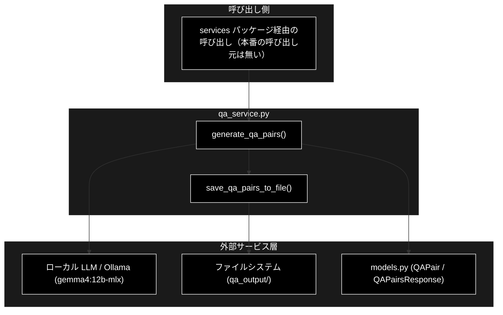
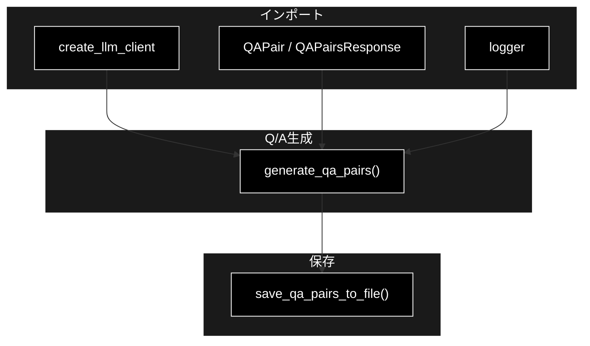
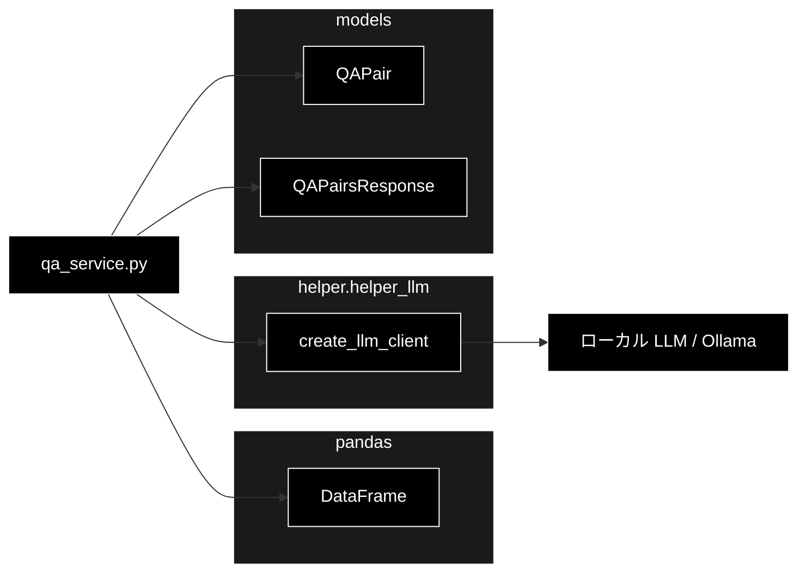

# qa_service.py - Q/A生成サービス ドキュメント

**Version 1.3** | 最終更新: 2026-09-25

---

## 目次

1. [概要](#概要)
2. [アーキテクチャ構成図](#1-アーキテクチャ構成図)
3. [モジュール構成図](#2-モジュール構成図)
4. [クラス・関数一覧表](#3-クラス関数一覧表)
5. [クラス・関数 IPO詳細](#4-クラス関数-ipo詳細)
6. [設定・定数](#5-設定定数)
7. [エクスポート](#6-エクスポート)
8. [変更履歴](#7-変更履歴)
9. [付録: 依存関係図](#付録-依存関係図)

---

## 概要

`qa_service.py` は、Q/Aペアの生成と保存に関するビジネスロジックを提供するサービスモジュールです。LLM には**ローカル LLM（Ollama）**（既定モデルは `config.py::get_default_ollama_model()` — 実値 `gemma4:12b-mlx`）を使用し、`create_llm_client(provider="ollama")` 経由でクライアントを生成します。構造化出力 API でテキストからQ/Aペアを生成し、CSV/JSON 形式でファイルに保存します。

> ⚠️ **Q/A 生成パイプライン（`QAPipeline`）の実行口はここではない。** CLI は `qa_qdrant/make_qa_register_qdrant.py`、
> Web は `services/data_pipeline_service.py::run_qa_generation_sync()` を通る。
> v1.2 まで載っていた `run_advanced_qa_generation()` は、**存在しない `qa_generator_runner` を import する死にコード**
> だったため 2026-09-25 に削除した（姉妹リポジトリ grace_v2 は 2026-09-12 に削除済み）。
>
> 📌 `generate_qa_pairs()` / `save_qa_pairs_to_file()` にも、`services/__init__.py` の再エクスポート以外の
> 本番の呼び出し元は無い（2026-09-25 grep）。

### 主な責務

- ローカル LLM（Ollama）を用いたテキストからのQ/Aペア自動生成
- 生成されたQ/Aペアへのメタデータ（チャンクID・データセットタイプ等）の付与
- Q/AペアのCSV・JSON形式でのファイル保存
- ログコールバックによる進捗・エラー通知

### 各責務対応のモジュール

| # | 責務 | 対応モジュール | 説明 |
|---|------|--------------|------|
| 1 | ローカル LLM（Ollama）によるQ/A生成 | `qa_service.py` | `generate_qa_pairs()` が `create_llm_client("ollama")` を利用 |
| 2 | メタデータの付与 | `models.py` | `QAPair` モデルにチャンクID等を格納 |
| 3 | CSV・JSON保存 | `qa_service.py` | `save_qa_pairs_to_file()` が `pandas`/`json` で出力 |
| 4 | 進捗・エラー通知 | `qa_service.py` | 各関数の `log_callback` 引数で通知 |

### 主要機能一覧

| 機能 | 説明 |
|------|------|
| `QAPair` | Q/Aペアのデータモデル（Pydantic、`models.py` 定義） |
| `QAPairsResponse` | Q/Aペア生成レスポンスモデル（構造化出力用、`models.py` 定義） |
| `generate_qa_pairs()` | テキストからローカル LLM（Ollama）でQ/Aペアを生成 |
| `save_qa_pairs_to_file()` | Q/AペアをCSVとJSONで保存 |

---

## 1. アーキテクチャ構成図

### 1.1 システム全体構成



### 1.2 データフロー

1. 呼び出し側からQ/A生成リクエストを受信
2. `generate_qa_pairs()` がローカル LLM（Ollama）の構造化出力APIを呼び出しQ/Aを生成
3. 生成結果に `QAPair` メタデータを付与
4. `save_qa_pairs_to_file()` がCSV・JSONとして `qa_output/` に保存

---

## 2. モジュール構成図

### 2.1 内部モジュール構成



### 2.2 外部依存関係

| ライブラリ | バージョン | 用途 |
|-----------|-----------|------|
| `pandas` | - | Q/AペアのDataFrame変換・CSV出力 |
| `openai`（`create_llm_client` 経由） | - | Ollama の OpenAI 互換エンドポイントを叩くクライアント |

### 2.3 内部依存モジュール

| モジュール | 用途 |
|-----------|------|
| `helper.helper_llm.create_llm_client` | LLM クライアント生成（provider="ollama"） |
| `models.QAPair` | Q/Aペアのデータモデル |
| `models.QAPairsResponse` | 構造化出力レスポンスモデル |

---

## 3. クラス・関数一覧表

### 3.1 クラス一覧

#### QAPair

> 📝 **注意**: `QAPair` は `models.py` で定義され、本モジュールがインポートして使用します。

| フィールド | 概要 |
|---------|------|
| `question` | 質問文 |
| `answer` | 回答文 |
| `question_type` | 質問タイプ |
| `source_chunk_id` | ソースチャンクID |
| `dataset_type` | データセットタイプ |
| `auto_generated` | 自動生成フラグ |

#### QAPairsResponse

> 📝 **注意**: `QAPairsResponse` は `models.py` で定義され、構造化出力のレスポンス型として使用します。

| フィールド | 概要 |
|---------|------|
| `qa_pairs` | 生成されたQ/Aペア（`QAPair`）のリスト |

### 3.2 関数一覧（カテゴリ別）

#### Q/A生成

| 関数名 | 概要 |
|-------|------|
| `generate_qa_pairs(...)` | テキストからローカル LLM（Ollama）でQ/Aペアを生成 |

#### 保存

| 関数名 | 概要 |
|-------|------|
| `save_qa_pairs_to_file(...)` | Q/AペアをCSVとJSONで保存 |

---

## 4. クラス・関数 IPO詳細

### 4.1 使用例

#### 4.1.1 基本的なワークフロー

```python
from config import get_default_ollama_model
from services.qa_service import (
    generate_qa_pairs,
    save_qa_pairs_to_file,
)

# 1. テキストからQ/Aペアを生成（ローカル LLM / Ollama）
pairs = generate_qa_pairs(
    text="RAGは検索拡張生成の略で、外部知識を検索して生成します。",
    dataset_type="faq",
    chunk_id="chunk_001",
    model=get_default_ollama_model(),
    qa_per_chunk=3,
    log_callback=print,
)

# 2. ファイルに保存
saved = save_qa_pairs_to_file(
    qa_pairs=pairs,
    dataset_type="faq",
    log_callback=print,
)

print(f"CSV: {saved['csv']}")
print(f"JSON: {saved['json']}")
```

### 4.2 QAPair クラス

Q/Aペアのデータモデル。基本的なQ/Aペア情報に加え、品質・難易度のメタデータを含みます（`models.py` 定義）。

**概要**: 質問・回答とそのメタデータを保持する Pydantic モデル。

```python
class QAPair(BaseModel):
    question: str
    answer: str
    question_type: str = "fact"
    source_chunk_id: Optional[str] = None
    dataset_type: Optional[str] = None
    auto_generated: bool = False
```

| パラメータ | 型 | デフォルト | 説明 |
|------------|------|-----------|------|
| `question` | str | - | 質問文（必須） |
| `answer` | str | - | 回答文（必須） |
| `question_type` | str | "fact" | 質問タイプ（fact/reason/comparison 等） |
| `source_chunk_id` | Optional[str] | None | ソースチャンクID |
| `dataset_type` | Optional[str] | None | データセットタイプ |
| `auto_generated` | bool | False | 自動生成フラグ |

| 項目 | 内容 |
|------|------|
| **Input** | `question: str`, `answer: str`, `question_type: str = "fact"`, `source_chunk_id: Optional[str] = None`, `dataset_type: Optional[str] = None`, `auto_generated: bool = False` |
| **Process** | Pydantic によるフィールド検証とインスタンス生成 |
| **Output** | `QAPair` インスタンス |

**戻り値例**:
```python
QAPair(
    question="RAGとは何ですか？",
    answer="検索拡張生成の略です。",
    question_type="definition",
    source_chunk_id="chunk_001",
    dataset_type="faq",
    auto_generated=True
)
```

```python
# 使用例
from models import QAPair

qa = QAPair(question="RAGとは？", answer="検索拡張生成です。")
print(qa.question_type)
# fact
```

---

### 4.3 QAPairsResponse クラス

Q/Aペア生成レスポンス。構造化出力（structured output）で使用します（`models.py` 定義）。

**概要**: 生成された複数の `QAPair` をまとめて保持するレスポンスモデル。

```python
class QAPairsResponse(BaseModel):
    qa_pairs: List[QAPair] = []
```

| パラメータ | 型 | デフォルト | 説明 |
|------------|------|-----------|------|
| `qa_pairs` | List[QAPair] | [] | 生成されたQ/Aペアのリスト |

| 項目 | 内容 |
|------|------|
| **Input** | `qa_pairs: List[QAPair] = []` |
| **Process** | 構造化出力APIのレスポンスを `QAPair` リストとして格納 |
| **Output** | `QAPairsResponse` インスタンス |

**戻り値例**:
```python
QAPairsResponse(
    qa_pairs=[
        QAPair(question="質問1", answer="回答1"),
        QAPair(question="質問2", answer="回答2")
    ]
)
```

```python
# 使用例
from models import QAPairsResponse, QAPair

resp = QAPairsResponse(qa_pairs=[QAPair(question="Q", answer="A")])
print(len(resp.qa_pairs))
# 1
```

---

### 4.4 Q/A生成関数

#### `generate_qa_pairs`

**概要**: テキストからローカル LLM（Ollama）を用いてQ/Aペアを生成する。`create_llm_client(provider="ollama")` でクライアントを生成し、構造化出力APIで `QAPairsResponse` を取得します。

```python
def generate_qa_pairs(
    text: str,
    dataset_type: str,
    chunk_id: str,
    model: str = get_default_ollama_model(),
    qa_per_chunk: int = 3,
    log_callback=None,
) -> List[QAPair]
```

| パラメータ | 型 | デフォルト | 説明 |
|------------|------|-----------|------|
| `text` | str | - | 対象テキスト |
| `dataset_type` | str | - | データセットタイプ |
| `chunk_id` | str | - | チャンクID |
| `model` | str | `get_default_ollama_model()` | 使用するモデル（ローカル LLM / Ollama） |
| `qa_per_chunk` | int | 3 | チャンクあたりのQ/A数 |
| `log_callback` | Optional[Callable] | None | ログコールバック関数 |

| 項目 | 内容 |
|------|------|
| **Input** | `text: str`, `dataset_type: str`, `chunk_id: str`, `model: str = get_default_ollama_model()`, `qa_per_chunk: int = 3`, `log_callback=None` |
| **Process** | 1. `create_llm_client(provider="ollama")` でクライアント生成<br>2. Q/A生成プロンプトを構築<br>3. `client.generate_structured()` で構造化出力（`QAPairsResponse`）を取得<br>4. 各Q/Aに `chunk_id`・`dataset_type`・`auto_generated=True` を付与<br>5. 例外時は空リストを返却 |
| **Output** | `List[QAPair]`: 生成されたQ/Aペアのリスト（エラー時は `[]`） |

**戻り値例**:
```python
[
    QAPair(
        question="RAGの目的は何ですか？",
        answer="外部知識を検索して生成精度を高めることです。",
        question_type="conceptual",
        source_chunk_id="chunk_001",
        dataset_type="faq",
        auto_generated=True
    )
]
```

```python
# 使用例
pairs = generate_qa_pairs(
    text="RAGは検索拡張生成の略で...",
    dataset_type="faq",
    chunk_id="chunk_001",
    model=get_default_ollama_model(),
    qa_per_chunk=3,
    log_callback=print,
)
print(f"生成数: {len(pairs)}")
# 生成数: 3
```

---

### 4.5 保存関数

#### `save_qa_pairs_to_file`

**概要**: Q/AペアをCSVとJSONの両形式で `qa_output/` ディレクトリに保存する。ファイル名にはタイムスタンプを付与します。

```python
def save_qa_pairs_to_file(
    qa_pairs: List[QAPair],
    dataset_type: str,
    log_callback=None,
) -> Dict[str, str]
```

| パラメータ | 型 | デフォルト | 説明 |
|------------|------|-----------|------|
| `qa_pairs` | List[QAPair] | - | Q/Aペアのリスト |
| `dataset_type` | str | - | データセットタイプ（ファイル名に使用） |
| `log_callback` | Optional[Callable] | None | ログコールバック関数 |

| 項目 | 内容 |
|------|------|
| **Input** | `qa_pairs: List[QAPair]`, `dataset_type: str`, `log_callback=None` |
| **Process** | 1. `qa_output/` ディレクトリを作成<br>2. タイムスタンプを生成<br>3. Q/Aペアを `pandas.DataFrame` に変換<br>4. CSV（utf-8-sig）として保存<br>5. メタ情報付きJSON（utf-8）として保存 |
| **Output** | `Dict[str, str]`: 保存ファイルパスの辞書（`csv` / `json` キー） |

**戻り値例**:
```python
{
    "csv": "qa_output/qa_pairs_faq_20260617_143000.csv",
    "json": "qa_output/qa_pairs_faq_20260617_143000.json"
}
```

```python
# 使用例
saved = save_qa_pairs_to_file(
    qa_pairs=pairs,
    dataset_type="faq",
    log_callback=print,
)
print(saved["csv"])
# qa_output/qa_pairs_faq_20260617_143000.csv
```

---

## 5. 設定・定数

本モジュールに設定辞書・定数の定義はありません。主要なデフォルト値は関数引数として定義されています。

| 項目 | 値 | 説明 |
|------|------|------|
| 既定モデル | `get_default_ollama_model()`（実値 `gemma4:12b-mlx`） | `generate_qa_pairs()` の `model` デフォルト（ローカル LLM / Ollama） |
| LLM プロバイダ | `ollama` | `create_llm_client(provider="ollama")` |
| 出力ディレクトリ | `qa_output/` | CSV・JSON保存先 |
| 既定Q/A数 | `3` | `qa_per_chunk` のデフォルト |

> 📝 **注意**: LLM はローカル実行（Ollama）なので **API キーは不要**です（CLAUDE.md §3）。接続先は `config.OllamaConfig.BASE_URL`（既定 `http://localhost:11434/v1`）で、前提は `ollama serve` が動いていることと既定モデルが pull 済みであること。Embedding だけは Gemini を使うため `GOOGLE_API_KEY` が要ります。


---

## 6. エクスポート

`qa_service.py` には `__all__` の定義はありません。公開要素は以下のとおりです。

```python
# 関数
generate_qa_pairs            # ローカル LLM（Ollama）によるQ/A生成
save_qa_pairs_to_file        # CSV・JSON保存

# 再エクスポート（models.py からインポート）
QAPair                       # Q/Aペアのデータモデル
QAPairsResponse              # Q/Aペア生成レスポンスモデル
```

---

## 7. 変更履歴

| バージョン | 変更内容 |
|---|---|
| 1.3 | **`run_advanced_qa_generation()` の削除に追随**（2026-09-25）。存在しない `qa_generator_runner` を import する死にコードだった。概要・責務表・構成図（1.1 / 2.1 / 付録）・関数一覧・IPO（旧 §4.4）・使用例（旧 §4.1.2）・エクスポートから外し、IPO の小節を繰り上げた。1.1 の図にあった存在しない「Streamlit UI」も外し、本番の呼び出し元が無いことを明記。変更履歴が §7 と末尾の 2 箇所に分かれていたのを §7 へ 1 本化した |
| 1.2 | 使用例を IPO 詳細の冒頭（`### 4.1 使用例`）へ移し、末尾の「## 6. 使用例」章を削除（基本フォーマット `a_class_method_md_format.md` v1.6〜 §6.1 に準拠。2026-09-24）。IPO の小節を 4.2 以降へ繰り下げ、後続の章番号を 1 つ繰り上げた。文書内の `§4.x` 参照も追随 |
| 1.1 | **LLM 表記を Ollama へ是正**（2026-09-21・27 箇所）。実装は `create_llm_client(provider="ollama")`・既定モデルは `get_default_ollama_model()` だが、本書は Anthropic Claude / `claude-sonnet-4-6` / `ANTHROPIC_API_KEY` のままだった。あわせて実装側（`services/qa_service.py`）の docstring 3 箇所（「Gemini API使用」「デフォルト: gemini-2.5-flash」「Gemini構造化出力API」）も是正した |
| 1.0 | 初版（2026-06-17） |

---

## 付録: 依存関係図



